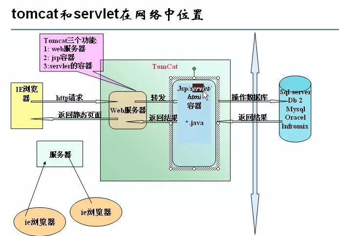

# 简要介绍

## 1、javaEE和javaWEB

javaWEB是JAVAEE的一部分

## 2、13个规范

Java语言在企业级开发中使用的技术规范的总和，一共规定了13项大的规范。

1、JDBC（java Database Connectivity）

2、JNDI(Java Name and Directory Interface)

3、EJB（Enterprise JavaBean）

4、RMI（RemoteMethod Invoke）

5、Java IDL（接口定义语言）/CORBA

6、JSP(Java Server Pages)

7、Java Servlet

8、XML（Extensible Markup Language）

9、JMS（Java Message Service）

10、JTA（Java Transaction Architecture）

11、JTS（Java Transaction Service）:

12、JavaMail

13、JAF（JavaBeans Activation Framework）

参考连接(https://www.zhihu.com/question/52002845)

# Tomcat

## 1、程序架构

```text
C/S(client/server)：
    优点：部分代码写在客户端，用户体验较好
    缺点：服务器更新，客户端也要更新，占用资源大
B/S(browser/server):
    优点：客户端只要有浏览器就行了，占用资源小
    缺点：用户体验相对而言，体验没那么好
```

服务器：一台电脑，配置比一般的要好

前提：确保本机已经安装好JDK。（java--version）查看jdk版本，（7.0 or above,现使用的JDK版本是jdk1.8.0_162）。

web服务器软件：处理客户端的请求，返回资源|信息，客户端在浏览器的地址栏中输入地址，然后web服务器，接收请求，然后响应消息

web应用：需要服务器支撑，常用web服务器：tomcat（apache），webLogic(oracle),webphere(IBM)，iis(微软)

## 2、Tomcat功能示意图



tomcat扮演着服务器的角色。

# Servlet

## 1、简介

Servlet 本身不能独立运行，需要在一个web应用中运行的
而一个web应用是部署在tomcat中的

所以开发一个servlet需要如下几个步骤
创建web应用项目
编写servlet代码
部署到tomcat中

## 2、应用实例

见JSP中的应用实例。

# JSP

## 1、简介

通过Servlet进行整个网站的开发是可以的。 不过在Servlet中输出html代码，特别是稍微复杂一点的html代码，就会给人一种很**酸爽**的感觉。

如果能够直接使用Html代码，然后在html中写java代码，就好了~

JSP ... 就可以干这个事情。

JSP可以看做是SERVLET的一种。

jsp是在服务中执行web组件，并且将网页的逻辑和网页的结构分离，根本的目的就是将逻辑从servlet中分离。jsp的本质是一种servlet，而servlet又是服务器端的java应用程序，也就是按照道理来说jsp应该属于后端。但是在MVC分层中，jsp是又属于view，目前jsp更多的用途是为了数据和页面的显示，并不用于逻辑的处理，总体看来，**jsp是属于后端的技术，但是在应用上更属于前端。**

jsp是一种脚本语言，并且jsp提供了简单的标签，也提供jsp标签把网页效果执行，也有很多人理解为，在html当中，嵌入java代码，就是jsp。

## 2、应用实例

在MVC（MODEL、VIEW、CONTROLLER）设计模式中，有一种实现是，model是Java Bean，view是JSP，controller是Servlet。


# XML、HTML、CSS、JAVASCRIPT

## 1、XML与HTML


## 2、CSS、HTML、JAVASCRIPT

HTML 标签的初衷是用于定义文档的内容，而不用关注文档的布局，布局交由浏览器来完成。然而，当时的两大主流浏览器（Netscape和IE）不断地将新的 HTML 标签和属性（如字体标签和颜色属性等）添加到 HTML
规范中。使文档的内容和表现（布局、字体、颜色、背景等）完全耦合在一起，对网页表现的任何修改，都必须修改网页的内容，造成站点的维护越来越困难。

为了解决此问题，万维网联盟（W3C）肩负起了 HTML 标准化的使命，并在 HTML 4.0 之外创造出CSS，让CSS来控制网页的外观，让HTML继续回到最拿手的老本行——为内容提供结构。

有了CSS，你再也不必担心HTML中的 h1 的字体是否过大，也不必担心无序列表的间隔是否合适，因为这些都可以在稍后用CSS进行调整。你只需集中精力用HTML来组织网页的内容，而如何使内容看起来更美观，就完全交给CSS来完成。

总之，**HTML控制内容与结构，CSS控制网页的外观**（字体、颜色、背景），**JAVASCRIPT实现交互逻辑**。