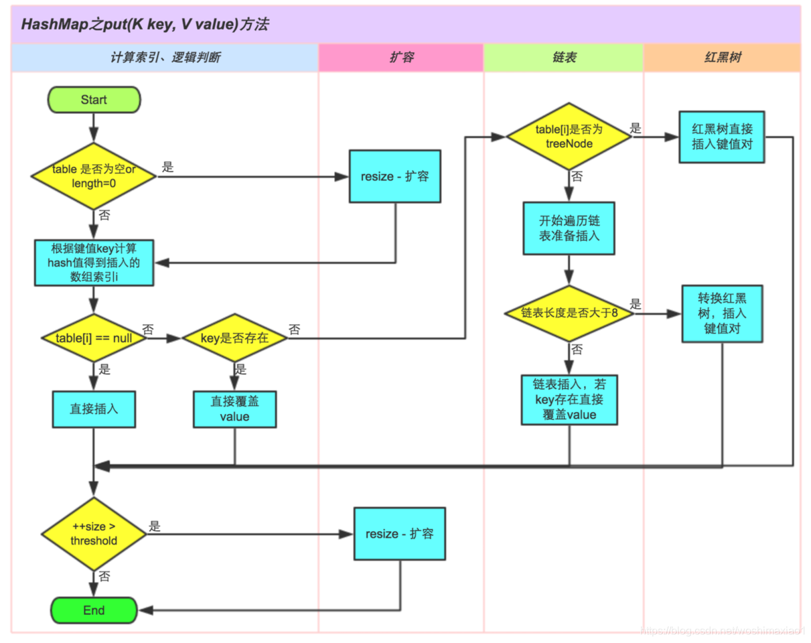

# JAVA关键字列表


# 基本数据类型

byte 8 short 16 int 32 long 62 float 32 double 64 char 16

。定义了boolean这种数据类型，但是只对它提供了非常有限的支持。在Java虚拟机中没有任何供boolean值专用的字节码指令，Java语言表达式所操作的boolean值，在编译之后都使用Java虚拟机中的int数据类型来代替，占32位。而boolean数组将会被编码成Java虚拟机的byte数组，（因此）每个boolean元素占8位。

# JAVA运算符优先级


**算术运算符>位运算符>关系运算符>逻辑运算符>三元运算符>赋值运算符**

# 面向对象三大特征

1、封装(Encapsulation)

**所谓封装，也就是把客观事物封装成抽象的类，并且类可以把自己的数据和方法只让可信的类或者对象操作，对不可信的进行信息隐藏**。封装是面向对象的特征之一，是对象和类概念的主要特性。简单的说，一个类就是一个封装了数据以及操作这些数据的代码的逻辑实体。在一个对象内部，某些代码或某些数据可以是私有的，不能被外界访问。通过这种方式，对象对内部数据提供了不同级别的保护，以防止程序中无关的部分意外的改变或错误的使用了对象的私有部分。

2、继承(Inheritance)

**继承是指这样一种能力：它可以使用现有类的所有功能，并在无需重新编写原来的类的情况下对这些功能进行扩展**。通过继承创建的新类称为“子类”或“派生类”，被继承的类称为“基类”、“父类”或“超类”。继承的过程，就是从一般到特殊的过程。要实现继承，可以通过“继承”（Inheritance）和“组合”（Composition）来实现。继承概念的实现方式有二类：**实现继承与接口继承**。

- 实现继承是指直接使用基类的属性和方法而无需额外编码的能力；
- 接口继承是指仅使用属性和方法的名称、但是子类必须提供实现的能力。

3、多态(Polymorphism)

**所谓多态就是指一个类实例的相同方法在不同情形有不同表现形式。多态机制使具有不同内部结构的对象可以共享相同的外部接口**。这意味着，虽然针对不同对象的具体操作不同，但通过一个公共的类，它们（那些操作）可以通过相同的方式予以调用。最常见的多态就是将子类传入父类参数中，运行时调用父类方法时通过传入的子类决定具体的内部结构或行为。

# Object方法

**1. clone**

保护方法，实现对象的浅复制，只有实现了Cloneable接口才可以调用该方法，否则抛出CloneNotSupportedException异常。

主要是JAVA里除了8种基本类型传参数是值传递，其他的类对象传参数都是引用传递，我们有时候不希望在方法里讲参数改变，这是就需要在类中复写clone方法。

**2.final**

final方法，获得运行时类型。

**3.toString**

该方法用得比较多，一般子类都有覆盖。

**4.finalize**

该方法用于释放资源。因为无法确定该方法什么时候被调用，很少使用。

**5.equals**

该方法是非常重要的一个方法。一般equals和==是不一样的，但是在Object中两者是一样的。子类一般都要重写这个方法。

**6.hashcode**

该方法用于哈希查找，可以减少在查找中使用equals的次数，重写了equals方法一般都要重写hashCode方法。这个方法在一些具有哈希功能的Collection中用到。

一般必须满足obj1.equals(obj2)true。可以推出obj1.hash- Code()obj2.hashCode()，但是hashCode相等不一定就满足equals。不过为了提高效率，应该尽量使上面两个条件接近等价。

如果不重写hashcode(),在HashSet中添加两个equals的对象，会将两个对象都加入进去。

**7.wait**

wait方法就是使当前线程等待该对象的锁，当前线程必须是该对象的拥有者，也就是具有该对象的锁。wait()方法一直等待，直到获得锁或者被中断。wait(long timeout)设定一个超时间隔，如果在规定时间内没有获得锁就返回。

调用该方法后当前线程进入睡眠状态，直到以下事件发生。

（1）其他线程调用了该对象的notify方法。

（2）其他线程调用了该对象的notifyAll方法。

（3）其他线程调用了interrupt中断该线程。

（4）时间间隔到了。

此时该线程就可以被调度了，如果是被中断的话就抛出一个InterruptedException异常。

**8.notify**

该方法唤醒在该对象上等待的某个线程。

**9.notifyAll**

该方法唤醒在该对象上等待的所有线程。

# 类之间的关系

以Hero为例

- **自身：**指的是Hero自己
- **同包子类：**ADHero这个类是Hero的子类，并且和Hero处于**同一个包下**
- **不同包子类：**Support这个类是Hero的子类，但是在**另一个包下
- **同包类：** GiantDragon 这个类和Hero是**同一个包**，但是彼此**没有继承关系**
- **其他类：**Item这个类，**在不同包**，也没有继承关系的


成员变量有四种修饰符

* **private** 私有的: 自身
* **package**/friendly/default 不写：同包类
* **protected** 受保护的：同包类、子类
* **public** 公共的：所有类

修饰符对应的权限关系图为：


# 类属性初始化

静态代码块先于代码块和属性初始化，代码块先于构造方法。 静态属性初始化和静态代码块哪个在前面哪个先。 同样属性初始化和代码块哪个在前面	

`静态声明初始化、静态块初始化`>`非静态声明初始化、非静态块初始化`>`非静态变量的构造器初始化、静态变量的构造器初始化`

**说明：**同一代码块内的顺序取决于编写代码的本来的顺序

# 单例模式

1. 构造方法私有化
2. 静态属性指向实例
3. public static的getInstance方法，返回第二步的静态属性

# 栈、堆

[java堆栈、堆、栈、常量池区别](https://zhuanlan.zhihu.com/p/68794639)

**栈：**

函数中定义的基本类型变量，对象的引用变量都在函数的栈内存中分配。
栈内存特点，数数据一执行完毕，变量会立即释放，节约内存空间。
栈内存中的数据，没有默认初始化值，需要手动设置。

**堆：**

堆内存用来存放new创建的对象和数组。
堆内存中所有的实体都有内存地址值。
堆内存中的实体是用来封装数据的，这些数据都有默认初始化值。
堆内存中的实体不再被指向时，JVM启动垃圾回收机制，自动清除，这也是JAVA优于C++的表现之一（C++中需要程序员手动清除）。

```
main()
　　int x=1;
show ()
　　int x=2
```


```
main()
　　int[] x=new int[3];
　　x[0]=20
```


```
Car c=new Car;
c.color="blue";
Car c1=new Car;
c1.num=5;
```


**常量池**

[java有哪几种常量池](https://www.zhihu.com/question/55994121)

# 构造函数能否被继承

答案是不能，Constructors 是在一个类创建的时候，用户创建类实例的时候被调用的特殊函数。它不是一个类的成员函数，它只能代表这个类本身。

```java
public class main {  
    public static void main (String[] arg){  
        Son s = new Son ();  // code 1  
    }  
}  
  
class Father{  
    public Father (){  
        System.out.println("Father Construtor");  
    }  
      
    public Father (int x){  
        System.out.println("Father Construtor " + x);  
    }  
      
    public void Father (){  
        System.out.println("Father member function");  
    }  
}  
  
class Son extends Father {   
    public Son (){  
        super(1);  
        System.out.println("Son Construtor");  
    }  
      
    public void Father(){  
        System.out.println("Inherited Father member function.");  
        super.Father();  
    }  
}  
```

当我用到不带参的构造方法去构造一个新子类时，系统会先调用父类的无参构造方法，再去调用子类的无参构造方法，子类与父类的无参构造方法都被调用了，并且先调用父类的；当我用带参的构造方法去构造一个新子类时，系统还是会先调用父类的构造方法，但是此时， 系统并不知道父类是否具备有参的构造方法，因此默认会直接用父类的无参构造方法（即使父类拥有有参的构造方法系统也会无视），再去用子类的有参构造方法。那么在有参构造时，super的作用是：可以略过系统的默认规则，转而去调用父类的有参构造方法。

# 抽象类与接口的区别

**区别1：**
子类只能继承一个抽象类，不能继承多个
子类可以实现多个接口
**区别2：**
抽象类可以定义
public,protected,package,private
静态和非静态属性
final和非final属性
但是接口中声明的属性，只能是
public
静态
final的
即便没有显式的声明

**区别3：**

1）接口不能有构造方法，抽象类可以有。
2）接口不能有方法体，抽象类可以有。
3）接口不能有静态方法，抽象类可以有。
4）在接口中凡是变量必须是public static final，而在抽象类中没有要求。

不管是父类还是接口，都可以作为变量类型来进行对象的转换。

# 换行符

**换行符**就是另起一行 --- '\n' 换行（newline）
**回车符**就是回到一行的开头 --- '\r' 回车（return）
在eclipse里敲一个回车，实际上是**回车换行符**
Java是跨平台的编程语言，同样的代码，可以在不同的平台使用，比如Windows,Linux,Mac
然而在不同的操作系统，换行符是不一样的
（1）在DOS和Windows中，每行结尾是 “\r\n”；
（2）Linux系统里，每行结尾只有 “\n”；
（3）Mac系统里，每行结尾是只有 "\r"。
为了使得同一个java程序的换行符在所有的操作系统中都有一样的表现，使用%n，就可以做到平台无关的换行

# 输出方式

```java
System.out.print("probability is " + count * 100.0 /number + "%");
System.out.printf("\nprobability is %.4f %%", count * 100.0 /number);
System.out.format("\nprobability is %.4f %%", count * 100.0 /number);
```

# Scanner

需要注意的是，如果在通过nextInt()读取了整数后，再接着读取字符串，读出来的是回车换行:"\r\n",因为nextInt仅仅读取数字信息，而不会**读取**回车换行"\r\n".

所以，如果在业务上需要读取了整数后，接着读取字符串，那么就应该连续执行两次nextLine()，第一次是取走回车换行，第二次才是读取真正的字符串。或者可以直接使用next可以避免这类问题。

# 异常


Error和Exception都能够try catch处理
异常分类： 可查异常，运行时异常和错误3种
其中，运行时异常和错误又叫非可查异常.
可查异常必须被处理。

# 编码方式

工作后经常接触的编码方式有如下几种：
**ISO-8859-1 ASCII** 数字和西欧字母
**GBK GB2312 BIG5** 中文
**UNICODE** (统一码，万国码)

其中
ISO-8859-1 包含 ASCII
GB2312 是简体中文，BIG5是繁体中文，GBK同时包含简体和繁体以及日文。
UNICODE 包括了所有的文字，无论中文，英文，藏文，法文，世界所有的文字都包含其中

根据前面的学习，我们了解到不同的编码方式对应不同的棋盘，而UNICODE因为要存放所有的数据，那么它的棋盘是最大的。
不仅如此，棋盘里每个数字都是很长的(4个字节)，因为不仅要表示字母，还要表示汉字等。

如果完全按照UNICODE的方式来存储数据，就会有很大的浪费。
比如在ISO-8859-1中，**a** 字符对应的数字是0x61
而UNICODE中对应的数字是 0x00000061，倘若一篇文章大部分都是英文字母，那么按照UNICODE的方式进行数据保存就会消耗很多空间

在这种情况下，就出现了UNICODE的各种**减肥**子编码, 比如UTF-8对数字和字母就使用一个字节，而对汉字就使用3个字节，从而达到了**减肥还能保证健康**的效果


写在.java源代码中的汉字，在执行之后，都会变成JVM中的字符。
而这些中文字符采用的编码方式，都是使用UNICODE. "中"字对应的UNICODE是**4E2D**,所以在内存中，实际保存的数据就是十六进制的0x4E2D, 也就是十进制的20013。


> 编码java文件的方式多种多样，但**java保存字符的时候实际是按照unicode来存的**，注意**编写**和**显示**的编码方式区别。比如，java编写用utf-8，显示用ISO，代码中文字符显示乱码，但正常运行会输出正常中文字符，因为编写用的utf-8，能够被java读取时的Unicode识别，终端能够输出正常中文字符，显示用的ISO，再次观察代码内容时，原先的中文字符会变成乱码；再比如，java编写时用的是GBK，显示用的Unicode，这样中文字符不仅显示时会出现乱码，而且输出也会乱码，此外，两者输出的乱码相同。

> 记事本默认保存格式为UTF-8；保存ANI格式，中文操作系统为GBK，英文操作系统为ISO。

> 在encoding为“UTF-8"时，控制台显示格式为“UTF-8”时，
>
> 当采用字符流的时候： 
>
> 如果test.txt采用GBK编码，那么生成的文件不管用GBK还是UTF-8显示都有乱码；如果test.txt采用UTF-8编码，那么生成的文件用UTF-8没有乱码，GBK有乱码。
>
> 当采用字节流的时候：
>
> 如果test.txt采用GBK编码，生成的文件用GBK无乱码，用UTF-8有乱码；如果test.txt采用UTF-8编码，那么生成的文件用UTF-8没有乱码，GBK有乱码。
>
> 详情见file/CharacterStream.java

``` java
byte类型: 0x2d        2个十六进制数 1个字节
char类型: 0x4e2d      4个十六进制数 2个字节
         0x00004e2d 16个十六进制数 4个字节   
```

```java
1.用"UTF-8"格式读文件时，采用
char[] cs = new char[(int)file.length()];
fis.read(cs);
cs实际按照Unicodeb编码方式存储，例如“中”对应的为4e2d
2.采用
 String str = "中"; 
 byte[] bs = str.getBytes("UTF-8");
能够获得真正的UTF-8编码内容，为e4 b8 ad
```


**字节流读取不需要考虑编码类型，字符流需要考虑编码类型，所以某种意义上字节流比字符流使用更加全面。**

java存储字符串采用Unicode方式；按照字符串方式读入文件内容可以设定读入的编码方式，但java实际存储仍然按照Unicode，采用字节串读入方式不能设定编码方式；

1、java默认的读入编码格式可以在`launch,json`中设置

```json
{
    // Use IntelliSense to learn about possible attributes.
    // Hover to view descriptions of existing attributes.
    // For more information, visit: https://go.microsoft.com/fwlink/?linkid=830387
    "version": "0.2.0",
    "configurations": [
        {
            "type": "java",
            "name": "Launch ObjectStream",
            "request": "launch",
            "mainClass": "file.ObjectStream",
            "projectName": "javaExample_2c8958d4"
        },
        {
            "type": "java",
            "name": "Launch Current File",
            "request": "launch",
            "mainClass": "${file}",
            "encoding": "UTF-8" //默认读入编码格式为UTF-8
        }
    ]
}
```

2、Java Process和Java Debug的控制台编码格式可以在

`c:\Users\Administrator\.vscode\extensions\vscjava.vscode-java-debug-0.36.0\scripts\launcher.bat`

中修改

```bat
@echo off

REM Change code page to UTF-8 for better compatibility.
@chcp.com 936 > NUL 

REM Execute real command passed by args
%*

```

936代表GBK、65001代表UTF-8

3、在终端输入chcp可以查看终端当前的编码格式

`chcp 936`改为GBK，`chcp 65001`改为UTF-8

4、vscode右下方可以查看java文件的编码格式


**为了保证Scanner能够从控制台读入和显示中文，记得将默认编码格式(1)和控制台默认格式(2)都调为GBK格式；若两者都为UTF-8格式，则不能很好地显示中文。**

**输入-输出设计的编码过程**

* > 文件编码格式(记事本另存为可以选择；vscode右下方可以选择)、控制台或者终端编码格式(控制台可以在.bat中修改；终端直接chcp修改即可)

* > java读入的编码格式，FIleReader(f, charset.forName("UTF-8"))、InputStreamReader(FileInputStream, charset.forName("UTF-8"))可以修改，默认一般为UTF-8

* > java内部存储的格式统一为Unicode，jvm会自动将读入的编码格式转成对应的Unicode(可以通过Integer.toHexString()来判断，是用Unicode表示的)

* > java输出的编码格式，输出到文件FIleWriter(f, charset.forName("UTF-8"))、OutputStreamReader(FileOuputStream, charset.forName("UTF-8"))可以修改；输出到控制台或终端中(字节流：new String(byte[], "UTF-8");字符流：new String(char[]),char[]的表示与文件读入的编码格式有关)

* > 输出显示的编码格式，文件编码格式(vscode右下方选择对应的编码方式选择即可)；控制台或终端显示(控制台可以在.bat中修改；终端直接chcp修改即可)

## ASCII编码


## GBK编码


# IO

## 分类方式1

* 字节流


* 字符流


## 分类方式2

* 节点流

节点流从一个特定的数据源读写数据。即节点流是直接操作文件，网络等的流，例如FileInputStream和FileOutputStream，他们直接从文件中读取或往文件中写入字节流。

> 字节流：FileInputStream、FileOutputStream
>
> 字符流：FileReader、FileWriter

* 处理流

> 缓冲流：　
>
> 字节缓冲流有BufferedInputStream/BufferedOutputStream，字符缓冲PrinterWriter BufferedReader/BufferedWriter，字符缓冲流分别提供了读取和写入一行的方法ReadLine和NewLine方法。对于输出地缓冲流，写出的数据，会先写入到内存中，再使用flush方法将内存中的数据刷到硬盘。所以，在使用字符缓冲流的时候，一定要先flush，然后再close，避免数据丢失。
>
> 数据流：
>
> DataInputStream和DataOutputStream分别继承自InputStream和OutputStream，需要“套接”在InputStream和OutputStream类型的节点流之上。
>
> 转换流：
>
> 用于字节数据到字符数据之间的转换。仅有字符流InputStreamReader/OutputStreamWriter。其中，InputStreamReader需要与InputStream“套接”，OutputStreamWriter需要与OutputStream“套接”。
>
> 对象流：
>
> 流类有ObjectInputStream和ObjectOutputStream，本身这两个方法没什么，但是其要写出的对象有要求，该对象必须实现Serializable接口，来声明其是可以序列化的。否则，不能用对象流读写。

将创建流的代码写在try(){}的()中，能实现自动关闭流的过程，这意味着自身不需要额外再写close()语句。


# 文件

file的父目录存在时，若要创建file，无须创建文件，java会自动生成；

file的父目录不存在时，若要创建file，要创建父目录`file.getParentFile().mkdirs`，后面系统才会自动生成文件。

# 类方法与实例方法

class和instance都是object

## 类方法

> 用static修饰的方法。
>
> 由于类方法是属于整个类的，所以类方法的方法体中不能有与类的对象有关的内容。
> 即类方法体有如下限制：
>     1.类方法中不能引用对象变量；
>     2.类方法中不能调用类的对象方法；
>     3.在类方法中不能调使用super，this关键字；
>     4.类方法不能被覆盖。

类方法中可以通过创建实例的方式来来调用对象方法。

## 实例方法

> 当一个类创建了一个对象后，这个对象就可以调用该类的方法（对象方法）。
>
>   1.实例方法中可以引用对象变量，也可以引用类变量；
>   2.实例方法中可以调用类方法；
>   3.对象方法中可以使用super，this关键字。


实例可以调用对象方法和类方法，但类方法一般都直接由类名称来调用；

类名称只能调用类方法，不能调用对象方法。

# 容器

```java
ArrayList<Hero> h=new ArrayList<Hero>(); //(1)
List<Hero> h=new ArrayList<Hero>();      //(2)
```

第一种形式用当前类作为引用类型，那么可以访问到ArrayList这个类中的所有公用方法。第二种形式，用ArrayList实现的接口List作为引用类型，那么通过list引用可以访问到接口中定义的方法。也就是说ArrayList这个类实现了List接口，除了要必须实现接口List中声明的方法外，还可以实现额外的一些方法。但是，第二种形式就无法调用的List接口以外的方法。 使用上，设计模式中有：“代码尽量依赖于抽象，不依赖于具体”。第一种形式就是依赖具体，第二种形式就是依赖于抽象。因为List是接口。代码依赖于抽象的好处是，代码可以方便替换。例如，代码List list = new ArrayList();下面通过list来操作集合。代码编写后发现集合使用的不准确，应该使用LinkedList，那么只要修改一行代码List list = new LinkedList();就可以，这行以后的代码不需要修改，因为List接口保证了调用的都是接口中的方法，而ArrayList与LinkedList都实现了List接口。而如果当时用ArrayList list = new ArrayList()这种形式的话，那么list访问到的就可能是ArrayList里独有的方法而非List接口中的方法。这样替换成LinkedList的时候就有可能需要修改很多的代码。

## 整体框架


上图中Collection还包括Deque；Collections是集合框架的工具类，就像Arrays是数组的工具类一样。

JAVA中的容器类主要分为两大类，一类是Map类，一类是Collections类，他们有一个共同的父接口Iterator，它提供基本的遍历，删除元素操作。Iterator还有一个子接口LinkIterator，它提供双向的遍历操作。

Collections是一个独立元素的序列，这些元素都服从一条或多条规则，它有三个子接口List，Set和Queue。其中List必须按照插入的顺序保存元素、Set不能有重复的元素、Queue按照排队规则来确定对象的产生顺序（通常也是和插入顺序相同）

Map是一组成对的值键对对象，允许用键来查找值。它允许我们使用一个对象来查找某个对象，也被称为关联数组，或者叫做字典。它主要包括HashMap类和TreeMap类。Map在实际开发中使用非常广，特别是HashMap，想象一下我们要保存一个对象中某些元素的值，如果我们在创建一个对象显得有点麻烦，这个时候我们就可以用上Map了，HashMap采用是所以查询的效率是比较高的，如果我们需要一个有序的我们就可以考虑使用TreeMap。


**PriorityQueue实现堆**

> Priority queue represented as a balanced binary heap: the two
>
>  children of queue[n] are queue[2*n+1] and queue[2*(n+1)].  The
>
>  priority queue is ordered by comparator, or by the elements'
>
>  natural ordering, if comparator is null: For each node n in the
>
>  heap and each descendant d of n, n <= d.  The element with the
>
>   lowest value is in queue[0], assuming the queue is nonempty.

## 关系与区别

**ArrayList VS HashSet**

1、ArrayList: 有顺序，HashSet: 无顺序。HashSet的具体顺序，既不是按照插入顺序，也不是按照hashcode的顺序。

2、List中的数据可以重复，Set中的数据不能够重复
重复判断标准是:
首先看hashcode是否相同
如果hashcode不同，则认为是不同数据
如果hashcode相同，再比较equals，如果equals相同，则是相同数据，否则是不同数据。

**ArrayList VS LinkedList**

ArrayList **插入，删除数据慢**
LinkedList， **插入，删除数据快**
ArrayList是顺序结构，所以**定位很快**，指哪找哪。 就像电影院位置一样，有了电影票，一下就找到位置了。
LinkedList 是链表结构，就像手里的一串佛珠，要找出第99个佛珠，必须得一个一个的数过去，所以**定位慢**。

**HashMap VS HashTable**

HashMap和Hashtable都实现了Map接口，都是键值对保存数据的方式
区别1：
HashMap可以存放 null
Hashtable不能存放null
区别2：
HashMap不是线程安全的类
Hashtable是线程安全的类

**几种Set**

HashSet： 无序
LinkedHashSet： 按照插入顺序
TreeSet： 从小到大排序

**HashMap性能卓越的原因**

**-----hashcode概念-----**
所有的对象，都有一个对应的**hashcode（散列值）**
比如字符串“gareen”对应的是1001 (实际上不是，这里是方便理解，假设的值)
比如字符串“temoo”对应的是1004
比如字符串“db”对应的是1008
比如字符串“annie”对应的也是1008

**-----保存数据-----**
准备一个数组，其长度是2000，并且设定特殊的hashcode算法，使得所有字符串对应的hashcode，都会落在0-1999之间
要存放名字是"gareen"的英雄，就把该英雄和名称组成一个**键值对**，存放在数组的1001这个位置上
要存放名字是"temoo"的英雄，就把该英雄存放在数组的1004这个位置上
要存放名字是"db"的英雄，就把该英雄存放在数组的1008这个位置上
要存放名字是"annie"的英雄，然而 "annie"的hashcode 1008对应的位置**已经有db英雄了**，那么就在这里创建一个链表，**接在db英雄后面存放annie**

**-----查找数据-----**
比如要查找gareen，首先计算"gareen"的hashcode是1001，根据1001这个下标，到数组中进行定位，（**根据数组下标进行定位，是非常快速的**） 发现1001这个位置就只有一个英雄，那么该英雄就是gareen.
比如要查找annie，首先计算"annie"的hashcode是1008，根据1008这个下标，到数组中进行定位，发现1008这个位置**有两个英雄**，那么就对两个英雄的名字进行逐一比较(**equals**)，因为此时需要比较的量就已经少很多了，很快也就可以找出目标英雄
这就是使用hashmap进行查询，非常快原理。


## 比较器

```java
@Override
public int compare(CommentVo o1, CommentVo o2) {
           return o1.getTime().compareTo(o2.getTime());
}
```

假设o1是前面的对象，o2表示后面的对象

- 返回-1（或负数），表示不需要交换01和02的位置，o1排在o2前面，降序

- 返回1（或正数），表示需要交换01和02的位置，o1排在o2后面，升序

  https://zhuanlan.zhihu.com/p/54004622（链接中asc和desc的顺序要反一下）

Arrays.sort默认升序 PriorityQueue默认最小堆

方式一：

使用Comparator。

```java
        //引入Comparator，指定比较的算法
        Comparator<Hero> c = new Comparator<Hero>() {
            @Override
            public int compare(Hero h1, Hero h2) {
                //按照hp进行排序
                if(h1.hp>=h2.hp)
                    return 1;  //正数表示h1比h2要大
                else
                    return -1;
            }
        };
        Collections.sort(heros,c);
```

方式二：

实现Comparable接口。

```java
public class Hero implements Comparable<Hero>{
    public String name;
    public float hp;
       
    public int damage;
  
    @Override
    public int compareTo(Hero anotherHero) {
        if(damage<anotherHero.damage)
            return 1; 
        else
            return -1;
    }
}
```

# Lambda

从匿名类慢慢演变为Lambda表达式。

1. 匿名类的正常写法

```java
HeroChecker c1 = new HeroChecker() {
    public boolean test(Hero h) {
        return (h.hp>100 && h.damage<50);
    }
};
```

2. 把外面的壳子去掉，只保留方法参数和方法体，参数和方法间加上符号->。

```java
HeroChecker c2 = (Hero h) ->{
	return h.hp>100 && h.damage<50;
};
```

3. 把return和{}去掉

```java
HeroChecker c3 = (Hero h) ->h.hp>100 && h.damage<50;
```

4. 把 参数类型和圆括号去掉(只有一个参数的时候，才可以去掉圆括号)

```java
HeroChecker c4 = h ->h.hp>100 && h.damage<50;
```

5. 把c4作为参数传递进去

```java
filter(heros,c4);
```

6. 直接把表达式传递进去

```java
filter(heros, h -> h.hp > 100 && h.damage < 50);
```


# 泛型

不使用泛型带来的问题
ADHero（物理攻击英雄） APHero（魔法攻击英雄）都是Hero的子类
ArrayList 默认接受Object类型的对象，所以所有对象都可以放进ArrayList中
所以get(0) **返回的类型是Object**
接着，需要进行强制转换才可以得到APHero类型或者ADHero类型。
如果软件开发人员记忆比较好，能**记得哪个是哪个**，还是可以的。 但是开发人员会犯错误，比如第20行，会记错，把第0个对象转换为ADHero,这样就会出现类型转换异常

## 通配符

**子类型限定符extends**

ArrayList heroList<? extends Hero> 表示这是一个Hero泛型或者其子类泛型
heroList 的泛型可能是Hero
heroList 的泛型可能是APHero
heroList 的泛型可能是ADHero

赋值时可以用Hero或其子类赋值
所以 可以确凿的是，**从heroList取出来的对象，一定是可以转型成Hero的**

但是，不能往里面放东西，但也不可以放Hero，因为
放APHero就不满足<ADHero>
放ADHero又不满足<APHero>

```java
    public static void main(String[] args) {
          
        ArrayList<APHero> apHeroList = new ArrayList<APHero>();
        apHeroList.add(new APHero());
         
        ArrayList<? extends Hero> heroList = apHeroList;
          
        //? extends Hero 表示这是一个Hero泛型的子类泛型
          
        //heroList 的泛型可以是Hero
        //heroList 的泛型可以使APHero
        //heroList 的泛型可以使ADHero
          
        //可以确凿的是，从heroList取出来的对象，一定是可以转型成Hero的
          
        Hero h= heroList.get(0);
          
        //但是，不能往里面放东西
        heroList.add(new ADHero()); //编译错误，因为heroList的泛型 有可能是APHero
        heroList.add(new Hero()); //依然编译错误    
    }
```

**超类型限定符super**

ArrayList heroList<? super Hero> 表示这是一个Hero泛型或者其父类泛型
heroList的泛型可能是Hero
heroList的泛型可能是Object

赋值时可以用hero或其父类赋值
可以往里面插入Hero以及Hero的子类
但是取出来有风险，因为不确定取出来是Hero还是Object

```java
package generic;
 
import java.util.ArrayList;
 
import charactor.ADHero;
import charactor.APHero;
import charactor.Hero;
 
public class TestGeneric {
    public static void main(String[] args) {
 
        ArrayList<? super Hero> heroList = new ArrayList<Object>();
         
        //? super Hero 表示 heroList的泛型是Hero或者其父类泛型
         
        //heroList 的泛型可以是Hero
        //heroList 的泛型可以是Object
         
        //所以就可以插入Hero
        heroList.add(new Hero());
        //也可以插入Hero的子类
        heroList.add(new APHero());
        heroList.add(new ADHero());
         
        //但是，不能从里面取数据出来,因为其泛型可能是Object,而Object是强转Hero会失败
        Hero h= heroList.get(0);
         
    }
 
}
```

**无限定通配符?**

可以用任何类型赋值，但既不能插入也不能获取。

泛型通配符? 代表任意泛型
既然?代表任意泛型，那么换句话说，这个容器什么泛型都有可能

```java
package generic;
 
import java.util.ArrayList;

import property.Item;
import charactor.APHero;
import charactor.Hero;
 
public class TestGeneric {
 
    public static void main(String[] args) {
 
        ArrayList<APHero> apHeroList = new ArrayList<APHero>();
        
        //?泛型通配符，表示任意泛型
        ArrayList<?> generalList = apHeroList;

        //?的缺陷1： 既然?代表任意泛型，那么换句话说，你就不知道这个容器里面是什么类型
        //所以只能以Object的形式取出来
        Object o = generalList.get(0);

        //?的缺陷2： 既然?代表任意泛型，那么既有可能是Hero,也有可能是Item
        //所以，放哪种对象进去，都有风险，结果就什么什么类型的对象，都不能放进去
        generalList.add(new Item()); //编译错误 因为?代表任意泛型，很有可能不是Item
        generalList.add(new Hero()); //编译错误 因为?代表任意泛型，很有可能不是Hero
        generalList.add(new APHero()); //编译错误  因为?代表任意泛型，很有可能不是APHero
 
    }
}

```

所以只能以Object的形式取出来
并且不能往里面放对象，因为不知道到底是一个什么泛型的容器

> 如果希望只取出，不插入，就使用? extends Hero
> 如果希望只插入，不取出，就使用? super Hero
> 如果希望，又能插入，又能取出，就不要用通配符？

三者都能删除元素，不能取出指的是如果硬要取出的话，类型是Object，不能进行强转。

如果要定义在类或接口中，可以使用<T extends/super Class/Interface>的形式来限定T是Class的子类或者父类。

## java 中泛型标记符

- **E** - Element (在集合中使用，因为集合中存放的是元素)
- **T** - Type（Java 类）
- **K** - Key（键）
- **V** - Value（值）
- **N** - Number（数值类型）
- **？** - 表示不确定的 java 类型


## 泛型转换

子类泛型无法转化为父类泛型，父类泛型无法转化为子类泛型。要想达到类似于子类与父类之间相互转换的效果，可以采用通配符的形式。

## public void <T> show (T t)

<T>表示传入参数有泛型T。

# 继承

**Node.java：**

```java
public class Node {
    public Node leftNode;
    public Node rightNode;
    public Object value;

    public void add(Object v) {
        if (value == null) {
            value = v;
        } else {
            if (compare(v, value)) {
                if (leftNode == null) {
                    leftNode = new Node();
                }
                leftNode.add(v);
            } else {
                if (rightNode == null) {
                    rightNode= new Node(); 
                }
                rightNode.add(v);   
            }
        }
    }

    /** 中序遍历所有节点 */
    public List<Object> values() {
        List<Object> values = new ArrayList<>();

        if (leftNode != null) {
            values.addAll(leftNode.values());
        }

        values.add(value);

        if (rightNode != null) {
            values.addAll(rightNode.values());
        }
        
        return values;
    }
    /** v1比v2小，返回true */
    public boolean compare(Object v1, Object v2) {
        Integer i1 = (Integer)v1;
        Integer i2 = (Integer)v2;
        return i1 - i2 <= 0;
    }
    public static void main(String[] args) {
        int randoms[] = new int[] {67, 7, 30, 73, 10, 0, 78, 81, 10, 74};

        Node roots = new Node();
        for (int number : randoms) {
            roots.add(number);
        }
        System.out.println(roots.values());
    }
}
```

**HeroNode.java：**

```java
public class HeroNode extends Node {

    @Override
    public boolean compare(Object v1, Object v2) {
        Hero i1 = (Hero)v1;
        Hero i2 = (Hero)v2;
        return i1.getHp() - i2.getHp() <= 0;
    }    

    static void printValue(List<Object> values) {
        for (Object o : values) {
            Hero h = (Hero)o;
            System.out.println(h.getName() + " " + h.getHp());
        }
    }
    public static void main(String[] args) {
        HeroNode hRoots = new HeroNode();
        float[] hps = new float[] {988, 809, 786, 566
                                  ,748, 178, 569, 572
                                  ,448, 679};
        for (int i = 0; i < hps.length; i++) {
            hRoots.add(new Hero("hero " + i, hps[i]));
            System.out.println("hero" + i + "  " + hps[i]);
        }
        System.out.println("Hp由到大到小的结果：");
        printValue(hRoots.values());
    }
}

```

hRoots进行add操作时，add方法中第一次调用compare方法时，是调用HeroNode.compare方法，但继续递归添加时，由于创建左右结点的代码为`leftNode = new Node();rightNode = new Node()`，因此第二次调用compare方法时，会调用Node.compare方法，从而导致出现错误。

**解决方法1：**

`HeroNode.java`中直接接重写add方法，但这样会造成很多重复工作。

```java
    public void add(Object v) {
        if (value == null) {
            value = v;
        } else {
            if (compare(v, value) <= 0) {
                if (leftNode == null) {
                    leftNode = new HeroNode();
                }
                leftNode.add(v);
            } else {
                if (rightNode == null) {
                    rightNode= new HeroNode(); 
                }
                rightNode.add(v);
            }
        }
    }
```

**解决方法2**：

`Node.java`中`leftNode = new Node();rightNode = new Node()`对应的代码改成反射机制的表达方式，这样`HeroNode.java`不需要再进行重写`add`方法，只需要进行继承即可。

```java
    public void add(Object v) {
        if (value == null) {
            value = v;
        } else {
            if (compare(v, value)) {
                if (leftNode == null) {
                    /** 下面是采用反射方法创建 */
                    try {
                        leftNode = getClass().getDeclaredConstructor().newInstance();
                    } catch (Exception e) {
                        e.printStackTrace();
                    }
                }
                leftNode.add(v);
            } else {
                if (rightNode == null) {
                    try {
                        rightNode = getClass().getDeclaredConstructor().newInstance();
                    } catch (Exception e) {
                        e.printStackTrace();
                    }
                }
                rightNode.add(v);   
            }
        }
    }
```

**补充**

1、不采用compare方法，而是直接用判断语句的话，即使`Node.java`add方法使用反射机制，`HeroNode.java`仍然需要重写add方法。

2、`Node n = new HeroNode();n.compare(h1, h2);`compare方法用的实际上为`HeroNode.java`中改写的，而不是`Node.java`中的；n声明为Node类型，这限制了n只能使用HeroNode从Node继承的字段和方法（包括自身重写的字段和方法）。

# 注解

> 1、注解对元数据进行了检查、对比等工作，不会对所修饰的代码产生直接的影响。
>
> 2、装饰器可以对方法进行功能上的改变，可以对所修饰的代码产生直接的影响。

[java注解和python装饰符区别](https://blog.csdn.net/a__int__/article/details/108279340)

**基本内置注解**

步骤 **1** : @Override  
步骤 **2** : @Deprecated  
步骤 **3** : @SuppressWarnings 
步骤 **4** : @SafeVarargs 
步骤 **5** : @FunctionalInterface  

**元注解**

@Target
@Retention
@Inherited
@Documented
@Repeatable (java1.8 新增)

@Target 表示这个注解能放在什么位置上，是只能放在类上？还是即可以放在方法上，又可以放在属性上。自定义注解@JDBCConfig 这个注解上的@Target是：@Target({METHOD,TYPE})，表示他可以用在方法和类型上（类和接口），但是不能放在属性等其他位置。 可以选择的位置列表如下：
ElementType.TYPE：能修饰类、接口或枚举类型
ElementType.FIELD：能修饰成员变量
ElementType.METHOD：能修饰方法
ElementType.PARAMETER：能修饰参数
ElementType.CONSTRUCTOR：能修饰构造器
ElementType.LOCAL_VARIABLE：能修饰局部变量
ElementType.ANNOTATION_TYPE：能修饰注解
ElementType.PACKAGE：能修饰包

@Retention 表示生命周期，自定义注解@JDBCConfig上的值是 RetentionPolicy.RUNTIME, 表示可以在运行的时候依然可以使用。 @Retention可选的值有3个：
**RetentionPolicy.SOURCE：** 注解只在源代码中存在，编译成class之后，就没了。@Override 就是这种注解。
**RetentionPolicy.CLASS：** 注解在java文件编程成.class文件后，依然存在，但是运行起来后就没了。@Retention的默认值，即当没有显式指定@Retention的时候，就会是这种类型。
**RetentionPolicy.RUNTIME：** 注解在运行起来之后依然存在，程序可以通过反射获取这些信息，自定义注解@JDBCConfig 就是这样。
大家可以试试把自定义注解@JDBCConfig的@Retention改成其他两种，并且运行起来，看看有什么不同

@Inherited 表示该注解具有继承性。如例，设计一个DBUtil的子类，其getConnection2方法，可以获取到父类DBUtil上的注解信息。

@Documented 如图所示， 在用javadoc命令生成API文档后，DBUtil的文档里会出现该注解说明。

当没有@Repeatable修饰的时候，注解在同一个位置，只能出现一次，如例所示：
@JDBCConfig(ip = "127.0.0.1", database = "test", encoding = "UTF-8", loginName = "root", password = "admin")
@JDBCConfig(ip = "127.0.0.1", database = "test", encoding = "UTF-8", loginName = "root", password = "admin")
重复做两次就会报错了。
使用@Repeatable之后，再配合一些其他动作，就可以在同一个地方使用多次了。


# 正则表达式

[正则表达式教程](https://www.runoob.com/regexp/regexp-syntax.html)

[最实用的正则表达式整理](https://zhuanlan.zhihu.com/p/30573054)

# 多线程(并发编程)

创建多线程的三种方法：继承线程类；实现Runnable接口；匿名类。但不管哪种方式，它都需要实现public void run()方法，调用线程时需要使用线程的start方法。

**匿名类**

  1、使用匿名内部类时，我们必须是**继承一个类或者实现一个接口**，但是两者不可兼得，同时也只能继承一个类或者实现一个接口。
  2、匿名内部类中是不能定义构造函数的。
  3、匿名内部类中不能存在任何的静态成员变量和静态方法。
  4、匿名内部类为局部内部类，所以局部内部类的所有限制同样对匿名内部类生效。
  5、匿名内部类不能是抽象的，它必须要实现继承的类或者实现的接口的所有抽象方法。

例如 Thread t = new Thread(){...}，该表达式创建了一个匿名类，并创建一个实例对象t。

**进程与线程的区别：进程一般包括多个线程**

**进程：**启动一个LOL.exe就叫一个进程。 接着又启动一个DOTA.exe，这叫两个进程。
**线程：**线程是在进程内部同时做的事情，比如在LOL里，有很多事情要同时做，比如"盖伦” 击杀“提莫”，**同时**“赏金猎人”又在击杀“盲僧”，这就是由多线程来实现的。

**多线程优点**

* 多线程技术使程序的响应速度更快 ,因为用户界面可以在进行其它工作的同时一直处于活动状态;

* 当前没有进行处理的任务时可以将处理器时间让给其它任务;

* 占用大量处理时间的任务可以定期将处理器时间让给其它任务;

* 可以随时停止任务;

* 可以分别设置各个任务的优先级以优化性能。

总之，资源利用率更好，程序设计在某些情况下更简单，程序响应更快。

 是否需要创建多个线程取决于各种因素。在以下情况下,最适合采用多线程处理: 

* 耗时或大量占用处理器的任务阻塞用户界面操作;

* 各个任务必须等待外部资源 (如远程文件或 Internet连接)。

**多线程缺点**

* 等候使用共享资源时造成程序的运行速度变慢。这些共享资源主要是独占性的资源 ,如打印机等。
* 对线程进行管理要求额外的 CPU开销。线程的使用会给系统带来上下文切换的额外负担。当这种负担超过一定程度时,多线程的特点主要表现在其缺点上,比如用独立的线程来更新数组内每个元素。
* 线程的死锁。即较长时间的等待或资源竞争以及死锁等多线程症状。
* 对公有变量的同时读或写。当多个线程需要对公有变量进行写操作时,后一个线程往往会修改掉前一个线程存放的数据,从而使前一个线程的参数被修改;另外 ,当公用变量的读写操作是非原子性时,在不同的机器上,中断时间的不确定性,会导致数据在一个线程内的操作产生错误,从而产生莫名其妙的错误,而这种错误是程序员无法预知的。

**同步synchronized**

多线程的同步问题指的是多个线程同时修改一个数据的时候，可能导致的问题

多线程的问题，又叫**Concurrency((并发)** 问题

synchronized是Java中的关键字，是一种同步锁。它修饰的对象有以下几种：
1. 修饰一个代码块，被修饰的代码块称为同步语句块，其作用的范围是大括号{}括起来的代码，作用的对象是调用这个代码块的对象；
2. 修饰一个方法，被修饰的方法称为同步方法，其作用的范围是整个方法，作用的对象是调用这个方法的对象；
3. 修改一个静态的方法，其作用的范围是整个静态方法，作用的对象是这个类的所有对象；
4. 修改一个类，其作用的范围是synchronized后面括号括起来的部分，作用主的对象是这个类的所有对象。

synchronized无法修饰构造函数。

synchronized无法被继承。

关键字修饰的顺序为：public static final synchronized int method()

**线程安全类**

如果一个类，其**方法都是有synchronized修饰的**，那么该类就叫做**线程安全的类**

同一时间，只有一个线程能够进入 **这种类的一个实例** 的去修改数据，进而保证了这个实例中的数据的安全(不会同时被多线程修改而变成脏数据)

比如StringBuffer和StringBuilder的区别
StringBuffer的方法都是有synchronized修饰的，StringBuffer就叫做线程安全的类
而StringBuilder就不是线程安全的类

1. HashMap和HashTable

HashMap和Hashtable都实现了Map接口，都是键值对保存数据的方式
区别1：
HashMap可以存放 null
Hashtable不能存放null
区别2：
HashMap不是线程安全的类
Hashtable是线程安全的类

2. StringBuffer和StringBulder

StringBuffer 是线程安全的
StringBuilder 是非线程安全的

所以当进行大量字符串拼接操作的时候，如果是单线程就用StringBuilder会更快些，如果是多线程，就需要用StringBuffer 保证数据的安全性。

非线程安全的类比线程安全的类进行处理时更快的原因在于，同步线程需要时间

3. ArrayList和Vector

Vector是线程安全的类，而ArrayList是非线程安全的。

ArrayList是非线程安全的，换句话说，多个线程可以同时进入**一个ArrayList对象**的add方法

借助Collections.synchronizedList，可以把ArrayList转换为线程安全的List。

与此类似的，还有HashSet,LinkedList,HashMap等等非线程安全的类，都通过工具类Collections转换为线程安全的

**死锁**

1. 线程1 首先占有对象1，接着试图占有对象2
2. 线程2 首先占有对象2，接着试图占有对象1
3. 线程1 等待线程2释放对象2
4. 与此同时，线程2等待线程1释放对象1

当多个线程按照不同顺序占用多个同步对象的时候，就有可能产生死锁现象。

死锁之所以会发生，就是因为synchronized 如果占用不到同步对象，就会苦苦的一直等待下去，借助tryLock的有限等待时间，解决死锁问题

**交互**

几种交互方式：

- wait() + notify() (Object)--对于synchronized占有对象来说
- await() + signal() (condition 条件锁)--对于lock占有对象来说
- join方式

[notify和notifyAll区别](https://blog.csdn.net/u014658905/article/details/81035870)

Java提供了两个方法notify和notifyAll来唤醒在某些条件下等待的线程，你可以使用它们中的任何一个，但是Java中的notify和notifyAll之间存在细微差别，这使得它成为Java中流行的多线程面试问题之一。当你调用notify时，只有一个等待线程会被唤醒而且它不能保证哪个线程会被唤醒，这取决于线程调度器。虽然如果你调用notifyAll方法，那么等待该锁的所有线程都会被唤醒，但是在执行剩余的代码之前，所有被唤醒的线程都将争夺锁定，这就是为什么在循环上调用wait，因为如果多个线程被唤醒，那么线程是将获得锁定将首先执行，它可能会重置等待条件，这将迫使后续线程等待。因此，notify和notifyAll之间的关键区别在于notify（）只会唤醒一个线程，而notifyAll方法将唤醒所有线程。
1）如果我使用notify（），将通知哪个线程？
无法保证，ThreadScheduler将从等待该监视器上的线程的池中选择一个随机线程。保证只有一个线程会被通知:（随机性）

2) 我怎么知道有多少线程在等待，所以我可以使用notifyAll（）？
它取决于程序逻辑，在编码时需要考虑一段代码是否可以由多个线程运行。理解线程间通信的一个很好的例子是在Java中实现生产者 - 消费者模式。

**锁Lock**

1. Lock是一个接口，而synchronized是Java中的关键字，synchronized是内置的语言实现，Lock是代码层面的实现。
2. Lock可以选择性的获取锁，如果一段时间获取不到，可以放弃。synchronized不行，会一根筋一直获取下去。 借助Lock的这个特性，就能够规避死锁，synchronized必须通过谨慎和良好的设计，才能减少死锁的发生。
3. synchronized在发生异常和同步块结束的时候，会自动释放锁。而Lock必须手动释放， 所以如果忘记了释放锁，一样会造成死锁。

**[锁的分类](https://www.cnblogs.com/qifengshi/p/6831055.html)**

1.公平锁/非公平锁

公平锁是指多个线程按照申请锁的顺序来获取锁。
非公平锁是指多个线程获取锁的顺序并不是按照申请锁的顺序，有可能后申请的线程比先申请的线程优先获取锁。有可能，会造成优先级反转或者饥饿现象。
对于Java `ReentrantLock`而言，通过构造函数指定该锁是否是公平锁，默认是非公平锁。非公平锁的优点在于吞吐量比公平锁大。
对于`Synchronized`而言，也是一种非公平锁。由于其并不像`ReentrantLock`是通过AQS的来实现线程调度，所以并没有任何办法使其变成公平锁。

2.可重入锁

可重入锁又名递归锁，是指在同一个线程在外层方法获取锁的时候，在进入内层方法会自动获取锁。说的有点抽象，下面会有一个代码的示例。
对于Java `ReentrantLock`而言, 他的名字就可以看出是一个可重入锁，其名字是`ReentrantLock`重新进入锁。
对于`Synchronized`而言,也是一个可重入锁。可重入锁的一个好处是可一定程度避免死锁。

```
synchronized void setA() throws Exception{
	Thread.sleep(1000);
	setB();
}

synchronized void setB() throws Exception{
	Thread.sleep(1000);
}
```

上面的代码就是一个可重入锁的一个特点，如果不是可重入锁的话，setB可能不会被当前线程执行，可能造成死锁。

3.独享锁/共享锁

独享锁是指该锁一次只能被一个线程所持有。独享锁又叫排它锁，X锁。
共享锁是指该锁可被多个线程所持有。共享锁就是S锁。

对于Java `ReentrantLock`而言，其是独享锁。但是对于Lock的另一个实现类`ReadWriteLock`，其读锁是共享锁，其写锁是独享锁。
读锁的共享锁可保证并发读是非常高效的，读写，写读 ，写写的过程是互斥的。
独享锁与共享锁也是通过AQS来实现的，通过实现不同的方法，来实现独享或者共享。
对于`Synchronized`而言，当然是独享锁。

4.互斥锁/独享锁

上面讲的独享锁/共享锁就是一种广义的说法，互斥锁/读写锁就是具体的实现。
互斥锁在Java中的具体实现就是`ReentrantLock`
读写锁在Java中的具体实现就是`ReadWriteLock`

5.乐观锁/悲观锁

乐观锁与悲观锁不是指具体的什么类型的锁，而是指看待并发同步的角度。
悲观锁认为对于同一个数据的并发操作，一定是会发生修改的，哪怕没有修改，也会认为修改。因此对于同一个数据的并发操作，悲观锁采取加锁的形式。悲观的认为，不加锁的并发操作一定会出问题。
乐观锁则认为对于同一个数据的并发操作，是不会发生修改的。在更新数据的时候，会采用尝试更新，不断重新的方式更新数据。乐观的认为，不加锁的并发操作是没有事情的。

从上面的描述我们可以看出，悲观锁适合写操作非常多的场景，乐观锁适合读操作非常多的场景，不加锁会带来大量的性能提升。
悲观锁在Java中的使用，就是利用各种锁。
乐观锁在Java中的使用，是无锁编程，常常采用的是CAS算法，典型的例子就是原子类，通过CAS自旋实现原子操作的更新。

排它锁都是悲观锁，共享锁也是悲观锁的一种实现。

6.分段锁

分段锁其实是一种锁的设计，并不是具体的一种锁，对于`ConcurrentHashMap`而言，其并发的实现就是通过分段锁的形式来实现高效的并发操作。
我们以`ConcurrentHashMap`来说一下分段锁的含义以及设计思想，`ConcurrentHashMap`中的分段锁称为Segment，它即类似于HashMap（JDK7与JDK8中HashMap的实现）的结构，即内部拥有一个Entry数组，数组中的每个元素又是一个链表；同时又是一个ReentrantLock（Segment继承了ReentrantLock)。
当需要put元素的时候，并不是对整个hashmap进行加锁，而是先通过hashcode来知道他要放在那一个分段中，然后对这个分段进行加锁，所以当多线程put的时候，只要不是放在一个分段中，就实现了真正的并行的插入。
但是，在统计size的时候，可就是获取hashmap全局信息的时候，就需要获取所有的分段锁才能统计。
分段锁的设计目的是细化锁的粒度，当操作不需要更新整个数组的时候，就仅仅针对数组中的一项进行加锁操作。

7.偏向锁/轻量级锁/重量级锁

这三种锁是指锁的状态，并且是针对`Synchronized`。在Java 5通过引入锁升级的机制来实现高效`Synchronized`。这三种锁的状态是通过对象监视器在对象头中的字段来表明的。
偏向锁是指一段同步代码一直被一个线程所访问，那么该线程会自动获取锁。降低获取锁的代价。
轻量级锁是指当锁是偏向锁的时候，被另一个线程所访问，偏向锁就会升级为轻量级锁，其他线程会通过自旋的形式尝试获取锁，不会阻塞，提高性能。
重量级锁是指当锁为轻量级锁的时候，另一个线程虽然是自旋，但自旋不会一直持续下去，当自旋一定次数的时候，还没有获取到锁，就会进入阻塞，该锁膨胀为重量级锁。重量级锁会让其他申请的线程进入阻塞，性能降低。

8.自旋锁

在Java中，自旋锁是指尝试获取锁的线程不会立即阻塞，而是采用循环的方式去尝试获取锁，这样的好处是减少线程上下文切换的消耗，缺点是循环会消耗CPU。
典型的自旋锁实现的例子，可以参考[自旋锁的实现](http://ifeve.com/java_lock_see1/)

**当一个线程进入一个对象的一个synchronized方法后，其它线程是否可进入此对象的其它方法**

这要看情况而定，如果该对象的其他方法也是有synchronized修饰的，那么其他线程就会被挡在外面。否则其他线程就可以进入其他方法。

**原子访问**

所谓的**原子性操作**即不可中断的操作，比如赋值操作
**原子性操作本身是线程安全的**
但是 i++ 这个行为，事实上是有3个原子性操作组成的。
步骤 1. 取 i 的值
步骤 2. i + 1
步骤 3. 把新的值赋予i
这三个步骤，每一步都是一个原子操作，但是合在一起，就不是原子操作。就**不是线程安全**的。
换句话说，一个线程在步骤1 取i 的值结束后，还没有来得及进行步骤2，另一个线程也可以取 i的值了。
这也是分析同步问题产生的原因中的原理。
i++ ，i--， i = i+1 这些都是非原子性操作。
只有int i = 1,这个赋值操作是原子性的。

# 反射

获取类对象有3种方式

1. Class.forName
2. Hero.class
3. new Hero().getClass()

在一个JVM中，一种类，只会有一个类对象存在。所以以上三种方式取出来的类对象，都是一样的。

getField和getDeclaredField的区别
这两个方法都是用于获取字段
getField **只能获取**public的，包括**从父类继承**来的字段。
getDeclaredField 可以获取本类所有的字段，**包括private**的，但是**不能获取继承**来的字段。 (**注**： 这里只能获取到private的**字段**，但并不能访问该private字段的**值**,除非加上**setAccessible(true)**)

# 工具

**javac** java编译器

**java** java解释器

**javap** 查看java中的class文件

**javadoc** java注释工具

**junit** java测试工具

# 其他细节

## 1、浅拷贝(shallow copy)和深拷贝(deep copy)

参考链接：https://www.cnblogs.com/ysocean/p/8482979.html

[String类只能实现浅拷贝，没有实现深拷贝。因为String类无法修改，一旦发生修改，内存地址就会发生改变，不像其他对象内存地址不会发生改变，因此String类没必要实现深拷贝。](https://someexp.com/post/About-String-Class's-shallow-clone-and-deep-clone-in-java/)

浅拷贝：实现Cloneable接口，而且覆写Object的public Object clone() throws CloneNotSupportedException方法。（两者缺一不可）

深拷贝：让类中每个引用属性内部重写clone方法或者利用序列化、反序列化重新生成对象。

JAVA中String和8种基本类型所对应的类都没有实现clone方法。

例子：Arrays.copyOf和Arrays.copyOfRange都是实现的浅拷贝而不是深拷贝，即拷贝的是引用类型。

## 2、HashMap源码分析

参考链接：https://blog.csdn.net/woshimaxiao1/article/details/83661464

**HashMap**总体结构：


简单来说，**HashMap由数组+链表(或者红黑树)组成的**，数组是HashMap的主体，链表则是主要为了解决哈希冲突而存在的，如果定位到的数组位置不含链表（当前entry的next指向null）,那么查找，添加等操作很快，仅需一次寻址即可；如果定位到的数组包含链表，对于添加操作，其时间复杂度为O(n)，首先遍历链表，存在即覆盖，否则新增；对于查找操作来讲，仍需遍历链表，然后通过key对象的equals方法逐一比对查找。所以，性能考虑，**HashMap中的链表出现越少，性能才会越好。**

**HashMap Put方法逻辑分析**



HashMap中判断是否为同一个key：1）首先判断hashCode值是否相同 2)然后调用equals判断是否相等。如果两者均相等，则认为是同一个key。

## 3、JAVA常量池

## [intern内部原理](https://www.jianshu.com/p/0d1c003d2ff5)

参考链接：

https://www.jianshu.com/p/c7f47de2ee80
https://www.zhihu.com/question/55994121

**相关概念** 

**1. 常量**

用final修饰的成员变量表示常量，值一旦给定就无法改变！
final修饰的变量有三种：静态变量、实例变量和局部变量，分别表示三种类型的常量。

**2. 常量池的类型**

==**Class文件中的常量池**==

在Class文件结构中，最头的4个字节用于存储魔数Magic Number，用于确定一个文件是否能被JVM接受，再接着4个字节用于存储版本号，前2个字节存储次版本号，后2个存储主版本号，再接着是用于存放常量的常量池，由于常量的数量是不固定的，所以常量池的入口放置一个U2类型的数据(constant_pool_count)存储常量池容量计数值。

 Class常量池主要用于存放两大类常量：**字面量**(Literal)和**符号引用量**(Symbolic References)，字面量相当于Java语言层面常量的概念，如文本字符串，数值1、2、1.3，声明为final的常量值等，符号引用则属于编译原理方面的概念，包括了如下三种类型的常量：

- 类和接口的全限定名
- 字段名称和描述符
- 方法名称和描述符

这个用javap看一下就能明白，这里只涉及字符串就不谈其他的了。简单地说，用双引号引起来的字符串字面量都会进这里面。具体查看指令为：`javap -verbose Class文件`

==**方法区中的运行时常量池**==

运行时常量池是方法区的一部分。
 CLass文件中除了有类的版本、字段、方法、接口等描述信息外，还有一项信息是常量池，用于**存放编译期生成的各种字面量和符号引用**，**这部分内容将在类加载后进入方法区的运行时常量池中存放**。
 运行时常量池相对于CLass文件常量池的另外一个重要特征是**具备动态性**，Java语言并不要求常量一定只有编译期才能产生，也就是并非预置入CLass文件中常量池的内容才能进入方法区运行时常量池，运行期间也可能将新的常量放入池中，这种特性被开发人员利用比较多的就是**String类的intern()**方法。

==**全局字符串常量池**==

HotSpot VM里，记录interned string的一个全局表叫做StringTable，它本质上就是个HashSet<String>。这是个纯运行时的结构，而且是惰性（lazy）维护的。注意它只存储对java.lang.String实例的引用，而不存储String对象的内容。 注意，它只存了引用，根据这个引用可以得到具体的String对象。一般我们说一**个字符串进入了全局的字符串常量池其实是说在这个StringTable中保存了对它的引用**，反之，如果说没有在其中就是说StringTable中没有对它的引用。

**3. 字面量进入全局字符串常量池的时机**

JVM规范里Class文件的常量池项的类型，有两种东西：

1.CONSTANT_Utf8

2.CONSTANT_String

后者是String常量的类型，但它并不直接持有String常量的内容，而是只持有一个index，这个index所指定的另一个常量池项必须是一个CONSTANT_Utf8类型的常量，这里才真正持有字符串的内容。  

在HotSpot VM中，运行时常量池里，
CONSTANT_Utf8 -> Symbol*（一个指针，指向一个Symbol类型的C++对象，内容是跟Class文件同样格式的UTF-8编码的字符串）
CONSTANT_String -> java.lang.String（一个实际的Java对象的引用，C++类型是oop） 

CONSTANT_Utf8会在类加载的过程中就全部创建出来，而CONSTANT_String则是lazy resolve的，例如说在第一次引用该项的ldc指令被第一次执行到的时候才会resolve。那么在尚未resolve的时候，HotSpot VM把它的类型叫做JVM_CONSTANT_UnresolvedString，内容跟Class文件里一样只是一个index；等到resolve过后这个项的常量类型就会变成最终的JVM_CONSTANT_String，而内容则变成实际的那个oop。 

看到这里想必也就明白了， 就**HotSpot VM的实现来说，加载类的时候，那些字符串字面量会进入到当前类的运行时常量池，不会进入全局的字符串常量池（即在StringTable中并没有相应的引用，在堆中也没有对应的对象产生**

**4. 常量池的好处**

常量池是为了避免频繁的创建和销毁对象而影响系统性能，其实现了对象的共享。
 例如字符串常量池，在编译阶段就把所有的字符串文字放到一个常量池中。
 （1）节省内存空间：常量池中所有相同的字符串常量被合并，只占用一个空间。
 （2）节省运行时间：比较字符串时，比equals()快。对于两个引用变量，只用判断引用是否相等，也就可以判断实际值是否相等。

**8种基本类型的包装类和常量池**

1. java中基本类型的包装类的大部分都实现了常量池技术，即Byte,Short,Integer,Long,Character,Boolean；

```java
  Integer i1 = 40;
  Integer i2 = 40;
  System.out.println(i1==i2);//输出TRUE
```

这5种包装类默认创建了数值[-128，127]的相应类型的缓存数据，但是超出此范围仍然会去创建新的对象。

```java
//Integer 缓存代码 ：
public static Integer valueOf(int i) {
        assert IntegerCache.high >= 127;
        if (i >= IntegerCache.low && i <= IntegerCache.high)
            return IntegerCache.cache[i + (-IntegerCache.low)];
        return new Integer(i);
    }
```

```java
  Integer i1 = 400;
  Integer i2 = 400;
  System.out.println(i1==i2);//输出false
```

2.两种浮点数类型的包装类Double和Float没有实现常量池技术

```java
   Double i1=1.2;
   Double i2=1.2;
   System.out.println(i1==i2);//输出false
```

3.应用常量池的场景

(1)`Integer i1=40；`Java在编译的时候会直接将代码封装成`Integer i1=Integer.valueOf(40);`，从而使用常量池中的对象。
 (2)`Integer i1 = new Integer(40);`这种情况下会创建新的对象。

```java
  Integer i1 = 40;
  Integer i2 = 40;
  Integer i3 = 0;
  Integer i4 = new Integer(40);
  Integer i5 = new Integer(40);
  Integer i6 = new Integer(0);
  
  System.out.println("i1=i2   " + (i1 == i2));
  System.out.println("i1=i2+i3   " + (i1 == i2 + i3));
  System.out.println("i1=i4   " + (i1 == i4));
  System.out.println("i4=i5   " + (i4 == i5));
  System.out.println("i4=i5+i6   " + (i4 == i5 + i6));   
  System.out.println("40=i5+i6   " + (40 == i5 + i6));     
```

```java
i1=i2   true
i1=i2+i3   true
i1=i4   false
i4=i5   false
i4=i5+i6   true
40=i5+i6   true
```

**String类和常量池**

**1.String对象创建方法**

```java
     String str1 = "abcd";
     String str2 = new String("abcd");
     System.out.println(str1==str2);//false
```

这两种不同的创建方法是有差别的，第一种方式是在常量池中拿对象，第二种方式是直接在堆内存空间创建一个新的对象。
**只要使用new方法，便需要创建新的对象。**

**2.连接表达式+**

1. 只有使用引号包含文本的方式创建的String对象之间使用“+”连接产生的新对象才会被加入常量池中。
2. 对于所有包含new方式新建对象（包括null）的“+”连接表达式，它所产生的新对象都不会被加入常量池中。

```java
  String str1 = "str";
  String str2 = "ing";
  
  String str3 = "str" + "ing";
  String str4 = str1 + str2;
  System.out.println(str3 == str4);//false
  
  String str5 = "string";
  System.out.println(str3 == str5);//true
```

特例1：

```java
public static final String A = "ab"; // 常量A
public static final String B = "cd"; // 常量B
public static void main(String[] args) {
     String s = A + B;  // 将两个常量用+连接对s进行初始化 
     String t = "abcd";   
    if (s == t) {   
         System.out.println("s等于t，它们是同一个对象");   
     } else {   
         System.out.println("s不等于t，它们不是同一个对象");   
     }   
 } 
s等于t，它们是同一个对象
```

A和B都是常量，值是固定的，因此s的值也是固定的，它在类被编译时就已经确定了。也就是说：String s=A+B; 等同于：String s="ab"+"cd";

特例2：

```java
public static final String A; // 常量A
public static final String B;    // 常量B
static {   
     A = "ab";   
     B = "cd";   
 }   
 public static void main(String[] args) {   
    // 将两个常量用+连接对s进行初始化   
     String s = A + B;   
     String t = "abcd";   
    if (s == t) {   
         System.out.println("s等于t，它们是同一个对象");   
     } else {   
         System.out.println("s不等于t，它们不是同一个对象");   
     }   
 } 
s不等于t，它们不是同一个对象
```

A和B虽然被定义为常量，但是它们都没有马上被赋值。在运算出s的值之前，他们何时被赋值，以及被赋予什么样的值，都是个变数。因此A和B在被赋值之前，性质类似于一个变量。那么s就不能在编译期被确定，而只能在运行时被创建了。

3.`String s1 = new String("xyz");` **创建了几个对象？ **

考虑类加载阶段和实际执行时。
 （1）类加载对一个类只会进行一次。"xyz"在类加载时就已经创建并驻留了（如果该类被加载之前已经有"xyz"字符串被驻留过则不需要重复创建用于驻留的"xyz"实例）。驻留的字符串是放在全局共享的字符串常量池中的。
 （2）在这段代码后续被运行的时候，"xyz"字面量对应的String实例已经固定了，不会再被重复创建。所以这段代码将常量池中的对象复制一份放到heap中，并且把heap中的这个对象的引用交给s1 持有。
 这条语句创建了2个对象。

4.**java.lang.String.intern()**

运行时常量池相对于CLass文件常量池的另外一个重要特征是**具备动态性**，Java语言并不要求常量一定只有编译期才能产生，也就是并非预置入CLass文件中常量池的内容才能进入方法区运行时常量池，运行期间也可能将新的常量放入池中，这种特性被开发人员利用比较多的就是**String类的intern()**方法。

 String的intern()方法会查找在常量池中是否存在一份equal相等的字符串,如果有则返回该字符串的引用,如果没有则添加自己的**字符串的引用**进入字符串常量池。

例1：

```java
public static void main(String[] args) {    
      String s1 = new String("计算机");
      String s2 = s1.intern();
      String s3 = "计算机";
      System.out.println("s1 == s2? " + (s1 == s2)); //false
      System.out.println("s3 == s2? " + (s3 == s2)); //true
  }
```

例2：

```java
public static void main(String[] args) {    
      String s1 = new String("计算") + new String("机");
      String s2 = s1.intern();
      String s3 = "计算机hh";
      System.out.println("s1 == s2? " + (s1 == s2)); //true
      System.out.println("s3 == s2? " + (s3 == s2)); //true
  }
```

例1：第一句将"计算机"的引用放入字符串常量池，将其对象存放在堆中，并用s1为堆中的引用；第二句，在字符串常量池中存在"计算机"的引用值，因此将s2取值为字符串常量池中"计算机"的引用。所以，s1与s2不相同。

例2：第一句将"计算"和"机“放入字符串常量池，将”计算机"存在堆中，s1为其引用值；第二句，字符串常量池中不存在”计算机”，但堆中存在"计算机"，因此将”计算机“的引用存在字符串常量池当中，并让s2取值为该引用值。因此，s1和s2相等。

5.**例子**

```java
public class Test {
 public static void main(String[] args) {   
      String hello = "Hello", lo = "lo";
      System.out.println((hello == "Hello") + " ");
      System.out.println((Other.hello == hello) + " ");
      System.out.println((other.Other.hello == hello) + " ");
      System.out.println((hello == ("Hel"+"lo")) + " ");
      System.out.println((hello == ("Hel"+lo)) + " ");
      System.out.println(hello == ("Hel"+lo).intern());
 }   
}
class Other { static String hello = "Hello"; }
package other;
public class Other { public static String hello = "Hello"; }
```

```rust
true true true true false true
在同包同类下,引用自同一String对象.
在同包不同类下,引用自同一String对象.
在不同包不同类下,依然引用自同一String对象.
在编译成.class时能够识别为同一字符串的,自动优化成常量,引用自同一String对象.
在运行时创建的字符串具有独立的内存地址,所以不引用自同一String对象.
```

**hashcode equals ==**

```java
   		Integer i1 = 1;
     	Integer i2 = 1;
        Integer i3 = new Integer(1);
        Integer i4 = new Integer(1);
        Integer i5 = Integer.valueOf(1);
        Integer i6 = Integer.valueOf(1);
        System.out.println((i1 == i2) + " " 
           + (i3.hashCode() == i4.hashCode()) + " " + (i3.equals(i4)) + " " + (i3 == i4) + " "
           + (i5.hashCode() == i6.hashCode()) + " " + (i5.equals(i6)) + " " + (i5 == i6));
        String s1 = "hhh";
        String s2 = "hhh";
        String s3 = new String("hhh");
        String s4 = new String("hhh");
        System.out.println((s1 == s2) + " " + (s1 == s3) + " "
           + (s3.hashCode() == s4.hashCode()) + " " + (s3.equals(s4)) + " " + (s3 == s4));
// 输出
// true true true false true true true
// true false true true false
```

## 4、javap -verbose Test

Test.java

```java
public class Test {
    public static void main(String[] args) {    
        String s1 = new String("计算") + new String("机");
        String s2 = s1.intern();
        String s3 = "计算机hh";
        System.out.println("s1 == s2? " + (s1 == s2)); //true
        System.out.println("s3 == s2? " + (s3 == s2)); //true
    }
}
```

javap -verbose Test

```shell
 Last modified 2022年1月20日; size 1174 bytes
  MD5 checksum 2b25fb9997d2c8cd1527cb50705b95ef
  Compiled from "Test.java"
public class Test
  minor version: 0
  major version: 56
  flags: (0x0021) ACC_PUBLIC, ACC_SUPER
  this_class: #1                          // Test
  super_class: #3                         // java/lang/Object
  interfaces: 0, fields: 0, methods: 2, attributes: 1
Constant pool:
   #1 = Class              #2             // Test
   #2 = Utf8               Test
   #3 = Class              #4             // java/lang/Object
   #4 = Utf8               java/lang/Object
   #5 = Utf8               <init>
   #6 = Utf8               ()V
   #7 = Utf8               Code
   #8 = Methodref          #3.#9          // java/lang/Object."<init>":()V
   #9 = NameAndType        #5:#6          // "<init>":()V
  #10 = Utf8               LineNumberTable
  #11 = Utf8               LocalVariableTable
  #12 = Utf8               this
  #13 = Utf8               LTest;
  #14 = Utf8               main
  #15 = Utf8               ([Ljava/lang/String;)V
  #16 = Class              #17            // java/lang/StringBuilder
  #17 = Utf8               java/lang/StringBuilder
  #18 = Class              #19            // java/lang/String
  #19 = Utf8               java/lang/String
  #20 = String             #21            // 计算
  #21 = Utf8               计算
  #22 = Methodref          #18.#23        // java/lang/String."<init>":(Ljava/lang/String;)V
  #23 = NameAndType        #5:#24         // "<init>":(Ljava/lang/String;)V
  #24 = Utf8               (Ljava/lang/String;)V
  #25 = Methodref          #18.#26        // java/lang/String.valueOf:(Ljava/lang/Object;)Ljava/lang/String;
  #26 = NameAndType        #27:#28        // valueOf:(Ljava/lang/Object;)Ljava/lang/String;
  #27 = Utf8               valueOf
  #28 = Utf8               (Ljava/lang/Object;)Ljava/lang/String;
  #29 = Methodref          #16.#23        // java/lang/StringBuilder."<init>":(Ljava/lang/String;)V
  #30 = String             #31            // 机
  #31 = Utf8               机
  #32 = Methodref          #16.#33        // java/lang/StringBuilder.append:(Ljava/lang/String;)Ljava/lang/StringBuilder;
  #33 = NameAndType        #34:#35        // append:(Ljava/lang/String;)Ljava/lang/StringBuilder;
  #34 = Utf8               append
  #35 = Utf8               (Ljava/lang/String;)Ljava/lang/StringBuilder;
  #36 = Methodref          #16.#37        // java/lang/StringBuilder.toString:()Ljava/lang/String;
  #37 = NameAndType        #38:#39        // toString:()Ljava/lang/String;
  #38 = Utf8               toString
  #39 = Utf8               ()Ljava/lang/String;
  #40 = Methodref          #18.#41        // java/lang/String.intern:()Ljava/lang/String;
  #41 = NameAndType        #42:#39        // intern:()Ljava/lang/String;
  #42 = Utf8               intern
  #43 = String             #44            // 计算机hh
  #44 = Utf8               计算机hh
  #45 = Fieldref           #46.#48        // java/lang/System.out:Ljava/io/PrintStream;
  #46 = Class              #47            // java/lang/System
  #47 = Utf8               java/lang/System
  #48 = NameAndType        #49:#50        // out:Ljava/io/PrintStream;
  #49 = Utf8               out
  #50 = Utf8               Ljava/io/PrintStream;
  #51 = String             #52            // s1 == s2?
  #52 = Utf8               s1 == s2?
  #53 = Methodref          #16.#54        // java/lang/StringBuilder.append:(Z)Ljava/lang/StringBuilder;
  #54 = NameAndType        #34:#55        // append:(Z)Ljava/lang/StringBuilder;
  #55 = Utf8               (Z)Ljava/lang/StringBuilder;
  #56 = Methodref          #57.#59        // java/io/PrintStream.println:(Ljava/lang/String;)V
  #57 = Class              #58            // java/io/PrintStream
  #58 = Utf8               java/io/PrintStream
  #59 = NameAndType        #60:#24        // println:(Ljava/lang/String;)V
  #60 = Utf8               println
  #61 = String             #62            // s3 == s2?
  #62 = Utf8               s3 == s2?
  #63 = Utf8               args
  #64 = Utf8               [Ljava/lang/String;
  #65 = Utf8               s1
  #66 = Utf8               Ljava/lang/String;
  #67 = Utf8               s2
  #68 = Utf8               s3
  #69 = Utf8               StackMapTable
  #70 = Class              #64            // "[Ljava/lang/String;"
  #71 = Utf8               SourceFile
  #72 = Utf8               Test.java
{
  public Test();
    descriptor: ()V
    flags: (0x0001) ACC_PUBLIC
    Code:
      stack=1, locals=1, args_size=1
         0: aload_0
         1: invokespecial #8                  // Method java/lang/Object."<init>":()V
         4: return
      LineNumberTable:
        line 1: 0
      LocalVariableTable:
        Start  Length  Slot  Name   Signature
            0       5     0  this   LTest;

  public static void main(java.lang.String[]);
    descriptor: ([Ljava/lang/String;)V
    flags: (0x0009) ACC_PUBLIC, ACC_STATIC
    Code:
      stack=5, locals=4, args_size=1
         0: new           #16                 // class java/lang/StringBuilder
         3: dup
         4: new           #18                 // class java/lang/String
         7: dup
         8: ldc           #20                 // String 计算
        10: invokespecial #22                 // Method java/lang/String."<init>":(Ljava/lang/String;)V
        13: invokestatic  #25                 // Method java/lang/String.valueOf:(Ljava/lang/Object;)Ljava/lang/String;
        16: invokespecial #29                 // Method java/lang/StringBuilder."<init>":(Ljava/lang/String;)V
        19: new           #18                 // class java/lang/String
        22: dup
        23: ldc           #30                 // String 机
        25: invokespecial #22                 // Method java/lang/String."<init>":(Ljava/lang/String;)V
        28: invokevirtual #32                 // Method java/lang/StringBuilder.append:(Ljava/lang/String;)Ljava/lang/StringBuilder;
        31: invokevirtual #36                 // Method java/lang/StringBuilder.toString:()Ljava/lang/String;
        34: astore_1
        35: aload_1
        36: invokevirtual #40                 // Method java/lang/String.intern:()Ljava/lang/String;
        39: astore_2
        40: ldc           #43                 // String 计算机hh
        42: astore_3
        43: getstatic     #45                 // Field java/lang/System.out:Ljava/io/PrintStream;
        46: new           #16                 // class java/lang/StringBuilder
        49: dup
        50: ldc           #51                 // String s1 == s2?
        52: invokespecial #29                 // Method java/lang/StringBuilder."<init>":(Ljava/lang/String;)V
        55: aload_1
        56: aload_2
        57: if_acmpne     64
        60: iconst_1
        61: goto          65
        64: iconst_0
        65: invokevirtual #53                 // Method java/lang/StringBuilder.append:(Z)Ljava/lang/StringBuilder;
        68: invokevirtual #36                 // Method java/lang/StringBuilder.toString:()Ljava/lang/String;
        71: invokevirtual #56                 // Method java/io/PrintStream.println:(Ljava/lang/String;)V
        74: getstatic     #45                 // Field java/lang/System.out:Ljava/io/PrintStream;
        77: new           #16                 // class java/lang/StringBuilder
        80: dup
        81: ldc           #61                 // String s3 == s2?
        83: invokespecial #29                 // Method java/lang/StringBuilder."<init>":(Ljava/lang/String;)V
        86: aload_3
        87: aload_2
        88: if_acmpne     95
        91: iconst_1
        92: goto          96
        95: iconst_0
        96: invokevirtual #53                 // Method java/lang/StringBuilder.append:(Z)Ljava/lang/StringBuilder;
        99: invokevirtual #36                 // Method java/lang/StringBuilder.toString:()Ljava/lang/String;
       102: invokevirtual #56                 // Method java/io/PrintStream.println:(Ljava/lang/String;)V
       105: return
      LineNumberTable:
        line 3: 0
        line 4: 35
        line 5: 40
        line 6: 43
        line 7: 74
        line 8: 105
      LocalVariableTable:
        Start  Length  Slot  Name   Signature
            0     106     0  args   [Ljava/lang/String;
           35      71     1    s1   Ljava/lang/String;
           40      66     2    s2   Ljava/lang/String;
           43      63     3    s3   Ljava/lang/String;
      StackMapTable: number_of_entries = 4
        frame_type = 255 /* full_frame */
          offset_delta = 64
          locals = [ class "[Ljava/lang/String;", class java/lang/String, class java/lang/String, class java/lang/String ]
          stack = [ class java/io/PrintStream, class java/lang/StringBuilder ]
        frame_type = 255 /* full_frame */
          offset_delta = 0
          locals = [ class "[Ljava/lang/String;", class java/lang/String, class java/lang/String, class java/lang/String ]
          stack = [ class java/io/PrintStream, class java/lang/StringBuilder, int ]
        frame_type = 255 /* full_frame */
          offset_delta = 29
          locals = [ class "[Ljava/lang/String;", class java/lang/String, class java/lang/String, class java/lang/String ]
          stack = [ class java/io/PrintStream, class java/lang/StringBuilder ]
        frame_type = 255 /* full_frame */
          offset_delta = 0
          locals = [ class "[Ljava/lang/String;", class java/lang/String, class java/lang/String, class java/lang/String ]
          stack = [ class java/io/PrintStream, class java/lang/StringBuilder, int ]
}
SourceFile: "Test.java"
```

==ldc字节码==: 将常量值从常量池推送至栈顶

​	`	`	`	`	`	`

## 5、java增强for循环或者for-each循环

参考链接：https://zhuanlan.zhihu.com/p/87101522