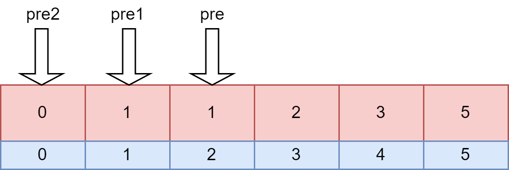

# 剑指offer03-数组中重复的数字

找出数组中重复的数字。


在一个长度为 n 的数组 nums 里的所有数字都在 0～n-1 的范围内。数组中某些数字是重复的，但不知道有几个数字重复了，也不知道每个数字重复了几次。请找出数组中任意一个重复的数字。

**方法1：暴力搜索**

`时间复杂度：O(n)~O(n^2) 空间复杂度：O(1)`

**方法2：使用集合的思想**

`时间复杂度：O(n) 空间复杂度：O(n)`

时间复杂度：O(n)。
遍历数组一遍。使用哈希集合（HashSet），添加元素的时间复杂度为 O(1)，故总的时间复杂度是 O(n)。
空间复杂度：O(n)。不重复的每个元素都可能存入集合，因此占用 O(n)额外空间。

```java
class Solution {
    public int findRepeatNumber(int[] nums) {
        Set<Integer> set = new HashSet<Integer>();
        int repeat = -1;
        for (int num : nums) {
            if (!set.add(num)) {
                repeat = num;
                break;
            }
        }
        return repeat;
    }
}
```

>hashset添加元素的时间复杂度为O(1)的原因：
>
>hashset通过内置的hashmap对象的put方法来添加元素，
>
>public boolean add(E e) {
>
>​    return map.put(e, PRESENT)==null;
>
>}
>
>而hashmap的put方法中，同样的key，后者的value会覆盖前者的value，从而实现key的不重合；而在寻找key的过程，根据key的hash值能够快速定位其位置，整个put过程的时间复杂度是O(1)。

**方法3：原地交换**

`时间复杂度：O(n) 空间复杂度O(1)`

题目说明尚未被充分使用，即 在一个长度为 n 的数组 nums 里的所有数字都在 0 ~ n-1 的范围内 。 此说明含义：数组元素的 索引 和 值 是 一对多 的关系。
因此，可遍历数组并通过交换操作，使元素的 索引 与 值 一一对应（即 nums[i] = inums[i]=i ）。因而，就能通过索引映射对应的值，起到与字典等价的作用。


遍历中，第一次遇到数字 x 时，将其交换至索引 x 处；而当第二次遇到数字 x 时，一定有 nums[x] = x，此时即可得到一组重复数字。

**算法流程**：

1. 遍历数组 nums ，设索引初始值为 i = 0;
   1. 若 nums[i] = i： 说明此数字已在对应索引位置，无需交换，因此跳过；
   2. 若 nums[nums[i]] = nums[i] ： 代表索引 nums[i]处和索引 ii处的元素值都为 nums[i]，即找到一组重复值，返回此值 nums[i]；
   3. 否则： 交换索引为 i和 nums[i]的元素值，将此数字交换至对应索引位置。
2. 若遍历完毕尚未返回，则返回 -1。

```java
class Solution {
    public int findRepeatNumber(int[] nums) {
        int i = 0;
        while(i < nums.length) {
            if(nums[i] == i) {
                i++;
                continue;
            }
            if(nums[nums[i]] == nums[i]) return nums[i];
            int tmp = nums[i];
            nums[i] = nums[tmp];
            nums[tmp] = tmp;
        }
        return -1;
    }
}
```

# 剑指offer04-二维数组中的查找

在一个 n * m 的二维数组中，每一行都按照从左到右递增的顺序排序，每一列都按照从上到下递增的顺序排序。请完成一个高效的函数，输入这样的一个二维数组和一个整数，判断数组中是否含有该整数。

示例:

现有矩阵 matrix 如下：

[
  [1,   4,  7, 11, 15],
  [2,   5,  8, 12, 19],
  [3,   6,  9, 16, 22],
  [10, 13, 14, 17, 24],
  [18, 21, 23, 26, 30]
]
给定 target = 5，返回 true。
给定 target = 20，返回 false。

**方法1：暴力搜索**

果不考虑二维数组排好序的特点，则直接遍历整个二维数组的每一个元素，判断目标值是否在二维数组中存在。

依次遍历二维数组的每一行和每一列。如果找到一个元素等于目标值，则返回 true。如果遍历完毕仍未找到等于目标值的元素，则返回 false

`时间复杂度：O(n·m) 空间复杂度：O(1)`

**方法2：类似于一维分块搜索**

当每一行对应的子数组的第一个元素值小于`target`时，对字数组进行二分搜索。

`时间复杂度：O(n·log2(m)) 空间复杂度：O(1)或者O(log2(n))[递归实现二分法]`

```java
class Solution {
 
        public boolean findNumberIn2DArray(int[][] matrix, int target) {
            if (matrix.length == 0 || matrix[0].length == 0) {
                return false;
            }
            
            for (int i = 0; i < matrix.length; i++) {
                if (matrix[i][0] > target) {
                    break;
                }
                if (findNumberIn1DArray(matrix[i], target) == true) {
                    return true;
                }
            }
            return false;
        }
        public boolean findNumberIn1DArray(int[] matrix, int target) {
            int start = 0;
            int end = matrix.length - 1;
            while (start <= end) {
                int mid = (start + end) / 2;
                if (matrix[mid] < target) {
                    start = mid + 1;
                } else if (matrix[mid] > target) {
                    end = mid - 1;
                } else {
                    return true;
                }
            }
            return false;
        }
    } 
```

**方法3：类似于二叉树查找法**

二维数组的右上角开始查找。如果当前元素等于目标值，则返回 true。如果当前元素大于目标值，则移到左边一列。如果当前元素小于目标值，则移到下边一行。

可以证明这种方法不会错过目标值。如果当前元素大于目标值，说明当前元素的下边的所有元素都一定大于目标值，因此往下查找不可能找到目标值，往左查找可能找到目标值。如果当前元素小于目标值，说明当前元素的左边的所有元素都一定小于目标值，因此往左查找不可能找到目标值，往下查找可能找到目标值。

`时间复杂度：O(n+m) 空间复杂度：O(1)`

```java
class Solution {
        public boolean findNumberIn2DArray(int[][] matrix, int target) {
            if (matrix.length == 0 || matrix[0].length == 0) {
                return false;
            }
            int x = 0;
            int y = matrix[0].length - 1;
            while (!(x == matrix.length || y == -1)) {
                if (matrix[x][y] == target) {
                    return true;
                } else if (matrix[x][y] < target) {
                    x++;
                } else {
                    y--;
                }
            }
            return false;
        }
    }
```

# 剑指offer05-替换空格

请实现一个函数，把字符串 s 中的每个空格替换成"%20"。

 示例 1：

> 输入：s = "We are happy."
> 输出："We%20are%20happy."

**法1(自己的)**

`时间复杂度：O(n) 空间复杂度：O(n)`

空间复杂度是因为需要额外空间sb

```java
    class Solution {
        public String replaceSpace(String s) {
            StringBuilder sb = new StringBuilder();
            for (int i = 0; i < s.length(); i++) {
                char c = s.charAt(i);
                if (c == ' ') {
                    sb.append("%20");
                } else {
                    sb.append(c);
                }
            }
            return sb.toString();
        }
    }
```

**法二 原地修改**

`时间复杂度：O(n) 空间复杂度：O(1)`

原地扩展长度，不需要使用额外空间。

```c++
class Solution {
public:
    string replaceSpace(string s) {
        int count = 0, len = s.size();
        // 统计空格数量
        for (char c : s) {
            if (c == ' ') count++;
        }
        // 修改 s 长度
        s.resize(len + 2 * count);
        // 倒序遍历修改
        for(int i = len - 1, j = s.size() - 1; i < j; i--, j--) {
            if (s[i] != ' ')
                s[j] = s[i];
            else {
                s[j - 2] = '%';
                s[j - 1] = '2';
                s[j] = '0';
                j -= 2;
            }
        }
        return s;
    }
};
```

# 剑指offer06-从尾到头打印链表

输入一个链表的头节点，从尾到头反过来返回每个节点的值（用数组返回）。

**示例 1：**

```
输入：head = [1,3,2]
输出：[2,3,1]
```

**法一(自己的)**

利用栈

`时间复杂度：O(n) 空间复杂度：O(n)`

时间复杂度：O(n)。正向遍历一遍链表，然后从栈弹出全部节点，等于又反向遍历一遍链表。
空间复杂度：O(n)。额外使用一个栈存储链表中的每个节点。

```java
    class Solution {
        public int[] reversePrint(ListNode head) {
            Stack<Integer> s = new Stack<>();
            int length = 0;
            while(head != null) {
                s.push(head.val);
                head = head.next;
                length++;
            }
            int[] reverseList = new int[length];
            for (int i = 0; i < length; i++) {
                reverseList[i] = s.pop();
            }
            return reverseList;
        }
    }
```

**法二(递归法)**

`时间复杂度：O(n) 空间复杂度：O(n)`

递归实现链表反序。

```java
class Solution {
    ArrayList<Integer> tmp = new ArrayList<Integer>();
    public int[] reversePrint(ListNode head) {
        recur(head);
        int[] res = new int[tmp.size()];
        for(int i = 0; i < res.length; i++)
            res[i] = tmp.get(i);
        return res;
    }
    void recur(ListNode head) {
        if(head == null) return;
        recur(head.next);
        tmp.add(head.val);
    }
}

```

# **剑指offer07-重建二叉树

输入某二叉树的前序遍历和中序遍历的结果，请构建该二叉树并返回其根节点。

假设输入的前序遍历和中序遍历的结果中都不含重复的数字。

示例1：


```
Input: preorder = [3,9,20,15,7], inorder = [9,3,15,20,7]
Output: [3,9,20,null,null,15,7]
```

**法1(自己的)**

`时间复杂度：O(n) 空间复杂度：O(n)`

```java
    class Solution {
        int[] preOrder;
        int[] inOrder;
        int pos = 0;
        public TreeNode buildTree(int[] preorder, int[] inorder) {
            if (preorder.length == 0) {
                return null;
            }
            preOrder = preorder;
            inOrder = inorder;
            return buildTree(0, preorder.length);
        }
        private TreeNode buildTree(int start, int end) {
            int rootValue = preOrder[pos++];
            TreeNode root = new TreeNode(rootValue);
            int leftStart = start;
            int rightEnd = end;
            int leftEnd = 0;
            int rightStart = 0;
            if ((end - start) == 1) {
                root.left = null;                
                root.right = null;
            } else {
                for (int i = start; i < end; i++) {
                    if (inOrder[i] == rootValue) {
                        leftEnd = i;
                        rightStart = i + 1;
                        break;
                    }
                }
                root.left = (leftStart == leftEnd ? null : buildTree(leftStart, leftEnd));
                root.right = (rightStart == rightEnd ? null : buildTree(rightStart, rightEnd));
            }
            return root;
        }
    }
```

**法二**

`时间复杂度：O(n) 空间复杂度：O(n)`

使用HahsMap来进行查找，更快。

时间复杂度O(N) ： 其中 N为树的节点数量。初始化 HashMap 需遍历 inorder ，占用 O(N) 。递归共建立 N 个节点，每层递归中的节点建立、搜索操作占用 O(1) ，因此使用 O(N) 时间。
空间复杂度 O(N) ： HashMap 使用 O(N) 额外空间；最差情况下（输入二叉树为链表时），递归深度达到 N ，占用 O(N) 的栈帧空间；因此总共使用 O(N)空间。

```java
class Solution {
    int[] preorder;
    HashMap<Integer, Integer> dic = new HashMap<>();
    public TreeNode buildTree(int[] preorder, int[] inorder) {
        this.preorder = preorder;
        for(int i = 0; i < inorder.length; i++)
            dic.put(inorder[i], i);
        return recur(0, 0, inorder.length - 1);
    }
    TreeNode recur(int root, int left, int right) {
        if(left > right) return null;                          // 递归终止
        TreeNode node = new TreeNode(preorder[root]);          // 建立根节点
        int i = dic.get(preorder[root]);                       // 划分根节点、左子树、右子树
        node.left = recur(root + 1, left, i - 1);              // 开启左子树递归
        node.right = recur(root + i - left + 1, i + 1, right); // 开启右子树递归
        return node;                                           // 回溯返回根节点
    }
}

```


# 剑指offer09-用两个栈实现队列

用两个栈实现一个队列。队列的声明如下，请实现它的两个函数 appendTail 和 deleteHead ，分别完成在队列尾部插入整数和在队列头部删除整数的功能。(若队列中没有元素，deleteHead 操作返回 -1 )

```java
import java.util.Stack
class CQueue {

    private Stack<Integer> firstStack;
    private Stack<Integer> lastStack;
    public CQueue() {
        this.firstStack = new Stack<>();
        this.lastStack = new Stack<>();
    }
    
    public void appendTail(int value) {
        lastStack.push(value);
    }
    
    public int deleteHead() {
        if (firstStack.empty()) {
            if (lastStack.empty()) {
                return -1;
            } else {
                while (!lastStack.empty()) {
                    firstStack.push(lastStack.pop());
                }
            }
        }
        return firstStack.pop();
    }
}
```

# 剑指offer10-I.斐波那契数列

写一个函数，输入 n ，求斐波那契（Fibonacci）数列的第 n 项（即 F(N)）。斐波那契数列的定义如下：

```java
F(0) = 0,   F(1) = 1
F(N) = F(N - 1) + F(N - 2), 其中 N > 1.
```

斐波那契数列由 0 和 1 开始，之后的斐波那契数就是由之前的两数相加而得出。
答案需要取模 1e9+7（1000000007），如计算初始结果为：1000000008，请返回 1。

```java
    public int fib(int n) {
        if (n ==0 || n == 1) {
            return n;
        }
        else {
            return fib(n - 1) + fib(n - 2);
        }
    }
```

`时间复杂度：O(2^n) 空间复杂度：O(n)`

上述方法运行过程中会重复计算内容，从而超出时间限制，因此改为采用下述方法。

**法1：while循环实现（动态规划法）**

`时间复杂度：O(n) 空间复杂度O(1)`



用pre表示需要返回的值。

```java
    static int mod = (int)(1e9 + 7);
    public int fib(int n) {
        int pre2 = 0;
        int pre1 = 1;
        int pre  = 1;
        if (n == 0) {
            return n;
        }
        for (int i = 1; i < n; i++) {
            pre = (pre2 + pre1) % mod;
            pre2 = pre1;
            pre1 = pre;
        }
        return pre;
    }
```

或者

用pre2表示需要返回的值。

```java
static int mod = (int)(1e9 + 7);
public int fib(int n) {
    int pre2 = 0;
    int pre1 = 1;
    int pre  = 1;
    for (int i = 0; i < n; i++) {
        pre = (pre2 + pre1) % mod;
        pre2 = pre1;
        pre1 = pre;
    }
    return pre2;
}
```
**法2：优化递归实现**

`时间复杂度：O(n) 空间复杂度：O(n)  `

```java
    private static final int mod = (int)(1e9 + 7);
    public int fib(int n) {
        return fib_recurse(n, 0, 0, 1);
    }
    private int fib_recurse(int n, int start, int previous2, int previous1) {
        if (n == start) {
            return previous2;
        }
        return fib_recurse(n, start + 1, previous1, (previous1 + previous2) % mod);
    }
```

**法3：记忆化递归方法**

`时间复杂度：O(n) 空间复杂度：O(n)`

递归法的基础上，新建一个长度为 n 的数组，用于在递归时存储 f(0)f(0) 至 f(n)f(n) 的数字值，重复遇到某数字则直接从数组取用，避免了重复的递归计算。

**法4：矩阵求幂法**

`时间复杂度：O(logn) 空间复杂度：O(1)`

使用矩阵快速幂的方法可以降低时间复杂度。

首先我们可以构建这样一个递推关系：
$$
\left[
\begin{matrix}
1 & 1 \\
0 & 1 
\end{matrix}
\right]
\left[
\begin{matrix}
F(n) \\
F(n-1)
\end{matrix}
\right]
=\left[
\begin{matrix}
F(n) + F(n-1) \\
F(n)
\end{matrix}
\right]
=\left[
\begin{matrix}
F(n+1) \\
F(n)
\end{matrix}
\right]
$$
因此：
$$
\left[
\begin{matrix}
F(n+1) \\
F(n)
\end{matrix}
\right]=\left[
\begin{matrix}
1 & 1 \\
1 & 0 
\end{matrix}
\right]^n
\left[
\begin{matrix}
F(1) \\
F(0)
\end{matrix}
\right]
$$
令：
$$
M = \left[\begin{matrix} 1 & 1 \\ 1 & 0 \end{matrix}\right]
$$
因此只要我们能快速计算矩阵 M 的 n 次幂，就可以得到 F(n)的值。如果直接求取 $M^n$，时间复杂度是 O(n)，可以定义矩阵乘法，然后用快速幂算法来加速这里 $M^n$  的求取。

```java
static final int MOD = 1000000007;

    public int fib(int n) {
        if (n < 2) {
            return n;
        }
        int[][] q = {{1, 1}, {1, 0}};
        int[][] res = pow(q, n - 1);
        return res[0][0];
    }

    public int[][] pow(int[][] a, int n) {
        int[][] ret = {{1, 0}, {0, 1}};
        while (n > 0) {
            if ((n & 1) == 1) {
                ret = multiply(ret, a);
            }
            n >>= 1;
            a = multiply(a, a);
        }
        return ret;
    }

    public int[][] multiply(int[][] a, int[][] b) {
        int[][] c = new int[2][2];
        for (int i = 0; i < 2; i++) {
            for (int j = 0; j < 2; j++) {
                c[i][j] = (int) (((long) a[i][0] * b[0][j] + (long) a[i][1] * b[1][j]) % MOD);
            }
        }
        return c;
    }
```

# 剑指Offer10II-青蛙跳台阶

一只青蛙一次可以跳上1级台阶，也可以跳上2级台阶。求该青蛙跳上一个 n 级的台阶总共有多少种跳法。

答案需要取模 1e9+7（1000000007），如计算初始结果为：1000000008，请返回 1。

设跳上 nn 级台阶有 f(n)种跳法。在所有跳法中，青蛙的最后一步只有两种情况： 跳上 1级或 2级台阶。
当为 1级台阶： 剩 n-1个台阶，此情况共有 f(n-1) 种跳法；
当为 2 级台阶： 剩 n-2 个台阶，此情况共有 f(n-2) 种跳法。
f(n)为以上两种情况之和，即 f(n)=f(n-1)+f(n-2)，以上递推性质为斐波那契数列。本题可转化为 求斐波那契数列第 nn项的值 ，与 面试题10- I. 斐波那契数列 等价，唯一的不同在于起始数字不同。
青蛙跳台阶问题： $f(0)=1, f(1)=1 , f(2)=2$；
斐波那契数列问题： $f(0)=0, f(1)=1 , f(2)=1$ 。

方法思路与剑指Offer10I中相同，在这里贴一个采用使用缓存的递归法解决思路。

```java
class Solution {
        HashMap<Integer, Integer> cache = new HashMap<>();
        public int numWays(int n) {
            switch (n) {
                case 0 :
                case 1 :
                    return 1;
                case 2 :
                    return 2;
                default :
                    if (!cache.containsKey(n - 1)) {
                        cache.put(n - 1, numWays(n - 1));
                    }  
                
                    if (!cache.containsKey(n - 2)) {
                        cache.put(n - 2, numWays(n - 2));
                    } 
    
                    return (cache.get(n - 1) + cache.get(n - 2)) % 1000000007;
            }
        }
    }
```

# 剑指Offer11-旋转数组的最小数字

把一个数组最开始的若干个元素搬到数组的末尾，我们称之为数组的旋转。

给你一个可能存在 重复 元素值的数组 numbers ，它原来是一个升序排列的数组，并按上述情形进行了一次旋转。请返回旋转数组的最小元素。例如，数组 [3,4,5,1,2] 为 [1,2,3,4,5] 的一次旋转，该数组的最小值为1。  

**法1：从数组后端采用顺序法**

`时间复杂度:O(n) 空间复杂度:O(1)`

```java
	class Solution1 {
        public int minArray(int[] numbers) {
            int max = numbers.length - 1;
            for (int i = max; i > 0; i--) {
                if (numbers[i - 1] > numbers[i]) {
                    return numbers[i];
                }
            }
            return numbers[0];
        }
    }
```

**法2：二分法**

`时间复杂度:O(logn) 空间复杂度:O(1)`

与二分查找法的区别，二分查找法比较的值是目标值`target`，此二分法比较的值是右端点值。

```java
	class Solution2 {
        public int minArray(int[] numbers) {
            int low = 0;
            int high = numbers.length - 1;
            while (low < high) {
                int pivot = low + (high - low) / 2;
                if (numbers[pivot] < numbers[high]) {
                    high = pivot;
                } else if (numbers[pivot] > numbers[high]) {
                    low = pivot + 1;
                } else {
                    high -= 1;
                }
            }
            return numbers[low];
        }
    }
```

# **剑指Offer12-矩阵中的路径

给定一个 $m * n$ 二维字符网格 board 和一个字符串单词 word 。如果 word 存在于网格中，返回 true ；否则，返回 false 。

单词必须按照字母顺序，通过相邻的单元格内的字母构成，其中“相邻”单元格是那些水平相邻或垂直相邻的单元格。同一个单元格内的字母不允许被重复使用。

==**整体思路**==

深度优先搜索(DFS)+回溯思想+剪枝

**整体思路**

* 深度优先搜索： 可以理解为暴力法遍历矩阵中所有字符串可能性。DFS 通过递归，先朝一个方向搜到底，再回溯至上个节点，沿另一个方向搜索，以此类推。
* 回溯思想：标记已经走过的方格
* 剪枝： 在搜索中，遇到 这条路不可能和目标字符串匹配成功 的情况（例如：此矩阵元素和目标字符不同、此元素已被访问），则应立即返回，称之为 可行性剪枝 。

**DFS搜索**

* 递归参数： 当前元素在矩阵 board 中的行列索引 i 和 j ，当前目标字符在 word 中的索引 k 。

* 终止条件：

  返回 false ： (1) 行或列索引越界 或 (2) 当前矩阵元素与目标字符不同 或 (3) 当前矩阵元素已访问过 （ (3) 可合并至 (2) ） 。

  返回 true： k = len(word) - 1 ，即字符串 word 已全部匹配。

* 递推工作：
  标记当前矩阵元素： 将 board[i)[j)修改为 空字符 '' ，代表此元素已访问过，防止之后搜索时重复访问。 搜索下一单元格： 朝当前元素的 上、下、左、右 四个方向开启下层递归，使用 或 连接 （代表只需找到一条可行路径就直接返回，不再做后续 DFS ），并记录结果至 res 。 还原当前矩阵元素： 将 board[i)[j)元素还原至初始值，即 word[k] 。[1][2

* 返回值： 返回布尔量 res ，代表是否搜索到目标字符串。

> 使用空字符（Python: '' , Java/C++: '\0' ）做标记是为了防止标记字符与矩阵原有字符重复。当存在重复时，此算法会将矩阵原有字符认作标记字符，从而出现错误。。 

**复杂度分析**

> M,N 分别为矩阵行列大小， KK为字 符串 word 长度。

* 时间复杂度 $O(3^KMN)$： 最差情况下，需要遍历矩阵中长度为 K 字符串的所有方案，时间复杂度为 $O(3^K)$；矩阵中共有 MN个起点，时间复杂度为 $O(MN)$ 。方案数计算： 设字符串长度为 K，搜索中每个字符有上、下、左、右四个方向可以选择，舍弃回头（上个字符）的方向，剩下 3种选择，因此方案数的复杂度为 $O(3^K)$。

* 空间复杂度 $O(K)$ ： 搜索过程中的递归深度不超过 K ，因此系统因函数调用累计使用的栈空间占用 $O(K)$（因为函数返回后，系统调用的栈空间会释放）。最坏情况下 $K = MN$ ，递归深度为 $MN$，此时系统栈使用 $O(MN)$的额外空间。

  ==<del>如果递归中使用全局变量，则为O(K);如果传递broad参数，则为O(KMN)</del>>==(即使传递broad参数，传递过程中使用的仍然是$O(K)$)

**法一(自己的)**

`时间复杂度：O(3^KMN) 空间复杂度：O(MN)`

```java
    class Solution {
        int[][] track;
        char[][] map;
        String matchWord;
        
        public boolean exist(char[][] board, String word) {
            if (board.length == 0 || board[0].length == 0 || word.equals("")) {
                return false;
            }
            
            char firstChar = word.charAt(0);
            boolean state = false;
            map = board;
            matchWord = word;
            for (int i = 0; i < board.length; i++) {
                if (state == true) {
                    break;
                }
                for (int j = 0; j < board[0].length; j++) {
                    if (board[i][j] == firstChar) {
                        track = new int[board.length][board[0].length];
                        track[i][j] = 1;
                        if (word.length() == 1) {
                            state = true;
                            break;
                        }
                        if (state =  move(i, j, 1)) {
                            break;
                        }
                    }
                }
            }
            return state;
        }
   
        public boolean move(int i, int j, int matchCount) {
            if (canMove(i + 1, j, matchCount)) {
                if (update(i + 1, j, matchCount)) {
                    return true;
                }
            }
            if (canMove(i - 1, j, matchCount)) {
                if (update(i - 1, j, matchCount)) {
                    return true;
                }
            }
            if (canMove(i, j + 1, matchCount)) {
                if (update(i, j + 1, matchCount)) {
                    return true;
                }
            }
            if (canMove(i, j - 1, matchCount)) {
                if (update(i, j - 1, matchCount)) {
                    return true;
                }
            }
            return false;
        }
        public boolean canMove(int i, int j, int matchCount) {
            if (i < 0 || i >= map.length) {
                return false;
            }
            if (j < 0 || j >= map[0].length) {
                return false;
            }
            if (track[i][j] == 1) {
                return false;
            }
            if (map[i][j] == matchWord.charAt(matchCount)) {
                return true;
            }
            return false;
        }
        public boolean update(int i, int j, int matchCount) {
            track[i][j] = 1;
            if (++matchCount == matchWord.length() || move(i, j, matchCount)) {
                return true;
            }
            track[i][j] = 0;
            return false;
        }
    }
```

**法二(他人的)：DFS+回溯**

`时间复杂度：O(3^KMN) 空间复杂度：O(MN)`

法二相比法一，代码更加简短；而且没有使用额外的空间作为标记数组，直接在board上进行操作，更加能体现回溯的过程。

```java
class Solution {
    public boolean exist(char[][] board, String word) {
        char[] words = word.toCharArray();
        for(int i = 0; i < board.length; i++) {
            for(int j = 0; j < board[0].length; j++) {
                if(dfs(board, words, i, j, 0)) return true;
            }
        }
        return false;
    }
    boolean dfs(char[][] board, char[] word, int i, int j, int k) {
        if(i >= board.length || i < 0 || j >= board[0].length || j < 0 || board[i][j] != word[k]) return false;
        if(k == word.length - 1) return true;
        board[i][j] = '\0';
        boolean res = dfs(board, word, i + 1, j, k + 1) || dfs(board, word, i - 1, j, k + 1) || 
                      dfs(board, word, i, j + 1, k + 1) || dfs(board, word, i , j - 1, k + 1);
        board[i][j] = word[k];
        return res;
    }
}

```

# *剑指Offer19-正则表达式匹配

请实现一个函数用来匹配包含'. '和'*'的正则表达式。模式中的字符'.'表示任意一个字符，而'*'表示它前面的字符可以出现任意次（含0次）。在本题中，匹配是指字符串的所有字符匹配整个模式。例如，字符串"aaa"与模式"a.a"和"ab*ac*a"匹配，但与"aa.a"和"ab*a"均不匹配。

==动态规划==

`时间 O(mn) 空间 O(mn)`

```java
class Solution {
    public boolean isMatch(String s, String p) {
        int m = s.length(), n = p.length();
        boolean[][] dp = new boolean[m + 1][n + 1];
        dp[0][0] = true;
        for(int j = 2; j <= n; j += 2) {
            dp[0][j] = dp[0][j - 2] && p.charAt(j - 1) == '*';
        }
        for (int i = 1; i <= m; i++) 
            for (int j = 1; j <= n; j++) {
                dp[i][j] = p.charAt(j - 1) == '*' ? 
                    dp[i][j - 2] || (dp[i - 1][j] && (s.charAt(i - 1) == p.charAt(j - 2) || p.charAt(j - 2) == '.')) :
                    dp[i - 1][j - 1] && (s.charAt(i - 1) == p.charAt(j - 1) || p.charAt(j - 1) == '.');
            }
        return dp[m][n];
    }
} 
```


# 剑指Offer30-包含main函数的栈

定义栈的数据结构，请在该类型中实现一个能够得到栈的最小元素的 min 函数在该栈中，调用 min、push 及 pop 的时间复杂度都是 O(1)。

示例：

> MinStack minStack = new MinStack();
> minStack.push(-2);
> minStack.push(0);
> minStack.push(-3);
> minStack.min();   --> 返回 -3.
> minStack.pop();
> minStack.top();      --> 返回 0.
> minStack.min();   --> 返回 -2。

**法一（自己的）**

`时间复杂度：O(1) 空间复杂度：O(n)`

```java
lass MinStack {
        private LinkedList<Integer> list;
        private LinkedList<Integer> minList;
        public MinStack() {
            list = new LinkedList<>();
            minList = new LinkedList<>();
        }
        
        public void push(int x) {
            list.addFirst(x);
            if (minList.isEmpty()) {
                minList.addFirst(x);
            } else {
                int pre = minList.getFirst();
                minList.addFirst(x > pre ? pre : x);
            }
        }
         
        public void pop() {
            list.removeFirst();
            minList.removeFirst();
        }
        
        public int top() {
            return list.getFirst();
        }
        
        public int min() {
            return minList.getFirst();
        }
    }
```

**法二**

`时间复杂度：O(1) 空间复杂度：O(n)`

法二与法一相比，两者复杂度量级相同，但法二实际占用的空间更少，因为其辅助栈所占用的空间更少。

法一的辅助栈存储着每个元素在主栈中对应的最小值；法二的辅助栈

```java
class MinStack {
    Stack<Integer> A, B;
    public MinStack() {
        A = new Stack<>();
        B = new Stack<>();
    }
    public void push(int x) {
        A.add(x);
        if(B.empty() || B.peek() >= x)
            B.add(x);
    }
    public void pop() {
        if(A.pop().equals(B.peek())) //注意使用equals，而不是使用"==“符号
            B.pop();
    }
    public int top() {
        return A.peek();
    }
    public int min() {
        return B.peek();
    }
}
```

# 剑指Offer31-栈的压入弹出序列

输入两个整数序列，第一个序列表示栈的压入顺序，请判断第二个序列是否为该栈的弹出顺序。假设压入栈的所有数字均不相等。例如，序列 {1,2,3,4,5} 是某栈的压栈序列，序列 {4,5,3,2,1} 是该压栈序列对应的一个弹出序列，但 {4,3,5,1,2} 就不可能是该压栈序列的弹出序列。

**法一（自己的）**

`时间复杂度：O(n) 空间复杂度：O(n)`

法一直接构造一个辅助栈来模拟栈的压入和弹出过程。

```java
    class Solution {
        private Stack<Integer> s = new Stack<>();
        public boolean validateStackSequences(int[] pushed, int[] popped) {
            int popIndex = 0;
            int length = pushed.length;
            if (length != popped.length) {
                return false;
            }
            for (int i = 0; i < length; i++) {
                s.push(pushed[i]);
                while (!s.isEmpty() && s.peek() == popped[popIndex]) {
                    popIndex++;
                    s.pop();
                }
                if (popIndex == length) {
                    return true;
                }
            }
            return s.isEmpty() ? true : false; //直接"return s.isEmpty();"即可
        }
    }
```

**法二**

`时间复杂度：O(n) 空间复杂度：O(n)`

法二只考虑数组长度相等的情况，没有考虑数组长度不相等的情况。从健壮性来说，法一比法二好。

```java
class Solution {
    public boolean validateStackSequences(int[] pushed, int[] popped) {
        Stack<Integer> stack = new Stack<>();
        int i = 0;
        for(int num : pushed) {
            stack.push(num); // num 入栈
            while(!stack.isEmpty() && stack.peek() == popped[i]) { // 循环判断与出栈
                stack.pop();
                i++;
            }
        }
        return stack.isEmpty();
    }
}
```

# 剑指Offer32I-从上到下打印二叉树I

从上到下打印出二叉树的每个节点，同一层的节点按照从左到右的顺序打印。

`时间 O(n) 空间 O(n)`

```java
class Solution {
    public int[] levelOrder(TreeNode root) {
        if (root == null) {
            return new int[0];
        }
        Queue<TreeNode> visited = new LinkedList<>();
        List<Integer> list = new ArrayList<>();
        visited.offer(root);
        while (!visited.isEmpty()) {
            TreeNode temp = visited.poll();
            list.add(temp.val);
            if (temp.left != null) {
                visited.offer(temp.left);
            }
            if (temp.right != null) {
                visited.offer(temp.right);
            }
        }
        int[] ans = new int[list.size()];
        for (int i = 0 ; i < ans.length; i++) {
            ans[i] = list.get(i);
        }
        return ans;
    }
}
```

```java
class Solution {
    List<Integer> l1 = new ArrayList<>();

    public int[] levelOrder(TreeNode root) {
        if (root == null) return new int[0];
        List<TreeNode> l = new ArrayList<>();
        l.add(root);
        bfs(l);
        int[] ans = new int[l1.size()];
        for (int i = 0; i < ans.length; i++) {
            ans[i] = l1.get(i);
        }
        return ans;
    }

    public void bfs(List<TreeNode> children) {
        List<TreeNode> allChildren = new ArrayList<>();
        for (TreeNode node : children) {
            l1.add(node.val);
            if (node.left != null) {
                allChildren.add(node.left);
            }
            if (node.right != null) {
                allChildren.add(node.right);
            }
        }
        if (allChildren.size() > 0) {
            bfs(allChildren);
        }
    }
}
```


# 剑指Offer32II-从上到下打印二叉树II

从上到下按层打印二叉树，同一层的节点按从左到右的顺序打印，每一层打印到一行。

 **法一(自己的)**

`时间复杂度：O(n) 空间复杂度：O(logn)+O(n)=O(n)`

广度优先遍历(BFS)

```java
       class Solution {
        public List<List<Integer>> levelOrder(TreeNode root) {
            if (root == null) {
                return new LinkedList<>();
            }
            List<TreeNode> tmp = new LinkedList<>();
            tmp.add(root);
            return levelOrder(tmp);
        }

        List<List<Integer>> levelOrder(List<TreeNode> list) {
            List<TreeNode> tmpList = new LinkedList<>();
            List<List<Integer>> res = new LinkedList<>();
            List<Integer> tmpRes = new LinkedList<>();

            for (TreeNode node : list) {
                tmpRes.add(node.val);
                if (node.left != null) {
                    tmpList.add(node.left);
                }
                if (node.right != null) {
                    tmpList.add(node.right);
                }
            }
            res.add(tmpRes);
            if (!tmpList.isEmpty()) {
                res.addAll(levelOrder(tmpList));
            }
            return res;
        }
    }
```

**法二 迭代写法**

`时间复杂度：O(n) 空间复杂度：O(n)`

时间复杂度 O(N) ： N 为二叉树的节点数量，即 BFS 需循环 NN次。
空间复杂度 O(N) ： 最差情况下，即当树为平衡二叉树时，最多有 N/2 个树节点同时在 queue 中，使用 O(N) 大小的额外空间。

```java
class Solution {
    public List<List<Integer>> levelOrder(TreeNode root) {
        Queue<TreeNode> queue = new LinkedList<>();
        List<List<Integer>> res = new ArrayList<>();
        if(root != null) queue.add(root);
        while(!queue.isEmpty()) {
            List<Integer> tmp = new ArrayList<>();
            for(int i = queue.size(); i > 0; i--) {
                TreeNode node = queue.poll();
                tmp.add(node.val);
                if(node.left != null) queue.add(node.left);
                if(node.right != null) queue.add(node.right);
            }
            res.add(tmp);
        }
        return res;
    }
}

```

**法三 递归写法**

`时间复杂度：O(n) 空间复杂度：O(n)`

==法三使用全局变量，法一法二没有使用全局变量==

```java
class Solution {
    List<List<Integer>> node=new ArrayList();
    public List<List<Integer>> levelOrder(TreeNode root) {
        lei(root,0);
        return node;
    }
    public void lei(TreeNode root,int k){
        if(root!=null){
            if(node.size()<=k)node.add(new ArrayList());
            node.get(k).add(root.val);
            lei(root.left,k+1);
            lei(root.right,k+1);
        }
    }
}
```

# 剑指Offer32III-从上打印二叉树III

请实现一个函数按照之字形顺序打印二叉树，即第一行按照从左到右的顺序打印，第二层按照从右到左的顺序打印，第三行再按照从左到右的顺序打印，其他行以此类推。

**法一(自己的)-层序遍历+倒序**

`时间复杂度：O(n) 空间复杂度：O(n)`

直接在原有基础上加上

> `            for(int i=1;i<res.size();i+=2){
>              Collections.reverse(res.get(i));
>       }`

```java
class Solution {
        public List<List<Integer>> levelOrder(TreeNode root) {
            if (root == null) {
                return new LinkedList<>();
            }
            List<TreeNode> tmp = new LinkedList<>();
            tmp.add(root);
            List<List<Integer>> res = levelOrder(tmp);
            for(int i=1;i<res.size();i+=2){
                Collections.reverse(res.get(i));
            }
            return res;
        }

        List<List<Integer>> levelOrder(List<TreeNode> list) {
            List<TreeNode> tmpList = new LinkedList<>();
            List<List<Integer>> res = new LinkedList<>();
            List<Integer> tmpRes = new LinkedList<>();

            for (TreeNode node : list) {
                tmpRes.add(node.val);
                if (node.left != null) {
                    tmpList.add(node.left);
                }
                if (node.right != null) {
                    tmpList.add(node.right);
                }
            }
            res.add(tmpRes);
            if (!tmpList.isEmpty()) {
                res.addAll(levelOrder(tmpList));
            }
            return res;
        }
    }
```

**法二 层序遍历+双端队列**

`时间复杂度：O(n) 空间复杂度：O(n)`

```java
class Solution {
    public List<List<Integer>> levelOrder(TreeNode root) {
        Queue<TreeNode> queue = new LinkedList<>();
        List<List<Integer>> res = new ArrayList<>();
        if(root != null) queue.add(root);
        while(!queue.isEmpty()) {
            LinkedList<Integer> tmp = new LinkedList<>();
            for(int i = queue.size(); i > 0; i--) {
                TreeNode node = queue.poll();
                if(res.size() % 2 == 0) tmp.addLast(node.val); // 偶数层 -> 队列头部
                else tmp.addFirst(node.val); // 奇数层 -> 队列尾部
                if(node.left != null) queue.add(node.left);
                if(node.right != null) queue.add(node.right);
            }
            res.add(tmp);
        }
        return res;
    }
}

```

**法三 层序遍历+双端队列(奇偶逻辑层分离)**

`时间复杂度：O(n) 空间复杂度：O(n)`

- 方法二代码简短、容易实现；但需要判断每个节点的所在层奇偶性，即冗余了 N*N 次判断。
- 通过将奇偶层逻辑拆分，可以消除冗余的判断。

```java
class Solution {
    public List<List<Integer>> levelOrder(TreeNode root) {
        Deque<TreeNode> deque = new LinkedList<>();
        List<List<Integer>> res = new ArrayList<>();
        if(root != null) deque.add(root);
        while(!deque.isEmpty()) {
            // 打印奇数层
            List<Integer> tmp = new ArrayList<>();
            for(int i = deque.size(); i > 0; i--) {
                // 从左向右打印
                TreeNode node = deque.removeFirst();
                tmp.add(node.val);
                // 先左后右加入下层节点
                if(node.left != null) deque.addLast(node.left);
                if(node.right != null) deque.addLast(node.right);
            }
            res.add(tmp);
            if(deque.isEmpty()) break; // 若为空则提前跳出
            // 打印偶数层
            tmp = new ArrayList<>();
            for(int i = deque.size(); i > 0; i--) {
                // 从右向左打印
                TreeNode node = deque.removeLast();
                tmp.add(node.val);
                // 先右后左加入下层节点
                if(node.right != null) deque.addFirst(node.right);
                if(node.left != null) deque.addFirst(node.left);
            }
            res.add(tmp);
        }
        return res;
    }
}

```

**法四-递归写法**

`时间复杂度：O(n) 空间复杂度：O(n)`

==结果是BFS的形式，但执行过程有点像DFS的递归过程。==

```java
class Solution {
    List<List<Integer>> node=new LinkedList();
    public List<List<Integer>> levelOrder(TreeNode root) {
        lei(root,0);
        return node;
    }
    public void lei(TreeNode root,int k){
        if(root!=null){
            if(node.size()<=k)node.add(new ArrayList());
            if (k % 2 == 0) {
                node.get(k).add(root.val);
            } else {
                node.get(k).add(0, root.val);
            }
            
            lei(root.left,k+1);
            lei(root.right,k+1);
        }
    }
}
```

# **剑指Offer33-二叉搜索树的后序遍历序列

输入一个整数数组，判断该数组是不是某二叉搜索树的后序遍历结果。如果是则返回 `true`，否则返回 `false`。假设输入的数组的任意两个数字都互不相同。

 参考以下这颗二叉搜索树：

```
     5
    / \
   2   6
  / \
 1   3
```

**示例 1：**

```
输入: [1,6,3,2,5]
输出: false
```

**示例 2：**

```
输入: [1,3,2,6,5]
输出: true
```

**法一(自己的)**

`时间复杂度：O(n^2) 空间复杂度；O(n)`

```java
    class Solution {
        public boolean verifyPostorder(int[] postorder) {
            return verifyPostorder(postorder, 0, postorder.length - 1);
        }

        public boolean verifyPostorder(int[] postorder, int start, int end) {
            if (end <= start) {
                return true;
            }
            int endValue = postorder[end];
            if (postorder[end - 1] < endValue) {
                for (int i = start; i < end - 1; i++) {
                    if (postorder[i] > endValue) {
                        return false;
                    }
                }
                return verifyPostorder(postorder, start, end - 1);
            } else {
                for (int i = end - 2; i >= 0; i--) {
                    if (postorder[i] < endValue) {
                        for (int j = i - 1; j >= 0; j--) {
                            if (postorder[j] > endValue) {
                                return false;
                            }
                        }
                        return verifyPostorder(postorder, start, i) && verifyPostorder(postorder, i + 1, end - 1);
                    }
                }
                return verifyPostorder(postorder, start, end - 1);
            }
        }
    }
```

**法二(递归分治)**

`时间复杂度：O(n^2) 空间复杂度；O(n)(最坏) O(logn)(平均)`（类似于快排的平均空间复杂度为O(logn)、最坏空间复杂度为O(n)）

法二思路跟法一思路相同，但代码更加简洁。

时间复杂度 $O(N^2)$： 每次调用 recur(i,j)减去一个根节点，因此递归占用 O(N)；最差情况下（即当树退化为链表），每轮递归都需遍历树所有节点，占用 O(N)。
空间复杂度 $O(N)$ ： 最差情况下（即当树退化为链表），递归深度将达到 N 。

```java
class Solution {
    public boolean verifyPostorder(int[] postorder) {
        return recur(postorder, 0, postorder.length - 1);
    }
    boolean recur(int[] postorder, int i, int j) {
        if(i >= j) return true;
        int p = i;
        while(postorder[p] < postorder[j]) p++;
        int m = p;
        while(postorder[p] > postorder[j]) p++;
        return p == j && recur(postorder, i, m - 1) && recur(postorder, m, j - 1);
    }
}
```

**法三(辅助单调栈)**

`时间复杂度：O(n) 空间复杂度：O(n)`

复杂度分析：

时间复杂度 $O(N)$ ： 遍历 postorder 所有节点，各节点均入栈 / 出栈一次，使用 O(N) 时间。
空间复杂度 $O(N)$： 最差情况下，单调栈 stack存储所有节点，使用 O(N)额外空间。

```java
class Solution {
    public boolean verifyPostorder(int[] postorder) {
        Stack<Integer> stack = new Stack<>();
        int root = Integer.MAX_VALUE;
        for(int i = postorder.length - 1; i >= 0; i--) {
            if(postorder[i] > root) return false;
            while(!stack.isEmpty() && stack.peek() > postorder[i])
            	root = stack.pop();
            stack.add(postorder[i]);
        }
        return true;
    }
}
```

# **剑指Offer34-二叉树中和为某一值的路径

给你二叉树的根节点 root 和一个整数目标和 targetSum ，找出所有 从根节点到叶子节点 路径总和等于给定目标和的路径。
叶子节点 是指没有子节点的节点。

示例 1：


```
输入：root = [5,4,8,11,null,13,4,7,2,null,null,5,1], targetSum = 22
输出：[[5,4,11,2],[5,8,4,5]]
```

**法一(自己的)**
`时间复杂度：O(n) 空间复杂度：O(logn)最坏O(n)`

```java
class Solution {
        List<List<Integer>> res = new LinkedList<>();
        int sum = 0;

        public List<List<Integer>> pathSum(TreeNode root, int target) {
            findPath(root, target);
            return res;
        }

        public boolean findPath(TreeNode root, int target) {
            if (root != null){
                if (target == root.val && root.left ==null && root.right == null) {
                    res.add(new LinkedList<>());
                    res.get(sum).add(0, root.val);
                    sum++;
                    return true;
                }
                int tmp = sum;
                boolean res1 = findPath(root.left, target - root.val);
                if (res1) {
                    for (int i = tmp; i < sum; i++) {
                        res.get(i).add(0, root.val);
                    }
                }
                tmp = sum;
                boolean res2 = findPath(root.right, target - root.val);
                if (res2) {
                    for (int i = tmp; i < sum; i++) {
                        res.get(i).add(0, root.val);
                    }
                }
                return res1 || res2;
            }
            return false;
        }
    }
```

**法二深度优先+回溯**

`时间复杂度：O(n) 空间复杂度：O(logn)最坏O(n)`

先序遍历+路径记录

法一是自底向顶记录，采用add(0, element)方式；法二是自顶向底记录，采用add(element)方式

> 值得注意的是，记录路径时若直接执行 res.append(path) ，则是将 path 对象加入了 res ；后续 path 改变时， res 中的 path 对象也会随之改变。
>
> 正确做法：res.append(list(path)) ，相当于复制了一个 path 并加入到 res 。

```java
class Solution {
    LinkedList<List<Integer>> res = new LinkedList<>();
    LinkedList<Integer> path = new LinkedList<>(); 
    public List<List<Integer>> pathSum(TreeNode root, int sum) {
        recur(root, sum);
        return res;
    }
    void recur(TreeNode root, int tar) {
        if(root == null) return;
        path.add(root.val);
        tar -= root.val;
        if(tar == 0 && root.left == null && root.right == null)
            res.add(new LinkedList(path));
        recur(root.left, tar);
        recur(root.right, tar);
        path.removeLast();
    }
}
```

**法三广度优先**

`时间复杂度：O(n^2) 空间复杂度：O(n)`

```java
class Solution {
    List<List<Integer>> ret = new LinkedList<List<Integer>>();
    Map<TreeNode, TreeNode> map = new HashMap<TreeNode, TreeNode>();

    public List<List<Integer>> pathSum(TreeNode root, int target) {
        if (root == null) {
            return ret;
        }

        Queue<TreeNode> queueNode = new LinkedList<TreeNode>();
        Queue<Integer> queueSum = new LinkedList<Integer>();
        queueNode.offer(root);
        queueSum.offer(0);

        while (!queueNode.isEmpty()) {
            TreeNode node = queueNode.poll();
            int rec = queueSum.poll() + node.val;

            if (node.left == null && node.right == null) {
                if (rec == target) {
                    getPath(node);
                }
            } else {
                if (node.left != null) {
                    map.put(node.left, node);
                    queueNode.offer(node.left);
                    queueSum.offer(rec);
                }
                if (node.right != null) {
                    map.put(node.right, node);
                    queueNode.offer(node.right);
                    queueSum.offer(rec);
                }
            }
        }

        return ret;
    }

    public void getPath(TreeNode node) {
        List<Integer> temp = new LinkedList<Integer>();
        while (node != null) {
            temp.add(node.val);
            node = map.get(node);
        }
        Collections.reverse(temp);
        ret.add(new LinkedList<Integer>(temp));
    }
}
```

# 剑指offer35-复杂链表的复制

请实现 copyRandomList 函数，复制一个复杂链表。在复杂链表中，每个节点除了有一个 next 指针指向下一个节点，还有一个 random 指针指向链表中的任意节点或者 null。

示例 1：


```
输入：head = [[7,null],[13,0],[11,4],[10,2],[1,0]]
输出：[[7,null],[13,0],[11,4],[10,2],[1,0]]
```

**法一(自己的)**

`时间复杂度：O(n) 空间复杂度：O(n)`

```java
    class Solution {
        public Node copyRandomList(Node head) {
            List<Node> list  = new ArrayList<>();
            HashMap<Node, Integer> map = new HashMap<>();
            Node pointer = head;
            int i = 0;
            while(pointer != null) {
                Node n = new Node(pointer.val);
                list.add(n);
                map.put(pointer, i++);
                pointer = pointer.next;
            }
            list.add(null);
            map.put(null, i);
            for (i = 0; i < list.size() - 1; i++) {
                list.get(i).next = list.get(i + 1);
                list.get(i).random = list.get(map.get(head.random));
                head = head.next;
            }
            return list.get(0);
            
        }
    }
```

**法二(哈希表)**

`时间复杂度：O(n) 空间复杂度：O(n)`

- 时间复杂度 O(N) ：两轮遍历链表，使用 O(N) 时间。
- 空间复杂度 O(N) ：哈希表 dic 使用线性大小的额外空间。

法二相比法一少用了一个列表，更加节省空间。

```java
class Solution {
    public Node copyRandomList(Node head) {
        if(head == null) return null;
        Node cur = head;
        Map<Node, Node> map = new HashMap<>();
        // 3. 复制各节点，并建立 “原节点 -> 新节点” 的 Map 映射
        while(cur != null) {
            map.put(cur, new Node(cur.val));
            cur = cur.next;
        }
        cur = head;
        // 4. 构建新链表的 next 和 random 指向
        while(cur != null) {
            map.get(cur).next = map.get(cur.next);
            map.get(cur).random = map.get(cur.random);
            cur = cur.next;
        }
        // 5. 返回新链表的头节点
        return map.get(head);
    }
}

```

**法三(拼接+拆分)**

`时间复杂度：O(n) 空间复杂度：O(1)`

- 时间复杂度 O(N) ：三轮遍历链表，使用 O(N)*O*(*N*) 时间。
- 空间复杂度 O(1)) ：节点引用变量使用常数大小的额外空间。

```java
class Solution {
    public Node copyRandomList(Node head) {
        if(head == null) return null;
        Node cur = head;
        // 1. 复制各节点，并构建拼接链表
        while(cur != null) {
            Node tmp = new Node(cur.val);
            tmp.next = cur.next;
            cur.next = tmp;
            cur = tmp.next;
        }
        // 2. 构建各新节点的 random 指向
        cur = head;
        while(cur != null) {
            if(cur.random != null)
                cur.next.random = cur.random.next;
            cur = cur.next.next;
        }
        // 3. 拆分两链表
        cur = head.next;
        Node pre = head, res = head.next;
        while(cur.next != null) {
            pre.next = pre.next.next;
            cur.next = cur.next.next;
            pre = pre.next;
            cur = cur.next;
        }
        pre.next = null; // 单独处理原链表尾节点
        return res;      // 返回新链表头节点
    }
}
```


# 剑指offer36-二叉搜索树与双向链表

输入一棵二叉搜索树，将该二叉搜索树转换成一个排序的循环双向链表。要求不能创建任何新的节点，只能调整树中节点指针的指向。

 为了让您更好地理解问题，以下面的二叉搜索树为例：


我们希望将这个二叉搜索树转化为双向循环链表。链表中的每个节点都有一个前驱和后继指针。对于双向循环链表，第一个节点的前驱是最后一个节点，最后一个节点的后继是第一个节点。

下图展示了上面的二叉搜索树转化成的链表。“head” 表示指向链表中有最小元素的节点。

 

特别地，我们希望可以就地完成转换操作。当转化完成以后，树中节点的左指针需要指向前驱，树中节点的右指针需要指向后继。还需要返回链表中的第一个节点的指针。

**法一(自己的)**

`时间复杂度：O(n) 空间复杂度：O(n)`

```java
    class Solution {
        List<Node> path = new ArrayList<>();
        public Node treeToDoublyList(Node root) {
            inOrderTraverse(root);
            int length = path.size();
            if (length == 0) {
                return root;
            }
            if (length == 1) {
                root.left = root;
                root.right = root;
            }
            path.get(0).left = path.get(length - 1);
            path.get(0).right = path.get(1);
            path.get(length - 1).left = path.get(length - 2);
            path.get(length - 1).right = path.get(0);
            for (int i = 1; i < length - 2; i++) {
                path.get(i).left = path.get(i - 1);
                path.get(i).right = path.get(i + 1);
            }
            return path.get(0);
            
        }
        void inOrderTraverse(Node root) {
            if (root == null) {
                return;
            }
            inOrderTraverse(root.left);
            path.add(root);
            inOrderTraverse(root.right);
        }
    }
```

**法二**

`时间复杂度：O(n) 空间复杂度：O(n)`

法二没有使用path全局变量，在中序遍历的过程中，就已经完成循环链表的创建。

```java
class Solution {
    Node pre, head;
    public Node treeToDoublyList(Node root) {
        if(root == null) return null;
        dfs(root);
        head.left = pre;
        pre.right = head;
        return head;
    }
    void dfs(Node cur) {
        if(cur == null) return;
        dfs(cur.left);
        if(pre != null) pre.right = cur;
        else head = cur;
        cur.left = pre;
        pre = cur;
        dfs(cur.right);
    }
}
```

# 剑指offer37-序列化二叉树

请实现两个函数，分别用来序列化和反序列化二叉树。

你需要设计一个算法来实现二叉树的序列化与反序列化。这里不限定你的序列 / 反序列化算法执行逻辑，你只需要保证一个二叉树可以被序列化为一个字符串并且将这个字符串反序列化为原始的树结构。

下面三种方法：

`时间复杂度：O(n) 空间复杂度：O(n)`

**法一(自己的)**

序列化与反序列化采用递归广度搜索实现。

```java
public class Codec {
        // Encodes a tree to a single string.
        public Integer[] serialize(TreeNode root) {
            List<Integer> list = new ArrayList<>();
            if (root == null) {
                return new Integer[]{};
            }
            Queue<TreeNode> q = new LinkedList<>();
            q.add(root);
            while(!q.isEmpty()) {
                TreeNode node = q.poll();
                if (node == null) {
                    list.add(null);
                    continue;
                }
                list.add(node.val);
                q.add(node.left);
                q.add(node.right);
            }   
            /* 可以删除掉
            for (int i = list.size() - 1; i >= 0; i--) {
                if (list.get(i) == null) {
                    list.remove(i);
                } else {
                    break;
                }
            }
            */
            Integer[] tmp = new Integer[list.size()];
            return list.toArray(tmp);
        }
        // Decodes your encoded data to tree.
        public TreeNode deserialize(Integer[] data) {
            TreeNode head = null;
            int length = data.length;
            if (length == 0) {
                return head;
            }
            Queue<TreeNode> q = new LinkedList<>();
            head = new TreeNode(data[0]);
            q.add(head);
            int i = 1;
            while(!q.isEmpty()) {
                TreeNode node = q.poll();
                if (i < length) {
                    if (data[i] != null) {
                        node.left = new TreeNode(data[i]);
                        q.add(node.left);
                    } 
                    i++;
                }
                if (i < length) {
                    if (data[i] != null) {
                        node.right = new TreeNode(data[i]);
                        q.add(node.right);
                    } 
                    i++;
                }
            }
            return head;
        }
    }
```

**法二、层序遍历DFS**

实际执行法一所用时间比法二少。

```java
public class Codec {
    public String serialize(TreeNode root) {
        if(root == null) return "[]";
        StringBuilder res = new StringBuilder("[");
        Queue<TreeNode> queue = new LinkedList<>() {{ add(root); }};
        while(!queue.isEmpty()) {
            TreeNode node = queue.poll();
            if(node != null) {
                res.append(node.val + ",");
                queue.add(node.left);
                queue.add(node.right);
            }
            else res.append("null,");
        }
        res.deleteCharAt(res.length() - 1);
        res.append("]");
        return res.toString();
    }

    public TreeNode deserialize(String data) {
        if(data.equals("[]")) return null;
        String[] vals = data.substring(1, data.length() - 1).split(",");
        TreeNode root = new TreeNode(Integer.parseInt(vals[0]));
        Queue<TreeNode> queue = new LinkedList<>() {{ add(root); }};
        int i = 1;
        while(!queue.isEmpty()) {
            TreeNode node = queue.poll();
            if(!vals[i].equals("null")) {
                node.left = new TreeNode(Integer.parseInt(vals[i]));
                queue.add(node.left);
            }
            i++;
            if(!vals[i].equals("null")) {
                node.right = new TreeNode(Integer.parseInt(vals[i]));
                queue.add(node.right);
            }
            i++;
        }
        return root;
    }
}
```

**法三、DFS**

可以采用StringBuilder实现。

```java
public class Codec {
    public String serialize(TreeNode root) {
        return rserialize(root, "");
    }
  
    public TreeNode deserialize(String data) {
        String[] dataArray = data.split(",");
        List<String> dataList = new LinkedList<String>(Arrays.asList(dataArray));
        return rdeserialize(dataList);
    }

    public String rserialize(TreeNode root, String str) {
        if (root == null) {
            str += "None,";
        } else {
            str += str.valueOf(root.val) + ",";
            str = rserialize(root.left, str);
            str = rserialize(root.right, str);
        }
        return str;
    }
  
    public TreeNode rdeserialize(List<String> dataList) {
        if (dataList.get(0).equals("None")) {
            dataList.remove(0);
            return null;
        }
  
        TreeNode root = new TreeNode(Integer.valueOf(dataList.get(0)));
        dataList.remove(0);
        root.left = rdeserialize(dataList);
        root.right = rdeserialize(dataList);
    
        return root;
    }
}

```

# **剑指offer38-字符串的排列

输入一个字符串，打印出该字符串中字符的所有排列。

你可以以任意顺序返回这个字符串数组，但里面不能有重复元素。

**示例:**

```
输入：s = "abc"
输出：["abc","acb","bac","bca","cab","cba"]
```

**法一(自己的)**

```java
class Solution {
        public String[] permutation(String s) {
            if (s.length() <= 1) {
                return new String[]{s};
            }
            HashSet<String> set = new HashSet<>();
            String[] post = permutation(s.substring(1));
            int length = s.length();
            String first = s.substring(0, 1);
            for (String str : post) {
                for (int i = 0; i < length - 1; i++) {
                    set.add(str.substring(0, i) + first + str.substring(i, length - 1));
                }
                set.add(str + first);
            }
            String[] res = new String[set.size()];
            return set.toArray(res);
        }
    }
```


**法二、回溯**

时间复杂度 $O(N!N)$： N为字符串 s 的长度；时间复杂度和字符串排列的方案数成线性关系，方案数为$ N \times (N-1) \times (N-2) … \times  $，即复杂度为 $O(N!) $；字符串拼接操作 join() 使用 $O(N)$ ；因此总体时间复杂度为 $O(N!N)$。
空间复杂度 $O(N^2)$： 全排列的递归深度为 N ，系统累计使用栈空间大小为 $O(N)$ ；递归中辅助 Set 累计存储的字符数量最多为 $N + (N-1) + ... + 2 + 1 = (N+1)N/2 $，即占用 $O(N^2)$的额外空间。

执行速度比法一快得多。

**终止条件**： 当 x = len(c) - 1 时，代表所有位已固定（最后一位只有 1 种情况），则将当前组合 c 转化为字符串并加入 res ，并返回；
**递推参数**： 当前固定位 x ；
**递推工作**： 初始化一个 Set ，用于排除重复的字符；将第 x 位字符与 i \in∈ [x, len(c)] 字符分别交换，并进入下层递归；
**剪枝**： 若 c[i] 在 Set 中，代表其是重复字符，因此 “剪枝” ；
将 c[i] 加入 Set ，以便之后遇到重复字符时剪枝；
**固定字符**： 将字符 c[i] 和 c[x] 交换，即固定 c[i] 为当前位字符；
**开启下层递归**： 调用 dfs(x + 1) ，即开始固定第 x + 1 个字符；
**还原交换**： 将字符 c[i] 和 c[x] 交换（还原之前的交换）；

```java
class Solution {
    List<String> res = new LinkedList<>();
    char[] c;
    public String[] permutation(String s) {
        c = s.toCharArray();
        dfs(0);
        return res.toArray(new String[res.size()]);
    }
    void dfs(int x) {
        if(x == c.length - 1) {
            res.add(String.valueOf(c));      // 添加排列方案
            return;
        }
        HashSet<Character> set = new HashSet<>();
        for(int i = x; i < c.length; i++) {
            if(set.contains(c[i])) continue; // 重复，因此剪枝
            set.add(c[i]);
            swap(i, x);                      // 交换，将 c[i] 固定在第 x 位
            dfs(x + 1);                      // 开启固定第 x + 1 位字符
            swap(i, x);                      // 恢复交换
        }
    }
    void swap(int a, int b) {
        char tmp = c[a];
        c[a] = c[b];
        c[b] = tmp;
    }
}
```

# 剑指Offer39-数组中出现次数超过一半的数字

数组中有一个数字出现的次数超过数组长度的一半，请找出这个数字。

你可以假设数组是非空的，并且给定的数组总是存在多数元素。

**法一**

`时间复杂度：O(n) 空间复杂度:O(n)`

```java
class Solution {
        public int majorityElement(int[] nums) {
            HashMap<Integer, Integer> map = new HashMap<>();
            if (nums.length <= 2) return nums[0];
            int halfLength = nums.length / 2;
            for (int i : nums) {
                if (map.containsKey(i)) {
                    int count = map.get(i) + 1;
                    if (count > halfLength) {
                        return i;
                    }
                    map.put(i, count);
                } else {
                    map.put(i, 1);
                }
            }
            return -1;
        }
    }
```

**法二 摩尔投票法（最佳解法）**

`时间复杂度：O(n) 空间复杂度:O(1)`

设输入数组 nums 的众数为 x ，数组长度为 n 。

推论一： 若记 众数 的票数为 +1 ，非众数 的票数为 -1 ，则一定有所有数字的 票数和 >0 。

推论二： 若数组的前 a 个数字的 票数和 =0 ，则 数组剩余 (n-a)个数字的 票数和一定仍 >0 ，即后 (n-a)个数字的 众数仍为 x 。

```java
class Solution {
    public int majorityElement(int[] nums) {
        int x = 0, votes = 0;
        for(int num : nums){
            if(votes == 0) x = num;
            votes += num == x ? 1 : -1;
        }
        return x;
    }
}
```

**法三 数组排序法**

 将数组 nums排序，**数组中点的元素** 一定为众数。

`时间复杂度：看排序算法的类型 空间复杂度:看排序算法的类型`

# 剑指offer40-最小的k个数

**法一(排序)**

时间复杂度 $O(NlogN) $： 库函数、快排等排序算法的平均时间复杂度为 $O(NlogN)$ 。
空间复杂度$ O(N)$ ： 快速排序的递归深度最好（平均）为 $O(logN)$ ，最差情况（即输入数组完全倒序）为$O(N)$。

自己的：

```java
    class Solution {
        public int[] getLeastNumbers(int[] arr, int k) {
            int[] res = sort(arr);
            return Arrays.copyOf(res, k);
        }

        public int[] sort(int[] sourceArray) {
            // 对 arr 进行拷贝，不改变参数内容
            int[] arr = Arrays.copyOf(sourceArray, sourceArray.length);
    
            return quickSort(arr, 0, arr.length - 1);
        }
    
        private int[] quickSort(int[] arr, int left, int right) {
            if (left < right) {
                int partitionIndex = partition(arr, left, right);
                quickSort(arr, left, partitionIndex - 1);
                quickSort(arr, partitionIndex + 1, right);
            }
            return arr;
        }
    
        private int partition(int[] arr, int left, int right) {
            // 设定基准值（pivot）
            int pivot = left;
            int index = pivot + 1;
            for (int i = index; i <= right; i++) {
                if (arr[i] < arr[pivot]) {
                    swap(arr, i, index);
                    index++;
                }
            }
            swap(arr, pivot, index - 1);
            return index - 1;
        }
    
        private void swap(int[] arr, int i, int j) {
            int temp = arr[i];
            arr[i] = arr[j];
            arr[j] = temp;
        }
    }
```

别人的

```java
class Solution {
    public int[] getLeastNumbers(int[] arr, int k) {
        quickSort(arr, 0, arr.length - 1);
        return Arrays.copyOf(arr, k);
    }
    private void quickSort(int[] arr, int l, int r) {
        // 子数组长度为 1 时终止递归
        if (l >= r) return;
        // 哨兵划分操作（以 arr[l] 作为基准数）
        int i = l, j = r;
        while (i < j) {
            while (i < j && arr[j] >= arr[l]) j--;
            while (i < j && arr[i] <= arr[l]) i++;
            swap(arr, i, j);
        }
        swap(arr, i, l);
        // 递归左（右）子数组执行哨兵划分
        quickSort(arr, l, i - 1);
        quickSort(arr, i + 1, r);
    }
    private void swap(int[] arr, int i, int j) {
        int tmp = arr[i];
        arr[i] = arr[j];
        arr[j] = tmp;
    }
}

```

**法二（基于快速排序的分组）**

> 本方法优化时间复杂度的本质是通过判断舍去了不必要的递归（哨兵划分）。

* 时间复杂度 $O(N)$： 其中 N为数组元素数量；对于长度为 N 的数组执行哨兵划分操作的时间复杂度为 $O(N)$ ；每轮哨兵划分后根据 k和 i的大小关系选择递归，由于 i 分布的随机性，则向下递归子数组的平均长度为 $\frac{N}{2} $；因此平均情况下，哨兵划分操作一共有 $N + \frac{N}{2} + \frac{N}{4} + ... + \frac{N}{N} = \frac{N - \frac{1}{2}}{1 - \frac{1}{2}} = 2N - 1$（等比数列求和），即总体时间复杂度为 $O(N)$ 。
* 空间复杂度 $O(\log N) $： 划分函数的平均递归深度为 $O(\log N)$ 。

```java
class Solution {
    public int[] getLeastNumbers(int[] arr, int k) {
        if (k >= arr.length) return arr;
        return quickSort(arr, k, 0, arr.length - 1);
    }
    private int[] quickSort(int[] arr, int k, int l, int r) {
        int i = l, j = r;
        while (i < j) {
            while (i < j && arr[j] >= arr[l]) j--;
            while (i < j && arr[i] <= arr[l]) i++;
            swap(arr, i, j);
        }
        swap(arr, i, l);
        if (i > k) return quickSort(arr, k, l, i - 1);
        if (i < k) return quickSort(arr, k, i + 1, r);
        return Arrays.copyOf(arr, k);
    }
    private void swap(int[] arr, int i, int j) {
        int tmp = arr[i];
        arr[i] = arr[j];
        arr[j] = tmp;
    }
}
```

**法三（堆）**

我们用一个大根堆实时维护数组的前 k小值。首先将前 k 个数插入大根堆中，随后从第 k+1 个数开始遍历，如果当前遍历到的数比大根堆的堆顶的数要小，就把堆顶的数弹出，再插入当前遍历到的数。最后将大根堆里的数存入数组返回即可。

时间复杂度：$O(n\log k)$，其中 n 是数组 arr 的长度。由于大根堆实时维护前 k小值，所以插入删除都是 $O(\log k)$ 的时间复杂度，最坏情况下数组里 n个数都会插入，所以一共需要 $O(n\log k)$ 的时间复杂度。

空间复杂度：$O(k)$，因为大根堆里最多 k 个数。


```java
class Solution {
    public int[] getLeastNumbers(int[] arr, int k) {
        int[] vec = new int[k];
        if (k == 0) { // 排除 0 的情况
            return vec;
        }
        PriorityQueue<Integer> queue = new PriorityQueue<Integer>(new Comparator<Integer>() {
            public int compare(Integer num1, Integer num2) {
                return num2 - num1;
            }
        });
        for (int i = 0; i < k; ++i) {
            queue.offer(arr[i]);
        }
        for (int i = k; i < arr.length; ++i) {
            if (queue.peek() > arr[i]) {
                queue.poll();
                queue.offer(arr[i]);
            }
        }
        for (int i = 0; i < k; ++i) {
            vec[i] = queue.poll();
        }
        return vec;
    }
}
```


**法四（数据范围有限直接计数排序）**

`时间复杂度：O(n) 空间复杂度：O(m) m为数组长度`

```java
class Solution {
    public int[] getLeastNumbers(int[] arr, int k) {
        if (k == 0 || arr.length == 0) {
            return new int[0];
        }
        // 统计每个数字出现的次数
        int[] counter = new int[10001];
        for (int num: arr) {
            counter[num]++;
        }
        // 根据counter数组从头找出k个数作为返回结果
        int[] res = new int[k];
        int idx = 0;
        for (int num = 0; num < counter.length; num++) {
            while (counter[num]-- > 0 && idx < k) {
                res[idx++] = num;
            }
            if (idx == k) {
                break;
            }
        }
        return res;
    }
}
```

# 剑指offer41-数据流中的中位数

如何得到一个数据流中的中位数？如果从数据流中读出奇数个数值，那么中位数就是所有数值排序之后位于中间的数值。如果从数据流中读出偶数个数值，那么中位数就是所有数值排序之后中间两个数的平均值。

例如，

[2,3,4] 的中位数是 3

[2,3] 的中位数是 (2 + 3) / 2 = 2.5

设计一个支持以下两种操作的数据结构：

void addNum(int num) - 从数据流中添加一个整数到数据结构中。
double findMedian() - 返回目前所有元素的中位数。
示例 1：

```
输入：["MedianFinder","addNum","addNum","findMedian","addNum","findMedian"]
[[],[1],[2],[],[3],[]]
输出：[null,null,null,1.50000,null,2.00000]示例 2：
```

示例2：

```java
输入：["MedianFinder","addNum","findMedian","addNum","findMedian"]
[[],[2],[],[3],[]]
输出：[null,null,2.00000,null,2.50000]
```

**法一(自己的 暴力排序法)**

`插入数据：O(n) 查找中位数：O(1) 空间复杂度：O(n)`

```java
    class MedianFinder {

        /** initialize your data structure here. */
        private List<Integer> list;
        public MedianFinder() {
            list = new ArrayList<>(); 
        }
        
        public void addNum(int num) {
            int i ;
            for (i = list.size() - 1; i >= 0; i--) {
                if (list.get(i) < num) {
                    break;
                }
            }
            list.add(i + 1, num);
        }
        
        public double findMedian() {
            int length = list.size();
            if (length % 2 == 1) {
                return list.get(length / 2);
            } else {
                return (list.get(length / 2 - 1) + list.get(length / 2)) / 2.0;
            }
        }
    }
```

**法二(堆法)**

* 时间复杂度：
  查找中位数 $O(1)$ ： 获取堆顶元素使用$ O(1)$时间；
  添加数字 $O(\log N)$： 堆的插入和弹出操作使用$ O(\log N)$ 时间。

* 空间复杂度 $O(N)$ ： 其中 N为数据流中的元素数量，小顶堆 A 和大顶堆 B 最多同时保存 N 个元素。

```java
class MedianFinder {
    Queue<Integer> A, B;
    public MedianFinder() {
        A = new PriorityQueue<>(); // 小顶堆，保存较大的一半
        B = new PriorityQueue<>((x, y) -> (y - x)); // 大顶堆，保存较小的一半
    }
    public void addNum(int num) {
        if(A.size() != B.size()) {
            A.add(num);
            B.add(A.poll());
        } else {
            B.add(num);
            A.add(B.poll());
        }
    }
    public double findMedian() {
        return A.size() != B.size() ? A.peek() : (A.peek() + B.peek()) / 2.0;
    }
}
```

# *剑指offer42-连续子数组的最大和

输入一个整型数组，数组中的一个或连续多个整数组成一个子数组。求所有子数组的和的最大值。

要求时间复杂度为O(n)。

**示例1:**

```
输入: nums = [-2,1,-3,4,-1,2,1,-5,4]
输出: 6
解释: 连续子数组 [4,-1,2,1] 的和最大，为 6。
```

**法一(动态规划)**

`时间复杂度：O(n) 空间复杂度：O(1)【直接在原数组上进行操作】`

```java
class Solution {
    public int maxSubArray(int[] nums) {
        int res = nums[0];
        for(int i = 1; i < nums.length; i++) {
            nums[i] += Math.max(nums[i - 1], 0);
            res = Math.max(res, nums[i]);
        }
        return res;
    }
}
```

**法二(分治)**

时间复杂度：假设我们把递归的过程看作是一颗二叉树的先序遍历，那么这颗二叉树的深度的渐进上界为 $O(\log n)$，这里的总时间相当于遍历这颗二叉树的所有节点，故总时间的渐进上界是 $O(\sum_{i=1}^{\log n} 2^{i-1})=O(n)$，故渐进时间复杂度为 $O(n)$。
空间复杂度：递归会使用 $O(\log n)$ 的栈空间，故渐进空间复杂度为 $O(\log n)$。

```java
class Solution {
    public class Status {
        public int lSum, rSum, mSum, iSum;

        public Status(int lSum, int rSum, int mSum, int iSum) {
            this.lSum = lSum;
            this.rSum = rSum;
            this.mSum = mSum;
            this.iSum = iSum;
        }
    }

    public int maxSubArray(int[] nums) {
        return getInfo(nums, 0, nums.length - 1).mSum;
    }

    public Status getInfo(int[] a, int l, int r) {
        if (l == r) {
            return new Status(a[l], a[l], a[l], a[l]);
        }
        int m = (l + r) >> 1;
        Status lSub = getInfo(a, l, m);
        Status rSub = getInfo(a, m + 1, r);
        return pushUp(lSub, rSub);
    }

    public Status pushUp(Status l, Status r) {
        int iSum = l.iSum + r.iSum;
        int lSum = Math.max(l.lSum, l.iSum + r.lSum);
        int rSum = Math.max(r.rSum, r.iSum + l.rSum);
        int mSum = Math.max(Math.max(l.mSum, r.mSum), l.rSum + r.lSum);
        return new Status(lSum, rSum, mSum, iSum);
    }
}
```

「方法二」相较于「方法一」来说，时间复杂度相同，但是因为使用了递归，并且维护了四个信息的结构体，运行的时间略长，空间复杂度也不如方法一优秀，而且难以理解。那么这种方法存在的意义是什么呢？

对于这道题而言，确实是如此的。但是仔细观察「方法二」，它不仅可以解决区间 [0, n-1]，还可以用于解决任意的子区间 [l,r]的问题。如果我们把 [0, n-1] 分治下去出现的所有子区间的信息都用堆式存储的方式记忆化下来，即建成一颗真正的树之后，我们就可以在 $O(\log n)$的时间内求到任意区间内的答案，我们甚至可以修改序列中的值，做一些简单的维护，之后仍然可以在 $O(\log n)$ 的时间内求到任意区间内的答案，对于大规模查询的情况下，这种方法的优势便体现了出来。这棵树就是上文提及的一种神奇的数据结构——线段树。

**法三(暴力遍历法)**

`时间复杂度：O(n^2) 空间复杂度：O(1)`

直接遍历各种可能性

# 剑指Offer43-1~n整数中1出现的次数

输入一个整数 n ，求1～n这n个整数的十进制表示中1出现的次数。

例如，输入12，1～12这些整数中包含1 的数字有1、10、11和12，1一共出现了5次。

**法一、自己的**

`时间复杂度： 空间复杂度：`

```java
    class Solution {
        public int countDigitOne(int n) {
            int count = getCount(n);
            return countDigitOne(n, count);
        }
        private int countDigitOne(int n, int count) {
            if (n >= 1 && n < 10) {
                return 1;
            }
            if (n == 0) {
                return 0;
            }
            int mod  = (int)Math.pow(10, count - 1);
            int firstDigit = n / mod;
            int remainder = n % mod;
            int count1 = count - 1;
            int mod1 = mod;
            while (remainder < mod1 / 10) {
                count1--;
                mod1 /= 10;
            }
            if (firstDigit == 1) {
                return remainder + 1 +  countDigitOne(remainder, count1) + countDigitOne(mod- 1, count - 1);
            } else {
                return mod + countDigitOne(remainder, count - 1) + firstDigit * countDigitOne(mod - 1, count - 1);
            }
            
        }
        private int getCount(int n) {
            int count = 0;
            while (n > 0) {
                n /= 10;
                count++;
            }
            return count;
        }
    }
```

前者相比后者理论上消耗时间更少，因为必须要每次计算总位数。

```java
    class Solution {
        public int countDigitOne(int n) {
            if (n >= 1 && n < 10) {
                return 1;
            }
            if (n == 0) {
                return 0;
            }
            int count = getCount(n);
            int mod  = (int)Math.pow(10, count - 1);
            int firstDigit = n / mod;
            int remainder = n % mod;
            int count1 =getCount(remainder);
            if (firstDigit == 1) {
                return remainder + 1 +  countDigitOne(remainder) + countDigitOne(mod- 1);
            } else {
                return mod + countDigitOne(remainder) + firstDigit * countDigitOne(mod - 1);
            }
            
        }
        private int getCount(int n) {
            int count = 0;
            while (n > 0) {
                n /= 10;
                count++;
            }
            return count;
        }
    }
```

**法二、**

时间复杂度$ O(\log n)$) ： 循环内的计算操作使用 $O(1)$ 时间；循环次数为数字 n的位数，即 $\log_{10}{n}$ ，因此循环使用$ O(\log n)$时间。
空间复杂度 $O(1)$ ： 几个变量使用常数大小的额外空间。

```java
class Solution {
    public int countDigitOne(int n) {
        int digit = 1, res = 0;
        int high = n / 10, cur = n % 10, low = 0;
        while(high != 0 || cur != 0) {
            if(cur == 0) res += high * digit;
            else if(cur == 1) res += high * digit + low + 1;
            else res += (high + 1) * digit;
            low += cur * digit;
            cur = high % 10;
            high /= 10;
            digit *= 10;
        }
        return res;
    }
}

```

**法三**

`时间复杂度：O(logn) 空间复杂度：O(1)`

```java
class Solution {
    public int countDigitOne(int n) {
        // mulk 表示 10^k
        // 在下面的代码中，可以发现 k 并没有被直接使用到（都是使用 10^k）
        // 但为了让代码看起来更加直观，这里保留了 k
        long mulk = 1;
        int ans = 0;
        for (int k = 0; n >= mulk; ++k) {
            ans += (n / (mulk * 10)) * mulk + Math.min(Math.max(n % (mulk * 10) - mulk + 1, 0), mulk);
            mulk *= 10;
        }
        return ans;
    }
}
```

# 剑指offer44-数字序列中某一位的数字

数字以0123456789101112131415…的格式序列化到一个字符序列中。在这个序列中，第5位（从下标0开始计数）是5，第13位是1，第19位是4，等等。

请写一个函数，求任意第n位对应的数字。

**法一 own**

`时间复杂度:O(logn) 空间复杂度：O(1)`

```java
static class Solution {
    public int findNthDigit(int n) {
        if (n < 10) {
            return n;
        }
        long sum_end = 0;
        int digit = 0;
        while (sum_end < n) {
            digit++;
            sum_end = (long)(Math.pow(10, digit) * digit - (Math.pow(10, digit) - 1) /9);
        }
        digit--;
        long sum_start = (long)(Math.pow(10, digit) * digit - (Math.pow(10, digit) - 1) /9);
        long remain = n - sum_start - 1;
        digit ++;
        long number = (long)Math.pow(10, digit - 1) + remain / digit;
        int order = (int)(remain % digit);
        for (int i = 1; i < digit - order; i++) {
            number /= 10;
        }
        return (int)(number % 10);
    }
}
```

**法二 leetcode**

`时间复杂度：O(logn) 空间复杂度：O(logn)`

法一用公式直接求解了和，法二隐式地求解了和，法二相比法二更加符合编程的思想，因为法一需要人为地去推倒求和公式$S_n=10^n\times n - \frac{10^n-1}{9}\quad n\ \text{means digits}$；法二中digit和count的初始值设置的比法一的更好。

```java
class Solution {
    public int findNthDigit(int n) {
        int digit = 1;
        long start = 1;
        long count = 9;
        while (n > count) { // 1.
            n -= count;
            digit += 1;
            start *= 10;
            count = digit * start * 9;
        }
        long num = start + (n - 1) / digit; // 2.
        return Long.toString(num).charAt((n - 1) % digit) - '0'; // 3. 求解第几位的巧妙方式，但会占用更多的内存空间
    }
}

```

# 剑指offer45-把数组排成最小的数

输入一个非负整数数组，把数组里所有数字拼接起来排成一个数，打印能拼接出的所有数字中最小的一个。

`时间复杂度：O(nlogn) 空间复杂度：O(n)`

**法一自己排序**

```java
class Solution {
    public String minNumber(int[] nums) {
        String[] strs = new String[nums.length];
        for(int i = 0; i < nums.length; i++)
            strs[i] = String.valueOf(nums[i]);
        quickSort(strs, 0, strs.length - 1);
        StringBuilder res = new StringBuilder();
        for(String s : strs)
            res.append(s);
        return res.toString();
    }
    void quickSort(String[] strs, int l, int r) {
        if(l >= r) return;
        int i = l, j = r;
        String tmp = strs[i];
        while(i < j) {
            while((strs[j] + strs[l]).compareTo(strs[l] + strs[j]) >= 0 && i < j) j--;
            while((strs[i] + strs[l]).compareTo(strs[l] + strs[i]) <= 0 && i < j) i++;
            tmp = strs[i];
            strs[i] = strs[j];
            strs[j] = tmp;
        }
        strs[i] = strs[l];
        strs[l] = tmp;
        quickSort(strs, l, i - 1);
        quickSort(strs, i + 1, r);
    }
}

```

**法二Arrays.sort**

```java
class Solution {
    public String minNumber(int[] nums) {
        String[] strs = new String[nums.length];
        for(int i = 0; i < nums.length; i++)
            strs[i] = String.valueOf(nums[i]);
        Arrays.sort(strs, (x, y) -> (x + y).compareTo(y + x));
        StringBuilder res = new StringBuilder();
        for(String s : strs)
            res.append(s);
        return res.toString();
    }
}
```

# 剑指Offer46-把数字翻译成字符串

给定一个数字，我们按照如下规则把它翻译为字符串：0 翻译成 “a” ，1 翻译成 “b”，……，11 翻译成 “l”，……，25 翻译成 “z”。一个数字可能有多个翻译。请编程实现一个函数，用来计算一个数字有多少种不同的翻译方法。

 动态规划法

`时间复杂度：O(logn) 空间复杂度：O(logn)`

**1 own递归备忘录法**

```java
class Solution {
    int[] memo;

    public int translateNum(int num) {
        String numString = String.valueOf(num);
        memo = new int[numString.length() + 1];
        return translateNumString(numString);
    }

    public int translateNumString(String numString) {
        int l = numString.length();
        if (l <= 1) {
            return 1;
        }
        String twoNum = numString.substring(0, 2);
        if (memo[l] == 0) {
            if (twoNum.compareTo("25") <= 0 && twoNum.substring(0, 1).compareTo("0") != 0) {
                memo[l] = translateNumString(numString.substring(2)) + translateNumString(numString.substring(1));
            } else {
                memo[l] = translateNumString(numString.substring(1));
            }
        }
        return memo[l];
    }
}
```

**2 迭代**

从左至右遍历

```java
class Solution {
    public int translateNum(int num) {
        String src = String.valueOf(num);
        int p = 0, q = 0, r = 1;
        for (int i = 0; i < src.length(); ++i) {
            p = q; 
            q = r; 
            r = 0;
            r += q;
            if (i == 0) {
                continue;
            }
            String pre = src.substring(i - 1, i + 1);
            if (pre.compareTo("25") <= 0 && pre.compareTo("10") >= 0) {
                r += p;
            }
        }
        return r;
    }
}

```


```java
    public static int translateNum(int num) {
        char[] ch = String.valueOf(num).toCharArray();
        int len = ch.length;
        int[] dp = new int[len + 1];
        dp[0] = 1;
        dp[1] = 1;
        for(int i = 2; i <= len; i++){
            int n = (ch[i - 2] - '0') * 10 + (ch[i - 1] - '0');
            if(n >= 10 && n <= 25){
                dp[i] = dp[i - 1] + dp[i - 2];
            }else{
                dp[i] = dp[i - 1];
            }
        }
        return dp[len];
    }
```

```java
class Solution {
    public int translateNum(int num) {
        String s = String.valueOf(num);
        int a = 1, b = 1;
        for(int i = 2; i <= s.length(); i++) {
            String tmp = s.substring(i - 2, i);
            int c = tmp.compareTo("10") >= 0 && tmp.compareTo("25") <= 0 ? a + b : a;
            b = a;
            a = c;
        }
        return a;
    }
}
```

从右至左遍历

```java
class Solution {
    public int translateNum(int num) {
        String s = String.valueOf(num);
        int a = 1, b = 1;
        for(int i = s.length() - 2; i > -1; i--) {
            String tmp = s.substring(i, i + 2);
            int c = tmp.compareTo("10") >= 0 && tmp.compareTo("25") <= 0 ? a + b : a;
            b = a;
            a = c;
        }
        return a;
    }
}
```

不采用字符串的形式

```java
class Solution {
    public int translateNum(int num) {
        int a = 1, b = 1, x, y = num % 10;
        while(num != 0) {
            num /= 10;
            x = num % 10;
            int tmp = 10 * x + y;
            int c = (tmp >= 10 && tmp <= 25) ? a + b : a;
            b = a;
            a = c;
            y = x;
        }
        return a;
    }
}
```

# 剑指Offer47-礼物的最大价值

从棋盘的左上角开始拿格子里的礼物，并每次 **向右** 或者 **向下** 移动一格、直到到达棋盘的右下角。

动态规划

`时间复杂度 O(MN) 空间复杂度 O(1)`

```java
class Solution {
    public int maxValue(int[][] grid) {
        int m = grid.length, n = grid[0].length;
        for (int i = 1; i < m; i++) {
            grid[i][0] = grid[i - 1][0] + grid[i][0];
        }
        for (int i = 1; i < n; i++) {
            grid[0][i] = grid[0][i - 1] + grid[0][i];
        }
        for (int i = 1; i < m; i++)
            for (int j = 1; j < n; j++) {
                grid[i][j] = Math.max(grid[i - 1][j], grid[i][j - 1]) + grid[i][j];
            }
        return grid[m - 1][n - 1];
    }
}
```

# 剑指Offer48-最长不含重复字符的子字符串

请从字符串中找出一个最长的不包含重复字符的子字符串，计算该最长子字符串的长度。

**法一-own**

hashset+队列

`时间复杂度：O(n) 空间复杂度：最大有O(M) M表示字符集的大小`

```java
class Solution {
    public int lengthOfLongestSubstring(String s) {
        HashSet<Character> hs = new HashSet<>();
        Queue<Character> q = new LinkedList<>();
        int maxLength = 0, nowLength = 0;
        char[] cs = s.toCharArray();
        for (char c : cs) {
            if (!hs.contains(c)) {
                hs.add(c);
                nowLength++;
            } else {
                maxLength = Math.max(maxLength, nowLength);
                while (q.peek() != c) {
                    nowLength--;
                    hs.remove(q.peek());
                    q.poll();
                }
                q.poll();
            }
            q.offer(c);
        }
        return Math.max(maxLength, nowLength);
    }
}
```

**法二-滑动窗口法**

hashset+双指针

`时间复杂度：O(n) 空间复杂度：同法一`   

 ==法二比法一少用了一个队列数据结构，更节省空间；法二的长度计算直接通过双指针求解即可，不需要像法一还需要额外设置变量存储长度==

```java
class Solution {
    public int lengthOfLongestSubstring(String s) {
        // 哈希集合，记录每个字符是否出现过
        Set<Character> occ = new HashSet<Character>();
        int n = s.length();
        // 右指针，初始值为 -1，相当于我们在字符串的左边界的左侧，还没有开始移动
        int rk = 0, ans = 0;
        for (int i = 0; i < n; ++i) {
            if (i != 0) {
                // 左指针向右移动一格，移除一个字符
                occ.remove(s.charAt(i - 1));
            }
            while (rk < n && !occ.contains(s.charAt(rk))) {
                // 不断地移动右指针
                occ.add(s.charAt(rk));
                ++rk;
            }
            // 第 i 到 rk 个字符是一个极长的无重复字符子串
            ans = Math.max(ans, rk - i);
        }
        return ans;
    }
}

```

下面写法不行（要想固定右端写法，参考法三和法五）

```java
class Solution2 {
    public int lengthOfLongestSubstring(String s) {
        int n = s.length();
        if (n <= 1) {
            return n;
        }
        Set<Character> visited = new HashSet<>();
        int lk = 0, max = 1;
        visited.add(s.charAt(0));
        for (int i = 1; i < n; i++) {
            char c = s.charAt(i);
            if (visited.contains(c)) {
                while (lk < i && s.charAt(lk) != c) {
                    visited.remove(s.charAt(lk));
                    lk++;
                }
            } 
            visited.add(c);
            max = Math.max(max, i - lk);
        }
        return max;
    }
}
```


法三-动态规划+哈希表**

`时间复杂度：O(n) 空间复杂度：O(1)`

```java
class Solution {
    public int lengthOfLongestSubstring(String s) {
        Map<Character, Integer> dic = new HashMap<>();
        int res = 0, tmp = 0;
        for(int j = 0; j < s.length(); j++) {
            int i = dic.getOrDefault(s.charAt(j), -1); // 获取索引 i
            dic.put(s.charAt(j), j); // 更新哈希表
            tmp = tmp < j - i ? tmp + 1 : j - i; // dp[j - 1] -> dp[j]
            res = Math.max(res, tmp); // max(dp[j - 1], dp[j])
        }
        return res;
    }
}
```

**法四-动态规划+线性遍历**

`时间复杂度：O(n^2) 空间复杂度：O(1)`

```java
class Solution:
    def lengthOfLongestSubstring(self, s: str) -> int:
        res = tmp = i = 0
        for j in range(len(s)):
            i = j - 1
            while i >= 0 and s[i] != s[j]: i -= 1 # 线性查找 i
            tmp = tmp + 1 if tmp < j - i else j - i # dp[j - 1] -> dp[j]
            res = max(res, tmp) # max(dp[j - 1], dp[j])
        return res
```

**法五-双指针+哈希表**

`时间复杂度：O(n) 空间复杂度：O(1)`

==法五类似于法二的滑动窗口法，只不过法二是固定左端，法五是固定右端==

```java
class Solution {
    public int lengthOfLongestSubstring(String s) {
        Map<Character, Integer> dic = new HashMap<>();
        int i = -1, res = 0;
        for(int j = 0; j < s.length(); j++) {
            if(dic.containsKey(s.charAt(j)))
                i = Math.max(i, dic.get(s.charAt(j))); // 更新左指针 i
            dic.put(s.charAt(j), j); // 哈希表记录
            res = Math.max(res, j - i); // 更新结果
        }
        return res;
    }
}
```

# *剑指Offer49-丑数

我们把只包含质因子 2、3 和 5 的数称作丑数（Ugly Number）。求按从小到大的顺序的第 n 个丑数。

**1 动态规划**

`时间复杂度：O(n) 空间复杂度：O(n)`

```java
class Solution {
    public int nthUglyNumber(int n) {
        int[] dp = new int[n];
        int a = 0, b = 0, c = 0;
        dp[0] = 1;
        for (int i = 1; i < n; i++) {
            int m = dp[a] * 2, k = dp[b] * 3, p = dp[c] * 5;
            dp[i] = Math.min(Math.min(m, k), p);
            if (dp[i] == m) {
                a++;
            }
            if (dp[i] == k) {
                b++;
            }
            if (dp[i] == p) {
                c++;
            }
        }
        return dp[n - 1];
    }
}
```

**2 最小堆**

`时间复杂度：O(nlogn) 空间复杂度：O(n)`

```java
class Solution {
    public int nthUglyNumber(int n) {
        int[] factors = {2, 3, 5};
        Set<Long> seen = new HashSet<Long>();
        PriorityQueue<Long> heap = new PriorityQueue<Long>();
        seen.add(1L);
        heap.offer(1L);
        int ugly = 0;
        for (int i = 0; i < n; i++) {
            long curr = heap.poll();
            ugly = (int) curr;
            for (int factor : factors) {
                long next = curr * factor;
                if (seen.add(next)) {
                    heap.offer(next);
                }
            }
        }
        return ugly;
    }
}
```

# 剑指Offer50-第一个只出现一次的字符

在字符串 s 中找出第一个只出现一次的字符。如果没有，返回一个单空格。 s 只包含小写字母。

**1 own**

`时间复杂度 O(n) 空间复杂度 O(1)(26个字母，最多O(26))`

```java
class Solution {
    public char firstUniqChar(String s) {
        Map<Character, Integer> hm = new HashMap<>();
        int L = s.length();
        for (int i = 0; i < L; i++) {
            char c = s.charAt(i);
            if (hm.containsKey(c)) {
                hm.put(c, L);
            } else {
                hm.put(c, i);
            }
        }
        int min = L;
        char uniqueChar = ' ';
        for (Map.Entry<Character, Integer> entry : hm.entrySet()) {
            if (entry.getValue() < min) {
                min = entry.getValue();
                uniqueChar = entry.getKey();
            }
        }
        return uniqueChar;
    }
}
```

**2 哈希表**

`时间复杂度 O(n) 空间复杂度 O(1)`

```java
class Solution {
    public char firstUniqChar(String s) {
        HashMap<Character, Boolean> dic = new HashMap<>();
        char[] sc = s.toCharArray();
        for(char c : sc)
            dic.put(c, !dic.containsKey(c));
        for(char c : sc)
            if(dic.get(c)) return c;
        return ' ';
    }
}
```

**3 有序哈希表**

`时间复杂度 O(n) 空间复杂度 O(1)`

```java
class Solution {
    public char firstUniqChar(String s) {
        Map<Character, Boolean> dic = new LinkedHashMap<>();
        char[] sc = s.toCharArray();
        for(char c : sc)
            dic.put(c, !dic.containsKey(c));
        for(Map.Entry<Character, Boolean> d : dic.entrySet()){
           if(d.getValue()) return d.getKey();
        }
        return ' ';
    }
}
```

**4 队列+哈希表**

`时间复杂度 O(n) 空间复杂度 O(1)`

```java
class Solution {
    public char firstUniqChar(String s) {
        Map<Character, Integer> position = new HashMap<Character, Integer>();
        Queue<Pair> queue = new LinkedList<Pair>();
        int n = s.length();
        for (int i = 0; i < n; ++i) {
            char ch = s.charAt(i);
            if (!position.containsKey(ch)) {
                position.put(ch, i);
                queue.offer(new Pair(ch, i));
            } else {
                position.put(ch, -1);
                while (!queue.isEmpty() && position.get(queue.peek().ch) == -1) {
                    queue.poll();
                }
            }
        }
        return queue.isEmpty() ? ' ' : queue.poll().ch;
    }

    class Pair {
        char ch;
        int pos;

        Pair(char ch, int pos) {
            this.ch = ch;
            this.pos = pos;
        }
    }
}
```

# 剑指Offer51-数组中的逆序对

在数组中的两个数字，如果前面一个数字大于后面的数字，则这两个数字组成一个逆序对。输入一个数组，求出这个数组中的逆序对的总数。

**1 own**

归并排序，利用分治思想

`时间复杂度 O(nlogn) 空间复杂度 O(n)`

```java
class Solution {
    public int reversePairs(int[] nums) {
        return mergeSort(nums, 0, nums.length);
    }

    public int mergeSort(int[] nums, int left, int right) {
        int mid = (left + right) / 2;
        if (right -left <= 1) {
            return 0;
        }
        return mergeSort(nums, left, mid) + mergeSort(nums, mid, right) + merge(nums, left, mid, right);
    }

    public int merge(int[] nums, int left, int mid, int right) {
        int i = left, j = mid;
        int[] temp = new int[right - left];
        int pos = 0, res = 0;;
        while (i < mid && j < right) {
            if (nums[i] <= nums[j]) {
                temp[pos++] = nums[i++];
            } else {
                temp[pos++] = nums[j++];
                res += mid - i;
            }
        }
        while (i < mid) {
            temp[pos++] = nums[i++];
        }
        while (j < right) {
            temp[pos++] = nums[j++];
        }
        System.arraycopy(temp, 0, nums, left, right - left);
        return res;
    }
}
```

**2 归并排序**

`时间复杂度 O(nlogn) 空间复杂度 O(n)`

```java
class Solution {
    int[] nums, tmp;
    public int reversePairs(int[] nums) {
        this.nums = nums;
        tmp = new int[nums.length];
        return mergeSort(0, nums.length - 1);
    }
    private int mergeSort(int l, int r) {
        // 终止条件
        if (l >= r) return 0;
        // 递归划分
        int m = (l + r) / 2;
        int res = mergeSort(l, m) + mergeSort(m + 1, r);
        // 合并阶段
        int i = l, j = m + 1;
        for (int k = l; k <= r; k++)
            tmp[k] = nums[k];
        for (int k = l; k <= r; k++) {
            if (i == m + 1)
                nums[k] = tmp[j++];
            else if (j == r + 1 || tmp[i] <= tmp[j])
                nums[k] = tmp[i++];
            else {
                nums[k] = tmp[j++];
                res += m - i + 1; // 统计逆序对
            }
        }
        return res;
    }
}
```

**3 离散化树状数组**

[树状数组](https://zhuanlan.zhihu.com/p/93795692, https://www.bilibili.com/video/BV1pE41197Qj)

`时间复杂度 O(nlogn) 空间复杂度 O(n)`

```java
class Solution {
    public int reversePairs(int[] nums) {
        int n = nums.length;
        int[] tmp = new int[n];
        System.arraycopy(nums, 0, tmp, 0, n);
        // 离散化
        Arrays.sort(tmp);
        for (int i = 0; i < n; ++i) {
            nums[i] = Arrays.binarySearch(tmp, nums[i]) + 1;
        }
        // 树状数组统计逆序对
        BIT bit = new BIT(n);
        int ans = 0;
        for (int i = n - 1; i >= 0; --i) {
            ans += bit.query(nums[i] - 1);
            bit.update(nums[i]);
        }
        return ans;
    }
}

class BIT {
    private int[] tree;
    private int n;

    public BIT(int n) {
        this.n = n;
        this.tree = new int[n + 1];
    }

    public static int lowbit(int x) {
        return x & (-x);
    }

    public int query(int x) {
        int ret = 0;
        while (x != 0) {
            ret += tree[x];
            x -= lowbit(x);
        }
        return ret;
    }

    public void update(int x) {
        while (x <= n) {
            ++tree[x];
            x += lowbit(x);
        }
    }
}
```

# 剑指Offer52-两个链表的首个公共节点

输入两个链表，找出它们的第一个公共节点。

**1 哈希集合 own**

`时间复杂度 O(m+n) 空间复杂度 O(m)`

```java
class Solution1 {
        ListNode getIntersectionNode(ListNode headA, ListNode headB) {
            Set<ListNode> collection = new HashSet<>(); //collection用visited更具有可读性
            for (ListNode now = headA; now != null; now = now.next) {
                collection.add(now);
            }
            for (ListNode now = headB; now != null; now = now.next) {
                if (collection.contains(now)) {
                    return now;
                }
            }
            return null;
        }
    }
```

**2 双指针**

`时间复杂度 O(m+n) 空间复杂度 O(1)`

```java
class Solution:
    def getIntersectionNode(self, headA: ListNode, headB: ListNode) -> ListNode:
        A, B = headA, headB
        while A != B:
            A = A.next if A else headB
            B = B.next if B else headA
        return A
```

# 剑指Offer53I-在排序数组中查找数字I

统计一个数字在排序数组中出现的次数。

`时间复杂度 O(logn) 空间复杂度 O(1)`

**1 own**

一次二分

如果`right`是开区间，则`while`的判断条件为`left < right`；
如果`right`是闭区间，则`while`的判断条件为`left <= right`。

```java
class Solution {
    public int search(int[] nums, int target) {
        int left = 0, right = nums.length, mid = 0;
        while (left < right) {
            mid = (left + right) / 2;
            if (nums[mid] == target) {
                break;
            } else if (nums[mid] < target) {
                left = mid + 1;
            } else {
                right = mid - 1;
            }
        }
        if (nums.length == 0 ||  nums[mid] != target) {
            return 0;
        } 
        for (left = mid - 1; left >=0; left--) {
            if (nums[left] != target) {
                break;
            }
        }
        for (right = mid + 1; right < nums.length; right++) {
            if (nums[right] != target) {
                break;
            }
        }
        return right - left - 1;
    }
}
```

**2 二次二分(1)**

```java
class Solution {
    public int search(int[] nums, int target) {
        // 搜索右边界 right
        int i = 0, j = nums.length - 1;
        while(i <= j) {
            int m = (i + j) / 2;
            if(nums[m] <= target) i = m + 1;
            else j = m - 1;
        }
        int right = i;
        // 若数组中无 target ，则提前返回
        if(j >= 0 && nums[j] != target) return 0;
        // 搜索左边界 right
        i = 0; j = nums.length - 1;
        while(i <= j) {
            int m = (i + j) / 2;
            if(nums[m] < target) i = m + 1;
            else j = m - 1;
        }
        int left = j;
        return right - left - 1;
    }
}
```

**3 二次二分(2)**

```java
class Solution {
    public int search(int[] nums, int target) {
        return helper(nums, target) - helper(nums, target - 1);
    }
    int helper(int[] nums, int tar) {
        int i = 0, j = nums.length - 1;
        while(i <= j) {
            int m = (i + j) / 2;
            if(nums[m] <= tar) i = m + 1;
            else j = m - 1;
        }
        return i;
    }
}
```

# 剑指Offer53II-在排序数组中查找数组II

一个长度为n-1的递增排序数组中的所有数字都是唯一的，并且每个数字都在范围0～n-1之内。在范围0～n-1内的n个数字中有且只有一个数字不在该数组中，请找出这个数字。

**1 二分 own**

`时间复杂度 O(logn) 空间复杂度 O(1)`

```java
class Solution {
    public int missingNumber(int[] nums) {
        int left = 0, right = nums.length - 1;
        while (left <= right) {
            int mid = (left + right) / 2;
            if (nums[mid] != mid) {
                right = mid - 1;
            } else {
                left = mid + 1;
            }
        }
        return right + 1;
    }
}
```

# 剑指Offer54-二叉搜索树的第K大节点

给定一棵二叉搜索树，请找出其中第 `k` 大的节点的值

`时间复杂度 最大O(n) 空间复杂度 最大O(n)` 最大是树退化为链表时，如全部为右节点时。

```java
class Solution {
    int res, k;
    public int kthLargest(TreeNode root, int k) {
        this.k = k;
        dfs(root);
        return res;
    }
    void dfs(TreeNode root) {
        if(root == null) return;
        dfs(root.right);
        if(k == 0) return;
        if(--k == 0) res = root.val;
        dfs(root.left);
    }
}
```

# 剑指Offer55I-二叉树的深度

输入一棵二叉树的根节点，求该树的深度。从根节点到叶节点依次经过的节点（含根、叶节点）形成树的一条路径，最长路径的长度为树的深度。

`时间复杂度 O(n) 空间复杂度 最差为O(n)`

**1 own DFS**

```java
class Solution {
    public class TreeNode {
        int val;
        TreeNode left;
        TreeNode right;

        TreeNode(int x) {
            val = x;
        }
    }

    int depth;
    public int maxDepth(TreeNode root) {
        this.depth = 0;
        dfs(root, 0);
        return depth;
    }
    public void dfs(TreeNode root, int d) {
        if (root == null) {
            depth = Math.max(depth, d);
            return ;
        }
        dfs(root.left, ++d);
        dfs(root.right, d);
    }
}
```

**2 简洁DFS**

```java
class Solution {
    public int maxDepth(TreeNode root) {
        if(root == null) return 0;
        return Math.max(maxDepth(root.left), maxDepth(root.right)) + 1;
    }
}
```

**3 BFS**

```java
class Solution {
    public int maxDepth(TreeNode root) {
        if(root == null) return 0;
        List<TreeNode> queue = new LinkedList<>() {{ add(root); }}, tmp;
        int res = 0;
        while(!queue.isEmpty()) {
            tmp = new LinkedList<>();
            for(TreeNode node : queue) {
                if(node.left != null) tmp.add(node.left);
                if(node.right != null) tmp.add(node.right);
            }
            queue = tmp;
            res++;
        }
        return res;
    }
}
```

# 剑指Offer55II-平衡二叉树

输入一棵二叉树的根节点，判断该树是不是平衡二叉树。如果某二叉树中任意节点的左右子树的深度相差不超过1，那么它就是一棵平衡二叉树。

**1 own(自顶向下)**

判断每个节点的是不是平衡二叉树

先序遍历 + 判断深度

`时间复杂度 O(nlogn) 空间复杂度 最差O(n)`


```java
boolean ans = true;
public boolean isBalanced(TreeNode root) {
    if (ans == false || root == null) {
        return ans;
    }
    ans = Math.abs(maxDepth(root.left) - maxDepth(root.right)) <= 1 ? true : false;
    ans = ans && isBalanced(root.left);
    ans = ans && isBalanced(root.right);
    return ans;
}

public int maxDepth(TreeNode root) {
    if (root == null) {
        return 0;
    }
    return Math.max(maxDepth(root.left), maxDepth(root.right)) + 1;
}
```

可以对上式进行简化

```java

public boolean isBalanced(TreeNode root) {
    if (root == null) {
        return true;
    }
    return Math.abs(maxDepth(root.left) - maxDepth(root.right)) <= 1 && isBalanced(root.left) && 	        	isBalanced(root.right);
}

public int maxDepth(TreeNode root) {
    if (root == null) {
        return 0;
    }
    return Math.max(maxDepth(root.left), maxDepth(root.right)) + 1;
}
```

**2 后序遍历+剪枝**

`时间复杂度 O(n) 空间复杂度 最差O(n)`

```java
class Solution {
    public boolean isBalanced(TreeNode root) {
        return recur(root) != -1;
    }

    private int recur(TreeNode root) {
        if (root == null) return 0;
        int left = recur(root.left);
        if(left == -1) return -1;
        int right = recur(root.right);
        if(right == -1) return -1;
        return Math.abs(left - right) < 2 ? Math.max(left, right) + 1 : -1;
    }
}
```

# 剑指Offer56I-数组中数字出现的次数

一个整型数组 `nums` 里除两个数字之外，其他数字都出现了两次。请写程序找出这两个只出现一次的数字。要求时间复杂度是$O(n)$，空间复杂度是$O(1)$。

==位运算==

`时间复杂度 O(n) 空间复杂度 O(1)`

```java
class Solution {
    public int[] singleNumbers(int[] nums) {
        int x = 0, y = 0, m = 1, temp = 0;
        for (int i : nums) {
            temp ^= i;
        }
        while ((temp & m) == 0) {
            m <<= 1;
        }
        for (int i : nums) {
            if ((i & m)  != 0) {
                x ^= i;
            } else {
                y ^= i;
            }
        }
        return new int[] {x, y};
    }
}
```

# 剑指Offer56II-数组中数字出现的次数

在一个数组 `nums` 中除一个数字只出现一次之外，其他数字都出现了三次。请找出那个只出现一次的数字。

**1、==哈希表==**

`时间复杂度 O(n) 空间复杂度 O(n)`

```java
/ 使用 HashMap 记录各个数字出现的次数
public int singleNumber(int[] nums) {
    Map<Integer, Integer> map = new HashMap();

    for(int i = nums.length - 1; i >= 0; --i){
        int key = nums[i];
        if(!map.containsKey(key)){
            // 如果之前没有遇到这一数字，则放入 map 中
            map.put(key, 1);
        }else{
            // 如果之前遇到过这一数字，则出现次数加 1
            map.put(key, map.get(key) + 1);
        }
    }

    for(Map.Entry<Integer, Integer> entry: map.entrySet()){
        if(entry.getValue() == 1){
            return entry.getKey();
        }
    }

    return -1;
}
```

**2、==有限状态机==**

2、3的整体思路如下：


`时间复杂度 O(n) 空间复杂度 O(1)`

```java
class Solution {
    public int singleNumber(int[] nums) {
        int ones = 0, twos = 0;
        for(int num : nums){
            ones = ones ^ num & ~twos;
            twos = twos ^ num & ~ones;
        }
        return ones;
    }
}
```

**3、==遍历统计==**

也是利用位运算的例子

`时间复杂度 O(n) 空间复杂度 O(1)`

```java
class Solution {
    public int singleNumber(int[] nums) {
        int[] counts = new int[32];
        for(int num : nums) {
            for(int j = 0; j < 32; j++) {
                counts[j] += num & 1;
                num >>>= 1;
            }
        }
        int res = 0, m = 3;
        for(int i = 0; i < 32; i++) {
            res <<= 1;
            res |= counts[31 - i] % m;
        }
        return res;
    }
}
```

# 剑指Offer57I-和为s的两个数字

输入一个递增排序的数组和一个数字s，在数组中查找两个数，使得它们的和正好是s。如果有多对数字的和等于s，则输出任意一对即可。

**1 ==双指针法==**

`时间复杂度 O(n) 空间复杂度 O(1)`

```java
class Solution {
    public int[] twoSum(int[] nums, int target) {
        int i = 0, j = nums.length - 1;
        while(i < j) {
            int s = nums[i] + nums[j];
            if(s < target) i++;
            else if(s > target) j--;
            else return new int[] { nums[i], nums[j] };
        }
        return new int[0];
    }
}

```

**2 ==哈希表==**

`时间复杂度 O(n) 空间复杂度 O(n)`

```java
class Solution {
    public int[] twoSum(int[] nums, int target) {
        Map<Integer, Integer> hashtable = new HashMap<Integer, Integer>();
        for (int i = 0; i < nums.length; ++i) {
            if (hashtable.containsKey(target - nums[i])) {
                return new int[]{nums[i], target - nums[i]};
            }
            hashtable.put(nums[i], i);
        }
        return new int[0];
    }
}
```

# 剑指Offer57II-和为s的连续正数序列

输入一个正整数 target ，输出所有和为 target 的连续正整数序列（至少含有两个数）。

序列内的数字由小到大排列，不同序列按照首个数字从小到大排列。

**1 ==own==**

`时间复杂度 O(n) 空间复杂度 O(1)`

```java
class Solution {
    public int[][] findContinuousSequence(int target) {
        List<Integer> possibleStarts = new ArrayList<>();
        Queue<Integer> possibleNums = new LinkedList<>();
        for (int num = target / 2; num >= 2; num--) {
            int mid = target / num, remainder = target % num;
            int temp = (num - 1) /2 + 1;
            int start = mid - temp + 1;
            if (start > 0) 
                if ((num % 2 == 0 && remainder == temp) ||(num % 2 != 0 && remainder == 0)) {
                    possibleStarts.add(start);
                    possibleNums.offer(num);
                }
        }
        int[][] ans = new int[possibleStarts.size()][];
        for (int k = 0; k < possibleStarts.size(); k++) {
            int[] temp = new int[possibleNums.poll()];
            temp[0] = possibleStarts.get(k);
            for (int i = 1; i < temp.length; i++) {
                temp[i] = temp[i - 1] + 1;
            }
            ans[k] = temp;
        }
        return ans;
    }
}
```

**2 ==求和公式==**

`时间复杂度 O(n) 空间复杂度 O(1)`

```java
class Solution {
    public int[][] findContinuousSequence(int target) {
        int i = 1;
        double j = 2.0;
        List<int[]> res = new ArrayList<>();
        while(i < j) {
            j = (-1 + Math.sqrt(1 + 4 * (2 * target + (long) i * i - i))) / 2;
            if(i < j && j == (int)j) {
                int[] ans = new int[(int)j - i + 1];
                for(int k = i; k <= (int)j; k++)
                    ans[k - i] = k;
                res.add(ans);
            }
            i++;
        }
        return res.toArray(new int[0][]);
    }
}
```

**3 ==滑动窗口法或者双指针法==**

`时间复杂度 O(n) 空间复杂度 O(1)`

```java
class Solution {
    public int[][] findContinuousSequence(int target) {
        int i = 1, j = 2, s = 3;
        List<int[]> res = new ArrayList<>();
        while(i < j) {
            if(s == target) {
                int[] ans = new int[j - i + 1];
                for(int k = i; k <= j; k++)
                    ans[k - i] = k;
                res.add(ans);
            }
            if(s >= target) {
                s -= i;
                i++;
            } else {
                j++;
                s += j;
            }
        }
        return res.toArray(new int[0][]);
    }
}
```

# 剑指Offer58I-翻转单词顺序

输入一个英文句子，翻转句子中单词的顺序，但单词内字符的顺序不变。为简单起见，标点符号和普通字母一样处理。例如输入字符串"I am a student. "，则输出"student. a am I"。

**1 ==own==**

`时间 O(n) 空间 O(n)`

```java
class Solution {
    public String reverseWords(String s) {
        s = s.trim();
        Stack<String> strs = new Stack<>();
        StringBuilder sb = new StringBuilder();
        boolean flag = false;
        for (int i = 0; i < s.length(); i++) {
            char temp = s.charAt(i);
            if (temp != ' ') {
                flag = true;
                sb.append(temp);
            } else if (flag == true) {
                flag = false;
                strs.push(sb.toString());
                sb = new StringBuilder();
            }
        }
        strs.push(sb.toString());
        sb = new StringBuilder();
        int length = strs.size();
        for (int i = 0; i < length - 1; i++) {
            sb.append(strs.pop() + " ");
        }
        sb.append(strs.pop());
        return sb.toString();
    }
}
```

**2 ==双指针==**

`时间 O(n) 空间 O(n)`

```java
class Solution {
    public String reverseWords(String s) {
        s = s.trim(); // 删除首尾空格
        int j = s.length() - 1, i = j;
        StringBuilder res = new StringBuilder();
        while(i >= 0) {
            while(i >= 0 && s.charAt(i) != ' ') i--; // 搜索首个空格
            res.append(s.substring(i + 1, j + 1) + " "); // 添加单词
            while(i >= 0 && s.charAt(i) == ' ') i--; // 跳过单词间空格
            j = i; // j 指向下个单词的尾字符
        }
        return res.toString().trim(); // 转化为字符串并返回
    }
}
```

**3 ==分割+倒序==**

`时间 O(n) 空间 O(n)`

```java
class Solution {
    public String reverseWords(String s) {
        String[] strs = s.trim().split(" "); // 删除首尾空格，分割字符串
        StringBuilder res = new StringBuilder();
        for(int i = strs.length - 1; i >= 0; i--) { // 倒序遍历单词列表
            if(strs[i].equals("")) continue; // 遇到空单词则跳过
            res.append(strs[i] + " "); // 将单词拼接至 StringBuilder
        }
        return res.toString().trim(); // 转化为字符串，删除尾部空格，并返回
    }
}
```

或者

```java
class Solution {
    public String reverseWords(String s) {
        // 除去开头和末尾的空白字符
        s = s.trim();
        // 正则匹配连续的空白字符作为分隔符分割
        List<String> wordList = Arrays.asList(s.split("\s+"));
        Collections.reverse(wordList);
        return String.join(" ", wordList);
    }
}
```

# 剑指Offer58II-左转字符串

字符串的左旋转操作是把字符串前面的若干个字符转移到字符串的尾部。请定义一个函数实现字符串左旋转操作的功能。比如，输入字符串"abcdefg"和数字2，该函数将返回左旋转两位得到的结果"cdefgab"。

`时间 O(n) 空间 O(n)`

```java
class Solution {
    public String reverseLeftWords(String s, int n) {
        StringBuilder sb = new StringBuilder();
        sb.append(s.substring(n));
        for (int i = 0; i < n; i++) {
            sb.append(s.charAt(i));
        }
        return sb.toString();
    }
}
```

利用求余简化

```java
class Solution {
    public String reverseLeftWords(String s, int n) {
        StringBuilder res = new StringBuilder();
        for(int i = n; i < n + s.length(); i++)
            res.append(s.charAt(i % s.length()));
        return res.toString();
    }
}
```

# 剑指Offer59I-滑动窗口的最大值

给定一个数组 `nums` 和滑动窗口的大小 `k`，请找出所有滑动窗口里的最大值。

**1==单调队列==**

`时间 O(n) 空间 O(1)`

写法一 单调队列添加下标

```java
class Solution {
    public int[] maxSlidingWindow(int[] nums, int k) {
        Deque<Integer> deque = new LinkedList<>();
        int[] ans = new int[nums.length - k + 1];
        for (int i = 0; i < nums.length; i++) {
            if (!deque.isEmpty() && i - deque.peekFirst() >= k) {
                deque.pollFirst();
            }
            while (!deque.isEmpty() && nums[deque.peekLast()] < nums[i]) {
                deque.pollLast();
            }
            deque.offerLast(i);
            if (i >= k - 1) {
                ans[i - k + 1] = nums[deque.peekFirst()];
            }
        }
        return ans;
    }
}
```

```java
class Solution {
    public int[] maxSlidingWindow(int[] nums, int k) {
        Deque<Integer> deque = new LinkedList<>();
        int[] ans = new int[nums.length - k + 1];
        for (int  i = 0; i < k; i++) {
            while (!deque.isEmpty() && nums[deque.peekLast()] < nums[i]) {
                deque.pollLast();
            }
            deque.offerLast(i);
        }
        ans[0] = nums[deque.peekFirst()];
        for (int i = k; i < nums.length; i++) {
            if (!deque.isEmpty() && i - deque.peekFirst() >= k) {
                deque.pollFirst();
            }
            while (!deque.isEmpty() && nums[deque.peekLast()] < nums[i]) {
                deque.pollLast();
            }
            deque.offerLast(i);
            ans[i - k + 1] = nums[deque.peekFirst()];
        }
        return ans;
    }
}
```

写法二 单调队列添加数值

```java
class Solution {
    public int[] maxSlidingWindow(int[] nums, int k) {
        if(nums.length == 0 || k == 0) return new int[0];
        Deque<Integer> deque = new LinkedList<>();
        int[] res = new int[nums.length - k + 1];
        // 未形成窗口
        for(int i = 0; i < k; i++) {
            while(!deque.isEmpty() && deque.peekLast() < nums[i])
                deque.removeLast();
            deque.addLast(nums[i]);
        }
        res[0] = deque.peekFirst();
        // 形成窗口后
        for(int i = k; i < nums.length; i++) {
            if(deque.peekFirst() == nums[i - k])
                deque.removeFirst();
            while(!deque.isEmpty() && deque.peekLast() < nums[i])
                deque.removeLast();
            deque.addLast(nums[i]);
            res[i - k + 1] = deque.peekFirst();
        }
        return res;
    }
}
```

**2==优先队列==**

`时间 O(nlogn) 空间 O(n)`

```java
class Solution {
    public int[] maxSlidingWindow(int[] nums, int k) {
        int n = nums.length;
        PriorityQueue<int[]> pq = new PriorityQueue<int[]>(new Comparator<int[]>() {
            public int compare(int[] pair1, int[] pair2) {
                return pair1[0] != pair2[0] ? pair2[0] - pair1[0] : pair2[1] - pair1[1];
            }
        });
        for (int i = 0; i < k; ++i) {
            pq.offer(new int[]{nums[i], i});
        }
        int[] ans = new int[n - k + 1];
        ans[0] = pq.peek()[0];
        for (int i = k; i < n; ++i) {
            pq.offer(new int[]{nums[i], i});
            while (pq.peek()[1] <= i - k) {
                pq.poll();
            }
            ans[i - k + 1] = pq.peek()[0];
        }
        return ans;
    }
}
```

**3==分块+预处理==**

`时间 O(n) 空间 O(n)`

类似于稀疏表（ST表）

```java
class Solution {
    public int[] maxSlidingWindow(int[] nums, int k) {
        int n = nums.length;
        int[] prefixMax = new int[n];
        int[] suffixMax = new int[n];
        for (int i = 0; i < n; ++i) {
            if (i % k == 0) {
                prefixMax[i] = nums[i];
            }
            else {
                prefixMax[i] = Math.max(prefixMax[i - 1], nums[i]);
            }
        }
        for (int i = n - 1; i >= 0; --i) {
            if (i == n - 1 || (i + 1) % k == 0) {
                suffixMax[i] = nums[i];
            } else {
                suffixMax[i] = Math.max(suffixMax[i + 1], nums[i]);
            }
        }

        int[] ans = new int[n - k + 1];
        for (int i = 0; i <= n - k; ++i) {
            ans[i] = Math.max(suffixMax[i], prefixMax[i + k - 1]);
        }
        return ans;
    }
}
```

# 剑指Offer59II-队列的最大值

请定义一个队列并实现函数 max_value 得到队列里的最大值，要求函数max_value、push_back 和 pop_front 的均摊时间复杂度都是O(1)。

若队列为空，pop_front 和 max_value 需要返回 -1

```
示例 1：

输入: 
["MaxQueue","push_back","push_back","max_value","pop_front","max_value"]
[[],[1],[2],[],[],[]]
输出: [null,null,null,2,1,2]
```

`时间 O(1) 空间O(n)`

```java
class MaxQueue {
    List<Integer> data = new ArrayList<>();
    Deque<Integer> deque = new LinkedList<>();
    public MaxQueue() {

    }

    public int max_value() {
        return deque.isEmpty() ? -1 : deque.peekFirst();
    }

    public void push_back(int value) {
        data.add(value);
        while (!deque.isEmpty() && deque.peekLast() < value) {
            deque.pollLast();
        }
        deque.add(value);
    }

    public int pop_front() {
        if (data.isEmpty()) {
            return -1;
        }
        int ans = data.remove(0);
        if (ans == deque.peekFirst()) {
            deque.pollFirst();
        }
        return ans;
    }
}
```

# 剑指Offer 60-n个骰子的点数

把n个骰子扔在地上，所有骰子朝上一面的点数之和为s。输入n，打印出s的所有可能的值出现的概率。

你需要用一个浮点数数组返回答案，其中第 i 个元素代表这 n 个骰子所能掷出的点数集合中第 i 小的那个的概率。

==动态规划==

`时间 O(n^2) 空间 O(n)`

```java
class Solution {
    public double[] dicesProbability(int n) {
        double[] dp = new double[6];
        Arrays.fill(dp, 1.0 /6.0);
        for (int i = 2; i <= n; i++) {
            double[] tmp = new double[5 * i + 1];
            for (int j = 0; j < dp.length; j++)
                for (int k = 0; k < 6; k++) {
                    tmp[j + k] += dp[j] / 6.0;
                }
            dp = tmp;
        }
        return dp;
    }
}
```

# 剑指Offer61-扑克牌中的顺子

从若干副扑克牌中随机抽 5 张牌，判断是不是一个顺子，即这5张牌是不是连续的。2～10为数字本身，A为1，J为11，Q为12，K为13，而大、小王为 0 ，可以看成任意数字。A 不能视为 14。

**1==own==**

`时间 O(n)=O(5) 空间 O(14)`

```java
class Solution {
    public boolean isStraight(int[] nums) {
        int[] temp = new int[14];
        int min = 14, max = -1;
        for (int i = 0; i < nums.length; i++) {
            temp[nums[i]]++;
            if (nums[i] != 0) {
                min = Math.min(min, nums[i]);
                max = Math.max(max, nums[i]);
            }
        }

        for (int i = min; i < max + 1; i++) {
            if (temp[i] > 1 || temp[0] < 0) {
                return false;
            } else if (temp[i] == 0) {
                temp[i] = 1;
                temp[0]--;
            }
        }
        return true;
    }
}
```

精简

```java
class Solution {
    public boolean isStraight(int[] nums) {
        int[] temp = new int[14];
        int min = 14, max = -1;
        for (int i = 0; i < nums.length; i++) {
            if (nums[i] == 0) continue;
            temp[nums[i]]++;
            min = Math.min(min, nums[i]);
            max = Math.max(max, nums[i]);
        }

        for (int i = min; i < max + 1; i++) {
            if (temp[i] > 1) {
                return false;
            } 
        }
        return max - min < 5;
    }
}
```

**2==集合==**

`时间 O(n)=O(5) 空间 O(n)=O(5)`

看起来复杂度一样，实际执行时间法1比法2用时少，这是因为使用java的容器，虽说时间复杂度量级一样，但容器操作时间更长（涉及的语句长度更长）。

```java
class Solution {
    public boolean isStraight(int[] nums) {
        Set<Integer> repeat = new HashSet<>();
        int max = 0, min = 14;
        for(int num : nums) {
            if(num == 0) continue; // 跳过大小王
            max = Math.max(max, num); // 最大牌
            min = Math.min(min, num); // 最小牌
            if(repeat.contains(num)) return false; // 若有重复，提前返回 false
            repeat.add(num); // 添加此牌至 Set
        }
        return max - min < 5; // 最大牌 - 最小牌 < 5 则可构成顺子
    }
}
```

**3==排序+遍历==**

`时间 O(nlogn)=O(5log5) 空间 O(2)`

```java
class Solution {
    public boolean isStraight(int[] nums) {
        int joker = 0;
        Arrays.sort(nums); // 数组排序
        for(int i = 0; i < 4; i++) {
            if(nums[i] == 0) joker++; // 统计大小王数量
            else if(nums[i] == nums[i + 1]) return false; // 若有重复，提前返回 false
        }
        return nums[4] - nums[joker] < 5; // 最大牌 - 最小牌 < 5 则可构成顺子
    }
}
```

#  *剑指Offer62- 圆圈中最后剩下的数字

0,1,···,n-1这n个数字排成一个圆圈，从数字0开始，每次从这个圆圈里删除第m个数字（删除后从下一个数字开始计数）。求出这个圆圈里剩下的最后一个数字。

例如，0、1、2、3、4这5个数字组成一个圆圈，从数字0开始每次删除第3个数字，则删除的前4个数字依次是2、0、4、1，因此最后剩下的数字是3。

==动态规划==

`时间 O(n) 空间 O(1)`

```java
class Solution {
    public int lastRemaining(int n, int m) {
        int dp = 0;
        for (int i = 2; i <= n; i++) {
            dp = (dp + m) % i;
        }
        return dp;
    }
}
```

==链表==

`时间 O(n) 空间 O(n)`

超时

```java
class Solution {
    public int lastRemaining(int n, int m) {
        ListNode head = new ListNode(0), now = head, prev = null;
        for (int i = 1; i < n; i++) {
            now.next(i);
            now = now.next;
        }
        now.next = head;
        prev = now;
        now = head;
        while (n != 1) {
            for (int j = 0; j < (m - 1) % n; j++) {
                prev = now;
                now = now.next;
            }
            prev.next = now.next;
            now = prev.next;
            n--;
        }
        return now.val;
    }
}

class ListNode {
    int val;
    ListNode next;

    ListNode(int val) {
        this.val = val;
    }

    void next(int val) {
        this.next = new ListNode(val);
    }
}
```

# 剑指Offer63-股票的最大利润

假设把某股票的价格按照时间先后顺序存储在数组中，请问买卖该股票一次可能获得的最大利润是多少？

==动态规划==

`时间 O(n) 空间O(n)`

```java
class Solution {
    public int maxProfit(int[] prices) {
        int length = prices.length;
        if (length == 0) {
            return 0;
        }
        int[] dp = new int[length];
        int min = prices[0];
        for (int i = 1; i < length; i++) {
            if (prices[i] - min < dp[i - 1]) {
                dp[i] = dp[i - 1];
            } else {
                dp[i] = prices[i] - min;
            }
            min = Math.min(min, prices[i]);
        }
        return dp[length - 1];
    }
}
```

简化

```java
class Solution {
    public int maxProfit(int[] prices) {
        int length = prices.length;
        if (length == 0) {
            return 0;
        }
        int[] dp = new int[length];
        int min = prices[0];
        for (int i = 1; i < length; i++) {
			dp[i] = Math.max(dp[i - 1], prices[i] - min)
            min = Math.min(min, prices[i]);
        }
        return dp[length - 1];
    }
}
```

`时间 O(n) 空间O(1)`

```java
class Solution {
    public int maxProfit(int[] prices) {
        int cost = Integer.MAX_VALUE, profit = 0;
        for(int price : prices) {
            cost = Math.min(cost, price);
            profit = Math.max(profit, price - cost);
        }
        return profit;
    }
}
```

# 剑指Offer64-求1+2+...+n

求 `1+2+...+n` ，要求不能使用乘除法、for、while、if、else、switch、case等关键字及条件判断语句（A?B:C）。

**1==递归==**

```java
class Solution {
    public int sumNums(int n) {
        boolean x = n > 1 && (n += sumNums(n - 1)) > 0;
        return n;
    }
}

```

**2==快速乘==**

```java
class Solution {
    public int sumNums(int n) {
        int ans = 0, A = n, B = n + 1;
        boolean flag;

        flag = ((B & 1) > 0) && (ans += A) > 0;
        A <<= 1;
        B >>= 1;

        flag = ((B & 1) > 0) && (ans += A) > 0;
        A <<= 1;
        B >>= 1;

        flag = ((B & 1) > 0) && (ans += A) > 0;
        A <<= 1;
        B >>= 1;

        flag = ((B & 1) > 0) && (ans += A) > 0;
        A <<= 1;
        B >>= 1;

        flag = ((B & 1) > 0) && (ans += A) > 0;
        A <<= 1;
        B >>= 1;

        flag = ((B & 1) > 0) && (ans += A) > 0;
        A <<= 1;
        B >>= 1;

        flag = ((B & 1) > 0) && (ans += A) > 0;
        A <<= 1;
        B >>= 1;

        flag = ((B & 1) > 0) && (ans += A) > 0;
        A <<= 1;
        B >>= 1;

        flag = ((B & 1) > 0) && (ans += A) > 0;
        A <<= 1;
        B >>= 1;

        flag = ((B & 1) > 0) && (ans += A) > 0;
        A <<= 1;
        B >>= 1;

        flag = ((B & 1) > 0) && (ans += A) > 0;
        A <<= 1;
        B >>= 1;

        flag = ((B & 1) > 0) && (ans += A) > 0;
        A <<= 1;
        B >>= 1;

        flag = ((B & 1) > 0) && (ans += A) > 0;
        A <<= 1;
        B >>= 1;

        flag = ((B & 1) > 0) && (ans += A) > 0;
        A <<= 1;
        B >>= 1;

        return ans >> 1;
    }
}
```

# 剑指Offer65-不用加减乘除做加法

写一个函数，求两个整数之和，要求在函数体内不得使用 “+”、“-”、“*”、“/” 四则运算符号。

==位运算==

`时间 O(1) 空间 O(1)`

自己的写法

```java
class Solution {
    public int add(int a, int b) {
        int p = 1, c = 0, ans = a, temp;
        for (int i = 0; i < 32; i++) {
            temp = b & p;
            ans = ans ^ temp ^ c;
            p = p << 1;
            c = ((a & temp) | (c & temp) | (a & c)) << 1;
        }
        return ans;
    }
}
```

另外一种写法更简洁，更符合编程思维。

```java
class Solution {
    public int add(int a, int b) {
        while(b != 0) { // 当进位为 0 时跳出
            int c = (a & b) << 1;  // c = 进位
            a ^= b; // a = 非进位和
            b = c; // b = 进位
        }
        return a;
    }
}
```

# 剑指Offer66-构建乘积数组

给定一个数组 $A[0,1,…,n-1]$，请构建一个数组 $B[0,1,…,n-1]$，其中$ B[i]$ 的值是数组 $A$ 中除了下标$ i$ 以外的元素的积, 即$ B[i]=A[0]×A[1]×…×A[i-1]×A[i+1]×…×A[n-1]$。不能使用除法。

==上下三角遍历==

`时间 O(n) 空间 O(1)`

```java
class Solution {
    public int[] constructArr(int[] a) {
        int len = a.length;
        if (len == 0) {
            return new int[0];
        }
        int[] b = new int[len];
        b[0] = 1;
        int temp = 1;
        for (int i = 1; i < len; i++) {
            b[i] = b[i - 1] * a[i - 1];
        }
        for (int i = len - 2; i >= 0; i--) {
            temp *= a[i + 1];
            b[i] *= temp;
        }
        return b;
    }
}
```

# 剑指Offer67-把字符串转化成整数

写一个函数 `StrToInt`，实现把字符串转换成整数这个功能。不能使用 `atoi` 或者其他类似的库函数。

首先，该函数会根据需要丢弃无用的开头空格字符，直到寻找到第一个非空格的字符为止。

当我们寻找到的第一个非空字符为正或者负号时，则将该符号与之后面尽可能多的连续数字组合起来，作为该整数的正负号；假如第一个非空字符是数字，则直接将其与之后连续的数字字符组合起来，形成整数。

该字符串除了有效的整数部分之后也可能会存在多余的字符，这些字符可以被忽略，它们对于函数不应该造成影响。

注意：假如该字符串中的第一个非空格字符不是一个有效整数字符、字符串为空或字符串仅包含空白字符时，则你的函数不需要进行转换。

在任何情况下，若函数不能进行有效的转换时，请返回 0。

`时间 O(n) 空间 O(1)`

```java
class Solution {
    public int strToInt(String str) {
        int res = 0, bndry = Integer.MAX_VALUE / 10;
        int i = 0, sign = 1, length = str.length();
        if(length == 0) return 0;
        while(str.charAt(i) == ' ')
            if(++i == length) return 0;
        if(str.charAt(i) == '-') sign = -1;
        if(str.charAt(i) == '-' || str.charAt(i) == '+') i++;
        for(int j = i; j < length; j++) {
            if(str.charAt(j) < '0' || str.charAt(j) > '9') break;
            if(res > bndry || res == bndry && str.charAt(j) > '7')
                return sign == 1 ? Integer.MAX_VALUE : Integer.MIN_VALUE;
            res = res * 10 + (str.charAt(j) - '0');
        }
        return sign * res;
    }
}
```

https://leetcode.cn/problems/string-to-integer-atoi/solution/zi-fu-chuan-zhuan-huan-zheng-shu-atoi-by-leetcode-/

`时间 O(n) 空间 O(n)` 空间复杂度由`trim`引起

```java
class Solution {
    public int strToInt(String str) {
        int flag = 1, i = 0;
        StringBuilder ans = new StringBuilder();
        str = str.trim();
        int len = str.length();
        String min = String.valueOf(Integer.MIN_VALUE).substring(1), max = String.valueOf(Integer.MAX_VALUE);
        if (len == 0) {
            return 0;
        }
        char c;
        if ((c = str.charAt(0)) == '+') {
            flag = 1;
            i = 1;
        } else if (c == '-') {
            flag = -1;
            i = 1;
        }
        for (; i < len; i++) {
            if ((c = str.charAt(i)) >= '0' && c <= '9') {
                ans.append(c);
            } else {
                break;
            }
        }
        String res = ans.toString();
        for (i = 0; i < res.length() - 1; i++) {
            if (res.charAt(i) != '0') {
                break;
            }
        }
        if (res.length() == 0) {
            return 0;
        }                
        res = res.substring(i);
        int l1 = res.length(), l2 = max.length();
        if ((l1 > l2 && flag == -1) || (l1 == l2 && res.compareTo(min) >= 0 && flag == -1)) {
            return Integer.MIN_VALUE;
        } else if (l1 > l2 || (l1 == l2 && res.compareTo(max) >= 0)) {
            return flag * Integer.MAX_VALUE;
        } else {
            return flag * Integer.valueOf(res);
        }
    }
}
```

# 剑指Offer68I-二叉搜索树的最近公共祖先

给定一个二叉搜索树, 找到该树中两个指定节点的最近公共祖先。

百度百科中最近公共祖先的定义为：“对于有根树 T 的两个结点 p、q，最近公共祖先表示为一个结点 x，满足 x 是 p、q 的祖先且 x 的深度尽可能大（一个节点也可以是它自己的祖先）。”

`时间 最大O(n) 空间 最大O(n)`

```java
class Solution {
    public TreeNode lowestCommonAncestor(TreeNode root, TreeNode p, TreeNode q) {
        if(root.val < p.val && root.val < q.val)
            return lowestCommonAncestor(root.right, p, q);
        if(root.val > p.val && root.val > q.val)
            return lowestCommonAncestor(root.left, p, q);
        return root;
    }
}
```

减小判断条件

```java
class Solution {
    public TreeNode lowestCommonAncestor(TreeNode root, TreeNode p, TreeNode q) {
        if(p.val > q.val) { // 保证 p.val < q.val
            TreeNode tmp = p;
            p = q;
            q = tmp;
        }
        while(root != null) {
            if(root.val < p.val) // p,q 都在 root 的右子树中
                root = root.right; // 遍历至右子节点
            else if(root.val > q.val) // p,q 都在 root 的左子树中
                root = root.left; // 遍历至左子节点
            else break;
        }
        return root;
    }
}
```

```java
class Solution {
    public TreeNode lowestCommonAncestor(TreeNode root, TreeNode p, TreeNode q) {
        if (p.val > q.val) return lowestCommonAncestor(root, q, p);
        if (root.val < p.val) return lowestCommonAncestor(root.right, p, q);
        if (root.val > q.val) return lowestCommonAncestor(root.left, p, q);
        return root;
    }
}
```


# 剑指Offer68II-二叉树的最近公共祖先

给定一个二叉树, 找到该树中两个指定节点的最近公共祖先。

百度百科中最近公共祖先的定义为：“对于有根树 T 的两个结点 p、q，最近公共祖先表示为一个结点 x，满足 x 是 p、q 的祖先且 x 的深度尽可能大（一个节点也可以是它自己的祖先）。”

例如，给定如下二叉树:  root = [3,5,1,6,2,0,8,null,null,7,4]

==DFS==

`时间 O(n) 空间 最大O(n)`

```java
class Solution {
    public TreeNode lowestCommonAncestor(TreeNode root, TreeNode p, TreeNode q) {
        if(root == null || root == p || root == q) return root;
        TreeNode left = lowestCommonAncestor(root.left, p, q);
        TreeNode right = lowestCommonAncestor(root.right, p, q);
        if(left == null) return right;
        if(right == null) return left;
        return root;
    }
}
```

==DFS存储父节点==

`时间 O(n) 空间 O(n)`

```java
class Solution {
    Map<Integer, TreeNode> parent = new HashMap<Integer, TreeNode>();
    Set<Integer> visited = new HashSet<Integer>();

    public void dfs(TreeNode root) {
        if (root.left != null) {
            parent.put(root.left.val, root);
            dfs(root.left);
        }
        if (root.right != null) {
            parent.put(root.right.val, root);
            dfs(root.right);
        }
    }

    public TreeNode lowestCommonAncestor(TreeNode root, TreeNode p, TreeNode q) {
        dfs(root);
        while (p != null) {
            visited.add(p.val);
            p = parent.get(p.val);
        }
        while (q != null) {
            if (visited.contains(q.val)) {
                return q;
            }
            q = parent.get(q.val);
        }
        return null;
    }
}
```

# 剑指OfferII44-二叉树每层中的最大值

给定一棵二叉树的根节点 `root` ，请找出该二叉树中每一层的最大值。

==1 BFS==

`时间 O(n) 空间 O(n)`

```java
class Solution {
    public List<Integer> largestValues(TreeNode root) {
        if (root == null) {
            return new ArrayList<>();
        }
        Queue<TreeNode> visit = new LinkedList<>();
        List<Integer> res = new ArrayList<>();
        int max = Integer.MIN_VALUE, len = 0;
        TreeNode temp = null;
        visit.offer(root);
        while (!visit.isEmpty()) {
           len = visit.size();
           for (int i = 0; i < len; i++) {
                temp = visit.poll();
                max = Math.max(max, temp.val);
                if (temp.left != null) {
                    visit.add(temp.left);
                }
                if (temp.right != null) {
                    visit.add(temp.right);
                }
           }
           res.add(max);
        }
        return res;
    }
}
```

==2 DFS==

`时间 O(n) 空间 最大O(n)`

```java
class Solution {
    public List<Integer> largestValues(TreeNode root) {
        if (root == null) {
            return new ArrayList<Integer>();
        }
        List<Integer> res = new ArrayList<Integer>();
        dfs(res, root, 0);
        return res;
    }

    public void dfs(List<Integer> res, TreeNode root, int curHeight) {
        if (curHeight == res.size()) {
            res.add(root.val);
        } else {
            res.set(curHeight, Math.max(res.get(curHeight), root.val));
        }
        if (root.left != null) {
            dfs(res, root.left, curHeight + 1);
        }
        if (root.right != null) {
            dfs(res, root.right, curHeight + 1);
        }
    }
}

```


# Leetcode1-两数之和

给定一个整数数组 `nums` 和一个整数目标值 `target`，请你在该数组中找出 **和为目标值** *`target`* 的那 **两个** 整数，并返回它们的数组下标。

你可以假设每种输入只会对应一个答案。但是，数组中同一个元素在答案里不能重复出现。

你可以按任意顺序返回答案。

**1 ==暴力搜索==**

`时间复杂度 O(n^2) 空间复杂度 O(1)`

```java
class Solution {
    public int[] twoSum(int[] nums, int target) {
        for (int i = 0; i < nums.length - 1; i++) 
            for (int j = i + 1; j < nums.length; j++) {
                if (nums[i] + nums[j] == target) {
                    return new int[] {i, j};
                }
            }
        return new int[0];
    }
}
```

**2 ==哈希表==**

`时间复杂度 O(n) 空间复杂度 O(n)`

```java
class Solution {
    public int[] twoSum(int[] nums, int target) {
        Map<Integer, Integer> hashtable = new HashMap<Integer, Integer>();
        for (int i = 0; i < nums.length; ++i) {
            if (hashtable.containsKey(target - nums[i])) {
                return new int[]{hashtable.get(target - nums[i]), i};
            }
            hashtable.put(nums[i], i);
        }
        return new int[0];
    }
}
```

# Leetcode2-[两数相加](https://leetcode.cn/problems/add-two-numbers/description/)

给你两个 **非空** 的链表，表示两个非负的整数。它们每位数字都是按照 **逆序** 的方式存储的，并且每个节点只能存储 **一位** 数字。

请你将两个数相加，并以相同形式返回一个表示和的链表。

你可以假设除了数字 0 之外，这两个数都不会以 0 开头

`时间 O(n) 空间 O(1) `

==own==

```java
class Solution {
    public ListNode addTwoNumbers(ListNode l1, ListNode l2) {
        ListNode res = new ListNode(), temp = res;
        int carry = 0, value;
        while (l1 != null && l2 != null) {
            value = l1.val + l2.val + carry;
            carry = value / 10;
            temp.next = new ListNode(value > 9 ? value - 10 : value); 
            temp = temp.next;
            l1 = l1.next;
            l2 = l2.next;
        }
        while (l1 != null) {
            value = l1.val + carry;
            carry = value / 10;
            temp.next = new ListNode(value > 9 ? value - 10 : value); 
            temp = temp.next;
            l1 = l1.next;
        }
        while (l2 != null) {
            value = l2.val + carry;
            carry = value / 10;
            temp.next = new ListNode(value > 9 ? value - 10 : value); 
            temp = temp.next;
            l2 = l2.next;
        }
        if (carry > 0) {
            temp.next = new ListNode(carry);
        }
        return res.next;
    }
}
```

==其他==

```java
class Solution {
    public ListNode addTwoNumbers(ListNode l1, ListNode l2) {
        ListNode head = null, tail = null;
        int carry = 0;
        while (l1 != null || l2 != null) {
            int n1 = l1 != null ? l1.val : 0;
            int n2 = l2 != null ? l2.val : 0;
            int sum = n1 + n2 + carry;
            if (head == null) {
                head = tail = new ListNode(sum % 10);
            } else {
                tail.next = new ListNode(sum % 10);
                tail = tail.next;
            }
            carry = sum / 10;
            if (l1 != null) {
                l1 = l1.next;
            }
            if (l2 != null) {
                l2 = l2.next;
            }
        }
        if (carry > 0) {
            tail.next = new ListNode(carry);
        }
        return head;
    }
}

```

# Leetcode3-[无重复字符的最长子串](https://leetcode.cn/problems/longest-substring-without-repeating-characters/description/)

同剑指Offer48

# Leetcode4-[寻找两个正序数组的中位数](https://leetcode.cn/problems/median-of-two-sorted-arrays/description/)

给定两个大小分别为 `m` 和 `n` 的正序（从小到大）数组 `nums1` 和 `nums2`。请你找出并返回这两个正序数组的 **中位数** 。

算法的时间复杂度应该为 `O(log (m+n))` 

==1 直接遍历==

`时间 O(m+n) 空间 O(1)`

```java
class Solution {
    public double findMedianSortedArrays(int[] nums1, int[] nums2) {
        int m = nums1.length, n = nums2.length;
        int k = (m + n) / 2;
        int i = 0, j = 0;
        int res1 = 0, res2 = 0;
        while (i < m || j < n) {
            if (j == n || i != m && nums1[i] < nums2[j]) {
                i++;
                if (i + j == k) {
                    res1 = nums1[i - 1];
                }
                if (i + j == k + 1) {
                    res2 = nums1[i - 1];
                }
            } else if (i == m || j != n && nums1[i] >= nums2[j]) {
                j++;
                if (i + j == k) {
                    res1 = nums2[j - 1];
                }
                if (i + j == k + 1) {
                    res2 = nums2[j - 1];
                }
            }
        }
        return (m + n) % 2 == 1 ? res2 : (res1 + res2) / 2.0;
    }
}
```

更简洁的写法

```java
public double findMedianSortedArrays(int[] A, int[] B) {
    int m = A.length;
    int n = B.length;
    int len = m + n;
    int left = -1, right = -1;
    int aStart = 0, bStart = 0;
    for (int i = 0; i <= len / 2; i++) {
        left = right;
        if (aStart < m && (bStart >= n || A[aStart] < B[bStart])) {
            right = A[aStart++];
        } else {
            right = B[bStart++];
        }
    }
    if ((len & 1) == 0)
        return (left + right) / 2.0;
    else
        return right;
}
```

==2 二分法（转化为求第k小）==

`时间 O(log(m+n)) 空间 O(1)`

递归的写法空间复杂度也是`O(1)`，因为其实尾递归的形式，不会额外占用栈空间。

```java
public double findMedianSortedArrays(int[] nums1, int[] nums2) {
    int n = nums1.length;
    int m = nums2.length;
    int left = (n + m + 1) / 2;
    int right = (n + m + 2) / 2;
    //将偶数和奇数的情况合并，如果是奇数，会求两次同样的 k 。
    return (getKth(nums1, 0, n - 1, nums2, 0, m - 1, left) + getKth(nums1, 0, n - 1, nums2, 0, m - 1, right)) * 0.5;  
}
    
    private int getKth(int[] nums1, int start1, int end1, int[] nums2, int start2, int end2, int k) {
        int len1 = end1 - start1 + 1;
        int len2 = end2 - start2 + 1;
        //让 len1 的长度小于 len2，这样就能保证如果有数组空了，一定是 len1 
        if (len1 > len2) return getKth(nums2, start2, end2, nums1, start1, end1, k);
        if (len1 == 0) return nums2[start2 + k - 1];

        if (k == 1) return Math.min(nums1[start1], nums2[start2]);

        int i = start1 + Math.min(len1, k / 2) - 1;
        int j = start2 + Math.min(len2, k / 2) - 1;

        if (nums1[i] > nums2[j]) {
            return getKth(nums1, start1, end1, nums2, j + 1, end2, k - (j - start2 + 1));
        }
        else {
            return getKth(nums1, i + 1, end1, nums2, start2, end2, k - (i - start1 + 1));
        }
    }

```

```java
class Solution {
    public double findMedianSortedArrays(int[] nums1, int[] nums2) {
        int length1 = nums1.length, length2 = nums2.length;
        int totalLength = length1 + length2;
        if (totalLength % 2 == 1) {
            int midIndex = totalLength / 2;
            double median = getKthElement(nums1, nums2, midIndex + 1);
            return median;
        } else {
            int midIndex1 = totalLength / 2 - 1, midIndex2 = totalLength / 2;
            double median = (getKthElement(nums1, nums2, midIndex1 + 1) + getKthElement(nums1, nums2, midIndex2 + 1)) / 2.0;
            return median;
        }
    }

    public int getKthElement(int[] nums1, int[] nums2, int k) {
        /* 主要思路：要找到第 k (k>1) 小的元素，那么就取 pivot1 = nums1[k/2-1] 和 pivot2 = nums2[k/2-1] 进行比较
         * 这里的 "/" 表示整除
         * nums1 中小于等于 pivot1 的元素有 nums1[0 .. k/2-2] 共计 k/2-1 个
         * nums2 中小于等于 pivot2 的元素有 nums2[0 .. k/2-2] 共计 k/2-1 个
         * 取 pivot = min(pivot1, pivot2)，两个数组中小于等于 pivot 的元素共计不会超过 (k/2-1) + (k/2-1) <= k-2 个
         * 这样 pivot 本身最大也只能是第 k-1 小的元素
         * 如果 pivot = pivot1，那么 nums1[0 .. k/2-1] 都不可能是第 k 小的元素。把这些元素全部 "删除"，剩下的作为新的 nums1 数组
         * 如果 pivot = pivot2，那么 nums2[0 .. k/2-1] 都不可能是第 k 小的元素。把这些元素全部 "删除"，剩下的作为新的 nums2 数组
         * 由于我们 "删除" 了一些元素（这些元素都比第 k 小的元素要小），因此需要修改 k 的值，减去删除的数的个数
         */

        int length1 = nums1.length, length2 = nums2.length;
        int index1 = 0, index2 = 0;
        int kthElement = 0;

        while (true) {
            // 边界情况
            if (index1 == length1) {
                return nums2[index2 + k - 1];
            }
            if (index2 == length2) {
                return nums1[index1 + k - 1];
            }
            if (k == 1) {
                return Math.min(nums1[index1], nums2[index2]);
            }
            
            // 正常情况
            int half = k / 2;
            int newIndex1 = Math.min(index1 + half, length1) - 1;
            int newIndex2 = Math.min(index2 + half, length2) - 1;
            int pivot1 = nums1[newIndex1], pivot2 = nums2[newIndex2];
            if (pivot1 <= pivot2) {
                k -= (newIndex1 - index1 + 1);
                index1 = newIndex1 + 1;
            } else {
                k -= (newIndex2 - index2 + 1);
                index2 = newIndex2 + 1;
            }
        }
    }
}
```

==3 二分法（划分数组）==

`时间 O(log min(m, n)) 空间 O(1)`

```java
class Solution {
    public double findMedianSortedArrays(int[] nums1, int[] nums2) {
        if (nums1.length > nums2.length) {
            return findMedianSortedArrays(nums2, nums1);
        }

        int m = nums1.length;
        int n = nums2.length;
        int left = 0, right = m;
        // median1：前一部分的最大值
        // median2：后一部分的最小值
        int median1 = 0, median2 = 0;

        while (left <= right) {
            // 前一部分包含 nums1[0 .. i-1] 和 nums2[0 .. j-1]
            // 后一部分包含 nums1[i .. m-1] 和 nums2[j .. n-1]
            int i = (left + right) / 2;
            int j = (m + n + 1) / 2 - i;

            // nums_im1, nums_i, nums_jm1, nums_j 分别表示 nums1[i-1], nums1[i], nums2[j-1], nums2[j]
            int nums_im1 = (i == 0 ? Integer.MIN_VALUE : nums1[i - 1]);
            int nums_i = (i == m ? Integer.MAX_VALUE : nums1[i]);
            int nums_jm1 = (j == 0 ? Integer.MIN_VALUE : nums2[j - 1]);
            int nums_j = (j == n ? Integer.MAX_VALUE : nums2[j]);

            if (nums_im1 <= nums_j) {
                median1 = Math.max(nums_im1, nums_jm1);
                median2 = Math.min(nums_i, nums_j);
                left = i + 1;
            } else {
                right = i - 1;
            }
        }

        return (m + n) % 2 == 0 ? (median1 + median2) / 2.0 : median1;
    }
}
```

# Leetcode5-[最长回文子串](https://leetcode.cn/problems/longest-palindromic-substring/)

给你一个字符串 `s`，找到 `s` 中最长的回文子串。

==1 动态规划==

`时间O(n^2) 空间 O(n^2)`

注意这个动态规划循环的方向是枚举子串长度的方向

```java
public class Solution {

    public String longestPalindrome(String s) {
        int len = s.length();
        if (len < 2) {
            return s;
        }

        int maxLen = 1;
        int begin = 0;
        // dp[i][j] 表示 s[i..j] 是否是回文串
        boolean[][] dp = new boolean[len][len];
        // 初始化：所有长度为 1 的子串都是回文串
        for (int i = 0; i < len; i++) {
            dp[i][i] = true;
        }

        char[] charArray = s.toCharArray();
        // 递推开始
        // 先枚举子串长度
        for (int L = 2; L <= len; L++) {
            // 枚举左边界，左边界的上限设置可以宽松一些
            for (int i = 0; i < len; i++) {
                // 由 L 和 i 可以确定右边界，即 j - i + 1 = L 得
                int j = L + i - 1;
                // 如果右边界越界，就可以退出当前循环
                if (j >= len) {
                    break;
                }

                if (charArray[i] != charArray[j]) {
                    dp[i][j] = false;
                } else {
                    if (j - i < 3) {
                        dp[i][j] = true;
                    } else {
                        dp[i][j] = dp[i + 1][j - 1];
                    }
                }

                // 只要 dp[i][L] == true 成立，就表示子串 s[i..L] 是回文，此时记录回文长度和起始位置
                if (dp[i][j] && j - i + 1 > maxLen) {
                    maxLen = j - i + 1;
                    begin = i;
                }
            }
        }
        return s.substring(begin, begin + maxLen);
    }
}
```

```java
public String longestPalindrome(String s) {
    int n = s.length();
    String res = "";
    boolean[][] dp = new boolean[n][n];
    for (int i = n - 1; i >= 0; i--) {
        for (int j = i; j < n; j++) { // for (int j = n - 1; j >= i; j--) 
            dp[i][j] = s.charAt(i) == s.charAt(j) && (j - i < 2 || dp[i + 1][j - 1]); //j - i 代表长度减去 1        
            if (dp[i][j] &&  j - i + 1 > res.length()) {
                res = s.substring(i, j + 1);
            }
        }
    }
    return res;
}

```

简洁写法

`时间O(n^2) 空间 O(n)`

```java
public String longestPalindrome7(String s) {
		int n = s.length();
		String res = "";
		boolean[] P = new boolean[n];
		for (int i = n - 1; i >= 0; i--) {
			for (int j = n - 1; j >= i; j--) {
				P[j] = s.charAt(i) == s.charAt(j) && (j - i < 3 || P[j - 1]);
				if (P[j] && j - i + 1 > res.length()) {
					res = s.substring(i, j + 1);
				}
			}
		}
		return res;
	}
```

==2 中心扩散法==

`时间O(n^2) 空间 O(1)`

```java
public String longestPalindrome(String s) {
    if (s == null || s.length() < 1) return "";
    int start = 0, end = 0;
    for (int i = 0; i < s.length(); i++) {
        int len1 = expandAroundCenter(s, i, i);
        int len2 = expandAroundCenter(s, i, i + 1);
        int len = Math.max(len1, len2);
        if (len > end - start) {
            start = i - (len - 1) / 2;
            end = i + len / 2;
        }
    }
    return s.substring(start, end + 1);
}

private int expandAroundCenter(String s, int left, int right) {
    int L = left, R = right;
    while (L >= 0 && R < s.length() && s.charAt(L) == s.charAt(R)) {
        L--;
        R++;
    }
    return R - L - 1;
}
```

==3 Manacher's Algorithm 马拉车算法==

`时间O(n) 空间O(n)`

```java
class Solution {
    public String longestPalindrome(String s) {
        int start = 0, end = -1;
        StringBuffer t = new StringBuffer("#");
        for (int i = 0; i < s.length(); ++i) {
            t.append(s.charAt(i));
            t.append('#');
        }
        t.append('#');
        s = t.toString();

        List<Integer> arm_len = new ArrayList<Integer>();
        int right = -1, j = -1;
        for (int i = 0; i < s.length(); ++i) {
            int cur_arm_len;
            if (right >= i) {
                int i_sym = j * 2 - i;
                int min_arm_len = Math.min(arm_len.get(i_sym), right - i);
                cur_arm_len = expand(s, i - min_arm_len - 1, i + min_arm_len + 1);
            } else {
                cur_arm_len = expand(s, i, i);
            }
            arm_len.add(cur_arm_len);
            if (i + cur_arm_len > right) {
                j = i;
                right = i + cur_arm_len;
            }
            if (cur_arm_len * 2 + 1 > end - start) {
                start = i - cur_arm_len;
                end = i + cur_arm_len;
            }
        }

        StringBuffer ans = new StringBuffer();
        for (int i = start; i <= end; ++i) {
            if (s.charAt(i) != '#') {
                ans.append(s.charAt(i));
            }
        }
        return ans.toString();
    }

    public int expand(String s, int left, int right) {
        while (left >= 0 && right < s.length() && s.charAt(left) == s.charAt(right)) {
            --left;
            ++right;
        }
        return (right - left - 2) / 2;
    }
}
```

# Leetcode10-正则表达式匹配

同剑指Offer19

# Leetcode11-[盛最多水的容器](https://leetcode.cn/problems/container-with-most-water/description/)

给定一个长度为 `n` 的整数数组 `height` 。有 `n` 条垂线，第 `i` 条线的两个端点是 `(i, 0)` 和 `(i, height[i])` 。

找出其中的两条线，使得它们与 `x` 轴共同构成的容器可以容纳最多的水。

返回容器可以储存的最大水量。

**说明：**你不能倾斜容器。

==双指针法==

`时间O(n) 空间O(1)`

```java
class Solution {
    public int maxArea(int[] height) {
        int i = 0, j = height.length - 1;
        int res = -1;
        while (i < j) {
            if (height[i] < height[j]) {
                res = Math.max(res, height[i] * (j - i));
                i++;
            } else {
                res = Math.max(res, height[j] * (j - i));
                j--;
            }
        }
        return res;
    }
}
```

更短写法

```java
class Solution {
    public int maxArea(int[] height) {
        int i = 0, j = height.length - 1, res = 0;
        while(i < j) {
            res = height[i] < height[j] ? 
                Math.max(res, (j - i) * height[i++]): 
                Math.max(res, (j - i) * height[j--]); 
        }
        return res;
    }
}
```

# Leetcode15-[三数之和](https://leetcode.cn/problems/3sum/description/)

给你一个包含 `n` 个整数的数组 `nums`，判断 `nums` 中是否存在三个元素 *a，b，c ，*使得 *a + b + c =* 0 ？请你找出所有和为 `0` 且不重复的三元组。

**注意：**答案中不可以包含重复的三元组。

==双指针==

`时间 O(n^2) 空间 O(1) O(logn)【考虑排序时使用的快排的空间复杂度】`

```java
class Solution {
    public List<List<Integer>> threeSum(int[] nums) {
        Arrays.sort(nums);
        List<List<Integer>> ans = new ArrayList<>();
        int len = nums.length;
        for (int k = 0; k < len - 2; k++) {
            if (nums[k] > 0) {
                break;
            }
            if (k > 0 && nums[k] == nums[k - 1]) {
                continue;
            }
            int i = k + 1, j = len - 1;
            while (i < j) {
                int sum = nums[i] + nums[j] + nums[k];
                if (sum < 0) {
                    while (i < j && nums[i] == nums[++i]);
                } else if (sum > 0) {
                    while (i < j && nums[j] == nums[--j]);
                } else {
                    ans.add(new ArrayList<Integer>(Arrays.asList(nums[k], nums[i], nums[j])));
                    while (i < j && nums[i] == nums[++i]);
                    while (i < j && nums[j] == nums[--j]); 
                }
            }
        }
        return ans;
    }
}
```

# Leetcode17-[电话号码的字母组合](https://leetcode.cn/problems/letter-combinations-of-a-phone-number/description/)

给定一个仅包含数字 `2-9` 的字符串，返回所有它能表示的字母组合。答案可以按 **任意顺序** 返回。

给出数字到字母的映射如下（与电话按键相同）。注意 1 不对应任何字母。

==回溯==

`时间 O(3^m * 4 ^ n) 空间 O(m + n)` m n分别表示3和4的个数

```java
class Solution {
    String[] maps = {"abc", "def", "ghi", "jkl", "mno", "pqrs", "tuv", "wxyz"};
    List<String> ans = new ArrayList<>();
    StringBuilder temp = new StringBuilder();
    public List<String> letterCombinations(String digits) {
        if (digits == null || digits.length() == 0) {
            return new ArrayList<String>();
        }
        backtrack(digits, 0);
        return ans;
    }
    public void backtrack(String digits, int index) {
        if (index == digits.length()) {
            ans.add(temp.toString());
            return;
        }
        String val = maps[digits.charAt(index) - '2'];
        for (char c : val.toCharArray()) {
            temp.append(c);
            backtrack(digits, index + 1);
            temp.deleteCharAt(temp.length() - 1);
        }
    }
}
```

# Leetcode19-[删除链表的倒数第 N 个结点](https://leetcode.cn/problems/remove-nth-node-from-end-of-list/description/)

给你一个链表，删除链表的倒数第 `n` 个结点，并且返回链表的头结点。

==1两次遍历==

`时间 O(n) 空间O(1)`

```java
class Solution {
    public ListNode removeNthFromEnd(ListNode head, int n) {
        int len = 0;
        ListNode temp = head;
        while (temp != null) {
            temp = temp.next;
            len++;
        }
        temp = head;
        if (len - n == 0) {
            return head.next;
        }
        for (int i = 0; i < len - n - 1; i++) {
            temp = temp.next;
        }
        temp.next = temp.next.next;
        return head;
    }
}
```

也可以采用dummy的写法，这样就不需要分类讨论了

```java
class Solution {
    public ListNode removeNthFromEnd(ListNode head, int n) {
        ListNode dummy = new ListNode(0, head);
        int length = getLength(head);
        ListNode cur = dummy;
        for (int i = 1; i < length - n + 1; ++i) {
            cur = cur.next;
        }
        cur.next = cur.next.next;
        ListNode ans = dummy.next;
        return ans;
    }

    public int getLength(ListNode head) {
        int length = 0;
        while (head != null) {
            ++length;
            head = head.next;
        }
        return length;
    }
}

```

==2栈==

`时间 O(n) 空间 O(n)`

```java
class Solution {
    public ListNode removeNthFromEnd(ListNode head, int n) {
        ListNode dummy = new ListNode(0, head);
        Deque<ListNode> stack = new LinkedList<ListNode>();
        ListNode cur = dummy;
        while (cur != null) {
            stack.push(cur);
            cur = cur.next;
        }
        for (int i = 0; i < n; ++i) {
            stack.pop();
        }
        ListNode prev = stack.peek();
        prev.next = prev.next.next;
        ListNode ans = dummy.next;
        return ans;
    }
}
```

==3 保存遍历量==

`时间 O(n) 空间 O(n)`

```java
class Solution {
    List<ListNode> visited = new ArrayList<>();
    public ListNode removeNthFromEnd(ListNode head, int n) {
        ListNode temp = head;
        while (temp != null) {
            visited.add(temp); 
            temp = temp.next;
        }
        int index = visited.size() - n - 1;
        if (index < 0) return head.next;
        ListNode indexNode = visited.get(index);
        indexNode.next  = indexNode.next.next;
        return head;
    }
}
```

==4 双指针==

只用一次遍历

`时间 O(n) 空间 O(1)`

```java
class Solution {
    public ListNode removeNthFromEnd(ListNode head, int n) {
        ListNode dummy = new ListNode(0, head);
        ListNode first = head;
        ListNode second = dummy;
        for (int i = 0; i < n; ++i) {
            first = first.next;
        }
        while (first != null) {
            first = first.next;
            second = second.next;
        }
        second.next = second.next.next;
        ListNode ans = dummy.next;
        return ans;
    }
}
```

# Leetcode20-[有效的括号](https://leetcode.cn/problems/valid-parentheses/description/)

给定一个只包括 `'('`，`')'`，`'{'`，`'}'`，`'['`，`']'` 的字符串 `s` ，判断字符串是否有效。

有效字符串需满足：

1. 左括号必须用相同类型的右括号闭合。
2. 左括号必须以正确的顺序闭合。

`时间 O(n) 空间 O(n)`

```java
class Solution {
    public boolean isValid(String s) {
        Deque<Character> stack = new LinkedList<>();
        for (char c : s.toCharArray()) {
            char peek = ' ';
            if (!stack.isEmpty() 
                && (peek = stack.peek()) == '[' &&  c == ']'
                || peek == '{' && c == '}'
                || peek == '(' && c == ')') {
                stack.pop();
            } else {
                stack.push(c);
            }
        }
        return stack.isEmpty();
    }
}
```

```java
class Solution {
    private static final Map<Character,Character> map = new HashMap<Character,Character>(){{
        put('{','}'); put('[',']'); put('(',')'); put('?','?');
    }};
    public boolean isValid(String s) {
        if(s.length() > 0 && !map.containsKey(s.charAt(0))) return false;
        LinkedList<Character> stack = new LinkedList<Character>() {{ add('?'); }};
        for(Character c : s.toCharArray()){
            if(map.containsKey(c)) stack.addLast(c);
            else if(map.get(stack.removeLast()) != c) return false;
        }
        return stack.size() == 1;
    }
}
```

```java
public boolean isValid(String s) {
        if(s.isEmpty())
            return true;
        Stack<Character> stack=new Stack<Character>();
        for(char c:s.toCharArray()){
            if(c=='(')
                stack.push(')');
            else if(c=='{')
                stack.push('}');
            else if(c=='[')
                stack.push(']');
            else if(stack.empty()||c!=stack.pop())
                return false;
        }
		return stack.isEmpty();
    }
```

# Leetcode21-[合并两个有序链表](https://leetcode.cn/problems/merge-two-sorted-lists/description/)

==递归==

`时间 最大O(m + n) 空间 最大O(m+n)`

```java
class Solution {
    public ListNode mergeTwoLists(ListNode l1, ListNode l2) {
        if (l1 == null) {
            return l2;
        } else if (l2 == null) {
            return l1;
        } else if (l1.val < l2.val) {
            l1.next = mergeTwoLists(l1.next, l2);
            return l1;
        } else {
            l2.next = mergeTwoLists(l1, l2.next);
            return l2;
        }
    }
}
```

==迭代==

`时间 最大O(m + n) 空间 O(1)`

```java
class Solution {
    public ListNode mergeTwoLists(ListNode list1, ListNode list2) {
        ListNode temp = new ListNode(0), head = temp;
        while (list1 != null && list2 != null) {
            if (list1.val < list2.val) {
                temp.next = list1;
                list1 = list1.next;
            } else {
                temp.next = list2;
                list2 = list2.next;
            }
            temp = temp.next;
        }
        if (list1 != null) {
            temp.next = list1;
        }
        if (list2 != null) {
            temp.next = list2;
        }
        return head.next;
    }
}
```

```java
class Solution {
    public ListNode mergeTwoLists(ListNode l1, ListNode l2) {
        ListNode prehead = new ListNode(-1);

        ListNode prev = prehead;
        while (l1 != null && l2 != null) {
            if (l1.val <= l2.val) {
                prev.next = l1;
                l1 = l1.next;
            } else {
                prev.next = l2;
                l2 = l2.next;
            }
            prev = prev.next;
        }

        // 合并后 l1 和 l2 最多只有一个还未被合并完，我们直接将链表末尾指向未合并完的链表即可
        prev.next = l1 == null ? l2 : l1;

        return prehead.next;
    }
}
```

# *Leetcode22-[括号生成](https://leetcode.cn/problems/generate-parentheses/description/)

数字 `n` 代表生成括号的对数，请你设计一个函数，用于能够生成所有可能的并且 **有效的** 括号组合。

==1 暴力法==

时间 $O(2^{2n}n)$ 空间 $O(n)$

```java
class Solution {
    public List<String> generateParenthesis(int n) {
        List<String> combinations = new ArrayList<String>();
        generateAll(new char[2 * n], 0, combinations);
        return combinations;
    }

    public void generateAll(char[] current, int pos, List<String> result) {
        if (pos == current.length) {
            if (valid(current)) {
                result.add(new String(current));
            }
        } else {
            current[pos] = '(';
            generateAll(current, pos + 1, result);
            current[pos] = ')';
            generateAll(current, pos + 1, result);
        }
    }

    public boolean valid(char[] current) {
        int balance = 0;
        for (char c: current) {
            if (c == '(') {
                ++balance;
            } else {
                --balance;
            }
            if (balance < 0) {
                return false;
            }
        }
        return balance == 0;
    }
}
```

==2 回溯==

时间 $O(C^n_{2n}-C^{n-1}_{2n})=O(\frac{4^n}{\sqrt{n}})$ 空间 $O(n)$

```java
class Solution {
    public List<String> generateParenthesis(int n) {
        List<String> ans = new ArrayList<String>();
        backtrack(ans, new StringBuilder(), 0, 0, n);
        return ans;
    }

    public void backtrack(List<String> ans, StringBuilder cur, int open, int close, int max) {
        if (cur.length() == max * 2) {
            ans.add(cur.toString());
            return;
        }
        if (open < max) {
            cur.append('(');
            backtrack(ans, cur, open + 1, close, max);
            cur.deleteCharAt(cur.length() - 1);
        }
        if (close < open) {
            cur.append(')');
            backtrack(ans, cur, open, close + 1, max);
            cur.deleteCharAt(cur.length() - 1);
        }
    }
}
```

==3 按括号序列的递归 动态规划==

时间 $O(C^n_{2n}-C^{n-1}_{2n})=O(\frac{4^n}{\sqrt{n}})$ 空间 $O(\frac{4^n}{\sqrt{n}})$

```java
class Solution {
    ArrayList[] cache = new ArrayList[100];

    public List<String> generate(int n) {
        if (cache[n] != null) {
            return cache[n];
        }
        ArrayList<String> ans = new ArrayList<String>();
        if (n == 0) {
            ans.add("");
        } else {
            for (int c = 0; c < n; ++c) {
                for (String left: generate(c)) {
                    for (String right: generate(n - 1 - c)) {
                        ans.add("(" + left + ")" + right);
                    }
                }
            }
        }
        cache[n] = ans;
        return ans;
    }

    public List<String> generateParenthesis(int n) {
        return generate(n);
    }
}
```

```java
public List<String> generateParenthesis(int n) {
		LinkedList<LinkedList<String>> result = new LinkedList<LinkedList<String>>();
		if (n == 0)
			return result.get(0);
		LinkedList<String> list0 = new LinkedList<String>();
		list0.add("");
		result.add(list0);
		LinkedList<String> list1 = new LinkedList<String>();
		list1.add("()");
		result.add(list1);
		for (int i = 2; i <= n; i++) {
			LinkedList<String> temp = new LinkedList<String>();
			for (int j = 0; j < i; j++) {
				List<String> str1 = result.get(j);
				List<String> str2 = result.get(i - 1 - j);
				for (String s1 : str1) {
					for (String s2 : str2) {
						String el = "(" + s1 + ")" + s2;
						temp.add(el);
					}
				}

			}
			result.add(temp);
		}
		return result.get(n);
	}


```

# Leetcode[23. 合并K个升序链表](https://leetcode.cn/problems/merge-k-sorted-lists/)

给你一个链表数组，每个链表都已经按升序排列。

请你将所有链表合并到一个升序链表中，返回合并后的链表。

链表个数为`k` 每个链表长度最长为`n`

==顺序合并==

`时间 O(k^2n) 空间 O(1)`

```java
class Solution {
    public ListNode mergeKLists(ListNode[] lists) {
        ListNode ans = null;
        for (int i = 0; i < lists.length; ++i) {
            ans = mergeTwoLists(ans, lists[i]);
        }
        return ans;
    }

    public ListNode mergeTwoLists(ListNode a, ListNode b) {
        if (a == null || b == null) {
            return a != null ? a : b;
        }
        ListNode head = new ListNode(0);
        ListNode tail = head, aPtr = a, bPtr = b;
        while (aPtr != null && bPtr != null) {
            if (aPtr.val < bPtr.val) {
                tail.next = aPtr;
                aPtr = aPtr.next;
            } else {
                tail.next = bPtr;
                bPtr = bPtr.next;
            }
            tail = tail.next;
        }
        tail.next = (aPtr != null ? aPtr : bPtr);
        return head.next;
    }
}
```

==优先队列==

`时间O(knlogk) 空间O(k)`

```java
class Solution {
    public ListNode mergeKLists(ListNode[] lists) {
        Queue<ListNode> queue = new PriorityQueue<>((a, b) -> a.val - b.val);
        ListNode head = new ListNode(0), tmp = head;
        for (ListNode node : lists) {
            if (node != null) {
                queue.add(node);
            }
        }
        while (!queue.isEmpty()) {
            tmp = tmp.next = queue.poll();
            if (tmp.next != null) {
                queue.offer(tmp.next);
            }
        }
        return head.next;
    }
}
```

==分而治之==

`时间O(k^2n) 空间O(logk)`

```java
/**
 * Definition for singly-linked list.
 * public class ListNode {
 *     int val;
 *     ListNode next;
 *     ListNode(int x) { val = x; }
 * }
 */
class Solution {
   public ListNode mergeKLists(ListNode[] lists) {
        if (lists == null || lists.length == 0) return null;
        return merge(lists, 0, lists.length - 1);
    }

    private ListNode merge(ListNode[] lists, int left, int right) {
        if (left == right) return lists[left];
        int mid = left + (right - left) / 2;
        ListNode l1 = merge(lists, left, mid);
        ListNode l2 = merge(lists, mid + 1, right);
        return mergeTwoLists(l1, l2);
    }

    private ListNode mergeTwoLists(ListNode l1, ListNode l2) {
        if (l1 == null) return l2;
        if (l2 == null) return l1;
        if (l1.val < l2.val) {
            l1.next = mergeTwoLists(l1.next, l2);
            return l1;
        } else {
            l2.next = mergeTwoLists(l1,l2.next);
            return l2;
        }
    }
}
```

# Leetcode[31. 下一个排列](https://leetcode.cn/problems/next-permutation/)

整数数组的一个 排列  就是将其所有成员以序列或线性顺序排列。

例如，arr = [1,2,3] ，以下这些都可以视作 arr 的排列：[1,2,3]、[1,3,2]、[3,1,2]、[2,3,1] 。
整数数组的 下一个排列 是指其整数的下一个字典序更大的排列。更正式地，如果数组的所有排列根据其字典顺序从小到大排列在一个容器中，那么数组的 下一个排列 就是在这个有序容器中排在它后面的那个排列。如果不存在下一个更大的排列，那么这个数组必须重排为字典序最小的排列（即，其元素按升序排列）。

例如，arr = [1,2,3] 的下一个排列是 [1,3,2] 。
类似地，arr = [2,3,1] 的下一个排列是 [3,1,2] 。
而 arr = [3,2,1] 的下一个排列是 [1,2,3] ，因为 [3,2,1] 不存在一个字典序更大的排列。
给你一个整数数组 nums ，找出 nums 的下一个排列。

必须 原地 修改，只允许使用额外常数空间。

```java
class Solution {
    public void nextPermutation(int[] nums) {
        int i = nums.length - 2;
        while (i >= 0 && nums[i] >= nums[i + 1]) {
            i--;
        }
        if (i >= 0) {
            int j = nums.length - 1;
            while (j >= 0 && nums[i] >= nums[j]) {
                j--;
            }
            swap(nums, i, j);
        }
        reverse(nums, i + 1);
    }

    public void swap(int[] nums, int i, int j) {
        int temp = nums[i];
        nums[i] = nums[j];
        nums[j] = temp;
    }

    public void reverse(int[] nums, int start) {
        int left = start, right = nums.length - 1;
        while (left < right) {
            swap(nums, left, right);
            left++;
            right--;
        }
    }
}
```

# Leetcode32- [最长有效括号](https://leetcode.cn/problems/longest-valid-parentheses/description/)

给你一个只包含 `'('` 和 `')'` 的字符串，找出最长有效（格式正确且连续）括号子串的长度。

==1 动态规划==

`时间 O(n) 空间 O(n)`

```java
class Solution {
    public int longestValidParentheses(String s) {
        int len = s.length();
        int[] dp = new int[len];
        int max = 0;
        for (int i = 1; i < len; i++) {
            if (s.charAt(i) == ')') {
                if (s.charAt(i - 1) == '(') {
                    dp[i] = (i - 2 >= 0 ? dp[i - 2] : 0) + 2;
                } else if (i - dp[i - 1] >= 1 && s.charAt(i - dp[i - 1] - 1) == '(') {
                    dp[i] = dp[i - 1] + (i - dp[i - 1] - 2 >= 0 ? dp[i - dp[i - 1] - 2] : 0) + 2;
                }
            }
            max = Math.max(dp[i], max);
        }
        return max;
    }
}
```

==2 栈==

`时间 O(n) 空间 O(n)`

```java
class Solution {
    public int longestValidParentheses(String s) {
        int maxans = 0;
        Deque<Integer> stack = new LinkedList<Integer>();
        stack.push(-1);
        for (int i = 0; i < s.length(); i++) {
            if (s.charAt(i) == '(') {
                stack.push(i);
            } else {
                stack.pop();
                if (stack.isEmpty()) {
                    stack.push(i);
                } else {
                    maxans = Math.max(maxans, i - stack.peek());
                }
            }
        }
        return maxans;
    }
}
```

==3 贪心+补充说明==

`时间O(n) 空间 O(1)`

```java
class Solution {
    public int longestValidParentheses(String s) {
        int left = 0, right = 0, maxlength = 0;
        for (int i = 0; i < s.length(); i++) {
            if (s.charAt(i) == '(') {
                left++;
            } else {
                right++;
            }
            if (left == right) {
                maxlength = Math.max(maxlength, 2 * right);
            } else if (right > left) {
                left = right = 0;
            }
        }
        left = right = 0;
        for (int i = s.length() - 1; i >= 0; i--) {
            if (s.charAt(i) == '(') {
                left++;
            } else {
                right++;
            }
            if (left == right) {
                maxlength = Math.max(maxlength, 2 * left);
            } else if (left > right) {
                left = right = 0;
            }
        }
        return maxlength;
    }
}
```

# Leetcode[33. 搜索旋转排序数组](https://leetcode.cn/problems/search-in-rotated-sorted-array/)

整数数组 nums 按升序排列，数组中的值 互不相同 。

在传递给函数之前，nums 在预先未知的某个下标 k（0 <= k < nums.length）上进行了 旋转，使数组变为 [nums[k], nums[k+1], ..., nums[n-1], nums[0], nums[1], ..., nums[k-1]]（下标 从 0 开始 计数）。例如， [0,1,2,4,5,6,7] 在下标 3 处经旋转后可能变为 [4,5,6,7,0,1,2] 。

给你 旋转后 的数组 nums 和一个整数 target ，如果 nums 中存在这个目标值 target ，则返回它的下标，否则返回 -1 。

你必须设计一个时间复杂度为 O(log n) 的算法解决此问题。

==二分查找==

`时间O(logn) 空间O(1)`

```java
class Solution {
    public int search(int[] nums, int target) {
        int n = nums.length;
        if (n == 0) {
            return -1;
        }
        if (n == 1) {
            return nums[0] == target ? 0 : -1;
        }
        int l = 0, r = n - 1;
        while (l <= r) {
            int mid = (l + r) / 2;
            if (nums[mid] == target) {
                return mid;
            }
            if (nums[0] <= nums[mid]) {
                if (nums[0] <= target && target < nums[mid]) {
                    r = mid - 1;
                } else {
                    l = mid + 1;
                }
            } else {
                if (nums[mid] < target && target <= nums[n - 1]) {
                    l = mid + 1;
                } else {
                    r = mid - 1;
                }
            }
        }
        return -1;
    }
}
```

# Leetcode[34. 在排序数组中查找元素的第一个和最后一个位置](https://leetcode.cn/problems/find-first-and-last-position-of-element-in-sorted-array/)

给你一个按照非递减顺序排列的整数数组 nums，和一个目标值 target。请你找出给定目标值在数组中的开始位置和结束位置。

如果数组中不存在目标值 target，返回 [-1, -1]。

你必须设计并实现时间复杂度为 O(log n) 的算法解决此问题。

==法一==

但不适用于float型的查找

```java
class Solution {
    //先找>=target的第一个
    //再找>target的第一个
    //我真是这辈子都不想看见这题
    public int[] searchRange(int[] nums, int target) {
        int l=search(nums,target);
        int r=search(nums,target+1);
        if(l==nums.length||nums[l]!=target)
            return new int[]{-1,-1};
        return new int[]{l,r - 1};
    }
    //找>=target的第一个
    public int search(int[] nums,int target){
        int l=0,r=nums.length;
        while(l<r){
            int mid=(r+l)>>1;
            if(nums[mid]>=target)
                r=mid;
            else
                l=mid+1;
        }
        return l;
    }
}
```

==法二==

两次二分分别找左边界和右边界

法二和法一二分的判断方式均为while(l < r)

```c++
class Solution {
public:
    vector<int> searchRange(vector<int>& nums, int target) {
        int n = nums.size();

        vector<int> ans(2, -1);
        if (n == 0) return ans;
        
        int l = 0, r = n - 1;
        while (l < r) {
            int mid = l + r >> 1;
            if (nums[mid] >= target) r = mid;
            else l = mid + 1;
        }
        if (nums[r] != target) return ans;
        ans[0] = r;
        l = 0, r = n - 1;
        while (l < r) {
            int mid = l + r + 1 >> 1;
            if (nums[mid] <= target) l = mid;
            else r = mid - 1;
        }
        ans[1] = r;

        return ans;
    }
};
```

==法三==

法三的二分判断是while(l <= r)

```java
class Solution {
    public int[] searchRange(int[] nums, int target) {
        int leftIdx = binarySearch(nums, target, true);
        int rightIdx = binarySearch(nums, target, false) - 1;
        if (leftIdx <= rightIdx && rightIdx < nums.length && nums[leftIdx] == target && nums[rightIdx] == target) {
            return new int[]{leftIdx, rightIdx};
        } 
        return new int[]{-1, -1};
    }

    public int binarySearch(int[] nums, int target, boolean lower) {
        int left = 0, right = nums.length - 1, ans = nums.length;
        while (left <= right) {
            int mid = (left + right) / 2;
            if (nums[mid] > target || (lower && nums[mid] >= target)) {
                right = mid - 1;
                ans = mid;
            } else {
                left = mid + 1;
            }
        }
        return ans;
    }
}
```

# Leetcode[39. 组合总和](https://leetcode.cn/problems/combination-sum/)

给你一个 无重复元素 的整数数组 candidates 和一个目标整数 target ，找出 candidates 中可以使数字和为目标数 target 的 所有 不同组合 ，并以列表形式返回。你可以按 任意顺序 返回这些组合。

candidates 中的 同一个 数字可以 无限制重复被选取 。如果至少一个数字的被选数量不同，则两种组合是不同的。 

对于给定的输入，保证和为 target 的不同组合数少于 150 个。

==回溯不含剪枝==

在深度优先遍历中实现回溯和剪枝

```java
class Solution {
    List<List<Integer>> ans = new ArrayList<>();
    int[] candidates;
    public List<List<Integer>> combinationSum(int[] candidates, int target) {
        LinkedList<Integer> combine = new LinkedList<>();
        this.candidates = candidates;
        dfs(combine, 0, target);
        return ans;
    }
    public void dfs(LinkedList<Integer> combine, int idx, int target) {
        if (target == 0) {
            ans.add((List<Integer>)combine.clone());
            return;
        }
        if (target < 0) {
            return;
        }
        for (int i = idx; i < candidates.length; i++) {
            combine.add(candidates[i]);
            dfs(combine, i, target - candidates[i]);
            combine.removeLast();
        }
    }
}
```

==回溯+排序+剪枝==

```java
public class Solution {

    public List<List<Integer>> combinationSum(int[] candidates, int target) {
        int len = candidates.length;
        List<List<Integer>> res = new ArrayList<>();
        if (len == 0) {
            return res;
        }

        // 排序是剪枝的前提
        Arrays.sort(candidates);
        Deque<Integer> path = new ArrayDeque<>();
        dfs(candidates, 0, len, target, path, res);
        return res;
    }

    private void dfs(int[] candidates, int begin, int len, int target, Deque<Integer> path, List<List<Integer>> res) {
        // 由于进入更深层的时候，小于 0 的部分被剪枝，因此递归终止条件值只判断等于 0 的情况
        if (target == 0) {
            res.add(new ArrayList<>(path));
            return;
        }

        for (int i = begin; i < len; i++) {
            // 重点理解这里剪枝，前提是候选数组已经有序，
            if (target - candidates[i] < 0) {
                break;
            }
            
            path.addLast(candidates[i]);
            dfs(candidates, i, len, target - candidates[i], path, res);
            path.removeLast();
        }
    }
}
```

# Leetcode[42. 接雨水](https://leetcode.cn/problems/trapping-rain-water/)

给定 `n` 个非负整数表示每个宽度为 `1` 的柱子的高度图，计算按此排列的柱子，下雨之后能接多少雨水。

==动态规划==

`时间O(n) 空间O(n)`

```java
class Solution {
    public int trap(int[] height) {
        int len = height.length;
        int[] leftMax = new int[len], rightMax = new int[len];
        leftMax[0] = height[0];
        rightMax[len - 1] = height[len - 1];
        for (int i = 1; i < len; i++) {
            leftMax[i] = Math.max(leftMax[i - 1], height[i]); 
        }
        for (int j = len - 2; j >= 0; j--) {
            rightMax[j] = Math.max(rightMax[j + 1], height[j]);
        }
        int ans = 0, min, tmp;
        for (int k = 1; k < len - 1; k++) {
            min = Math.min(leftMax[k - 1], rightMax[k + 1]);
            ans += (tmp = min - height[k]) > 0 ? tmp : 0; 
        }
        return ans;
    }
}
```

==双指针==

`时间O(n) 空间O(1)`

```java
class Solution {
    public int trap(int[] height) {
        int ans = 0;
        int left = 0, right = height.length - 1;
        int leftMax = 0, rightMax = 0;
        while (left < right) {
            leftMax = Math.max(leftMax, height[left]);
            rightMax = Math.max(rightMax, height[right]);
            if (height[left] < height[right]) {
                ans += leftMax - height[left];
                ++left;
            } else {
                ans += rightMax - height[right];
                --right;
            }
        }
        return ans;
    }
}
```

==栈==

`时间O(n) 空间O(n)`

```java
class Solution {
    public int trap(int[] height) {
        int ans = 0;
        Deque<Integer> stack = new LinkedList<Integer>();
        int n = height.length;
        for (int i = 0; i < n; ++i) {
            while (!stack.isEmpty() && height[i] > height[stack.peek()]) {
                int top = stack.pop();
                if (stack.isEmpty()) {
                    break;
                }
                int left = stack.peek();
                int currWidth = i - left - 1;
                int currHeight = Math.min(height[left], height[i]) - height[top];
                ans += currWidth * currHeight;
            }
            stack.push(i);
        }
        return ans;
    }
}
```

# Leetcode[46. 全排列](https://leetcode.cn/problems/permutations/)

给定一个不含重复数字的数组 `nums` ，返回其 *所有可能的全排列* 。你可以 **按任意顺序** 返回答案。

==回溯==

```java
class Solution {
    List<List<Integer>> ans = new ArrayList<>();
    int[] nums;
    public List<List<Integer>> permute(int[] nums) {
        this.nums = nums;
        Deque<Integer> temp = new ArrayDeque<>();
        dfs(temp, 0);
        return ans;
    }
    public void dfs(Deque<Integer> temp, int idx) {
        if (idx == nums.length) {
            ans.add(new ArrayList<>(temp));
            return;
        }
        for (int i = idx; i < nums.length; i++) {
            temp.add(nums[i]);
            swap(idx, i);
            dfs(temp, idx + 1);
            swap(idx, i);
            temp.removeLast();
        }
    }
    public void swap(int i, int j) {
        int temp = nums[i];
        nums[i] = nums[j];
        nums[j] = temp;
    }
} 
```


```java
class Solution {
    public List<List<Integer>> permute(int[] nums) {
        List<List<Integer>> res = new ArrayList<List<Integer>>();

        List<Integer> output = new ArrayList<Integer>();
        for (int num : nums) {
            output.add(num);
        }

        int n = nums.length;
        backtrack(n, output, res, 0);
        return res;
    }

    public void backtrack(int n, List<Integer> output, List<List<Integer>> res, int first) {
        // 所有数都填完了
        if (first == n) {
            res.add(new ArrayList<Integer>(output));
        }
        for (int i = first; i < n; i++) {
            // 动态维护数组
            Collections.swap(output, first, i);
            // 继续递归填下一个数
            backtrack(n, output, res, first + 1);
            // 撤销操作
            Collections.swap(output, first, i);
        }
    }
}
```


# Leetcode[48. 旋转图像](https://leetcode.cn/problems/rotate-image/)

给定一个 n × n 的二维矩阵 matrix 表示一个图像。请你将图像顺时针旋转 90 度。

你必须在 原地 旋转图像，这意味着你需要直接修改输入的二维矩阵。请不要 使用另一个矩阵来旋转图像。

```java
class Solution {
    public void rotate(int[][] matrix) {
        int len = matrix[0].length;
        for (int i = 0; i < len / 2; i++)
            for (int j = i; j < len - i - 1; j++) {
                int temp = matrix[i][j];
                int p = i, q = j, m;
                for (int k = 0; k < 3; k++) {
                    matrix[p][q] = matrix[len - 1 -q][p];
                    m = p;
                    p = len - 1 - q;
                    q = p;
                }
                matrix[p][q] = temp;
            }
    }
}
```

```java
class Solution {
    public void rotate(int[][] matrix) {
        int n = matrix.length;
        for (int i = 0; i < n / 2; ++i) {
            for (int j = 0; j < (n + 1) / 2; ++j) {
                int temp = matrix[i][j];
                matrix[i][j] = matrix[n - j - 1][i];
                matrix[n - j - 1][i] = matrix[n - i - 1][n - j - 1];
                matrix[n - i - 1][n - j - 1] = matrix[j][n - i - 1];
                matrix[j][n - i - 1] = temp;
            }
        }
    }
}
```

# Leetcode[49. 字母异位词分组](https://leetcode.cn/problems/group-anagrams/)

给你一个字符串数组，请你将 字母异位词 组合在一起。可以按任意顺序返回结果列表。

字母异位词 是由重新排列源单词的字母得到的一个新单词，所有源单词中的字母通常恰好只用一次。

==排序+哈希==

```java
class Solution {
    public List<List<String>> groupAnagrams(String[] strs) {
        List<List<String>> ans = new ArrayList<>();
        Map<String, Integer> hashmap = new HashMap<>();
        for (String str : strs) {
            char[] charArray = str.toCharArray();
            Arrays.sort(charArray);
            String key = new String(charArray);
            if (!hashmap.containsKey(key)) {
                hashmap.put(key, ans.size());
                ans.add(new ArrayList<>());
            }
            ans.get(hashmap.get(key)).add(str);
        }
        return ans;
    }
}
```

```java
class Solution {
    public List<List<String>> groupAnagrams(String[] strs) {
        Map<String, List<String>> map = new HashMap<String, List<String>>();
        for (String str : strs) {
            char[] array = str.toCharArray();
            Arrays.sort(array);
            String key = new String(array);
            List<String> list = map.getOrDefault(key, new ArrayList<String>());
            list.add(str);
            map.put(key, list);
        }
        return new ArrayList<List<String>>(map.values());
    }
}
```

==计数+哈希==

```java
class Solution {
    public List<List<String>> groupAnagrams(String[] strs) {
        Map<String, List<String>> map = new HashMap<String, List<String>>();
        for (String str : strs) {
            int[] counts = new int[26];
            int length = str.length();
            for (int i = 0; i < length; i++) {
                counts[str.charAt(i) - 'a']++;
            }
            // 将每个出现次数大于 0 的字母和出现次数按顺序拼接成字符串，作为哈希表的键
            StringBuffer sb = new StringBuffer();
            for (int i = 0; i < 26; i++) {
                if (counts[i] != 0) {
                    sb.append((char) ('a' + i));
                    sb.append(counts[i]);
                }
            }
            String key = sb.toString();
            List<String> list = map.getOrDefault(key, new ArrayList<String>());
            list.add(str);
            map.put(key, list);
        }
        return new ArrayList<List<String>>(map.values());
    }
}
```

# Leetcode[50. Pow(x, n)](https://leetcode.cn/problems/powx-n/)

==快速幂==


# Leetcode53-[最大子数组和](https://leetcode.cn/problems/maximum-subarray/description/)

同剑指Offer42

# Leetcode[56. 合并区间](https://leetcode.cn/problems/merge-intervals/)

以数组 intervals 表示若干个区间的集合，其中单个区间为 intervals[i] = [starti, endi] 。请你合并所有重叠的区间，并返回 一个不重叠的区间数组，该数组需恰好覆盖输入中的所有区间 。

==数组+排序==

`时间 O(nlogn) 空间O(n)`

```java
class Solution {
    public int[][] merge(int[][] intervals) {
        Arrays.sort(intervals, (v1, v2) -> v1[0] - v2[0]);
        int[][] ans = new int[intervals.length][2];
        int idx = -1;
        for (int[] ints : intervals) {
            if (idx == -1 || ints[0] > ans[idx][1]) {
                ans[++idx] = ints;
            } else {
                ans[idx][1] = Math.max(ans[idx][1], ints[1]);
            }
        }
        return Arrays.copyOf(ans, idx + 1);
    }
}
```

# Leetcode110-[平衡二叉树](https://leetcode.cn/problems/balanced-binary-tree/description/)

给定一个二叉树，判断它是否是高度平衡的二叉树。

本题中，一棵高度平衡二叉树定义为：

> 一个二叉树*每个节点* 的左右两个子树的高度差的绝对值不超过 1 。

同剑指Offer55II

# Leetcode199-[二叉树的右视图](https://leetcode.cn/problems/binary-tree-right-side-view/)

给定一个二叉树的 **根节点** `root`，想象自己站在它的右侧，按照从顶部到底部的顺序，返回从右侧所能看到的节点值。

`时间 O(n) 空间 O(n)`

==BFS==

```java
class Solution {
    public List<Integer> rightSideView(TreeNode root) {
        if (root == null) {
            return new LinkedList<Integer>();
        }
        List<Integer> rights = new ArrayList<>();
        Queue<TreeNode> visited = new LinkedList<>();
        visited.offer(root);
        while (!visited.isEmpty()) {
            int len = visited.size();
            for (int i = 0; i < len; i++) {
                TreeNode temp = visited.poll();
                if (i == 0) {
                    rights.add(temp.val);
                }
                if (temp.right != null) {
                    visited.add(temp.right);
                }
                if (temp.left != null) {
                    visited.add(temp.left);
                }

            }
        }
        return rights;
    }
}
```

==DFS==

```java
class Solution {
    List<Integer> res = new ArrayList<>();

    public List<Integer> rightSideView(TreeNode root) {
        dfs(root, 0); // 从根节点开始访问，根节点深度是0
        return res;
    }

    private void dfs(TreeNode root, int depth) {
        if (root == null) {
            return;
        }
        // 先访问 当前节点，再递归地访问 右子树 和 左子树。
        if (depth == res.size()) {   // 如果当前节点所在深度还没有出现在res里，说明在该深度下当前节点是第一个被访问的节点，因此将当前节点加入res中。
            res.add(root.val);
        }
        depth++;
        dfs(root.right, depth);
        dfs(root.left, depth);
    }
}

```

# Leetcode[62. 不同路径](https://leetcode.cn/problems/unique-paths/)

一个机器人位于一个 m x n 网格的左上角 （起始点在下图中标记为 “Start” ）。

机器人每次只能向下或者向右移动一步。机器人试图达到网格的右下角（在下图中标记为 “Finish” ）。

问总共有多少条不同的路径？

==动态规划==

`时间O(mn) 空间O(mn)`

```java
class Solution {
    public int uniquePaths(int m, int n) {
        int[][] f = new int[m][n];
        for (int i = 0; i < m; ++i) {
            f[i][0] = 1;
        }
        for (int j = 0; j < n; ++j) {
            f[0][j] = 1;
        }
        for (int i = 1; i < m; ++i) {
            for (int j = 1; j < n; ++j) {
                f[i][j] = f[i - 1][j] + f[i][j - 1];
            }
        }
        return f[m - 1][n - 1];
    }
}
```

==数学规律==

```java
class Solution {
    public int uniquePaths(int m, int n) {
        long ans = 1;
        for (int x = n, y = 1; y < m; ++x, ++y) {
            ans = ans * x / y;
        }
        return (int) ans;
    }
}
```

# Leetcode[64. 最小路径和](https://leetcode.cn/problems/minimum-path-sum/)

给定一个包含非负整数的 `*m* x *n*` 网格 `grid` ，请找出一条从左上角到右下角的路径，使得路径上的数字总和为最小。

**说明：**每次只能向下或者向右移动一步。

==动态规划==

```java
class Solution {
    public int minPathSum(int[][] grid) {
        int m = grid.length, n = grid[0].length;
        int[][] dp = new int[m][n];
        dp[0][0] = grid[0][0];
        for (int i = 1; i < n; i++) dp[0][i] = grid[0][i] + dp[0][i - 1];
        for (int i = 1; i < m; i++) dp[i][0] = grid[i][0] + dp[i - 1][0];
        for (int i = 1; i < m; i++) {
            for (int j = 1; j < n; j++) {
                dp[i][j] = Math.min(dp[i - 1][j], dp[i][j - 1]) + grid[i][j];
            }
        }
        return dp[m - 1][n - 1];
    }
} 
```

# Leetcode[70. 爬楼梯](https://leetcode.cn/problems/climbing-stairs/)

假设你正在爬楼梯。需要 `n` 阶你才能到达楼顶。

每次你可以爬 `1` 或 `2` 个台阶。你有多少种不同的方法可以爬到楼顶呢？

==动态规划==

```java
class Solution {
    public int climbStairs(int n) {
        int pre1 = 0, pre2 = 1;
        for (int i = 1; i <= n; i++) {
            int temp = pre2;
            pre2 = pre1 + pre2;
            pre1 = temp;
        }
        return pre2;
    }
}
```

```java
class Solution {
    public int climbStairs(int n) {
        if (n <= 2) return n;
        int[] dp = new int[n];
        dp[0] = 1;
        dp[1] = 2;
        for (int i = 2; i < n; i++) {
            dp[i] = dp[i - 1] + dp[i - 2]; 
        }
        return dp[n - 1];
    }
}
```

# Leetcode[72. 编辑距离](https://leetcode.cn/problems/edit-distance/)

给你两个单词 word1 和 word2， 请返回将 word1 转换成 word2 所使用的最少操作数  。

你可以对一个单词进行如下三种操作：

插入一个字符
删除一个字符
替换一个字符

==动态规划==

```java
class Solution {
    public int minDistance(String word1, String word2) {
        int n = word1.length();
        int m = word2.length();

        // 有一个字符串为空串
        if (n * m == 0) {
            return n + m;
        }

        // DP 数组
        int[][] D = new int[n + 1][m + 1];

        // 边界状态初始化
        for (int i = 0; i < n + 1; i++) {
            D[i][0] = i;
        }
        for (int j = 0; j < m + 1; j++) {
            D[0][j] = j;
        }

        // 计算所有 DP 值
        for (int i = 1; i < n + 1; i++) {
            for (int j = 1; j < m + 1; j++) {
                int left = D[i - 1][j] + 1;
                int down = D[i][j - 1] + 1;
                int left_down = D[i - 1][j - 1];
                if (word1.charAt(i - 1) != word2.charAt(j - 1)) {
                    left_down += 1;
                }
                D[i][j] = Math.min(left, Math.min(down, left_down));
            }
        }
        return D[n][m];
    }
}
```


# Leetcode[75. 颜色分类](https://leetcode.cn/problems/sort-colors/)

给定一个包含红色、白色和蓝色、共 n 个元素的数组 nums ，原地对它们进行排序，使得相同颜色的元素相邻，并按照红色、白色、蓝色顺序排列。

我们使用整数 0、 1 和 2 分别表示红色、白色和蓝色。

必须在不使用库的sort函数的情况下解决这个问题。

==临时数组==

```java
class Solution {
    public void sortColors(int[] nums) {
        int[] copy = nums.clone();
        int len = nums.length;
        int left = 0, right = len - 1;
        for (int i = 0; i < len; i++) {
            if (copy[i] == 0) nums[left++] = 0;
            else if (copy[i] == 2) nums[right--] = 2;
        } 
        while (left <= right) {
            nums[left++] = 1;
        }
    }
}
```

==单指针+两次遍历==

```java
class Solution {
    public void sortColors(int[] nums) {
        int n = nums.length;
        int ptr = 0;
        for (int i = 0; i < n; ++i) {
            if (nums[i] == 0) {
                int temp = nums[i];
                nums[i] = nums[ptr];
                nums[ptr] = temp;
                ++ptr;
            }
        }
        for (int i = ptr; i < n; ++i) {
            if (nums[i] == 1) {
                int temp = nums[i];
                nums[i] = nums[ptr];
                nums[ptr] = temp;
                ++ptr;
            }
        }
    }
}

```

==双指针==

```java
class Solution {
    public void sortColors(int[] nums) {
        int len = nums.length;
        int left = 0, right = len - 1;
        for (int i = 0; i < right + 1; i++) {
            if (nums[i] == 2) {
                swap(nums, i--, right--);
            } else if (nums[i] == 0) {
                swap(nums, i, left++);
            }
        }
    }
    private void swap(int[] nums, int i, int j) {
        int temp = nums[i];
        nums[i] = nums[j];
        nums[j] = temp;
    }
}
```

```java
class Solution {
    public void sortColors(int[] nums) {
        int len = nums.length;
        int left = 0, right = len - 1;
        for (int i = 0; i < right + 1; i++) {
            if (nums[i] == 2) {
                swap(nums, i--, right--);
            } else if (nums[i] == 0 && i >left) {
                swap(nums, i--, left++);
            }
        }
    }
    private void swap(int[] nums, int i, int j) {
        int temp = nums[i];
        nums[i] = nums[j];
        nums[j] = temp;
    }
}
```

```java
class Solution {
    public void sortColors(int[] nums) {
        int n = nums.length;
        int p0 = 0, p1 = 0;
        for (int i = 0; i < n; ++i) {
            if (nums[i] == 1) {
                int temp = nums[i];
                nums[i] = nums[p1];
                nums[p1] = temp;
                ++p1;
            } else if (nums[i] == 0) {
                int temp = nums[i];
                nums[i] = nums[p0];
                nums[p0] = temp;
                if (p0 < p1) {
                    temp = nums[i];
                    nums[i] = nums[p1];
                    nums[p1] = temp;
                }
                ++p0;
                ++p1;
            }
        }
    }
}
```

```java
class Solution {
    public void sortColors(int[] nums) {
        int n = nums.length;
        int p0 = 0, p2 = n - 1;
        for (int i = 0; i <= p2; ++i) {
            while (i <= p2 && nums[i] == 2) {
                int temp = nums[i];
                nums[i] = nums[p2];
                nums[p2] = temp;
                --p2;
            }
            if (nums[i] == 0) {
                int temp = nums[i];
                nums[i] = nums[p0];
                nums[p0] = temp;
                ++p0;
            }
        }
    }
}
```

# Leetcode[76. 最小覆盖子串](https://leetcode.cn/problems/minimum-window-substring/)

给你一个字符串 s 、一个字符串 t 。返回 s 中涵盖 t 所有字符的最小子串。如果 s 中不存在涵盖 t 所有字符的子串，则返回空字符串 "" 。

注意：

对于 t 中重复字符，我们寻找的子字符串中该字符数量必须不少于 t 中该字符数量。
如果 s 中存在这样的子串，我们保证它是唯一的答案。

==双指针 动态窗口==

```java
class Solution {
    public String minWindow(String s, String t) {
        char[] chars = s.toCharArray(), chart = t.toCharArray();
        int n = chars.length, m = chart.length;

        int[] hash = new int[128];
        for (char ch : chart) hash[ch]--;

        String res = "";
        for (int i = 0, j = 0, cnt = 0; i < n; i++) {
            hash[chars[i]]++;
            if (hash[chars[i]] <= 0) cnt++;
            while (cnt == m && hash[chars[j]] > 0) hash[chars[j++]]--;
            if (cnt == m)
                if (res.equals("") || res.length() > i - j + 1)
                    res = s.substring(j, i + 1);
        }
        return res;
    }
}
```

```java
class Solution {
    Map<Character, Integer> ori = new HashMap<Character, Integer>();
    Map<Character, Integer> cnt = new HashMap<Character, Integer>();

    public String minWindow(String s, String t) {
        int tLen = t.length();
        for (int i = 0; i < tLen; i++) {
            char c = t.charAt(i);
            ori.put(c, ori.getOrDefault(c, 0) + 1);
        }
        int l = 0, r = -1;
        int len = Integer.MAX_VALUE, ansL = -1, ansR = -1;
        int sLen = s.length();
        while (r < sLen) {
            ++r;
            if (r < sLen && ori.containsKey(s.charAt(r))) {
                cnt.put(s.charAt(r), cnt.getOrDefault(s.charAt(r), 0) + 1);
            }
            while (check() && l <= r) {
                if (r - l + 1 < len) {
                    len = r - l + 1;
                    ansL = l;
                    ansR = l + len;
                }
                if (ori.containsKey(s.charAt(l))) {
                    cnt.put(s.charAt(l), cnt.getOrDefault(s.charAt(l), 0) - 1);
                }
                ++l;
            }
        }
        return ansL == -1 ? "" : s.substring(ansL, ansR);
    }

    public boolean check() {
        Iterator iter = ori.entrySet().iterator(); 
        while (iter.hasNext()) { 
            Map.Entry entry = (Map.Entry) iter.next(); 
            Character key = (Character) entry.getKey(); 
            Integer val = (Integer) entry.getValue(); 
            if (cnt.getOrDefault(key, 0) < val) {
                return false;
            }
        } 
        return true;
    }
}
```

# Leetcode[78. 子集](https://leetcode.cn/problems/subsets/)

给你一个整数数组 `nums` ，数组中的元素 **互不相同** 。返回该数组所有可能的子集（幂集）。

解集 **不能** 包含重复的子集。你可以按 **任意顺序** 返回解集。

==回溯==

```java
class Solution {
    List<List<Integer>> ans = new ArrayList<>();
    int[] nums;
    int n;
    public List<List<Integer>> subsets(int[] nums) {
        this.nums = nums;
        n = nums.length;
        Deque<Integer> tmp = new ArrayDeque<>();
        backtrack(tmp, 0); 
        return ans;
    }
    private void backtrack(Deque<Integer> tmp, int i) {
        ans.add(new ArrayList<Integer>(tmp));
        for (int index = i; index < n; index++) {
            tmp.add(nums[index]);
            backtrack(tmp, index + 1);
            tmp.removeLast();
        }
    }
}
```

==位运算==

```java
class Solution {
    List<Integer> t = new ArrayList<Integer>();
    List<List<Integer>> ans = new ArrayList<List<Integer>>();

    public List<List<Integer>> subsets(int[] nums) {
        int n = nums.length;
        for (int mask = 0; mask < (1 << n); ++mask) {
            t.clear();
            for (int i = 0; i < n; ++i) {
                if ((mask & (1 << i)) != 0) {
                    t.add(nums[i]);
                }
            }
            ans.add(new ArrayList<Integer>(t));
        }
        return ans;
    }
}
```

# Leetcode[79. 单词搜索](https://leetcode.cn/problems/word-search/)

给定一个 m x n 二维字符网格 board 和一个字符串单词 word 。如果 word 存在于网格中，返回 true ；否则，返回 false 。

单词必须按照字母顺序，通过相邻的单元格内的字母构成，其中“相邻”单元格是那些水平相邻或垂直相邻的单元格。同一个单元格内的字母不允许被重复使用

同剑指Offer12

==回溯==

```java
class Solution {
    public boolean exist(char[][] board, String word) {
        for (int i = 0; i < board.length; ++i) {
            for (int j = 0; j < board[i].length; ++j) {
                if (board[i][j] == word.charAt(0)) {
                    if (dfs(board, word, i, j, 0)) return true;
                }
            }
        }
        return false;
    }
    public boolean dfs(char[][] board, String word, int i, int j, int k) {
        if (k == word.length()) {
            return true;
        }
        if (i < 0 || j < 0 || i >= board.length || j >= board[i].length) {
            return false;
        }
        
        if (word.charAt(k) != board[i][j]) {
            return false;
        }
        char t = board[i][j];
        board[i][j] = '0';
        boolean res = dfs(board, word, i + 1, j, k + 1) || 
        dfs(board, word, i - 1, j, k + 1) || 
        dfs(board, word, i, j + 1, k + 1) || 
        dfs(board, word, i, j - 1, k + 1);
        board[i][j] = t;
        return res;
    }
}
```

==自己的==

```java
class Solution {
    char[][] board;
    char[] wordArray;
    int m, n, len;
    public boolean exist(char[][] board, String word) {
        this.board = board;
        this.wordArray = word.toCharArray();
        this.m = board.length;
        this.n = board[0].length;
        this.len = word.length();
        return dfs(0, 0, 0); 
    }

    private boolean dfs(int x, int y, int index) {
        if (index == len) return true;
        if (x < 0 || x == m || y < 0 || y == n) return false;
        for (int i = x; i < m; i++) {
            for (int j = y; j < n; j++) {
                if (board[i][j] == wordArray[index]) {
                    index++;
                    char tmp = board[i][j];
                    board[i][j] = '#';
                    if (dfs(i - 1, j, index) || dfs(i + 1, j, index) || dfs(i, j - 1, index) || dfs(i, j + 1, index)) {
                        return true;
                    }
                    board[i][j] = tmp;
                    index--;
                }
                if (index > 0) return false;
            }
        }
        return false;
    }
}
```

# Leetcode[84. 柱状图中最大的矩形](https://leetcode.cn/problems/largest-rectangle-in-histogram/)

给定 *n* 个非负整数，用来表示柱状图中各个柱子的高度。每个柱子彼此相邻，且宽度为 1 。

求在该柱状图中，能够勾勒出来的矩形的最大面积。

==栈==

`时间O(n) 空间O(n)`

```java
class Solution {
    public int largestRectangleArea(int[] heights) {
        int n = heights.length;
        int[] left = new int[n];
        int[] right = new int[n];
        Arrays.fill(right, n);
        
        Deque<Integer> mono_stack = new ArrayDeque<Integer>();
        for (int i = 0; i < n; ++i) {
            while (!mono_stack.isEmpty() && heights[mono_stack.peek()] >= heights[i]) {
                right[mono_stack.peek()] = i;
                mono_stack.pop();
            }
            left[i] = (mono_stack.isEmpty() ? -1 : mono_stack.peek());
            mono_stack.push(i);
        }
        
        int ans = 0;
        for (int i = 0; i < n; ++i) {
            ans = Math.max(ans, (right[i] - left[i] - 1) * heights[i]);
        }
        return ans;
    }
}
```

# Leetcode[85. 最大矩形](https://leetcode.cn/problems/maximal-rectangle/)

给定一个仅包含 `0` 和 `1` 、大小为 `rows x cols` 的二维二进制矩阵，找出只包含 `1` 的最大矩形，并返回其面积。

==动态规划 栈==

`时间O(mn) 空间O(mn)`

```java
class Solution {
    public int maximalRectangle(char[][] matrix) {
        int m = matrix.length, n = matrix[0].length;
        int[][] pre = new int[m + 1][n + 1];
        for (int i = 1; i <= m; i++) {
            for (int j = 1; j <= n; j++) {
                pre[i][j] = matrix[i - 1][j - 1] == '1' ? pre[i][j - 1] + 1 : 0;
            }
        }
        int ans = 0;
        for (int j = 1; j <= n; j++) {
            int[] up = new int[m + 1];
            int[] down = new int[m + 1];
            Arrays.fill(down, m + 1);
            Deque<Integer> stack = new ArrayDeque<>();
            for (int i = 1; i <= m; i++) {
                while (!stack.isEmpty() && pre[stack.peek()][j] >= pre[i][j]) {
                    down[stack.peek()] = i;
                    stack.pop();
                }
                up[i] = stack.isEmpty() ? 0 : stack.peek();
                stack.push(i);
            }
            for (int i = 1; i <= m; i++) {
                ans = Math.max(ans, pre[i][j] * (down[i] - up[i] - 1));
            }
        }
        return ans;
    }
}
```

# Leetcode[90. 子集 II](https://leetcode.cn/problems/subsets-ii/)

给你一个整数数组 nums ，其中可能包含重复元素，请你返回该数组所有可能的子集（幂集）。

解集 不能 包含重复的子集。返回的解集中，子集可以按 任意顺序 排列。

==回溯==

```java
class Solution {
   List<List<Integer>> result = new ArrayList<>();// 存放符合条件结果的集合
   LinkedList<Integer> path = new LinkedList<>();// 用来存放符合条件结果
   boolean[] used;
    public List<List<Integer>> subsetsWithDup(int[] nums) {
        if (nums.length == 0){
            result.add(path);
            return result;
        }
        Arrays.sort(nums);
        used = new boolean[nums.length];
        subsetsWithDupHelper(nums, 0);
        return result;
    }
    
    private void subsetsWithDupHelper(int[] nums, int startIndex){
        result.add(new ArrayList<>(path));

        for (int i = startIndex; i < nums.length; i++){
            if (i > 0 && nums[i] == nums[i - 1] && !used[i - 1]){
                continue;
            }
            path.add(nums[i]);
            used[i] = true;
            subsetsWithDupHelper(nums, i + 1);
            path.removeLast();
            used[i] = false;
        }
    }
}
```


# Leetcode[96. 不同的二叉搜索树](https://leetcode.cn/problems/unique-binary-search-trees/)

给你一个整数 `n` ，求恰由 `n` 个节点组成且节点值从 `1` 到 `n` 互不相同的 **二叉搜索树** 有多少种？返回满足题意的二叉搜索树的种数。

==动态规划==

```java
class Solution {
    public int numTrees(int n) {
        int[] dp = new int[n + 1];
        dp[0] = 1;
        dp[1] = 1;
        for (int i = 2; i < n + 1; i++) {
            for (int j = 1; j < i + 1; j++) {
                dp[i] += dp[j - 1] * dp[i - j];
            }
        }
        return dp[n];
    }

```

# Leetcode[98. 验证二叉搜索树](https://leetcode.cn/problems/validate-binary-search-tree/)

给你一个二叉树的根节点 root ，判断其是否是一个有效的二叉搜索树。

有效 二叉搜索树定义如下：

节点的左子树只包含 小于 当前节点的数。
节点的右子树只包含 大于 当前节点的数。
所有左子树和右子树自身必须也是二叉搜索树。

==递归==

`时间O(n) 空间O(n)`

```java
class Solution {
    public boolean isValidBST(TreeNode root) {
        return isValidBST(root, Long.MIN_VALUE, Long.MAX_VALUE);
    }

    public boolean isValidBST(TreeNode node, long lower, long upper) {
        if (node == null) {
            return true;
        }
        if (node.val <= lower || node.val >= upper) {
            return false;
        }
        return isValidBST(node.left, lower, node.val) && isValidBST(node.right, node.val, upper);
    }
}
```

==中序遍历==

`时间O(n) 空间O(n)`

```java
class Solution {
    public boolean isValidBST(TreeNode root) {
        Deque<TreeNode> stack = new LinkedList<TreeNode>();
        double inorder = -Double.MAX_VALUE;

        while (!stack.isEmpty() || root != null) {
            while (root != null) {
                stack.push(root);
                root = root.left;
            }
            root = stack.pop();
              // 如果中序遍历得到的节点的值小于等于前一个 inorder，说明不是二叉搜索树
            if (root.val <= inorder) {
                return false;
            }
            inorder = root.val;
            root = root.right;
        }
        return true;
    }
}
```

```java
class Solution {
    long pre = Long.MIN_VALUE;
    public boolean isValidBST(TreeNode root) {
        if (root == null) {
            return true;
        }
        // 访问左子树
        if (!isValidBST(root.left)) {
            return false;
        }
        // 访问当前节点：如果当前节点小于等于中序遍历的前一个节点，说明不满足BST，返回 false；否则继续遍历。
        if (root.val <= pre) {
            return false;
        }
        pre = root.val;
        // 访问右子树
        return isValidBST(root.right);
    }
}
```

# Leetcode[101. 对称二叉树](https://leetcode.cn/problems/symmetric-tree/)

给你一个二叉树的根节点 `root` ， 检查它是否轴对称。

==递归==

```java
class Solution {
    public boolean isSymmetric(TreeNode root) {
        if (root == null)
            return true;
        return isSymmetric(root.left, root.right);
    }

    private boolean isSymmetric(TreeNode left, TreeNode right) {
        if (left == null)
            return right == null;
        if (right == null)
            return left == null;
        if (left.val != right.val) 
            return false;
        return isSymmetric(left.left, right.right) && isSymmetric(left.right, right.l=eft);
    }
}
```

==迭代==

```java
class Solution {
	public boolean isSymmetric(TreeNode root) {
		if(root==null || (root.left==null && root.right==null)) {
			return true;
		}
		//用队列保存节点
		LinkedList<TreeNode> queue = new LinkedList<TreeNode>();
		//将根节点的左右孩子放到队列中
		queue.add(root.left);
		queue.add(root.right);
		while(queue.size()>0) {
			//从队列中取出两个节点，再比较这两个节点
			TreeNode left = queue.removeFirst();
			TreeNode right = queue.removeFirst();
			//如果两个节点都为空就继续循环，两者有一个为空就返回false
			if(left==null && right==null) {
				continue;
			}
			if(left==null || right==null) {
				return false;
			}
			if(left.val!=right.val) {
				return false;
			}
			//将左节点的左孩子， 右节点的右孩子放入队列
			queue.add(left.left);
			queue.add(right.right);
			//将左节点的右孩子，右节点的左孩子放入队列
			queue.add(left.right);
			queue.add(right.left);
		}
		
		return true;
	}
}

```

# Leetcode[102. 二叉树的层序遍历](https://leetcode.cn/problems/binary-tree-level-order-traversal/)

给你二叉树的根节点 `root` ，返回其节点值的 **层序遍历** 。 （即逐层地，从左到右访问所有节点）。

```java
class Solution {
    public List<List<Integer>> levelOrder(TreeNode root) {
        List<List<Integer>> ans = new ArrayList<>();
        Deque<TreeNode> queue = new ArrayDeque<>();
        if (root != null) queue.offer(root);
        while (!queue.isEmpty()) {
            List<Integer> temp = new ArrayList<>();
            int size = queue.size();
            for (int i = 0; i < size; i++) {
                TreeNode node = queue.poll();
                temp.add(node.val);
                if (node.left != null) queue.offer(node.left);
                if (node.right != null) queue.offer(node.right);
            }
            ans.add(temp);
        }
        return ans;
    }
} 
```

# Leetcode[104. 二叉树的最大深度](https://leetcode.cn/problems/maximum-depth-of-binary-tree/)

给定一个二叉树，找出其最大深度。

二叉树的深度为根节点到最远叶子节点的最长路径上的节点数。

**说明:** 叶子节点是指没有子节点的节点。

```java
class Solution {
    public int maxDepth(TreeNode root) {
        return maxDepth(root, 0);
    }
    private int maxDepth(TreeNode root, int depth) {
        if (root == null) return depth;
        depth++;
        return Math.max(maxDepth(root.left), maxDepth(root.right));
    }

}
```

```java
class Solution {
    public int maxDepth(TreeNode root) {
        if (root == null) return 0;
        return Math.max(maxDepth(root.left), maxDepth(root.right)) + 1;
    }
}
```

# Leetcode[105. 从前序与中序遍历序列构造二叉树](https://leetcode.cn/problems/construct-binary-tree-from-preorder-and-inorder-traversal/)

给定两个整数数组 preorder 和 inorder ，其中 preorder 是二叉树的先序遍历， inorder 是同一棵树的中序遍历，请构造二叉树并返回其根节点。

见剑指OfferII07

# Leetcode [114. 二叉树展开为链表](https://leetcode.cn/problems/flatten-binary-tree-to-linked-list/)

==借助缓存数组==

`时间O(n) 空间O(n)`

```java
class Solution {
    List<TreeNode> traverse = new ArrayList<>();
    public void flatten(TreeNode root) {
        dfs(root);
        for (int i = 1; i < traverse.size(); i++) {
            root.left = null;
            root = root.right = traverse.get(i);
        }
    }
    private void dfs(TreeNode node) {
        if (node == null) return ;
        traverse.add(node);
        dfs(node.left);
        dfs(node.right);
    }
}
```

==后序遍历==

```java
class Solution {
    private TreeNode pre = null;

    public void flatten(TreeNode root) {
        if (root == null)
            return;
        flatten(root.right);
        flatten(root.left);
        root.right = pre;
        root.left = null;
        pre = root;
    }
}
```

==先序遍历==

```java
class Solution {
    public void flatten(TreeNode root) {
        if (root == null) return;
        flatten(root.left);
        TreeNode right = root.right;
        root.right = root.left;
        root.left = null;
        while (root.right != null) {
            root = root.right;
        }
        flatten(right);
        root.right = right;
    }
}
```

# Leetcode[121. 买卖股票的最佳时机](https://leetcode.cn/problems/best-time-to-buy-and-sell-stock/)

你只能选择 某一天 买入这只股票，并选择在 未来的某一个不同的日子 卖出该股票。设计一个算法来计算你所能获取的最大利润。

返回你可以从这笔交易中获取的最大利润。如果你不能获取任何利润，返回 0 。

==动态规划==

```java
class Solution {
    public int maxProfit(int[] prices) {
        int res = 0;
        for (int i = 1; i < prices.length; i++) {
            res = Math.max(res, prices[i] - prices[i - 1]);
            prices[i] = Math.min(prices[i - 1], prices[i]);
        }
        return res;
    }
}
```

```java
public class Solution {
    public int maxProfit(int prices[]) {
        int minprice = Integer.MAX_VALUE;
        int maxprofit = 0;
        for (int i = 0; i < prices.length; i++) {
            if (prices[i] < minprice) {
                minprice = prices[i];
            } else if (prices[i] - minprice > maxprofit) {
                maxprofit = prices[i] - minprice;
            }
        }
        return maxprofit;
    }
}
```

# Leetcode[124. 二叉树中的最大路径和](https://leetcode.cn/problems/binary-tree-maximum-path-sum/)

路径 被定义为一条从树中任意节点出发，沿父节点-子节点连接，达到任意节点的序列。同一个节点在一条路径序列中 至多出现一次 。该路径 至少包含一个 节点，且不一定经过根节点。

路径和 是路径中各节点值的总和。

给你一个二叉树的根节点 root ，返回其 最大路径和 。

```java
class Solution {
    int maxSum = Integer.MIN_VALUE;

    public int maxPathSum(TreeNode root) {
        maxGain(root);
        return maxSum;
    }

    public int maxGain(TreeNode node) {
        if (node == null) {
            return 0;
        }
        
        // 递归计算左右子节点的最大贡献值
        // 只有在最大贡献值大于 0 时，才会选取对应子节点
        int leftGain = Math.max(maxGain(node.left), 0);
        int rightGain = Math.max(maxGain(node.right), 0);

        // 节点的最大路径和取决于该节点的值与该节点的左右子节点的最大贡献值
        int priceNewpath = node.val + leftGain + rightGain;

        // 更新答案
        maxSum = Math.max(maxSum, priceNewpath);

        // 返回节点的最大贡献值
        return node.val + Math.max(leftGain, rightGain);
    }
}
```

# Leetode [128. 最长连续序列](https://leetcode.cn/problems/longest-consecutive-sequence/)

给定一个未排序的整数数组 nums ，找出数字连续的最长序列（不要求序列元素在原数组中连续）的长度。

请你设计并实现时间复杂度为 O(n) 的算法解决此问题。

==哈希表==

```java
class Solution {
    public int longestConsecutive(int[] nums) {
        Set<Integer> num_set = new HashSet<Integer>();
        for (int num : nums) {
            num_set.add(num);
        }

        int longestStreak = 0;

        for (int num : num_set) {
            if (!num_set.contains(num - 1)) {
                int currentNum = num;
                int currentStreak = 1;

                while (num_set.contains(currentNum + 1)) {
                    currentNum += 1;
                    currentStreak += 1;
                }

                longestStreak = Math.max(longestStreak, currentStreak);
            }
        }

        return longestStreak;
    }
}
```

==哈希表记录右边界==

```java
class Solution {
    public int longestConsecutive(int[] nums) {
        // key表示num，value表示num最远到达的连续右边界
        Map<Integer, Integer> map = new HashMap<>();
        // 初始化每个num的右边界为自己
        for (int num : nums) {
            map.put(num, num);
        }

        int ans = 0;
        for (int num : nums) {
            if (!map.containsKey(num - 1)) {
                int right = map.get(num);
                // 遍历得到最远的右边界
                while (map.containsKey(right + 1)) {
                    right = map.get(right + 1);
                }
                // 更新右边界
                map.put(num, right);
                // 更新答案
                ans = Math.max(ans, right - num + 1);
            }
            
        }
        return ans;
    }
}
```

==哈希表 动态规划==

```java
class Solution {
    public int longestConsecutive(int[] nums) {
        // key表示num，value表示num所在连续区间的长度
        Map<Integer, Integer> map = new HashMap<>();
        int ans = 0;
        for (int num : nums) {
            // 当map中不包含num，也就是num第一次出现
            if (!map.containsKey(num)) {
                // left为num-1所在连续区间的长度，更进一步理解为：左连续区间的长度
                int left = map.getOrDefault(num - 1, 0);
                // right为num+1所在连续区间的长度，更进一步理解为：右连续区间的长度
                int right = map.getOrDefault(num + 1, 0);
                // 当前连续区间的总长度
                int curLen = left + right + 1;
                ans = Math.max(ans, curLen);
                // 将num加入map中，表示已经遍历过该值。其对应的value可以为任意值。
                map.put(num, -1);
                // 更新当前连续区间左边界和右边界对应的区间长度
                map.put(num - left, curLen);
                map.put(num + right, curLen);
            }
        }
        return ans;
    }
}
```

==并查集==

```java
class UnionFind {
    // 记录每个节点的父节点
    private Map<Integer, Integer> parent;

    public UnionFind(int[] nums) {
        parent = new HashMap<>();
        // 初始化父节点为自身
        for (int num : nums) {
            parent.put(num, num);
        }
    }

    // 寻找x的父节点，实际上也就是x的最远连续右边界，这点类似于方法2
    public Integer find(int x) {
        // nums不包含x
        if (!parent.containsKey(x)) {
            return null;
        }
        // 遍历找到x的父节点
        while (x != parent.get(x)) {
            // 进行路径压缩，不写下面这行也可以，但是时间会慢些
            parent.put(x, parent.get(parent.get(x)));
            x = parent.get(x);
        }
        return x;
    }

    // 合并两个连通分量，在本题中只用来将num并入到num+1的连续区间中
    public void union(int x, int y) {
        int rootX = find(x);
        int rootY = find(y);
        if (rootX == rootY) {
            return;
        }
        parent.put(rootX, rootY);
    }
}

class Solution {
    public int longestConsecutive(int[] nums) {
        UnionFind uf = new UnionFind(nums);
        int ans = 0;
        
        for (int num : nums) {
            // 当num+1存在，将num合并到num+1所在集合中
            if (uf.find(num + 1) != null) {
                uf.union(num, num + 1);
            }
        }

        for (int num : nums) {
            // 找到num的最远连续右边界
            int right = uf.find(num);
            ans = Math.max(ans, right - num + 1);
        }
        return ans;
    }
}

```


# Leetcode[136. 只出现一次的数字](https://leetcode.cn/problems/single-number/)

给定一个非空整数数组，除了某个元素只出现一次以外，其余每个元素均出现两次。找出那个只出现了一次的元素。

说明：

你的算法应该具有线性时间复杂度。 你可以不使用额外空间来实现吗？

```java
class Solution {
    public int singleNumber(int[] nums) {
        int ans = 0;
        for (int i : nums) ans ^= i;
        return ans;
    }
}
```


# Leetcode[139. 单词拆分](https://leetcode.cn/problems/word-break/)

给你一个字符串 s 和一个字符串列表 wordDict 作为字典。请你判断是否可以利用字典中出现的单词拼接出 s 。

注意：不要求字典中出现的单词全部都使用，并且字典中的单词可以重复使用。

==字典树==

```java
class Solution {
    Trie root;
    boolean[] failed = new boolean[301];
    public boolean wordBreak(String s, List<String> wordDict) {
        Trie root = new Trie();
        for (String str : wordDict) {
            Trie node = root;
            for (char c : str.toCharArray()) {
                node.putIfAbsent(c, new Trie());
                node = node.get(c);
            }
            node.put('#', new Trie());
        }
        this.root = root;
        return isWordBreak(root, s, 0);
    }
    private boolean isWordBreak(Trie trie, String s, int index) {
        if (failed[index] && trie == root) return false;
        if (index == s.length()) return trie.containsKey('#');
        boolean res = false;
        if (trie.containsKey('#')) {
            res = res || isWordBreak(root, s, index);
            failed[index] = !res;
        }
        if (res) return res;
        char c = s.charAt(index);
        if (trie.containsKey(c)) res = res || isWordBreak(trie.get(c), s, index + 1);
        return res;
    }
}
class Trie extends HashMap<Character, Trie> {
}
```


```java
class Solution {
    // 1ms
    public boolean wordBreak(String s, List<String> wordDict) {
    Trie trie = new Trie();

    for (String word : wordDict)
        trie.insert(word.toCharArray());

    return trie.find(s, 0);
    }

    class TrieNode {
    public TrieNode[] children = new TrieNode[26];
    public boolean isEndingChar = false;
    }

    class Trie {
    private TrieNode root = new TrieNode();
    boolean[] failed = new boolean[301]; // s.length <= 300

    public void insert(char[] text) {
        TrieNode p = root;
        for (int i = 0; i < text.length; ++i) {
            int index = text[i] - 'a';
            if (p.children[index] == null) {
                TrieNode newNode = new TrieNode();
                p.children[index] = newNode;
            }
            p = p.children[index];
        }
        p.isEndingChar = true;
    }

    public boolean find(String s, int i) {
        if (failed[i])
            return false;

        if (i >= s.length())
            return true;
        TrieNode p = root;
        for (; i < s.length(); i++) {
            int index = s.charAt(i) - 'a';
            if (p.children[index] == null) {
                return false;
            }
            p = p.children[index];
            if (p.isEndingChar) {
                if (find(s, i + 1))
                    return true;
                failed[i + 1] = true;
            }
        }
        return false;
    }
    }
}
```

==动态规划==

```java
public class Solution {
    public boolean wordBreak(String s, List<String> wordDict) {
        Set<String> wordDictSet = new HashSet(wordDict);
        boolean[] dp = new boolean[s.length() + 1];
        dp[0] = true;
        for (int i = 1; i <= s.length(); i++) {
            for (int j = 0; j < i; j++) {
                if (dp[j] && wordDictSet.contains(s.substring(j, i))) {
                    dp[i] = true;
                    break;
                }
            }
        }
        return dp[s.length()];
    }
}
```

# Leetcode[141. 环形链表](https://leetcode.cn/problems/linked-list-cycle/)

与Leetcode202大同小异

==哈希集合==

`时间O(n) 空间O(n)`

```java
public class Solution {
    public boolean hasCycle(ListNode head) {
        Set<ListNode> seen = new HashSet<ListNode>();
        while (head != null) {
            if (!seen.add(head)) {
                return true;
            }
            head = head.next;
        }
        return false;
    }
}
```

==快慢指针==

`时间O(n) 空间O(1)`

```java
public class Solution {
    public boolean hasCycle(ListNode head) {
        if (head == null || head.next == null) {
            return false;
        }
        ListNode slow = head;
        ListNode fast = head.next;
        while (slow != fast) {
            if (fast == null || fast.next == null) {
                return false;
            }
            slow = slow.next;
            fast = fast.next.next;
        }
        return true;
    }
}
```

# Leetcode[142. 环形链表 II](https://leetcode.cn/problems/linked-list-cycle-ii/)

给定一个链表的头节点  head ，返回链表开始入环的第一个节点。 如果链表无环，则返回 null。

如果链表中有某个节点，可以通过连续跟踪 next 指针再次到达，则链表中存在环。 为了表示给定链表中的环，评测系统内部使用整数 pos 来表示链表尾连接到链表中的位置（索引从 0 开始）。如果 pos 是 -1，则在该链表中没有环。注意：pos 不作为参数进行传递，仅仅是为了标识链表的实际情况。

不允许修改 链表。

==哈希集合==

```java
public class Solution {
    public ListNode detectCycle(ListNode head) {
        Set<ListNode> set = new HashSet<>();
        while (head != null) {
            if (set.contains(head)) {
                return head;
            }
            set.add(head);
            head = head.next;
        }
        return null;
    }
}
```

==快慢指针==

```java
public class Solution {
    public ListNode detectCycle(ListNode head) {
        if (head == null || head.next == null) return null;
        ListNode slow = head.next, fast = head.next.next;
        while (slow != null && fast != null && fast.next != null) {
            if (fast == slow) {
                fast = head;
                while (slow != fast) {
                    slow = slow.next;
                    fast = fast.next;
                }
                return fast;
            }
            slow = slow.next;
            fast = fast.next.next;
        }
        return null;
    }
}
```

```java
public class Solution {
    public ListNode detectCycle(ListNode head) {
        ListNode fast = head, slow = head;
        while (true) {
            if (fast == null || fast.next == null) return null;
            fast = fast.next.next;
            slow = slow.next;
            if (fast == slow) break;
        }
        fast = head;
        while (slow != fast) {
            slow = slow.next;
            fast = fast.next;
        }
        return fast;
    }
}
```

# Leetcode[143. 重排链表](https://leetcode.cn/problems/reorder-list/)

给定一个单链表 L 的头节点 head ，单链表 L 表示为：

L0 → L1 → … → Ln - 1 → Ln
请将其重新排列后变为：

L0 → Ln → L1 → Ln - 1 → L2 → Ln - 2 → …
不能只是单纯的改变节点内部的值，而是需要实际的进行节点交换。

==栈==

```java
class Solution {
    public void reorderList(ListNode head) {
        if (head == null || head.next == null) return ;
        ListNode temp = head.next, temp1 = null;
        int length = 0, count = 0;
        Deque<ListNode> stack = new ArrayDeque<>();
        while (temp != null) {
            stack.push(temp);
            temp = temp.next;
            length++;
        }
        while (head.next != null) {
            if (count++ >= length / 2) break;
            temp = stack.pop();
            temp1 = head.next;
            head.next = temp;
            temp.next = temp1;
            head = temp1;
        }
        if (length % 2 == 0) head.next = null;
        else head.next.next = null;
    }
}
```

==快慢指针==

```java
class Solution {
    public void reorderList(ListNode head) {
        ListNode mid = middleNode(head);
        ListNode head2 = reverseList(mid);
        while (head2.next != null) {
            ListNode nxt = head.next;
            ListNode nxt2 = head2.next;
            head.next = head2;
            head2.next = nxt;
            head = nxt;
            head2 = nxt2;
        }
    }

    // 876. 链表的中间结点
    private ListNode middleNode(ListNode head) {
        ListNode slow = head, fast = head;
        while (fast != null && fast.next != null) {
            slow = slow.next;
            fast = fast.next.next;
        }
        return slow;
    }

    // 206. 反转链表
    private ListNode reverseList(ListNode head) {
        ListNode pre = null, cur = head;
        while (cur != null) {
            ListNode nxt = cur.next;
            cur.next = pre;
            pre = cur;
            cur = nxt;
        }
        return pre;
    }
}
```


# Leetcode[146. LRU 缓存](https://leetcode.cn/problems/lru-cache/)

请你设计并实现一个满足  LRU (最近最少使用) 缓存 约束的数据结构。
实现 LRUCache 类：
LRUCache(int capacity) 以 正整数 作为容量 capacity 初始化 LRU 缓存
int get(int key) 如果关键字 key 存在于缓存中，则返回关键字的值，否则返回 -1 。
void put(int key, int value) 如果关键字 key 已经存在，则变更其数据值 value ；如果不存在，则向缓存中插入该组 key-value 。如果插入操作导致关键字数量超过 capacity ，则应该 逐出 最久未使用的关键字。
函数 get 和 put 必须以 O(1) 的平均时间复杂度运行。

==LinkedHashMap==

```java
class LRUCache extends LinkedHashMap<Integer, Integer>{
    private int capacity;
    
    public LRUCache(int capacity) {
        super(capacity, 0.75F, true);
        this.capacity = capacity;
    }

    public int get(int key) {
        return super.getOrDefault(key, -1);
    }

    // 这个可不写
    public void put(int key, int value) {
        super.put(key, value);
    }

    @Override
    protected boolean removeEldestEntry(Map.Entry<Integer, Integer> eldest) {
        return size() > capacity; 
    }
}

```

```java
class LRUCache {
    Map<Integer, Integer> map;
    int capacity;

    public LRUCache(int capacity) {
        this.capacity = capacity;
        map = new LinkedHashMap<>();
    }
    
    public int get(int key) {
        if (map.containsKey(key)) {
            int value = map.get(key);
            map.remove(key);
            map.put(key, value);
        }
        return map.getOrDefault(key, -1);
    }
    
    public void put(int key, int value) {
        if (map.containsKey(key)) {
            map.remove(key);
            map.put(key, value);
        }
        else {
            if (map.size() == capacity) {
                Iterator<Map.Entry<Integer, Integer>> iter = map.entrySet().iterator();
                int removeKey = iter.next().getKey();
                map.remove(removeKey);
            }
            map.put(key, value);
        }
    }
}
```

==哈希表+双向链表==

```java
public class LRUCache {
    class DLinkedNode {
        int key;
        int value;
        DLinkedNode prev;
        DLinkedNode next;
        public DLinkedNode() {}
        public DLinkedNode(int _key, int _value) {key = _key; value = _value;}
    }

    private Map<Integer, DLinkedNode> cache = new HashMap<Integer, DLinkedNode>();
    private int size;
    private int capacity;
    private DLinkedNode head, tail;

    public LRUCache(int capacity) {
        this.size = 0;
        this.capacity = capacity;
        // 使用伪头部和伪尾部节点
        head = new DLinkedNode();
        tail = new DLinkedNode();
        head.next = tail;
        tail.prev = head;
    }

    public int get(int key) {
        DLinkedNode node = cache.get(key);
        if (node == null) {
            return -1;
        }
        // 如果 key 存在，先通过哈希表定位，再移到头部
        moveToHead(node);
        return node.value;
    }

    public void put(int key, int value) {
        DLinkedNode node = cache.get(key);
        if (node == null) {
            // 如果 key 不存在，创建一个新的节点
            DLinkedNode newNode = new DLinkedNode(key, value);
            // 添加进哈希表
            cache.put(key, newNode);
            // 添加至双向链表的头部
            addToHead(newNode);
            ++size;
            if (size > capacity) {
                // 如果超出容量，删除双向链表的尾部节点
                DLinkedNode tail = removeTail();
                // 删除哈希表中对应的项
                cache.remove(tail.key);
                --size;
            }
        }
        else {
            // 如果 key 存在，先通过哈希表定位，再修改 value，并移到头部
            node.value = value;
            moveToHead(node);
        }
    }

    private void addToHead(DLinkedNode node) {
        node.prev = head;
        node.next = head.next;
        head.next.prev = node;
        head.next = node;
    }

    private void removeNode(DLinkedNode node) {
        node.prev.next = node.next;
        node.next.prev = node.prev;
    }

    private void moveToHead(DLinkedNode node) {
        removeNode(node);
        addToHead(node);
    }

    private DLinkedNode removeTail() {
        DLinkedNode res = tail.prev;
        removeNode(res);
        return res;
    }
}
```

# Leetcode[148. 排序链表](https://leetcode.cn/problems/sort-list/)

给你链表的头结点 `head` ，请将其按 **升序** 排列并返回 **排序后的链表** 。

==归并排序==

```java
class Solution {
    public ListNode sortList(ListNode head) {
        if (head == null || head.next == null)
            return head;
        ListNode fast = head.next, slow = head;
        while (fast != null && fast.next != null) {
            slow = slow.next;
            fast = fast.next.next;
        }
        ListNode tmp = slow.next;
        slow.next = null;
        ListNode left = sortList(head);
        ListNode right = sortList(tmp);
        ListNode h = new ListNode(0);
        ListNode res = h;
        while (left != null && right != null) {
            if (left.val < right.val) {
                h.next = left;
                left = left.next;
            } else {
                h.next = right;
                right = right.next;
            }
            h = h.next;
        }
        h.next = left != null ? left : right;
        return res.next;
    }
}
```

# Leetcode[152. 乘积最大子数组](https://leetcode.cn/problems/maximum-product-subarray/)

给你一个整数数组 nums ，请你找出数组中乘积最大的非空连续子数组（该子数组中至少包含一个数字），并返回该子数组所对应的乘积。

测试用例的答案是一个 32-位 整数。

子数组 是数组的连续子序列。

==动态规划==

```java
class Solution {
    public int maxProduct(int[] nums) {
        int max = Integer.MIN_VALUE, imax = 1, imin = 1;
        for(int i=0; i<nums.length; i++){
            if(nums[i] < 0){ 
              int tmp = imax;
              imax = imin;
              imin = tmp;
            }
            imax = Math.max(imax*nums[i], nums[i]);
            imin = Math.min(imin*nums[i], nums[i]);
            
            max = Math.max(max, imax);
        }
        return max;
    }
}
```

# Leetcode[155. 最小栈](https://leetcode.cn/problems/min-stack/)

设计一个支持 push ，pop ，top 操作，并能在常数时间内检索到最小元素的栈。

实现 MinStack 类:

MinStack() 初始化堆栈对象。
void push(int val) 将元素val推入堆栈。
void pop() 删除堆栈顶部的元素。
int top() 获取堆栈顶部的元素。
int getMin() 获取堆栈中的最小元素。

==辅助栈==

```java
class Node {
    int val;
    int min;
    Node() {}
    Node(int val, int min) {this.val = val; this.min = min;}
}
class MinStack {
    Deque<Node> deque;
    public MinStack() {
        deque = new ArrayDeque<>();
    }

    public void push(int val) {
        if (deque.isEmpty()) {
            deque.push(new Node(val, val));
        } else {
            int m = Math.min(deque.peek().min, val);
            deque.push(new Node(val, m));
        }
    }

    public void pop() {
        deque.pop();
    }

    public int top() {
        return deque.peek().val;
    }

    public int getMin() {
        return deque.peek().min;
    }
} 
```

# Leetcode[160. 相交链表](https://leetcode.cn/problems/intersection-of-two-linked-lists/)

给你两个单链表的头节点 `headA` 和 `headB` ，请你找出并返回两个单链表相交的起始节点。如果两个链表不存在相交节点，返回 `null` 。

```java
public class Solution {
    public ListNode getIntersectionNode(ListNode headA, ListNode headB) {
        ListNode tmpA = headA, tmpB = headB;
        while (!(headA == null && headB == null)) {
            if (headA == headB) return headA;
            headA = headA == null ? tmpB : headA.next;
            headB = headB == null ? tmpA : headB.next;
        }
        return null;
    }
}
```

# Leetcode169多数元素

同剑指Offer39

# Leetcode[198. 打家劫舍](https://leetcode.cn/problems/house-robber/)

你是一个专业的小偷，计划偷窃沿街的房屋。每间房内都藏有一定的现金，影响你偷窃的唯一制约因素就是相邻的房屋装有相互连通的防盗系统，如果两间相邻的房屋在同一晚上被小偷闯入，系统会自动报警。

给定一个代表每个房屋存放金额的非负整数数组，计算你 不触动警报装置的情况下 ，一夜之内能够偷窃到的最高金额。

==动态规划==

`时间O(n) 空间O(n)`

```java
class Solution {
    public int rob(int[] nums) {
        int len = nums.length;
        int[] dp = new int[len + 1];
        dp[1] = nums[0];
        for (int i = 2; i < len + 1; i++) {
            dp[i] = Math.max(dp[i - 1], dp[i - 2] + nums[i - 1]);
        }
        return dp[len];
    }
}
```

`时间O(n) 空间O(1)`

```java
class Solution {
    public int rob(int[] nums) {
        if (nums == null || nums.length == 0) {
            return 0;
        }
        int length = nums.length;
        if (length == 1) {
            return nums[0];
        }
        int first = nums[0], second = Math.max(nums[0], nums[1]);
        for (int i = 2; i < length; i++) {
            int temp = second;
            second = Math.max(first + nums[i], second);
            first = temp;
        }
        return second;
    }
}
```

# Leetcode[200. 岛屿数量](https://leetcode.cn/problems/number-of-islands/)

给你一个由 '1'（陆地）和 '0'（水）组成的的二维网格，请你计算网格中岛屿的数量。

岛屿总是被水包围，并且每座岛屿只能由水平方向和/或竖直方向上相邻的陆地连接形成。

此外，你可以假设该网格的四条边均被水包围。

==DFS==

```java
class Solution {
    void dfs(char[][] grid, int r, int c) {
        int nr = grid.length;
        int nc = grid[0].length;

        if (r < 0 || c < 0 || r >= nr || c >= nc || grid[r][c] == '0') {
            return;
        }

        grid[r][c] = '0';
        dfs(grid, r - 1, c);
        dfs(grid, r + 1, c);
        dfs(grid, r, c - 1);
        dfs(grid, r, c + 1);
    }

    public int numIslands(char[][] grid) {
        if (grid == null || grid.length == 0) {
            return 0;
        }

        int nr = grid.length;
        int nc = grid[0].length;
        int num_islands = 0;
        for (int r = 0; r < nr; ++r) {
            for (int c = 0; c < nc; ++c) {
                if (grid[r][c] == '1') {
                    ++num_islands;
                    dfs(grid, r, c);
                }
            }
        }

        return num_islands;
    }
}
```

==并查集==

```java
class Solution {
    class UnionFind {
        int count;
        int[] parent;
        int[] rank;

        public UnionFind(char[][] grid) {
            count = 0;
            int m = grid.length;
            int n = grid[0].length;
            parent = new int[m * n];
            rank = new int[m * n];
            for (int i = 0; i < m; ++i) {
                for (int j = 0; j < n; ++j) {
                    if (grid[i][j] == '1') {
                        parent[i * n + j] = i * n + j;
                        ++count;
                    }
                    rank[i * n + j] = 0;
                }
            }
        }

        public int find(int i) {
            if (parent[i] != i) parent[i] = find(parent[i]);
            return parent[i];
        }

        public void union(int x, int y) {
            int rootx = find(x);
            int rooty = find(y);
            if (rootx != rooty) {
                if (rank[rootx] > rank[rooty]) {
                    parent[rooty] = rootx;
                } else if (rank[rootx] < rank[rooty]) {
                    parent[rootx] = rooty;
                } else {
                    parent[rooty] = rootx;
                    rank[rootx] += 1;
                }
                --count;
            }
        }

        public int getCount() {
            return count;
        }
    }

    public int numIslands(char[][] grid) {
        if (grid == null || grid.length == 0) {
            return 0;
        }

        int nr = grid.length;
        int nc = grid[0].length;
        UnionFind uf = new UnionFind(grid);
        for (int r = 0; r < nr; ++r) {
            for (int c = 0; c < nc; ++c) {
                if (grid[r][c] == '1') {
                    if (r - 1 >= 0 && grid[r-1][c] == '1') {
                        uf.union(r * nc + c, (r-1) * nc + c);
                    }
                    if (r + 1 < nr && grid[r+1][c] == '1') {
                        uf.union(r * nc + c, (r+1) * nc + c);
                    }
                    if (c - 1 >= 0 && grid[r][c-1] == '1') {
                        uf.union(r * nc + c, r * nc + c - 1);
                    }
                    if (c + 1 < nc && grid[r][c+1] == '1') {
                        uf.union(r * nc + c, r * nc + c + 1);
                    }
                }
            }
        }

        return uf.getCount();
    }
}
```


# Leetcode[202. 快乐数](https://leetcode.cn/problems/happy-number/)

编写一个算法来判断一个数 n 是不是快乐数。

「快乐数」 定义为：

对于一个正整数，每一次将该数替换为它每个位置上的数字的平方和。
然后重复这个过程直到这个数变为 1，也可能是 无限循环 但始终变不到 1。
如果这个过程 结果为 1，那么这个数就是快乐数。
如果 n 是 快乐数 就返回 true ；不是，则返回 false 。

==哈希集合==

  ```java
class Solution {
    private int getNext(int n) {
        int totalSum = 0;
        while (n > 0) {
            int d = n % 10;
            n = n / 10;
            totalSum += d * d;
        }
        return totalSum;
    }

    public boolean isHappy(int n) {
        Set<Integer> seen = new HashSet<>();
        while (n != 1 && !seen.contains(n)) {
            seen.add(n);
            n = getNext(n);
        }
        return n == 1;
    }
}
  ```

==快慢指针法==

```java
class Solution {

     public int getNext(int n) {
        int totalSum = 0;
        while (n > 0) {
            int d = n % 10;
            n = n / 10;
            totalSum += d * d;
        }
        return totalSum;
    }

    public boolean isHappy(int n) {
        int slowRunner = n;
        int fastRunner = getNext(n);
        while (fastRunner != 1 && slowRunner != fastRunner) {
            slowRunner = getNext(slowRunner);
            fastRunner = getNext(getNext(fastRunner));
        }
        return fastRunner == 1;
    }
}
```

# Leetcode[207. 课程表](https://leetcode.cn/problems/course-schedule/)

你这个学期必须选修 numCourses 门课程，记为 0 到 numCourses - 1 。

在选修某些课程之前需要一些先修课程。 先修课程按数组 prerequisites 给出，其中 prerequisites[i] = [ai, bi] ，表示如果要学习课程 ai 则 必须 先学习课程  bi 。

例如，先修课程对 [0, 1] 表示：想要学习课程 0 ，你需要先完成课程 1 。
请你判断是否可能完成所有课程的学习？如果可以，返回 true ；否则，返回 false 。

==拓扑排序 DFS==

```java
class Solution {
    public boolean canFinish(int numCourses, int[][] prerequisites) {
        List<List<Integer>> adjacency = new ArrayList<>();
        for(int i = 0; i < numCourses; i++)
            adjacency.add(new ArrayList<>());
        int[] flags = new int[numCourses];
        for(int[] cp : prerequisites)
            adjacency.get(cp[1]).add(cp[0]);
        for(int i = 0; i < numCourses; i++)
            if(!dfs(adjacency, flags, i)) return false;
        return true;
    }
    private boolean dfs(List<List<Integer>> adjacency, int[] flags, int i) {
        if(flags[i] == 1) return false;
        if(flags[i] == -1) return true;
        flags[i] = 1;
        for(Integer j : adjacency.get(i))
            if(!dfs(adjacency, flags, j)) return false;
        flags[i] = -1;
        return true;
    }
}
```

==拓扑排序 BFS==

```java
class Solution {
    public boolean canFinish(int numCourses, int[][] prerequisites) {
        int[] indegrees = new int[numCourses];
        List<List<Integer>> adjacency = new ArrayList<>();
        Queue<Integer> queue = new LinkedList<>();
        for(int i = 0; i < numCourses; i++)
            adjacency.add(new ArrayList<>());
        // Get the indegree and adjacency of every course.
        for(int[] cp : prerequisites) {
            indegrees[cp[0]]++;
            adjacency.get(cp[1]).add(cp[0]);
        }
        // Get all the courses with the indegree of 0.
        for(int i = 0; i < numCourses; i++)
            if(indegrees[i] == 0) queue.add(i);
        // BFS TopSort.
        while(!queue.isEmpty()) {
            int pre = queue.poll();
            numCourses--;
            for(int cur : adjacency.get(pre))
                if(--indegrees[cur] == 0) queue.add(cur);
        }
        return numCourses == 0;
    }
}
```

# Leetcode[208. 实现 Trie (前缀树)](https://leetcode.cn/problems/implement-trie-prefix-tree/)

Trie（发音类似 "try"）或者说 前缀树 是一种树形数据结构，用于高效地存储和检索字符串数据集中的键。这一数据结构有相当多的应用情景，例如自动补完和拼写检查。

请你实现 Trie 类：

Trie() 初始化前缀树对象。
void insert(String word) 向前缀树中插入字符串 word 。
boolean search(String word) 如果字符串 word 在前缀树中，返回 true（即，在检索之前已经插入）；否则，返回 false 。
boolean startsWith(String prefix) 如果之前已经插入的字符串 word 的前缀之一为 prefix ，返回 true ；否则，返回 false 。

==字典树==

```java
class Trie {
    Trie[] next;
    boolean isEnding;

    public Trie() {
        next = new Trie[26];
        isEnding = false;
    }
    
    public void insert(String word) {
        Trie temp = this;
        for (char c : word.toCharArray()) {
            int index = c - 'a';
            if (temp.next[index] == null) temp.next[index] = new Trie();
            temp = temp.next[index]; 
        }
        temp.isEnding = true;
    }
    
    public boolean search(String word) {
        Trie temp = this;
        for (char c : word.toCharArray()) {
            if (temp.next[c - 'a'] == null) return false;
            temp = temp.next[c - 'a'];
        }
        return temp.isEnding;
    }
    
    public boolean startsWith(String prefix) {
        Trie temp = this;
        for (char c : prefix.toCharArray()) {
            if (temp.next[c - 'a'] == null) return false;
            temp = temp.next[c - 'a'];
        }
        return true;
    }
}
```

# Leetcode[215. 数组中的第K个最大元素](https://leetcode.cn/problems/kth-largest-element-in-an-array/)

给定整数数组 nums 和整数 k，请返回数组中第 k 个最大的元素。

请注意，你需要找的是数组排序后的第 k 个最大的元素，而不是第 k 个不同的元素。

你必须设计并实现时间复杂度为 O(n) 的算法解决此问题。

类似于剑指Offer40

==快速排序==

```java
class Solution {
    Random random = new Random();

    public int findKthLargest(int[] nums, int k) {
        return quickSelect(nums, 0, nums.length - 1, nums.length - k);
    }

    public int quickSelect(int[] a, int l, int r, int index) {
        int q = randomPartition(a, l, r);
        if (q == index) {
            return a[q];
        } else {
            return q < index ? quickSelect(a, q + 1, r, index) : quickSelect(a, l, q - 1, index);
        }
    }

    public int randomPartition(int[] a, int l, int r) {
        int i = random.nextInt(r - l + 1) + l;
        swap(a, i, r);
        return partition(a, l, r);
    }

    public int partition(int[] a, int l, int r) {
        int x = a[r], i = l - 1;
        for (int j = l; j < r; ++j) {
            if (a[j] <= x) {
                swap(a, ++i, j);
            }
        }
        swap(a, i + 1, r);
        return i + 1;
    }

    public void swap(int[] a, int i, int j) {
        int temp = a[i];
        a[i] = a[j];
        a[j] = temp;
    }
}
```

# Leetcode[221. 最大正方形](https://leetcode.cn/problems/maximal-square/)

在一个由 `'0'` 和 `'1'` 组成的二维矩阵内，找到只包含 `'1'` 的最大正方形，并返回其面积。

与Leetcode84、Leetcode85类似之处，但LC84 85使用基于栈的方法来解决问题。

==动态规划==

```java
class Solution {
    public int maximalSquare(char[][] matrix) {
        int m = matrix.length, n = matrix[0].length;
        int max = 0;
        int[][] dp = new int[m + 1][n + 1];
        for (int i = 1; i <= m; i++) {
            for (int j = 1; j <= n; j++) {
                if (matrix[i - 1][j - 1] == '1') {
                    dp[i][j] = Math.min(dp[i][j - 1], Math.min(dp[i - 1][j], dp[i - 1][j - 1])) + 1;
                    max = Math.max(max, dp[i][j]);
                }
            }
        }
        return max * max;
    }
}
```

# Leetcode[229. 多数元素 II](https://leetcode.cn/problems/majority-element-ii/)

给定一个大小为 *n* 的整数数组，找出其中所有出现超过 `⌊ n/3 ⌋` 次的元素。

==哈希表==

```java
class Solution {
    public List<Integer> majorityElement(int[] nums) {
        Map<Integer, Integer> map = new HashMap<>();
        List<Integer> res = new ArrayList<>();
        for (int num : nums){
            map.put(num, map.getOrDefault(num, 0) + 1);
        }
        int thre = nums.length / 3;
        for (Map.Entry<Integer, Integer> entry : map.entrySet()) {
            if (entry.getValue() > thre) res.add(entry.getKey());
        }
        return res;
    }
}
```

==摩尔投票==

```java
class Solution {
    public List<Integer> majorityElement(int[] nums) {
        int n = nums.length;
        int a = 0, b = 0;
        int c1 = 0, c2 = 0;
        for (int i : nums) {
            if (c1 != 0 && a == i) c1++;
            else if (c2 != 0 && b == i) c2++;
            else if (c1 == 0 && ++c1 >= 0) a = i;
            else if (c2 == 0 && ++c2 >= 0) b = i;
            else {
                c1--; c2--;
            }
        }
        c1 = 0; c2 = 0;
        for (int i : nums) {
            if (a == i) c1++;
            else if (b == i) c2++;
        }
        List<Integer> ans = new ArrayList<>();
        if (c1 > n / 3) ans.add(a);
        if (c2 > n / 3) ans.add(b);
       return ans;
    }
}
```

# Leetcode[230. 二叉搜索树中第K小的元素](https://leetcode.cn/problems/kth-smallest-element-in-a-bst/)

给定一个二叉搜索树的根节点 `root` ，和一个整数 `k` ，请你设计一个算法查找其中第 `k` 个最小元素（从 1 开始计数）。

==递归==

```java
class Solution {
    int counts = 0;
    public int kthSmallest(TreeNode root, int k) {
        if (root == null) return -1;
        int tmp = kthSmallest(root.left, k);
        if (tmp >= 0) return tmp;
        counts++;
        if (counts == k) return root.val;
        tmp = kthSmallest(root.right, k);
        if (tmp >= 0) return tmp;
        return -1;
    }
}
```

==中序遍历==

```java
class Solution {
    public int kthSmallest(TreeNode root, int k) {
        Deque<TreeNode> stack = new ArrayDeque<TreeNode>();
        while (root != null || !stack.isEmpty()) {
            while (root != null) {
                stack.push(root);
                root = root.left;
            }
            root = stack.pop();
            --k;
            if (k == 0) {
                break;
            }
            root = root.right;
        }
        return root.val;
    }
}

```


# Leetcode[231. 2 的幂](https://leetcode.cn/problems/power-of-two/)

给你一个整数 n，请你判断该整数是否是 2 的幂次方。如果是，返回 true ；否则，返回 false 。

如果存在一个整数 x 使得 n == 2x ，则认为 n 是 2 的幂次方。

==快速幂==

```java
class Solution {
    public double myPow(double x, int n) {
        double res = 1;
        long b = n;
        if (b < 0) {
            x = 1.0 / x;
            b = -b;
        }
        while (b > 0) {
            if ((b & 1) > 0)res = res * x;
            x = x * x;
            b >>= 1;
        }
        return res;
    }
}
```

# Leetcode[235. 二叉搜索树的最近公共祖先](https://leetcode.cn/problems/lowest-common-ancestor-of-a-binary-search-tree/)

见剑指Offer68

# Leetcode[236. 二叉树的最近公共祖先](https://leetcode.cn/problems/lowest-common-ancestor-of-a-binary-tree/)

给定一个二叉树, 找到该树中两个指定节点的最近公共祖先。

百度百科中最近公共祖先的定义为：“对于有根树 T 的两个节点 p、q，最近公共祖先表示为一个节点 x，满足 x 是 p、q 的祖先且 x 的深度尽可能大（一个节点也可以是它自己的祖先）。”

见剑指Offer68

# Leetcode[238. 除自身以外数组的乘积](https://leetcode.cn/problems/product-of-array-except-self/)

同剑指Offer66

# Leetcode[239. 滑动窗口最大值](https://leetcode.cn/problems/sliding-window-maximum/)

同剑指Offer59

# Leetcode[240. 搜索二维矩阵 II](https://leetcode.cn/problems/search-a-2d-matrix-ii/)

编写一个高效的算法来搜索 m x n 矩阵 matrix 中的一个目标值 target 。该矩阵具有以下特性：

每行的元素从左到右升序排列。
每列的元素从上到下升序排列。


同剑指Offer04

#  Leetcode[279. 完全平方数](https://leetcode.cn/problems/perfect-squares/)

给你一个整数 n ，返回 和为 n 的完全平方数的最少数量 。

完全平方数 是一个整数，其值等于另一个整数的平方；换句话说，其值等于一个整数自乘的积。例如，1、4、9 和 16 都是完全平方数，而 3 和 11 不是。

==动态规划==

```java
class Solution {
    public int numSquares(int n) {
        int[] f = new int[n + 1];
        for (int i = 1; i <= n; i++) {
            int minn = Integer.MAX_VALUE;
            for (int j = 1; j * j <= i; j++) {
                minn = Math.min(minn, f[i - j * j]);
            }
            f[i] = minn + 1;
        }
        return f[n];
    }
}
```

# Leetcode[283. 移动零](https://leetcode.cn/problems/move-zeroes/)

给定一个数组 `nums`，编写一个函数将所有 `0` 移动到数组的末尾，同时保持非零元素的相对顺序。

**请注意** ，必须在不复制数组的情况下原地对数组进行操作。

==双指针==

```java
class Solution {
    public void moveZeroes(int[] nums) {
        int n = nums.length, left = 0, right = 0;
        while (right < n) {
            if (nums[right] != 0) {
                swap(nums, left, right);
                left++;
            }
            right++;
        }
    }

    public void swap(int[] nums, int left, int right) {
        int temp = nums[left];
        nums[left] = nums[right];
        nums[right] = temp;
    }
}
```

# Leetcode[287. 寻找重复数](https://leetcode.cn/problems/find-the-duplicate-number/)

给定一个包含 n + 1 个整数的数组 nums ，其数字都在 [1, n] 范围内（包括 1 和 n），可知至少存在一个重复的整数。

假设 nums 只有 一个重复的整数 ，返回 这个重复的数 。

你设计的解决方案必须 不修改 数组 nums 且只用常量级 O(1) 的额外空间。

==位图==

```java
class Solution {
    public int findDuplicate(int[] nums) {
         if (nums.length==2){
            return nums[0];
        }
        BitSet bitSet=new BitSet();
        for (int i = 0; i <nums.length ; i++) {
            int num = nums[i];
            if (bitSet.get(num)){
                return num;
            }else {
                bitSet.set(num,true);
            }
        }
        return 0;
    }
}
```

==快慢指针==

```java
class Solution {
    public int findDuplicate(int[] nums) {
        int slow = 0, fast = 0;
        do {
            slow = nums[slow];
            fast = nums[nums[fast]];
        } while (slow != fast);
        slow = 0;
        while (slow != fast) {
            slow = nums[slow];
            fast = nums[fast];
        }
        return slow;
    }
}
```

# Leetcode[292. 石子游戏 Nim 游戏](https://leetcode.cn/problems/nim-game/)

你和你的朋友，两个人一起玩 Nim 游戏：

桌子上有一堆石头。
你们轮流进行自己的回合， 你作为先手 。
每一回合，轮到的人拿掉 1 - 3 块石头。
拿掉最后一块石头的人就是获胜者。
假设你们每一步都是最优解。请编写一个函数，来判断你是否可以在给定石头数量为 n 的情况下赢得游戏。如果可以赢，返回 true；否则，返回 false 。

```java
class Solution {
    public boolean canWinNim(int n) {
        return n % 4 != 0;
    }
}
```

# Leetcode[300. 最长递增子序列](https://leetcode.cn/problems/longest-increasing-subsequence/)

==动态规划==

```java
// Dynamic programming.
class Solution {
    public int lengthOfLIS(int[] nums) {
        if(nums.length == 0) return 0;
        int[] dp = new int[nums.length];
        int res = 0;
        Arrays.fill(dp, 1);
        for(int i = 0; i < nums.length; i++) {
            for(int j = 0; j < i; j++) {
                if(nums[j] < nums[i]) dp[i] = Math.max(dp[i], dp[j] + 1);
            }
            res = Math.max(res, dp[i]);
        }
        return res;
    }
}
```

==动态规划+二分法==

```java
// Dynamic programming + Dichotomy.
class Solution {
    public int lengthOfLIS(int[] nums) {
        int[] tails = new int[nums.length];
        int res = 0;
        for(int num : nums) {
            int i = 0, j = res;
            while(i < j) {
                int m = (i + j) / 2;
                if(tails[m] < num) i = m + 1;
                else j = m;
            }
            tails[i] = num;
            if(res == j) res++;
        }
        return res;
    }
}
```

# Leetcode[338. 比特位计数](https://leetcode.cn/problems/counting-bits/)

给你一个整数 `n` ，对于 `0 <= i <= n` 中的每个 `i` ，计算其二进制表示中 **`1` 的个数** ，返回一个长度为 `n + 1` 的数组 `ans` 作为答案。

==自己的==

`时间O(nlogn) 空间O(n)`

```java
class Solution {
    public int[] countBits(int n) {
        int[] res = new int[n + 1];
        for (int i = 0; i <= n; i++) res[i] = countBit(i);
        return res;
    }

    private int countBit(int num) {
        int ans = 0;
        for (int i = 0; i < 17; i++) {
            if ((num & 1) > 0) ans++;
            num >>= 1;
        }
        return ans;
    }
}
```

==Brian Kernighan 算法==

`时间O(nlogn) 空间O(n)`

```java
class Solution {
    public int[] countBits(int n) {
        int[] bits = new int[n + 1];
        for (int i = 0; i <= n; i++) {
            bits[i] = countOnes(i);
        }
        return bits;
    }

    public int countOnes(int x) {
        int ones = 0;
        while (x > 0) {
            x &= (x - 1);
            ones++;
        }
        return ones;
    }
}
```

==动态规划==

`时间O(n) 空间O(1)`

```java
class Solution {
    public int[] countBits(int n) {
        int[] bits = new int[n + 1];
        for (int i = 1; i <= n; i++) {
            bits[i] = bits[i & (i - 1)] + 1;
        }
        return bits;
    }
}
```

# Leetcode[448. 找到所有数组中消失的数字](https://leetcode.cn/problems/find-all-numbers-disappeared-in-an-array/)

给你一个含 n 个整数的数组 nums ，其中 nums[i] 在区间 [1, n] 内。请你找出所有在 [1, n] 范围内但没有出现在 nums 中的数字，并以数组的形式返回结果。

```java
class Solution {
    public List<Integer> findDisappearedNumbers(int[] nums) {
        List<Integer> res = new LinkedList<>();
        boolean[] flags = new boolean[nums.length + 1];
        for (int i : nums) {
            flags[i] = true;
        }
        for (int i = 1; i <= nums.length; i++) {
            if (!flags[i]) res.add(i);
        }
        return res;
    }
}
```

```java
class Solution {
    public List<Integer> findDisappearedNumbers(int[] nums) {
        List<Integer> res = new LinkedList<>();
        boolean[] flags = new boolean[nums.length + 1];
        for (int i : nums) {
            flags[i] = true;
        }
        for (int i = 1; i <= nums.length; i++) {
            if (!flags[i]) res.add(i);
        }
        return res;
    }
}
```

```java
class Solution {
    public List<Integer> findDisappearedNumbers(int[] nums) {
        int n = nums.length;
        for (int num : nums) {
            int x = (num - 1) % n;
            nums[x] += n;
        }
        List<Integer> ret = new ArrayList<Integer>();
        for (int i = 0; i < n; i++) {
            if (nums[i] <= n) {
                ret.add(i + 1);
            }
        }
        return ret;
    }
}
```

 # Leetcode[455. 分发饼干](https://leetcode.cn/problems/assign-cookies/)

假设你是一位很棒的家长，想要给你的孩子们一些小饼干。但是，每个孩子最多只能给一块饼干。

对每个孩子 i，都有一个胃口值 g[i]，这是能让孩子们满足胃口的饼干的最小尺寸；并且每块饼干 j，都有一个尺寸 s[j] 。如果 s[j] >= g[i]，我们可以将这个饼干 j 分配给孩子 i ，这个孩子会得到满足。你的目标是尽可能满足越多数量的孩子，并输出这个最大数值。

 ==贪心==

```java
class Solution {
    public int findContentChildren(int[] g, int[] s) {
        Arrays.sort(g);
        Arrays.sort(s);
        int m = g.length, n = s.length;
        int count = 0;
        for (int i = 0, j = 0; i < m && j < n; i++, j++) {
            while (j < n && g[i] > s[j]) {
                j++;
            }
            if (j < n) {
                count++;
            }
        }
        return count;
    }
}
```

# Leetcode[462. 最小操作次数使数组元素相等 II](https://leetcode.cn/problems/minimum-moves-to-equal-array-elements-ii/)

给你一个长度为 `n` 的整数数组 `nums` ，返回使所有数组元素相等需要的最小操作数。

在一次操作中，你可以使数组中的一个元素加 `1` 或者减 `1` 。

==中位数贪心==

```java
class Solution {
    public int minMoves2(int[] nums) {
        Arrays.sort(nums);
        int n = nums.length, ret = 0, x = nums[n / 2];
        return Arrays.stream(nums).map(s -> Math.abs(s - x)).sum();
    }
}
```

# Leecode[486. 预测赢家](https://leetcode.cn/problems/predict-the-winner/)

给你一个整数数组 nums 。玩家 1 和玩家 2 基于这个数组设计了一个游戏。

玩家 1 和玩家 2 轮流进行自己的回合，玩家 1 先手。开始时，两个玩家的初始分值都是 0 。每一回合，玩家从数组的任意一端取一个数字（即，nums[0] 或 nums[nums.length - 1]），取到的数字将会从数组中移除（数组长度减 1 ）。玩家选中的数字将会加到他的得分上。当数组中没有剩余数字可取时，游戏结束。

如果玩家 1 能成为赢家，返回 true 。如果两个玩家得分相等，同样认为玩家 1 是游戏的赢家，也返回 true 。你可以假设每个玩家的玩法都会使他的分数最大化。

与Leetcode877类似。

==递归==

```java
class Solution {
    public boolean PredictTheWinner(int[] nums) {
        return total(nums, 0, nums.length - 1, 1) >= 0;
    }

    public int total(int[] nums, int start, int end, int turn) {
        if (start == end) {
            return nums[start] * turn;
        }
        int scoreStart = nums[start] * turn + total(nums, start + 1, end, -turn);
        int scoreEnd = nums[end] * turn + total(nums, start, end - 1, -turn);
        return Math.max(scoreStart * turn, scoreEnd * turn) * turn;
    }
}
```

==动态规划==

```java
class Solution {
    public boolean PredictTheWinner(int[] nums) {
        int length = nums.length;
        int[][] dp = new int[length][length];
        for (int i = 0; i < length; i++) {
            dp[i][i] = nums[i];
        }
        for (int i = length - 2; i >= 0; i--) {
            for (int j = i + 1; j < length; j++) {
                dp[i][j] = Math.max(nums[i] - dp[i + 1][j], nums[j] - dp[i][j - 1]);
            }
        }
        return dp[0][length - 1] >= 0;
    }
}

```

```java
class Solution {
    public boolean PredictTheWinner(int[] nums) {
        int length = nums.length;
        int[] dp = new int[length];
        for (int i = 0; i < length; i++) {
            dp[i] = nums[i];
        }
        for (int i = length - 2; i >= 0; i--) {
            for (int j = i + 1; j < length; j++) {
                dp[j] = Math.max(nums[i] - dp[j], nums[j] - dp[j - 1]);
            }
        }
        return dp[length - 1] >= 0;
    }
}
```


# Leetcode[543. 二叉树的直径](https://leetcode.cn/problems/diameter-of-binary-tree/)

给定一棵二叉树，你需要计算它的直径长度。一棵二叉树的直径长度是任意两个结点路径长度中的最大值。这条路径可能穿过也可能不穿过根结点。

参考[Leetcode124](#Leetcode[124. 二叉树中的最大路径和](https://leetcode.cn/problems/binary-tree-maximum-path-sum/))

```java
class Solution {
    int MaxPathSum = Integer.MIN_VALUE;;
    public int diameterOfBinaryTree(TreeNode root) {
        maxPath(root);
        return MaxPathSum;
    }
    private int maxPath(TreeNode root) {
        if (root == null) {
            return -1;
        }
        int leftSum = maxPath(root.left);
        int rightSum = maxPath(root.right);
        MaxPathSum = Math.max(MaxPathSum, 2 + leftSum + rightSum);
        return Math.max(leftSum, rightSum) + 1;
    }
}
```

写法跟Leetcode124大同小异

```java
class Solution {
    int maxSum = Integer.MIN_VALUE;

    public int maxPathSum(TreeNode root) {
        maxGain(root);
        return maxSum;
    }

    public int maxGain(TreeNode node) {
        if (node == null) {
            return 0;
        }
        
        // 递归计算左右子节点的最大贡献值
        // 只有在最大贡献值大于 0 时，才会选取对应子节点
        int leftGain = Math.max(maxGain(node.left), 0);
        int rightGain = Math.max(maxGain(node.right), 0);

        // 节点的最大路径和取决于该节点的值与该节点的左右子节点的最大贡献值
        int priceNewpath = node.val + leftGain + rightGain;

        // 更新答案
        maxSum = Math.max(maxSum, priceNewpath);

        // 返回节点的最大贡献值
        return node.val + Math.max(leftGain, rightGain);
    }
}
```

# Leetcode[617. 合并二叉树](https://leetcode.cn/problems/merge-two-binary-trees/)

给你两棵二叉树： root1 和 root2 。

想象一下，当你将其中一棵覆盖到另一棵之上时，两棵树上的一些节点将会重叠（而另一些不会）。你需要将这两棵树合并成一棵新二叉树。合并的规则是：如果两个节点重叠，那么将这两个节点的值相加作为合并后节点的新值；否则，不为 null 的节点将直接作为新二叉树的节点。

返回合并后的二叉树。

注意: 合并过程必须从两个树的根节点开始。

```java
class Solution {
    public TreeNode mergeTrees(TreeNode root1, TreeNode root2) {
        if (root1 == null && root2 == null) return null;
        TreeNode temp = new TreeNode();
        if (root1 == null) {
            temp.val = root2.val;
            temp.left = mergeTrees(null, root2.left);
            temp.right = mergeTrees(null, root2.right);
        } else if (root2 == null) {
            temp.val = root1.val;
            temp.left = mergeTrees(root1.left, null);
            temp.right = mergeTrees(root1.right, null);
        } else {
            temp.val = root1.val + root2.val;
            temp.left = mergeTrees(root1.left, root2.left);
            temp.right  = mergeTrees(root1.right, root2.right);
        }
        return temp;
    }
}
```

```java
class Solution {
    public TreeNode mergeTrees(TreeNode t1, TreeNode t2) {
        if (t1 == null) {
            return t2;
        }
        if (t2 == null) {
            return t1;
        }
        TreeNode merged = new TreeNode(t1.val + t2.val);
        merged.left = mergeTrees(t1.left, t2.left);
        merged.right = mergeTrees(t1.right, t2.right);
        return merged;
    }
}
```

# Leetcode[647. 回文子串](https://leetcode.cn/problems/palindromic-substrings/)

给你一个字符串 s ，请你统计并返回这个字符串中 回文子串 的数目。

回文字符串 是正着读和倒过来读一样的字符串。

子字符串 是字符串中的由连续字符组成的一个序列。

具有不同开始位置或结束位置的子串，即使是由相同的字符组成，也会被视作不同的子串。

==动态规划==

```java
class Solution {
    public int countSubstrings(String s) {
        int n = s.length();
        boolean[] flags = new boolean[n];
        int res = 0;
        for (int i = n - 1; i >= 0; i--) {
            for (int j = n - 1; j >= i; j--) {
                flags[j] = s.charAt(i) == s.charAt(j) && (j - i < 2 || flags[j - 1]);
                if (flags[j]) res++;
            }
        }
        return res;
    }
}
```

==中心扩散==

```java
class Solution {
    public int countSubstrings(String s) {
        int n = s.length(), ans = 0;
        for (int i = 0; i < 2 * n - 1; ++i) {
            int l = i / 2, r = i / 2 + i % 2;
            while (l >= 0 && r < n && s.charAt(l) == s.charAt(r)) {
                --l;
                ++r;
                ++ans;
            }
        }
        return ans;
    }
}
```

# Leetcode[718. 最长重复子数组](https://leetcode.cn/problems/maximum-length-of-repeated-subarray/)

给两个整数数组 `nums1` 和 `nums2` ，返回 *两个数组中 **公共的** 、长度最长的子数组的长度* 。

==动态规划==

```java
class Solution {
    public int findLength(int[] nums1, int[] nums2) {
        int m = nums1.length, n = nums2.length;
        int[][] dp = new int[m + 1][n + 1];
        int res = Integer.MIN_VALUE;
        for (int i = 1; i <= m; i++) {
            for (int j = 1; j <= n; j++) {
                if (nums1[i - 1] == nums2[j - 1]) dp[i][j] = dp[i - 1][j - 1] + 1;
                res = Math.max(res, dp[i][j]);
            }
        }
        return res;
    }
}
```

```java
class Solution {
    public int findLength(int[] nums1, int[] nums2) {
        int[] dp = new int[nums2.length + 1];
        int result = 0;

        for (int i = 1; i <= nums1.length; i++) {
            for (int j = nums2.length; j > 0; j--) {
                if (nums1[i - 1] == nums2[j - 1]) {
                    dp[j] = dp[j - 1] + 1;
                } else {
                    dp[j] = 0;
                }
                result = Math.max(result, dp[j]);
            }
        }
        return result;
    }
}
```


==动态窗口==

```java
class Solution {
    public int findLength(int[] A, int[] B) {
        int n = A.length, m = B.length;
        int ret = 0;
        for (int i = 0; i < n; i++) {
            int len = Math.min(m, n - i);
            int maxlen = maxLength(A, B, i, 0, len);
            ret = Math.max(ret, maxlen);
        }
        for (int i = 0; i < m; i++) {
            int len = Math.min(n, m - i);
            int maxlen = maxLength(A, B, 0, i, len);
            ret = Math.max(ret, maxlen);
        }
        return ret;
    }

    public int maxLength(int[] A, int[] B, int addA, int addB, int len) {
        int ret = 0, k = 0;
        for (int i = 0; i < len; i++) {
            if (A[addA + i] == B[addB + i]) {
                k++;
            } else {
                k = 0;
            }
            ret = Math.max(ret, k);
        }
        return ret;
    }
}
```


# Leetcode[739. 每日温度](https://leetcode.cn/problems/daily-temperatures/)

给定一个整数数组 temperatures ，表示每天的温度，返回一个数组 answer ，其中 answer[i] 是指对于第 i 天，下一个更高温度出现在几天后。如果气温在这之后都不会升高，请在该位置用 0 来代替。

==栈==

```java
class Solution {
    public int[] dailyTemperatures(int[] temperatures) {
        Deque<Integer> stack = new ArrayDeque<>();
        int len = temperatures.length;
        int[] res = new int[len];
        for (int i = len - 1; i >= 0; i--) {
            while (!stack.isEmpty() && temperatures[i] >= temperatures[stack.peek()]) {
                stack.pop();
            }
            if (stack.isEmpty()) res[i] = 0;
            else res[i] = stack.peek() - i;
            stack.push(i);
        }
        return res;
    }
}
```

# Leetcode[766. 托普利茨矩阵](https://leetcode.cn/problems/toeplitz-matrix/)

==自己的==

```java
class Solution {
    public boolean isToeplitzMatrix(int[][] matrix) {
        int m = matrix.length;
        int n = matrix[0].length;
        for (int j = 0; j < n; j++) {
            int temp = matrix[0][j];
            int k = 1, l = j + 1;
            while (k < m && l < n) {
                if (temp != matrix[k++][l++]) return false;
            }
        }

        for (int i = 1; i < m; i++) {
            int temp = matrix[i][0];
            int k = i + 1, l = 1;
            while (k < m && l < n) {
                if (temp != matrix[k++][l++]) return false;
            }
        }

        return true;
    }
}
```

```java
class Solution {
    public boolean isToeplitzMatrix(int[][] matrix) {
        int m = matrix.length, n = matrix[0].length;
        for (int i = 1; i < m; i++) {
            for (int j = 1; j < n; j++) {
                if (matrix[i][j] != matrix[i - 1][j - 1]) {
                    return false;
                }
            }
        }
        return true;
    }
}
```

# Leetcode[876. 链表的中间结点](https://leetcode.cn/problems/middle-of-the-linked-list/)

给定一个头结点为 `head` 的非空单链表，返回链表的中间结点。

如果有两个中间结点，则返回第二个中间结点。

==快慢指针==

```java
class Solution {
    public ListNode middleNode(ListNode head) {
        if (head == null || head.next == null) return head;
        ListNode slow = head, quick = head.next;
        while (quick != null && quick.next != null) {
            slow = slow.next;
            quick = quick.next.next;
        }
        return quick == null ? slow : slow.next;
    }
}
```

 ```java
class Solution {
    public ListNode middleNode(ListNode head) {
        ListNode slow = head, fast = head;
        while (fast != null && fast.next != null) {
            slow = slow.next;
            fast = fast.next.next;
        }
        return slow;
    }
}
 ```


# Leetcode[877. 石子游戏](https://leetcode.cn/problems/stone-game/)

Alice 和 Bob 用几堆石子在做游戏。一共有偶数堆石子，排成一行；每堆都有 正 整数颗石子，数目为 piles[i] 。

游戏以谁手中的石子最多来决出胜负。石子的 总数 是 奇数 ，所以没有平局。

Alice 和 Bob 轮流进行，Alice 先开始 。 每回合，玩家从行的 开始 或 结束 处取走整堆石头。 这种情况一直持续到没有更多的石子堆为止，此时手中 石子最多 的玩家 获胜 。

假设 Alice 和 Bob 都发挥出最佳水平，当 Alice 赢得比赛时返回 true ，当 Bob 赢得比赛时返回 false 。

==动态规划==

```java
class Solution {
    public boolean stoneGame(int[] piles) {
        int length = piles.length;
        int[][] dp = new int[length][length];
        for (int i = 0; i < length; i++) {
            dp[i][i] = piles[i];
        }
        for (int i = length - 2; i >= 0; i--) {
            for (int j = i + 1; j < length; j++) {
                dp[i][j] = Math.max(piles[i] - dp[i + 1][j], piles[j] - dp[i][j - 1]);
            }
        }
        return dp[0][length - 1] > 0;
    }
}
```

```java
class Solution {
    public boolean stoneGame(int[] piles) {
        int length = piles.length;
        int[] dp = new int[length];
        for (int i = 0; i < length; i++) {
            dp[i] = piles[i];
        }
        for (int i = length - 2; i >= 0; i--) {
            for (int j = i + 1; j < length; j++) {
                dp[j] = Math.max(piles[i] - dp[j], piles[j] - dp[j - 1]);
            }
        }
        return dp[length - 1] > 0;
    }
}
```

==数学==

```java
class Solution {
    public boolean stoneGame(int[] piles) {
        return true;
    }
}
```

# Leetcode[1002. 查找共用字符](https://leetcode.cn/problems/find-common-characters/)

给你一个字符串数组 words ，请你找出所有在 words 的每个字符串中都出现的共用字符（ 包括重复字符），并以数组形式返回。你可以按 任意顺序 返回答案。

==哈希表==

```java
class Solution {
    public List<String> commonChars(String[] words) {
        int[] minfreq = new int[26];
        Arrays.fill(minfreq, Integer.MAX_VALUE);
        for (String word : words) {
            int[] freq = new int[26];
            int length = word.length();
            for (int i = 0; i < length; ++i) {
                char ch = word.charAt(i);
                ++freq[ch - 'a'];
            }
            for (int i = 0; i < 26; ++i) {
                minfreq[i] = Math.min(minfreq[i], freq[i]);
            }
        }

        List<String> ans = new ArrayList<String>();
        for (int i = 0; i < 26; ++i) {
            for (int j = 0; j < minfreq[i]; ++j) {
                ans.add(String.valueOf((char) (i + 'a')));
            }
        }
        return ans;
    }
}
```

# Leetcode[1143. 最长公共子序列](https://leetcode.cn/problems/longest-common-subsequence/)

给定两个字符串 text1 和 text2，返回这两个字符串的最长 公共子序列 的长度。如果不存在 公共子序列 ，返回 0 。

一个字符串的 子序列 是指这样一个新的字符串：它是由原字符串在不改变字符的相对顺序的情况下删除某些字符（也可以不删除任何字符）后组成的新字符串。

例如，"ace" 是 "abcde" 的子序列，但 "aec" 不是 "abcde" 的子序列。
两个字符串的 公共子序列 是这两个字符串所共同拥有的子序列。

类似：Leetcode718 Leetcode1002

==动态规划==

```java
class Solution {
    public int longestCommonSubsequence(String text1, String text2) {
        int[][] dp = new int[text1.length() + 1][text2.length() + 1]; // 先对dp数组做初始化操作
        for (int i = 1 ; i <= text1.length() ; i++) {
            char char1 = text1.charAt(i - 1);
            for (int j = 1; j <= text2.length(); j++) {
                char char2 = text2.charAt(j - 1);
                if (char1 == char2) { // 开始列出状态转移方程
                    dp[i][j] = dp[i - 1][j - 1] + 1;
                } else {
                    dp[i][j] = Math.max(dp[i - 1][j], dp[i][j - 1]);
                }
            }
        }
        return dp[text1.length()][text2.length()];
    }
}
```


# Leetcode[1224. 最大相等频率](https://leetcode.cn/problems/maximum-equal-frequency/)

给你一个正整数数组 nums，请你帮忙从该数组中找出能满足下面要求的 最长 前缀，并返回该前缀的长度：

从前缀中 恰好删除一个 元素后，剩下每个数字的出现次数都相同。
如果删除这个元素后没有剩余元素存在，仍可认为每个数字都具有相同的出现次数（也就是 0 次）。

==哈希表==

`时间O(n) 空间O(n)`

```java
class Solution {
    public int maxEqualFreq(int[] nums) {
        Map<Integer, Integer> freq = new HashMap<Integer, Integer>();
        Map<Integer, Integer> count = new HashMap<Integer, Integer>();
        int res = 0, maxFreq = 0;
        for (int i = 0; i < nums.length; i++) {
            if (count.getOrDefault(nums[i], 0) > 0) {
                freq.put(count.get(nums[i]), freq.get(count.get(nums[i])) - 1);
            }
            count.put(nums[i], count.getOrDefault(nums[i], 0) + 1);
            maxFreq = Math.max(maxFreq, count.get(nums[i]));
            freq.put(count.get(nums[i]), freq.getOrDefault(count.get(nums[i]), 0) + 1);
            boolean ok = maxFreq == 1 ||
                    freq.get(maxFreq) * maxFreq + freq.get(maxFreq - 1) * (maxFreq - 1) == i + 1 && freq.get(maxFreq) == 1 ||
                    freq.get(maxFreq) * maxFreq + 1 == i + 1 && freq.get(1) == 1;
            if (ok) {
                res = Math.max(res, i + 1);
            }
        }
        return res;
    }
}
```

# 311-[6182. 反转二叉树的奇数层](https://leetcode.cn/problems/reverse-odd-levels-of-binary-tree/)

```java
import java.util.ArrayList;
import java.util.LinkedList;
import java.util.List;
import java.util.Queue;

class Solution {
    public TreeNode reverseOddLevels(TreeNode root) {
        if (root == null) {
            return null;
        }
        Queue<TreeNode> queue = new LinkedList<>();
        queue.add(root);
        int level = 0;
        while (!queue.isEmpty()) {
            int size = queue.size();
            if (level % 2 == 1) {
                //反转该层的每一个节点的值
                List<TreeNode> nodes = new ArrayList<>(queue);
                for (int i = 0; i < nodes.size() / 2; i++) {
                    TreeNode treeNode = nodes.get(i);
                    TreeNode treeNode1 = nodes.get(nodes.size() - 1 - i);
                    int temp = treeNode.val;
                    treeNode.val = treeNode1.val;
                    treeNode1.val = temp;
                }
            }
            for (int i = 0; i < size; i++) {
                TreeNode node = queue.poll();
                if (node.left != null) {
                    queue.add(node.left);
                }
                if (node.right != null) {
                    queue.add(node.right);
                }
            }
            level++;
        }
        return root;
    }
}

class TreeNode {
    int val;
    TreeNode left;
    TreeNode right;

    TreeNode() {
    }

    TreeNode(int val) {
        this.val = val;
    }

    TreeNode(int val, TreeNode left, TreeNode right) {
        this.val = val;
        this.left = left;
        this.right = right;
    }
}
```

```java
/**
 * Definition for a binary tree node.
 * public class TreeNode {
 *     int val;
 *     TreeNode left;
 *     TreeNode right;
 *     TreeNode() {}
 *     TreeNode(int val) { this.val = val; }
 *     TreeNode(int val, TreeNode left, TreeNode right) {
 *         this.val = val;
 *         this.left = left;
 *         this.right = right;
 *     }
 * }
 */
class Solution {
    public TreeNode reverseOddLevels(TreeNode root) {
        Queue<TreeNode> queue = new LinkedList<TreeNode>();
        List<TreeNode> tempList;
        queue.offer(root);
        int depth = 0;
        while (!queue.isEmpty()) {
            int size = queue.size();
            tempList = new ArrayList<>();
            for (int i = 0; i < size; i++) {
                TreeNode temp = queue.poll();
                tempList.add(temp);
                if (null != temp.left) {
                    queue.offer(temp.left);
                }
                if (null != temp.right) {
                    queue.offer(temp.right);
                }
            }
            size = tempList.size();
            if (depth % 2 == 1) {
                for (int j = 0; j < size / 2; j++) {
                    int t = tempList.get(j).val;
                    tempList.get(j).val = tempList.get(size - 1 - j).val;
                    tempList.get(size - 1 - j).val = t;
                }
            }
            depth++;
        }
        return root;
    }
}
```


# 311-[6183. 字符串的前缀分数和](https://leetcode.cn/problems/sum-of-prefix-scores-of-strings/)

给你一个长度为 n 的数组 words ，该数组由 非空 字符串组成。

定义字符串 word 的 分数 等于以 word 作为 前缀 的 words[i] 的数目。

例如，如果 words = ["a", "ab", "abc", "cab"] ，那么 "ab" 的分数是 2 ，因为 "ab" 是 "ab" 和 "abc" 的一个前缀。
返回一个长度为 n 的数组 answer ，其中 answer[i] 是 words[i] 的每个非空前缀的分数 总和 。

==字典树==

```java
class Solution {

	public int[] sumPrefixScores(String[] words) {
		Trie root = new Trie();
		for (String word : words) {
			Trie node = root;
			for (char c : word.toCharArray()) {
				(node = node.computeIfAbsent(c, t -> new Trie())).count++;
			}
		}
		int[] result = new int[words.length];
		for (int i = 0; i < words.length; i++) {
			Trie node = root;
			for (char c : words[i].toCharArray()) {
				result[i] += (node = node.get(c)).count;
			}
		}
		return result;
	}

	private class Trie extends HashMap<Character, Trie> {
		private int count;
	}
}
```

# 312-[6188. 按身高排序](https://leetcode.cn/problems/sort-the-people/)

给你一个字符串数组 names ，和一个由 互不相同 的正整数组成的数组 heights 。两个数组的长度均为 n 。

对于每个下标 i，names[i] 和 heights[i] 表示第 i 个人的名字和身高。

请按身高 降序 顺序返回对应的名字数组 names 。

==IdentityHashMap==

```java
class Solution {
    public String[] sortPeople(String[] names, int[] heights) {
        int n = names.length;
        Map<String, Integer> map = new IdentityHashMap<>();
        for (int i = 0; i < n; ++i) {
            map.put(names[i], heights[i]);
        }
        Arrays.sort(names, (n1, n2) -> Integer.compare(map.get(n2), map.get(n1)));
        return names;
    }
}
```

==HashMap==

```java
class Solution {
    public String[] sortPeople(String[] names, int[] heights) {
        Integer[] height=new Integer[heights.length];
        Map<Integer,String> map=new HashMap<>();
        int i;
        for(i=0;i<heights.length;i++){
            map.put(heights[i],names[i]);
            height[i]=heights[i];
        }
        
        Arrays.sort(height,(o1,o2)->o2-o1);
        String[] res=new String[heights.length];
        for(i=0;i<height.length;i++){
            res[i]=map.get(height[i]);
        }
        return res;
    }
}
```

==构造类==

```java
class Solution {
    class Person {
        public String name;
        public int height;
        public Person(String name, int height) {
            this.name = name;
            this.height = height;
        }
    }
    public String[] sortPeople(String[] names, int[] heights) {
        List<Person> persons = new ArrayList<Person>();
        int len = heights.length;
        for (int i = 0; i < len; i++) {
            persons.add(new Person(names[i], heights[i]));
        }
        Collections.sort(persons, (v1, v2) -> v2.height - v1.height);
        String[] res = new String[len];
        for (int i = 0; i < len; i++) {
            res[i] = persons.get(i).name;
        }
        return res;
    }
}
```

# 312-[6189. 按位与最大的最长子数组](https://leetcode.cn/problems/longest-subarray-with-maximum-bitwise-and/)

给你一个长度为 n 的整数数组 nums 。

考虑 nums 中进行 按位与（bitwise AND）运算得到的值 最大 的 非空 子数组。

换句话说，令 k 是 nums 任意 子数组执行按位与运算所能得到的最大值。那么，只需要考虑那些执行一次按位与运算后等于 k 的子数组。
返回满足要求的 最长 子数组的长度。

数组的按位与就是对数组中的所有数字进行按位与运算。

子数组 是数组中的一个连续元素序列。

==动态规划-遍历两次==

```java
class Solution {
    public int longestSubarray(int[] nums) {
       int[] dp=new int[nums.length];
       int max=nums[0];
       dp[0]=nums[0];
       for(int i=1;i<nums.length;i++){
           dp[i]=Math.max(nums[i],dp[i-1]&nums[i]);
           max=Math.max(max,dp[i]);
       }
       int maxlen=0;
       int len=0;
       for(int i=0;i<nums.length;i++){
           if(dp[i]==max){
               len++;
           }else{
               len=0;
           }
           maxlen=Math.max(maxlen,len);
       }
       return maxlen;
    }
}
```

==求最大值-遍历两次==

```java
class Solution {
    public int longestSubarray(int[] nums) {
        int max = Integer.MIN_VALUE;
        for (int num : nums) {
            max = Math.max(max, num);
        }
        for (int i = 0; i < nums.length; ++i) {
            nums[i] &= max;
        }
        int maxCount = 0;
        for (int i = 0; i < nums.length;++i) {
            int curCount = 0;
            while (i < nums.length && nums[i] == max) {
                ++curCount;
                maxCount = Math.max(maxCount, curCount);
                ++i;
            }
        }
        return maxCount;
    }
}
```

或者

```java
class Solution {
    public int longestSubarray(int[] nums) {
        int max=Arrays.stream(nums).max().getAsInt();
        int ans=0;
        int temp=0;
        for(int i=0;i<nums.length;i++){
            if(nums[i]==max){
                temp++;
                ans=Math.max(temp,ans);}
            else temp=0;
        }
        return ans;

    }
}
```

==求最大值-一次遍历==

```java
class Solution {
    public int longestSubarray(int[] nums) {
        int n = nums.length;
        int max = nums[0];
        int t = 1;
        int max_t = 1;
        if (n == 1)
            return 1;
        for (int i = 1; i < n; i++) {
            if (max < nums[i]) {
                max = nums[i];
                max_t = 1;
                t = 1;
            }else if(max == nums[i])
                t++;
            else{
                max_t = Math.max(max_t,t);
                t = 0;
            }
        }
        max_t = Math.max(max_t,t);
        return max_t;
    }
}
```

# 312-[6190. 找到所有好下标](https://leetcode.cn/problems/find-all-good-indices/)

给你一个大小为 n 下标从 0 开始的整数数组 nums 和一个正整数 k 。

对于 k <= i < n - k 之间的一个下标 i ，如果它满足以下条件，我们就称它为一个 好 下标：

下标 i 之前 的 k 个元素是 非递增的 。
下标 i 之后 的 k 个元素是 非递减的 。
按 升序 返回所有好下标。

==暴力遍历==

会超时

==动态规划==

```java
class Solution {
    public List<Integer> goodIndices(int[] nums, int k) {
        int[] dp = new int[nums.length];
        List<Integer> res = new ArrayList<>();
        Arrays.fill(dp,1);
        for(int i = nums.length - 2;i >= 1;i--){
            if(nums[i] <= nums[i + 1]){
                dp[i] = dp[i + 1] + 1;
            }
        }
        int incrSum = 1;
        for(int i = 1;i < nums.length - 1;i++){
            if(incrSum >= k && dp[i + 1] >= k){
                res.add(i);
            }
            if(nums[i] <= nums[i - 1]){
                incrSum++;
            }else{
                incrSum = 1;
            }
        }
        return res;
    }
}
```

==滑动窗口==

1.每次左窗口和右窗口分别整体向前滑动一格。
2.左窗口中若出现递增段，则不符合要求，要滑动时递推是否存在递增段。
3.可能存在多个递增段，但只要最右侧(最远下标)的递增段没有排除，就一定不符合非递增，因此只要记录最右侧递增段的下标即可。
4.若左窗口左边界已经越过记录的最右侧递增段下标，则视为满足非递增。
5.右窗口同理。
6.左右窗口同时满足条件，则为好下标。

```java
class Solution {
    public List<Integer> goodIndices(int[] nums, int k) {
        int n=nums.length,ll=0,lr=k,rl=k+1,rr=rl+k,lp=-1,rp=k;
        List<Integer> res=new ArrayList<>();
        for(int i=ll;i<lr;i++){
            if(i>0&&nums[i]>nums[i-1])lp=i-1;
        }
        for(int i=rl;i<rr;i++){
            if(i+1<Math.min(rr,n)&&nums[i]>nums[i+1])rp=i;
        }
        for(int i=k;i<n-k;i++){
            if(ll>lp&&rl>rp)res.add(i);
            if(nums[lr]>nums[lr-1])lp=lr-1;
            if(rr<n&&nums[rr-1]>nums[rr])rp=rr-1;
            ll++;
            lr++;
            rl++;
            rr++;
        }
        return res;
    }
}
```

# 312-[6191. 好路径的数目](https://leetcode.cn/problems/number-of-good-paths/)

你一棵 n 个节点的树（连通无向无环的图），节点编号从 0 到 n - 1 且恰好有 n - 1 条边。

给你一个长度为 n 下标从 0 开始的整数数组 vals ，分别表示每个节点的值。同时给你一个二维整数数组 edges ，其中 edges[i] = [ai, bi] 表示节点 ai 和 bi 之间有一条 无向 边。

一条 好路径 需要满足以下条件：

开始节点和结束节点的值 相同 。
开始节点和结束节点中间的所有节点值都 小于等于 开始节点的值（也就是说开始节点的值应该是路径上所有节点的最大值）。
请你返回不同好路径的数目。

注意，一条路径和它反向的路径算作 同一 路径。比方说， 0 -> 1 与 1 -> 0 视为同一条路径。单个节点也视为一条合法路径。

==并查集==

```java
class Solution {
    int[] fa;

    public int numberOfGoodPaths(int[] vals, int[][] edges) {
        var n = vals.length;
        List<Integer>[] g = new ArrayList[n];
        Arrays.setAll(g, e -> new ArrayList<>());
        for (var e : edges) {
            int x = e[0], y = e[1];
            g[x].add(y);
            g[y].add(x); // 建图
        }

        fa = new int[n];
        for (var i = 0; i < n; i++) fa[i] = i;
        // size[x] 表示节点值等于 vals[x] 的节点个数，如果按照节点值从小到大合并，size[x] 也是连通块内的等于最大节点值的节点个数
        var size = new int[n];
        Arrays.fill(size, 1);
        var id = IntStream.range(0, n).boxed().toArray(Integer[]::new);
        Arrays.sort(id, (i, j) -> vals[i] - vals[j]);

        var ans = n;
        for (var x : id) {
            int vx = vals[x], fx = find(x);
            for (var y : g[x]) {
                y = find(y);
                if (y == fx || vals[y] > vx) continue; // 只考虑最大节点值比 vx 小的连通块
                if (vals[y] == vx) { // 可以构成好路径
                    ans += size[fx] * size[y]; // 乘法原理
                    size[fx] += size[y]; // 统计连通块内节点值等于 vx 的节点个数
                }
                fa[y] = fx; // 把小的节点值合并到大的节点值上
            }
        }
        return ans;
    }

    int find(int x) {
        if (fa[x] != x) fa[x] = find(fa[x]);
        return fa[x];
    }
}
```

# D88-[6212. 删除字符使频率相同](https://leetcode.cn/problems/remove-letter-to-equalize-frequency/)

给你一个下标从 0 开始的字符串 word ，字符串只包含小写英文字母。你需要选择 一个 下标并 删除 下标处的字符，使得 word 中剩余每个字母出现 频率 相同。

如果删除一个字母后，word 中剩余所有字母的出现频率都相同，那么返回 true ，否则返回 false 。

注意：

字母 x 的 频率 是这个字母在字符串中出现的次数。
你 必须 恰好删除一个字母，不能一个字母都不删除。

==哈希表+排序==

`时间 O(nlogn) 空间 O(n)`

```java
class Solution {
    public boolean equalFrequency(String word) {
        Map<Character, Integer> map = new HashMap<>();
        List<Integer> temp;
        for (char c : word.toCharArray()) {
            map.put(c, map.getOrDefault(c, 0) + 1);
        }
        temp = new ArrayList<>(map.values());
        Collections.sort(temp);
        int size = temp.size();
        if (size == 1) return true;
        if (temp.get(size - 1) == temp.get(size - 2) + 1 && temp.get(0) == temp.get(size - 2)) return true;
        if (temp.get(0) == 1 && temp.get(size - 1) == temp.get(1)) return true;
        return false;
    }
}
```

==哈希表+暴力遍历==

`时间 O(n^2) 空间 O(n)`

```java
class Solution {
    public boolean equalFrequency(String word) {
        int n = word.length();
        for (int i = 0; i < n - 1; i++) {
            String temp =  word.substring(0, i) + word.substring(i + 1, n);
            // System.out.println("temp: " + temp);
            
            int[] cnt = new int[26];
            for (char c : temp.toCharArray()) {
                cnt[c - 'a']++;
            }
            Set<Integer> set = new HashSet<Integer>();
            for (int c : cnt) {
                if (c != 0) {
                    set.add(c);
                }
            }
            if (set.size() == 1) {
                return true;
            }
        }
        return false;
    }
}
```

==哈希表==

`时间 O(n) 空间 O(n)`

类似于Leetcode1224

```java
class Solution {
    public boolean equalFrequency(String word) {
        Map<Integer, Integer> freq = new HashMap<>();
        Map<Character, Integer> count = new HashMap<>();
        int res = 0, maxFreq = 0;
        for (Character c : word.toCharArray()) {
            if (count.getOrDefault(c, 0) > 0) {
                freq.put(count.get(c), freq.get(count.get(c)) - 1);
            }
            count.put(c, count.getOrDefault(c, 0) + 1);
            maxFreq = Math.max(maxFreq, count.get(c));
            freq.put(count.get(c), freq.getOrDefault(count.get(c), 0) + 1);

        }
        boolean ok = maxFreq == 1 ||
                    freq.get(maxFreq) * maxFreq + freq.get(maxFreq - 1) * (maxFreq - 1) == word.length() && freq.get(maxFreq) == 1 ||
                    freq.get(maxFreq) * maxFreq + 1 == word.length() && freq.get(1) == 1;

        return ok;
    }
}
```

# D88-[6197. 最长上传前缀](https://leetcode.cn/problems/longest-uploaded-prefix/)

给你一个 n 个视频的上传序列，每个视频编号为 1 到 n 之间的 不同 数字，你需要依次将这些视频上传到服务器。请你实现一个数据结构，在上传的过程中计算 最长上传前缀 。

如果 闭区间 1 到 i 之间的视频全部都已经被上传到服务器，那么我们称 i 是上传前缀。最长上传前缀指的是符合定义的 i 中的 最大值 。

请你实现 LUPrefix 类：

LUPrefix(int n) 初始化一个 n 个视频的流对象。
void upload(int video) 上传 video 到服务器。
int longest() 返回上述定义的 最长上传前缀 的长度。

```java
class LUPrefix {
    int[] temp;
    int cursor;
    int len;

    public LUPrefix(int n) {
        temp = new int[n];
        cursor = 0;
        len = n;
    }
    
    public void upload(int video) {
        temp[video - 1] = 1;
    }
    
    public int longest() {
        for (int i = cursor; i < len; i++) {
            if (temp[i] == 0) {
                break;
            }
            cursor++;
        }
        return cursor;
    }
}
```

# D88-[6213. 所有数对的异或和](https://leetcode.cn/problems/bitwise-xor-of-all-pairings/)

给你两个下标从 0 开始的数组 nums1 和 nums2 ，两个数组都只包含非负整数。请你求出另外一个数组 nums3 ，包含 nums1 和 nums2 中 所有数对 的异或和（nums1 中每个整数都跟 nums2 中每个整数 恰好 匹配一次）。

请你返回 nums3 中所有整数的 异或和 。

```java
class Solution {
    public int xorAllNums(int[] nums1, int[] nums2) {
        int len1 = nums1.length, len2 = nums2.length;
        int temp1 = 0, temp2 = 0;
        if (len2 % 2 == 1) {
            for (int i : nums1) {
                temp1 ^= i;
            }
        }
        if (len1 % 2 == 1) {
            for (int i : nums2) {
                temp2 ^= i;
            }
        }
        return temp1 ^ temp2;
    }
}
```

# D88-[6198. 满足不等式的数对数目](https://leetcode.cn/problems/number-of-pairs-satisfying-inequality/)

给你两个下标从 0 开始的整数数组 nums1 和 nums2 ，两个数组的大小都为 n ，同时给你一个整数 diff ，统计满足以下条件的 数对 (i, j) ：

0 <= i < j <= n - 1 且
nums1[i] - nums1[j] <= nums2[i] - nums2[j] + diff.
请你返回满足条件的 数对数目 。

==树状数组==

```java
class Solution {
    public long numberOfPairs(int[] a, int[] nums2, int diff) {
        var n = a.length;
        for (var i = 0; i < n; ++i)
            a[i] -= nums2[i];
        var b = a.clone();
        Arrays.sort(b); // 配合下面的二分，离散化

        var ans = 0L;
        var t = new BIT(n + 1);
        for (var x : a) {
            ans += t.query(lowerBound(b, x + diff + 1));
            t.add(lowerBound(b, x) + 1);
        }
        return ans;
    }

    private int lowerBound(int[] a, int x) {
        int left = 0, right = a.length;
        while (left < right) {
            var mid = left + (right - left) / 2;
            if (a[mid] < x) left = mid + 1;
            else right = mid;
        }
        return left;
    }
}

class BIT {
    private final int[] tree;

    public BIT(int n) {
        tree = new int[n];
    }

    public void add(int x) {
        while (x < tree.length) {
            ++tree[x];
            x += x & -x;
        }
    }

    public int query(int x) {
        var res = 0;
        while (x > 0) {
            res += tree[x];
            x &= x - 1;
        }
        return res;
    }
}
```

==归并排序==

# 313-[6192. 公因子的数目](https://leetcode.cn/problems/number-of-common-factors/)

给你两个正整数 `a` 和 `b` ，返回 `a` 和 `b` 的 **公** 因子的数目。

如果 `x` 可以同时整除 `a` 和 `b` ，则认为 `x` 是 `a` 和 `b` 的一个 **公因子** 。

```java
class Solution {
    public int commonFactors(int a, int b) {
        int label = Math.min(a, b);
        int ans = 0;
        for (int i = 1; i <= label; i++) {
            if (a % i == 0 && b % i == 0) {
                ans++;
            }
        }
        return ans;
    }
}
```

优化

```java
class Solution {
    public int commonFactors(int a, int b) {
        int g = gcd(a, b);
        int ans = 0, i = 1;
        while (i * i <= g) {
            if (g % i == 0) {
                ans++;
                if (i * i < g) {
                    ans++;
                }
            }
            i++;
        }
        return ans;
    }

    private int gcd(int m, int n) {
        return n > 0 ? gcd(n, m % n) : m;
    }
}
```

# 313-[6193. 沙漏的最大总和](https://leetcode.cn/problems/maximum-sum-of-an-hourglass/)

给你一个大小为 m x n 的整数矩阵 grid 。

按以下形式将矩阵的一部分定义为一个 沙漏 ：


返回沙漏中元素的 最大 总和。

注意：沙漏无法旋转且必须整个包含在矩阵中。

```java
class Solution {
    public int maxSum(int[][] grid) {
        int m = grid.length, n = grid[0].length;
        int max = 0;
        int[][] dp = new int[m - 2][n - 2];
        for (int i = 0; i <= m - 3; i++) {
            for (int j = 0; j <= n - 3; j++) {
                if (j == 0) {
                    dp[i][j] = grid[i][0] + grid[i][1] + grid[i][2] +
                        grid[i + 1][1] + grid[i + 2][0] + grid[i + 2][1] + grid[i + 2][2];
                } else {
                    dp[i][j] = dp[i][j - 1] - grid[i][j - 1] - grid[i + 2][j - 1]  - grid[i + 1][j] + grid[i][j + 2] + grid[i + 2][j + 2] + grid[i + 1][j + 1];
                }
                max = Math.max(max, dp[i][j]);
            }
        }
        return max;
    }
}
```

# 313-[6194. 最小 XOR](https://leetcode.cn/problems/minimize-xor/)

```java
class Solution {
    public int minimizeXor(int num1, int num2) {
        int[] temp = new int[31];
        int count1 = 0, count2 = 0;
        int sum = 0, count = 0, originalNum1 = num1;
        for (int i = 0; i < 31; i++) {
            if ((num2 & 1) > 0) {
                count2++;
            }
            num2 = num2 >> 1;
        }
        for (int j = 0; j < 31; j++) {
            if ((num1 & 1) > 0) {
                count1++;
                temp[j] = 1;
            }
            num1 = num1 >> 1;
        }
        if (count1 < count2) {
            for (int k = 0; k < 31; k++) {
                if (count == count2 - count1) return sum + originalNum1;
                if (temp[k] == 0) {
                    sum += 1 << k;
                    count++;
                }
            }
        }
        if (count1 > count2) {
            for (int k = 0; k < 31; k++) {
                if (count == count1 - count2) return originalNum1 - sum;
                if (temp[k] == 1) {
                    sum += 1 << k;
                    count++;
                }
            }
        }
        return originalNum1;
    }
}
```

==贪心+位运算==

具体思路参考：https://leetcode.cn/problems/minimize-xor/solution/by-flix-0phq/

```python
class Solution:
    def minimizeXor(self, num1: int, num2: int) -> int:
        c2 = num2.bit_count()
        c1 = num1.bit_count()
        while c2 < c1:
            num1 &= num1 - 1  # 1 变成 0
            c2 += 1
        while c2 > c1:
            num1 |= num1 + 1  # 0 变成 1
            c2 -= 1
        return num1
```

java中bit_count可以采用下面方式求解

```java
public static int bitCount(int n){
    int count = 0;
    while(n != 0){
        count += n & 1;
        n >>>= 1;
    }
    return count;
}
```

# 313-[6195. 对字母串可执行的最大删除数](https://leetcode.cn/problems/maximum-deletions-on-a-string/)

给你一个仅由小写英文字母组成的字符串 s 。在一步操作中，你可以：

删除 整个字符串 s ，或者
对于满足 1 <= i <= s.length / 2 的任意 i ，如果 s 中的 前 i 个字母和接下来的 i 个字母 相等 ，删除 前 i 个字母。
例如，如果 s = "ababc" ，那么在一步操作中，你可以删除 s 的前两个字母得到 "abc" ，因为 s 的前两个字母和接下来的两个字母都等于 "ab" 。

返回删除 s 所需的最大操作数。

==动态规划==

`时间 O(n^2) 空间 O(n^2)`

 ```java
class Solution {
    public int deleteString(String S) {
        var s = S.toCharArray();
        var n = s.length;
        var lcp = new int[n + 1][n + 1]; // lcp[i][j] 表示 s[i:] 和 s[j:] 的最长公共前缀
        for (var i = n - 1; i >= 0; --i)
            for (var j = n - 1; j > i; --j)
                if (s[i] == s[j])
                    lcp[i][j] = lcp[i + 1][j + 1] + 1;
        var f = new int[n];
        for (var i = n - 1; i >= 0; --i) {
            for (var j = 1; i + j * 2 <= n; ++j)
                if (lcp[i][i + j] >= j) // 说明 s[i:i+j] == s[i+j:i+j*2]
                    f[i] = Math.max(f[i], f[i + j]);
            ++f[i];
        }
        return f[0];
    }
}
 ```

# 314-[6202. 使用机器人打印字典序最小的字符串](https://leetcode.cn/problems/using-a-robot-to-print-the-lexicographically-smallest-string/)

给你一个字符串 s 和一个机器人，机器人当前有一个空字符串 t 。执行以下操作之一，直到 s 和 t 都变成空字符串：

删除字符串 s 的 第一个 字符，并将该字符给机器人。机器人把这个字符添加到 t 的尾部。
删除字符串 t 的 最后一个 字符，并将该字符给机器人。机器人将该字符写到纸上。
请你返回纸上能写出的字典序最小的字符串。

==贪心 栈==

`时间O(n) 空间O(n+26)`

```java
class Solution {
    public String robotWithString(String S) {
        var ans = new StringBuilder();
        var s = S.toCharArray();
        var cnt = new int[26];
        for (var c : s) ++cnt[c - 'a'];
        var min = 0; // 剩余最小字母
        var st = new ArrayDeque<Character>();
        for (var c : s) {
            --cnt[c - 'a'];
            while (min < 25 && cnt[min] == 0) ++min;
            st.push(c);
            while (!st.isEmpty() && st.peek() - 'a' <= min)
                ans.append(st.poll());
        }
        return ans.toString();
    }
}
```

# 314-[6203. 矩阵中和能被 K 整除的路径](https://leetcode.cn/problems/paths-in-matrix-whose-sum-is-divisible-by-k/)

给你一个下标从 0 开始的 m x n 整数矩阵 grid 和一个整数 k 。你从起点 (0, 0) 出发，每一步只能往 下 或者往 右 ，你想要到达终点 (m - 1, n - 1) 。

请你返回路径和能被 k 整除的路径数目，由于答案可能很大，返回答案对 109 + 7 取余 的结果。

 ==动态规划==

`时间O(mnk) 空间O(mnk)`

```java
class Solution {
    public int numberOfPaths(int[][] grid, int k) {
        final var mod = (int) 1e9 + 7;
        int m = grid.length, n = grid[0].length;
        var f = new int[m + 1][n + 1][k];
        f[0][1][0] = 1;
        for (var i = 0; i < m; ++i)
            for (var j = 0; j < n; ++j)
                for (var v = 0; v < k; ++v)
                    f[i + 1][j + 1][(v + grid[i][j]) % k] = f[i + 1][j][v] % mod + f[i][j + 1][v] % mod;
        return f[m][n][0];
    }
}
```

# 315-[6207. 统计定界子数组的数目](https://leetcode.cn/problems/count-subarrays-with-fixed-bounds/)

给你一个整数数组 nums 和两个整数 minK 以及 maxK 。

nums 的定界子数组是满足下述条件的一个子数组：

子数组中的 最小值 等于 minK 。
子数组中的 最大值 等于 maxK 。
返回定界子数组的数目。

子数组是数组中的一个连续部分

==双指针 滑动窗口==

```java
class Solution {
    public long countSubarrays(int[] nums, int minK, int maxK) {
        var ans = 0L;
        int n = nums.length, minI = -1, maxI = -1, i0 = -1;
        for (var i = 0; i < n; ++i) {
            var x = nums[i];
            if (x == minK) minI = i;
            if (x == maxK) maxI = i;
            if (x < minK || x > maxK) i0 = i; // 子数组不能包含 nums[i0]
            ans += Math.max(Math.min(minI, maxI) - i0, 0);
        }
        return ans;
    }
}
```

==ST表==

# 316-[2447. 最大公因数等于 K 的子数组数目](https://leetcode.cn/problems/number-of-subarrays-with-gcd-equal-to-k/)

给你一个整数数组 `nums` 和一个整数 `k` ，请你统计并返回 `nums` 的子数组中元素的最大公因数等于 `k` 的子数组数目。

**子数组** 是数组中一个连续的非空序列。

**数组的最大公因数** 是能整除数组中所有元素的最大整数。

==暴力==

```java
class Solution {
    public int subarrayGCD(int[] nums, int k) {
        int len = nums.length;
        int ans = 0;
        for (int i = 0; i < len; i++) {
            int temp = nums[i];
            for (int j = i; j < len; j++) {
                if (nums[j] % k != 0) break;
                temp = gcd(temp, nums[j]);
                if (temp == k) ans++;
            }
        }
        return ans;
    }
    private int gcd(int m, int n) {
        return n > 0 ? gcd(n, m % n) : m;
    }
}
```

==滑动窗口==

```java
class Solution {
    public int subarrayGCD(int[] nums, int k) {
        int n = nums.length;
        int left = 0;
        int res = 0;
        for (int i = 0; i < n; i++) {
            if (nums[i] % k != 0) {//不是k的倍数
                left = i + 1;
            } else if (nums[i] == k) {//k
                res += i - left + 1;
            } else {//2k,3k...
               if (left != i) {
                    res += getCount(nums,k, left, i);
                }
            }
        }
        return res;
    }

    private int getCount(int[] nums, int k, int left, int right) {
        int res = 0;
       int gcd = nums[right];
        for (int i = right - 1; i >=left; i--) {
            gcd = gcd(gcd,nums[i]);
            if (gcd == k) {
                res++;
            }
            if(gcd < k){
                break;
            }
        }
        return res;
    }


    private int gcd(int a, int b) {
        return b == 0 ? a : gcd(b, a % b);
    }

}

```

==原地去重==

```java
class Solution {
    public int subarrayGCD(int[] nums, int k) {

        int res = 0;
        int len = nums.length;
        List<int[]> records = new ArrayList<>(); //[gcd, 相同gcd区间的右端点]
        int index0 = -1; //gcd 不为 k 的下标索引
        for(int i = 0; i < len; i++){
            int num = nums[i];
            if(num % k != 0) {
                index0 = i;
                records = new ArrayList<>();
            }else{
                records.add(new int[]{num, i});
                int j = 0
                    
                    //原地去重
                for(int[] record : records){
             		record[0] = gcd(num, record[0]);
                    if(records.get(j)[0] != record[0]){
                        records.set(++j, record);
                    }else{
                        //相同gcd 更新右端点
                        records.set(j, record);
                    }
                }
                records.subList(j + 1, records.size()).clear();
                int[] first = records.get(0);
                if(first[0] == k) res += first[1] - index0;
            }
        }
        return res;
    }
    public int gcd(int a, int b){

        return b == 0 ? a : gcd(b, a % b);
    }
}


```

# 316-[2448. 使数组相等的最小开销](https://leetcode.cn/problems/minimum-cost-to-make-array-equal/)

给你两个下标从 0 开始的数组 nums 和 cost ，分别包含 n 个 正 整数。

你可以执行下面操作 任意 次：

将 nums 中 任意 元素增加或者减小 1 。
对第 i 个元素执行一次操作的开销是 cost[i] 。

请你返回使 nums 中所有元素 相等 的 最少 总开销。

==中位数贪心==

```java
class Solution {
    public long minCost(int[] nums, int[] cost) {
        int n = nums.length;

        Integer[] ids = new Integer[n];
        long costSum = 0;
        for (int i = 0; i < n; i++) {
            ids[i] = i;
            costSum += cost[i];
        }

        Arrays.sort(ids, (a, b) -> {
            return nums[a] - nums[b];
        });

        // 计算加权中位数
        long cnt = 0;
        int mid = 0;
        for (int i = 0; i < n; i++) {
            cnt += cost[ids[i]];
            if (cnt >= costSum / 2) {
                mid = nums[ids[i]];
                break;
            }
        }

        long ans = 0;
        for (int i = 0; i < n; i++) {
            ans += 1L * Math.abs(mid - nums[i]) * cost[i];
        }
        return ans;
    }
}
```

==枚举==

```java
class Solution:
    def minCost(self, nums: List[int], cost: List[int]) -> int:
        a = sorted(zip(nums, cost))
        ans = total = sum((x - a[0][0]) * c for x, c in a)
        sum_cost = sum(cost)
        for (x0, c), (x1, _) in pairwise(a):
            sum_cost -= c * 2
            total -= sum_cost * (x1 - x0)
            ans = min(ans, total)
        return ans
```

# 316-[2449. 使数组相似的最少操作次数](https://leetcode.cn/problems/minimum-number-of-operations-to-make-arrays-similar/)

给你两个正整数数组 nums 和 target ，两个数组长度相等。

在一次操作中，你可以选择两个 不同 的下标 i 和 j ，其中 0 <= i, j < nums.length ，并且：

令 nums[i] = nums[i] + 2 且
令 nums[j] = nums[j] - 2 。
如果两个数组中每个元素出现的频率相等，我们称两个数组是 相似 的。

请你返回将 nums 变得与 target 相似的最少操作次数。测试数据保证 nums 一定能变得与 target 相似。

==邻项交换法==

```java
class Solution {
    public long makeSimilar(int[] nums, int[] target) {
        f(nums);
        f(target);
        var ans = 0L;
        for (var i = 0; i < nums.length; ++i)
            ans += Math.abs(nums[i] - target[i]);
        return ans / 4;
    }

    private void f(int[] a) {
        // 由于元素都是正数，把奇数变成相反数，这样排序后奇偶就自动分开了
        for (var i = 0; i < a.length; ++i)
            if (a[i] % 2 != 0) a[i] = -a[i];
        Arrays.sort(a);
    }
}
```


