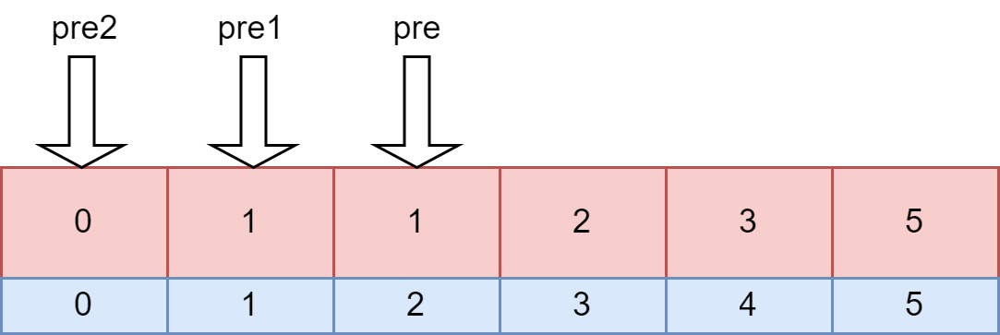

# 剑指offer03-数组中重复的数字

找出数组中重复的数字。


在一个长度为 n 的数组 nums 里的所有数字都在 0～n-1 的范围内。数组中某些数字是重复的，但不知道有几个数字重复了，也不知道每个数字重复了几次。请找出数组中任意一个重复的数字。

**方法1：暴力搜索**

`时间复杂度：O(n)~O(n^2) 空间复杂度：O(1)`

**方法2：使用集合的思想**

`时间复杂度：O(n) 空间复杂度：O(n)`

时间复杂度：O(n)。
遍历数组一遍。使用哈希集合（HashSet），添加元素的时间复杂度为 O(1)，故总的时间复杂度是 O(n)。
空间复杂度：O(n)。不重复的每个元素都可能存入集合，因此占用 O(n)额外空间。

```java
class Solution {
    public int findRepeatNumber(int[] nums) {
        Set<Integer> set = new HashSet<Integer>();
        int repeat = -1;
        for (int num : nums) {
            if (!set.add(num)) {
                repeat = num;
                break;
            }
        }
        return repeat;
    }
}
```

>hashset添加元素的时间复杂度为O(1)的原因：
>
>hashset通过内置的hashmap对象的put方法来添加元素，
>
>public boolean add(E e) {
>
>​    return map.put(e, PRESENT)==null;
>
>}
>
>而hashmap的put方法中，同样的key，后者的value会覆盖前者的value，从而实现key的不重合；而在寻找key的过程，根据key的hash值能够快速定位其位置，整个put过程的时间复杂度是O(1)。

**方法3：原地交换**

`时间复杂度：O(n) 空间复杂度O(1)`

题目说明尚未被充分使用，即 在一个长度为 n 的数组 nums 里的所有数字都在 0 ~ n-1 的范围内 。 此说明含义：数组元素的 索引 和 值 是 一对多 的关系。
因此，可遍历数组并通过交换操作，使元素的 索引 与 值 一一对应（即 nums[i] = inums[i]=i ）。因而，就能通过索引映射对应的值，起到与字典等价的作用。


遍历中，第一次遇到数字 x 时，将其交换至索引 x 处；而当第二次遇到数字 x 时，一定有 nums[x] = x，此时即可得到一组重复数字。

**算法流程**：

1. 遍历数组 nums ，设索引初始值为 i = 0;
   1. 若 nums[i] = i： 说明此数字已在对应索引位置，无需交换，因此跳过；
   2. 若 nums[nums[i]] = nums[i] ： 代表索引 nums[i]处和索引 ii处的元素值都为 nums[i]，即找到一组重复值，返回此值 nums[i]；
   3. 否则： 交换索引为 i和 nums[i]的元素值，将此数字交换至对应索引位置。
2. 若遍历完毕尚未返回，则返回 -1。

```java
class Solution {
    public int findRepeatNumber(int[] nums) {
        int i = 0;
        while(i < nums.length) {
            if(nums[i] == i) {
                i++;
                continue;
            }
            if(nums[nums[i]] == nums[i]) return nums[i];
            int tmp = nums[i];
            nums[i] = nums[tmp];
            nums[tmp] = tmp;
        }
        return -1;
    }
}
```

# 剑指offer04-二维数组中的查找

在一个 n * m 的二维数组中，每一行都按照从左到右递增的顺序排序，每一列都按照从上到下递增的顺序排序。请完成一个高效的函数，输入这样的一个二维数组和一个整数，判断数组中是否含有该整数。

示例:

现有矩阵 matrix 如下：

[
  [1,   4,  7, 11, 15],
  [2,   5,  8, 12, 19],
  [3,   6,  9, 16, 22],
  [10, 13, 14, 17, 24],
  [18, 21, 23, 26, 30]
]
给定 target = 5，返回 true。
给定 target = 20，返回 false。

**方法1：暴力搜索**

果不考虑二维数组排好序的特点，则直接遍历整个二维数组的每一个元素，判断目标值是否在二维数组中存在。

依次遍历二维数组的每一行和每一列。如果找到一个元素等于目标值，则返回 true。如果遍历完毕仍未找到等于目标值的元素，则返回 false

`时间复杂度：O(n·m) 空间复杂度：O(1)`

**方法2：类似于一维分块搜索**

当每一行对应的子数组的第一个元素值小于`target`时，对字数组进行二分搜索。

`时间复杂度：O(n·log2(m)) 空间复杂度：O(1)或者O(log2(n))[递归实现二分法]`

```java
class Solution {
 
        public boolean findNumberIn2DArray(int[][] matrix, int target) {
            if (matrix.length == 0 || matrix[0].length == 0) {
                return false;
            }
            
            for (int i = 0; i < matrix.length; i++) {
                if (matrix[i][0] > target) {
                    break;
                }
                if (findNumberIn1DArray(matrix[i], target) == true) {
                    return true;
                }
            }
            return false;
        }
        public boolean findNumberIn1DArray(int[] matrix, int target) {
            int start = 0;
            int end = matrix.length - 1;
            while (start <= end) {
                int mid = (start + end) / 2;
                if (matrix[mid] < target) {
                    start = mid + 1;
                } else if (matrix[mid] > target) {
                    end = mid - 1;
                } else {
                    return true;
                }
            }
            return false;
        }
    } 
```

**方法3：类似于二叉树查找法**

二维数组的右上角开始查找。如果当前元素等于目标值，则返回 true。如果当前元素大于目标值，则移到左边一列。如果当前元素小于目标值，则移到下边一行。

可以证明这种方法不会错过目标值。如果当前元素大于目标值，说明当前元素的下边的所有元素都一定大于目标值，因此往下查找不可能找到目标值，往左查找可能找到目标值。如果当前元素小于目标值，说明当前元素的左边的所有元素都一定小于目标值，因此往左查找不可能找到目标值，往下查找可能找到目标值。

`时间复杂度：O(n+m) 空间复杂度：O(1)`

```java
class Solution {
        public boolean findNumberIn2DArray(int[][] matrix, int target) {
            if (matrix.length == 0 || matrix[0].length == 0) {
                return false;
            }
            int x = 0;
            int y = matrix[0].length - 1;
            while (!(x == matrix.length || y == -1)) {
                if (matrix[x][y] == target) {
                    return true;
                } else if (matrix[x][y] < target) {
                    x++;
                } else {
                    y--;
                }
            }
            return false;
        }
    }
```

# 剑指offer05-替换空格

请实现一个函数，把字符串 s 中的每个空格替换成"%20"。

 示例 1：

> 输入：s = "We are happy."
> 输出："We%20are%20happy."

**法1(自己的)**

`时间复杂度：O(n) 空间复杂度：O(n)`

空间复杂度是因为需要额外空间sb

```java
    class Solution {
        public String replaceSpace(String s) {
            StringBuilder sb = new StringBuilder();
            for (int i = 0; i < s.length(); i++) {
                char c = s.charAt(i);
                if (c == ' ') {
                    sb.append("%20");
                } else {
                    sb.append(c);
                }
            }
            return sb.toString();
        }
    }
```

**法二 原地修改**

`时间复杂度：O(n) 空间复杂度：O(1)`

原地扩展长度，不需要使用额外空间。

```c++
class Solution {
public:
    string replaceSpace(string s) {
        int count = 0, len = s.size();
        // 统计空格数量
        for (char c : s) {
            if (c == ' ') count++;
        }
        // 修改 s 长度
        s.resize(len + 2 * count);
        // 倒序遍历修改
        for(int i = len - 1, j = s.size() - 1; i < j; i--, j--) {
            if (s[i] != ' ')
                s[j] = s[i];
            else {
                s[j - 2] = '%';
                s[j - 1] = '2';
                s[j] = '0';
                j -= 2;
            }
        }
        return s;
    }
};
```

# 剑指offer06-从尾到头打印链表

输入一个链表的头节点，从尾到头反过来返回每个节点的值（用数组返回）。

**示例 1：**

```
输入：head = [1,3,2]
输出：[2,3,1]
```

**法一(自己的)**

利用栈

`时间复杂度：O(n) 空间复杂度：O(n)`

时间复杂度：O(n)。正向遍历一遍链表，然后从栈弹出全部节点，等于又反向遍历一遍链表。
空间复杂度：O(n)。额外使用一个栈存储链表中的每个节点。

```java
    class Solution {
        public int[] reversePrint(ListNode head) {
            Stack<Integer> s = new Stack<>();
            int length = 0;
            while(head != null) {
                s.push(head.val);
                head = head.next;
                length++;
            }
            int[] reverseList = new int[length];
            for (int i = 0; i < length; i++) {
                reverseList[i] = s.pop();
            }
            return reverseList;
        }
    }
```

**法二(递归法)**

`时间复杂度：O(n) 空间复杂度：O(n)`

递归实现链表反序。

```java
class Solution {
    ArrayList<Integer> tmp = new ArrayList<Integer>();
    public int[] reversePrint(ListNode head) {
        recur(head);
        int[] res = new int[tmp.size()];
        for(int i = 0; i < res.length; i++)
            res[i] = tmp.get(i);
        return res;
    }
    void recur(ListNode head) {
        if(head == null) return;
        recur(head.next);
        tmp.add(head.val);
    }
}

```

# **剑指offer07-重建二叉树

输入某二叉树的前序遍历和中序遍历的结果，请构建该二叉树并返回其根节点。

假设输入的前序遍历和中序遍历的结果中都不含重复的数字。

示例1：


```
Input: preorder = [3,9,20,15,7], inorder = [9,3,15,20,7]
Output: [3,9,20,null,null,15,7]
```

**法1(自己的)**

`时间复杂度：O(n) 空间复杂度：O(n)`

```java
    class Solution {
        int[] preOrder;
        int[] inOrder;
        int pos = 0;
        public TreeNode buildTree(int[] preorder, int[] inorder) {
            if (preorder.length == 0) {
                return null;
            }
            preOrder = preorder;
            inOrder = inorder;
            return buildTree(0, preorder.length);
        }
        private TreeNode buildTree(int start, int end) {
            int rootValue = preOrder[pos++];
            TreeNode root = new TreeNode(rootValue);
            int leftStart = start;
            int rightEnd = end;
            int leftEnd = 0;
            int rightStart = 0;
            if ((end - start) == 1) {
                root.left = null;                
                root.right = null;
            } else {
                for (int i = start; i < end; i++) {
                    if (inOrder[i] == rootValue) {
                        leftEnd = i;
                        rightStart = i + 1;
                        break;
                    }
                }
                root.left = (leftStart == leftEnd ? null : buildTree(leftStart, leftEnd));
                root.right = (rightStart == rightEnd ? null : buildTree(rightStart, rightEnd));
            }
            return root;
        }
    }
```

**法二**

`时间复杂度：O(n) 空间复杂度：O(n)`

使用HahsMap来进行查找，更快。

时间复杂度O(N) ： 其中 N为树的节点数量。初始化 HashMap 需遍历 inorder ，占用 O(N) 。递归共建立 N 个节点，每层递归中的节点建立、搜索操作占用 O(1) ，因此使用 O(N) 时间。
空间复杂度 O(N) ： HashMap 使用 O(N) 额外空间；最差情况下（输入二叉树为链表时），递归深度达到 N ，占用 O(N) 的栈帧空间；因此总共使用 O(N)空间。

```java
class Solution {
    int[] preorder;
    HashMap<Integer, Integer> dic = new HashMap<>();
    public TreeNode buildTree(int[] preorder, int[] inorder) {
        this.preorder = preorder;
        for(int i = 0; i < inorder.length; i++)
            dic.put(inorder[i], i);
        return recur(0, 0, inorder.length - 1);
    }
    TreeNode recur(int root, int left, int right) {
        if(left > right) return null;                          // 递归终止
        TreeNode node = new TreeNode(preorder[root]);          // 建立根节点
        int i = dic.get(preorder[root]);                       // 划分根节点、左子树、右子树
        node.left = recur(root + 1, left, i - 1);              // 开启左子树递归
        node.right = recur(root + i - left + 1, i + 1, right); // 开启右子树递归
        return node;                                           // 回溯返回根节点
    }
}

```


# 剑指offer09-用两个栈实现队列

用两个栈实现一个队列。队列的声明如下，请实现它的两个函数 appendTail 和 deleteHead ，分别完成在队列尾部插入整数和在队列头部删除整数的功能。(若队列中没有元素，deleteHead 操作返回 -1 )

```java
import java.util.Stack
class CQueue {

    private Stack<Integer> firstStack;
    private Stack<Integer> lastStack;
    public CQueue() {
        this.firstStack = new Stack<>();
        this.lastStack = new Stack<>();
    }
    
    public void appendTail(int value) {
        lastStack.push(value);
    }
    
    public int deleteHead() {
        if (firstStack.empty()) {
            if (lastStack.empty()) {
                return -1;
            } else {
                while (!lastStack.empty()) {
                    firstStack.push(lastStack.pop());
                }
            }
        }
        return firstStack.pop();
    }
}
```

# 剑指offer10-I.斐波那契数列

写一个函数，输入 n ，求斐波那契（Fibonacci）数列的第 n 项（即 F(N)）。斐波那契数列的定义如下：

```java
F(0) = 0,   F(1) = 1
F(N) = F(N - 1) + F(N - 2), 其中 N > 1.
```

斐波那契数列由 0 和 1 开始，之后的斐波那契数就是由之前的两数相加而得出。
答案需要取模 1e9+7（1000000007），如计算初始结果为：1000000008，请返回 1。

```java
    public int fib(int n) {
        if (n ==0 || n == 1) {
            return n;
        }
        else {
            return fib(n - 1) + fib(n - 2);
        }
    }
```

`时间复杂度：O(2^n) 空间复杂度：O(n)`

上述方法运行过程中会重复计算内容，从而超出时间限制，因此改为采用下述方法。

**法1：while循环实现（动态规划法）**

`时间复杂度：O(n) 空间复杂度O(1)`



用pre表示需要返回的值。

```java
    static int mod = (int)(1e9 + 7);
    public int fib(int n) {
        int pre2 = 0;
        int pre1 = 1;
        int pre  = 1;
        if (n == 0) {
            return n;
        }
        for (int i = 1; i < n; i++) {
            pre = (pre2 + pre1) % mod;
            pre2 = pre1;
            pre1 = pre;
        }
        return pre;
    }
```

或者

用pre2表示需要返回的值。

```java
static int mod = (int)(1e9 + 7);
public int fib(int n) {
    int pre2 = 0;
    int pre1 = 1;
    int pre  = 1;
    for (int i = 0; i < n; i++) {
        pre = (pre2 + pre1) % mod;
        pre2 = pre1;
        pre1 = pre;
    }
    return pre2;
}
```
**法2：优化递归实现**

`时间复杂度：O(n) 空间复杂度：O(n)  `

```java
    private static final int mod = (int)(1e9 + 7);
    public int fib(int n) {
        return fib_recurse(n, 0, 0, 1);
    }
    private int fib_recurse(int n, int start, int previous2, int previous1) {
        if (n == start) {
            return previous2;
        }
        return fib_recurse(n, start + 1, previous1, (previous1 + previous2) % mod);
    }
```

**法3：记忆化递归方法**

`时间复杂度：O(n) 空间复杂度：O(n)`

递归法的基础上，新建一个长度为 n 的数组，用于在递归时存储 f(0)f(0) 至 f(n)f(n) 的数字值，重复遇到某数字则直接从数组取用，避免了重复的递归计算。

**法4：矩阵求幂法**

`时间复杂度：O(logn) 空间复杂度：O(1)`

使用矩阵快速幂的方法可以降低时间复杂度。

首先我们可以构建这样一个递推关系：
$$
\left[
\begin{matrix}
1 & 1 \\
0 & 1 
\end{matrix}
\right]
\left[
\begin{matrix}
F(n) \\
F(n-1)
\end{matrix}
\right]
=\left[
\begin{matrix}
F(n) + F(n-1) \\
F(n)
\end{matrix}
\right]
=\left[
\begin{matrix}
F(n+1) \\
F(n)
\end{matrix}
\right]
$$
因此：
$$
\left[
\begin{matrix}
F(n+1) \\
F(n)
\end{matrix}
\right]=\left[
\begin{matrix}
1 & 1 \\
1 & 0 
\end{matrix}
\right]^n
\left[
\begin{matrix}
F(1) \\
F(0)
\end{matrix}
\right]
$$
令：
$$
M = \left[\begin{matrix} 1 & 1 \\ 1 & 0 \end{matrix}\right]
$$
因此只要我们能快速计算矩阵 M 的 n 次幂，就可以得到 F(n)的值。如果直接求取 $M^n$，时间复杂度是 O(n)，可以定义矩阵乘法，然后用快速幂算法来加速这里 $M^n$  的求取。

```java
static final int MOD = 1000000007;

    public int fib(int n) {
        if (n < 2) {
            return n;
        }
        int[][] q = {{1, 1}, {1, 0}};
        int[][] res = pow(q, n - 1);
        return res[0][0];
    }

    public int[][] pow(int[][] a, int n) {
        int[][] ret = {{1, 0}, {0, 1}};
        while (n > 0) {
            if ((n & 1) == 1) {
                ret = multiply(ret, a);
            }
            n >>= 1;
            a = multiply(a, a);
        }
        return ret;
    }

    public int[][] multiply(int[][] a, int[][] b) {
        int[][] c = new int[2][2];
        for (int i = 0; i < 2; i++) {
            for (int j = 0; j < 2; j++) {
                c[i][j] = (int) (((long) a[i][0] * b[0][j] + (long) a[i][1] * b[1][j]) % MOD);
            }
        }
        return c;
    }
```

# 剑指Offer10II-青蛙跳台阶

一只青蛙一次可以跳上1级台阶，也可以跳上2级台阶。求该青蛙跳上一个 n 级的台阶总共有多少种跳法。

答案需要取模 1e9+7（1000000007），如计算初始结果为：1000000008，请返回 1。

设跳上 nn 级台阶有 f(n)种跳法。在所有跳法中，青蛙的最后一步只有两种情况： 跳上 1级或 2级台阶。
当为 1级台阶： 剩 n-1个台阶，此情况共有 f(n-1) 种跳法；
当为 2 级台阶： 剩 n-2 个台阶，此情况共有 f(n-2) 种跳法。
f(n)为以上两种情况之和，即 f(n)=f(n-1)+f(n-2)，以上递推性质为斐波那契数列。本题可转化为 求斐波那契数列第 nn项的值 ，与 面试题10- I. 斐波那契数列 等价，唯一的不同在于起始数字不同。
青蛙跳台阶问题： $f(0)=1, f(1)=1 , f(2)=2$；
斐波那契数列问题： $f(0)=0, f(1)=1 , f(2)=1$ 。

方法思路与剑指Offer10I中相同，在这里贴一个采用使用缓存的递归法解决思路。

```java
class Solution {
        HashMap<Integer, Integer> cache = new HashMap<>();
        public int numWays(int n) {
            switch (n) {
                case 0 :
                case 1 :
                    return 1;
                case 2 :
                    return 2;
                default :
                    if (!cache.containsKey(n - 1)) {
                        cache.put(n - 1, numWays(n - 1));
                    }  
                
                    if (!cache.containsKey(n - 2)) {
                        cache.put(n - 2, numWays(n - 2));
                    } 
    
                    return (cache.get(n - 1) + cache.get(n - 2)) % 1000000007;
            }
        }
    }
```

# 剑指Offer11-旋转数组的最小数字

把一个数组最开始的若干个元素搬到数组的末尾，我们称之为数组的旋转。

给你一个可能存在 重复 元素值的数组 numbers ，它原来是一个升序排列的数组，并按上述情形进行了一次旋转。请返回旋转数组的最小元素。例如，数组 [3,4,5,1,2] 为 [1,2,3,4,5] 的一次旋转，该数组的最小值为1。  

**法1：从数组后端采用顺序法**

`时间复杂度:O(n) 空间复杂度:O(1)`

```java
	class Solution1 {
        public int minArray(int[] numbers) {
            int max = numbers.length - 1;
            for (int i = max; i > 0; i--) {
                if (numbers[i - 1] > numbers[i]) {
                    return numbers[i];
                }
            }
            return numbers[0];
        }
    }
```

**法2：二分法**

`时间复杂度:O(logn) 空间复杂度:O(1)`

与二分查找法的区别，二分查找法比较的值是目标值`target`，此二分法比较的值是右端点值。

```java
	class Solution2 {
        public int minArray(int[] numbers) {
            int low = 0;
            int high = numbers.length - 1;
            while (low < high) {
                int pivot = low + (high - low) / 2;
                if (numbers[pivot] < numbers[high]) {
                    high = pivot;
                } else if (numbers[pivot] > numbers[high]) {
                    low = pivot + 1;
                } else {
                    high -= 1;
                }
            }
            return numbers[low];
        }
    }
```

# **剑指Offer12-矩阵中的路径

给定一个 $m * n$ 二维字符网格 board 和一个字符串单词 word 。如果 word 存在于网格中，返回 true ；否则，返回 false 。

单词必须按照字母顺序，通过相邻的单元格内的字母构成，其中“相邻”单元格是那些水平相邻或垂直相邻的单元格。同一个单元格内的字母不允许被重复使用。

==**整体思路**==

深度优先搜索(DFS)+回溯思想+剪枝

**整体思路**

* 深度优先搜索： 可以理解为暴力法遍历矩阵中所有字符串可能性。DFS 通过递归，先朝一个方向搜到底，再回溯至上个节点，沿另一个方向搜索，以此类推。
* 回溯思想：标记已经走过的方格
* 剪枝： 在搜索中，遇到 这条路不可能和目标字符串匹配成功 的情况（例如：此矩阵元素和目标字符不同、此元素已被访问），则应立即返回，称之为 可行性剪枝 。

**DFS搜索**

* 递归参数： 当前元素在矩阵 board 中的行列索引 i 和 j ，当前目标字符在 word 中的索引 k 。

* 终止条件：

  返回 false ： (1) 行或列索引越界 或 (2) 当前矩阵元素与目标字符不同 或 (3) 当前矩阵元素已访问过 （ (3) 可合并至 (2) ） 。

  返回 true： k = len(word) - 1 ，即字符串 word 已全部匹配。

* 递推工作：
  标记当前矩阵元素： 将 board[i)[j)修改为 空字符 '' ，代表此元素已访问过，防止之后搜索时重复访问。 搜索下一单元格： 朝当前元素的 上、下、左、右 四个方向开启下层递归，使用 或 连接 （代表只需找到一条可行路径就直接返回，不再做后续 DFS ），并记录结果至 res 。 还原当前矩阵元素： 将 board[i)[j)元素还原至初始值，即 word[k] 。[1][2

* 返回值： 返回布尔量 res ，代表是否搜索到目标字符串。

> 使用空字符（Python: '' , Java/C++: '\0' ）做标记是为了防止标记字符与矩阵原有字符重复。当存在重复时，此算法会将矩阵原有字符认作标记字符，从而出现错误。。 

**复杂度分析**

> M,N 分别为矩阵行列大小， KK为字 符串 word 长度。

* 时间复杂度 $O(3^KMN)$： 最差情况下，需要遍历矩阵中长度为 K 字符串的所有方案，时间复杂度为 $O(3^K)$；矩阵中共有 MN个起点，时间复杂度为 $O(MN)$ 。方案数计算： 设字符串长度为 K，搜索中每个字符有上、下、左、右四个方向可以选择，舍弃回头（上个字符）的方向，剩下 3种选择，因此方案数的复杂度为 $O(3^K)$。

* 空间复杂度 $O(K)$ ： 搜索过程中的递归深度不超过 K ，因此系统因函数调用累计使用的栈空间占用 $O(K)$（因为函数返回后，系统调用的栈空间会释放）。最坏情况下 $K = MN$ ，递归深度为 $MN$，此时系统栈使用 $O(MN)$的额外空间。

  ==<del>如果递归中使用全局变量，则为O(K);如果传递broad参数，则为O(KMN)</del>>==(即使传递broad参数，传递过程中使用的仍然是$O(K)$)

**法一(自己的)**

`时间复杂度：O(3^KMN) 空间复杂度：O(MN)`

```java
    class Solution {
        int[][] track;
        char[][] map;
        String matchWord;
        
        public boolean exist(char[][] board, String word) {
            if (board.length == 0 || board[0].length == 0 || word.equals("")) {
                return false;
            }
            
            char firstChar = word.charAt(0);
            boolean state = false;
            map = board;
            matchWord = word;
            for (int i = 0; i < board.length; i++) {
                if (state == true) {
                    break;
                }
                for (int j = 0; j < board[0].length; j++) {
                    if (board[i][j] == firstChar) {
                        track = new int[board.length][board[0].length];
                        track[i][j] = 1;
                        if (word.length() == 1) {
                            state = true;
                            break;
                        }
                        if (state =  move(i, j, 1)) {
                            break;
                        }
                    }
                }
            }
            return state;
        }
   
        public boolean move(int i, int j, int matchCount) {
            if (canMove(i + 1, j, matchCount)) {
                if (update(i + 1, j, matchCount)) {
                    return true;
                }
            }
            if (canMove(i - 1, j, matchCount)) {
                if (update(i - 1, j, matchCount)) {
                    return true;
                }
            }
            if (canMove(i, j + 1, matchCount)) {
                if (update(i, j + 1, matchCount)) {
                    return true;
                }
            }
            if (canMove(i, j - 1, matchCount)) {
                if (update(i, j - 1, matchCount)) {
                    return true;
                }
            }
            return false;
        }
        public boolean canMove(int i, int j, int matchCount) {
            if (i < 0 || i >= map.length) {
                return false;
            }
            if (j < 0 || j >= map[0].length) {
                return false;
            }
            if (track[i][j] == 1) {
                return false;
            }
            if (map[i][j] == matchWord.charAt(matchCount)) {
                return true;
            }
            return false;
        }
        public boolean update(int i, int j, int matchCount) {
            track[i][j] = 1;
            if (++matchCount == matchWord.length() || move(i, j, matchCount)) {
                return true;
            }
            track[i][j] = 0;
            return false;
        }
    }
```

**法二(他人的)：DFS+回溯**

`时间复杂度：O(3^KMN) 空间复杂度：O(MN)`

法二相比法一，代码更加简短；而且没有使用额外的空间作为标记数组，直接在board上进行操作，更加能体现回溯的过程。

```java
class Solution {
    public boolean exist(char[][] board, String word) {
        char[] words = word.toCharArray();
        for(int i = 0; i < board.length; i++) {
            for(int j = 0; j < board[0].length; j++) {
                if(dfs(board, words, i, j, 0)) return true;
            }
        }
        return false;
    }
    boolean dfs(char[][] board, char[] word, int i, int j, int k) {
        if(i >= board.length || i < 0 || j >= board[0].length || j < 0 || board[i][j] != word[k]) return false;
        if(k == word.length - 1) return true;
        board[i][j] = '\0';
        boolean res = dfs(board, word, i + 1, j, k + 1) || dfs(board, word, i - 1, j, k + 1) || 
                      dfs(board, word, i, j + 1, k + 1) || dfs(board, word, i , j - 1, k + 1);
        board[i][j] = word[k];
        return res;
    }
}

```


# 剑指Offer30-包含main函数的栈

定义栈的数据结构，请在该类型中实现一个能够得到栈的最小元素的 min 函数在该栈中，调用 min、push 及 pop 的时间复杂度都是 O(1)。

示例：

> MinStack minStack = new MinStack();
> minStack.push(-2);
> minStack.push(0);
> minStack.push(-3);
> minStack.min();   --> 返回 -3.
> minStack.pop();
> minStack.top();      --> 返回 0.
> minStack.min();   --> 返回 -2。

**法一（自己的）**

`时间复杂度：O(1) 空间复杂度：O(n)`

```java
lass MinStack {
        private LinkedList<Integer> list;
        private LinkedList<Integer> minList;
        public MinStack() {
            list = new LinkedList<>();
            minList = new LinkedList<>();
        }
        
        public void push(int x) {
            list.addFirst(x);
            if (minList.isEmpty()) {
                minList.addFirst(x);
            } else {
                int pre = minList.getFirst();
                minList.addFirst(x > pre ? pre : x);
            }
        }
         
        public void pop() {
            list.removeFirst();
            minList.removeFirst();
        }
        
        public int top() {
            return list.getFirst();
        }
        
        public int min() {
            return minList.getFirst();
        }
    }
```

**法二**

`时间复杂度：O(1) 空间复杂度：O(n)`

法二与法一相比，两者复杂度量级相同，但法二实际占用的空间更少，因为其辅助栈所占用的空间更少。

法一的辅助栈存储着每个元素在主栈中对应的最小值；法二的辅助栈

```java
class MinStack {
    Stack<Integer> A, B;
    public MinStack() {
        A = new Stack<>();
        B = new Stack<>();
    }
    public void push(int x) {
        A.add(x);
        if(B.empty() || B.peek() >= x)
            B.add(x);
    }
    public void pop() {
        if(A.pop().equals(B.peek())) //注意使用equals，而不是使用"==“符号
            B.pop();
    }
    public int top() {
        return A.peek();
    }
    public int min() {
        return B.peek();
    }
}
```

# 剑指Offer31-栈的压入弹出序列

输入两个整数序列，第一个序列表示栈的压入顺序，请判断第二个序列是否为该栈的弹出顺序。假设压入栈的所有数字均不相等。例如，序列 {1,2,3,4,5} 是某栈的压栈序列，序列 {4,5,3,2,1} 是该压栈序列对应的一个弹出序列，但 {4,3,5,1,2} 就不可能是该压栈序列的弹出序列。

**法一（自己的）**

`时间复杂度：O(n) 空间复杂度：O(n)`

法一直接构造一个辅助栈来模拟栈的压入和弹出过程。

```java
    class Solution {
        private Stack<Integer> s = new Stack<>();
        public boolean validateStackSequences(int[] pushed, int[] popped) {
            int popIndex = 0;
            int length = pushed.length;
            if (length != popped.length) {
                return false;
            }
            for (int i = 0; i < length; i++) {
                s.push(pushed[i]);
                while (!s.isEmpty() && s.peek() == popped[popIndex]) {
                    popIndex++;
                    s.pop();
                }
                if (popIndex == length) {
                    return true;
                }
            }
            return s.isEmpty() ? true : false; //直接"return s.isEmpty();"即可
        }
    }
```

**法二**

`时间复杂度：O(n) 空间复杂度：O(n)`

法二只考虑数组长度相等的情况，没有考虑数组长度不相等的情况。从健壮性来说，法一比法二好。

```java
class Solution {
    public boolean validateStackSequences(int[] pushed, int[] popped) {
        Stack<Integer> stack = new Stack<>();
        int i = 0;
        for(int num : pushed) {
            stack.push(num); // num 入栈
            while(!stack.isEmpty() && stack.peek() == popped[i]) { // 循环判断与出栈
                stack.pop();
                i++;
            }
        }
        return stack.isEmpty();
    }
}
```

# 剑指Offer32II-从上到下打印二叉树II

从上到下按层打印二叉树，同一层的节点按从左到右的顺序打印，每一层打印到一行。

 **法一(自己的)**

`时间复杂度：O(n) 空间复杂度：O(logn)+O(n)=O(n)`

广度优先遍历(BFS)

```java
       class Solution {
        public List<List<Integer>> levelOrder(TreeNode root) {
            if (root == null) {
                return new LinkedList<>();
            }
            List<TreeNode> tmp = new LinkedList<>();
            tmp.add(root);
            return levelOrder(tmp);
        }

        List<List<Integer>> levelOrder(List<TreeNode> list) {
            List<TreeNode> tmpList = new LinkedList<>();
            List<List<Integer>> res = new LinkedList<>();
            List<Integer> tmpRes = new LinkedList<>();

            for (TreeNode node : list) {
                tmpRes.add(node.val);
                if (node.left != null) {
                    tmpList.add(node.left);
                }
                if (node.right != null) {
                    tmpList.add(node.right);
                }
            }
            res.add(tmpRes);
            if (!tmpList.isEmpty()) {
                res.addAll(levelOrder(tmpList));
            }
            return res;
        }
    }
```

**法二 迭代写法**

`时间复杂度：O(n) 空间复杂度：O(n)`

时间复杂度 O(N) ： N 为二叉树的节点数量，即 BFS 需循环 NN次。
空间复杂度 O(N) ： 最差情况下，即当树为平衡二叉树时，最多有 N/2 个树节点同时在 queue 中，使用 O(N) 大小的额外空间。

```java
class Solution {
    public List<List<Integer>> levelOrder(TreeNode root) {
        Queue<TreeNode> queue = new LinkedList<>();
        List<List<Integer>> res = new ArrayList<>();
        if(root != null) queue.add(root);
        while(!queue.isEmpty()) {
            List<Integer> tmp = new ArrayList<>();
            for(int i = queue.size(); i > 0; i--) {
                TreeNode node = queue.poll();
                tmp.add(node.val);
                if(node.left != null) queue.add(node.left);
                if(node.right != null) queue.add(node.right);
            }
            res.add(tmp);
        }
        return res;
    }
}

```

**法三 递归写法**

`时间复杂度：O(n) 空间复杂度：O(n)`

==法三使用全局变量，法一法二没有使用全局变量==

```java
class Solution {
    List<List<Integer>> node=new ArrayList();
    public List<List<Integer>> levelOrder(TreeNode root) {
        lei(root,0);
        return node;
    }
    public void lei(TreeNode root,int k){
        if(root!=null){
            if(node.size()<=k)node.add(new ArrayList());
            node.get(k).add(root.val);
            lei(root.left,k+1);
            lei(root.right,k+1);
        }
    }
}
```

# 剑指Offer32III-从上打印二叉树III

请实现一个函数按照之字形顺序打印二叉树，即第一行按照从左到右的顺序打印，第二层按照从右到左的顺序打印，第三行再按照从左到右的顺序打印，其他行以此类推。

**法一(自己的)-层序遍历+倒序**

`时间复杂度：O(n) 空间复杂度：O(n)`

直接在原有基础上加上

> `            for(int i=1;i<res.size();i+=2){
>              Collections.reverse(res.get(i));
>       }`

```java
class Solution {
        public List<List<Integer>> levelOrder(TreeNode root) {
            if (root == null) {
                return new LinkedList<>();
            }
            List<TreeNode> tmp = new LinkedList<>();
            tmp.add(root);
            List<List<Integer>> res = levelOrder(tmp);
            for(int i=1;i<res.size();i+=2){
                Collections.reverse(res.get(i));
            }
            return res;
        }

        List<List<Integer>> levelOrder(List<TreeNode> list) {
            List<TreeNode> tmpList = new LinkedList<>();
            List<List<Integer>> res = new LinkedList<>();
            List<Integer> tmpRes = new LinkedList<>();

            for (TreeNode node : list) {
                tmpRes.add(node.val);
                if (node.left != null) {
                    tmpList.add(node.left);
                }
                if (node.right != null) {
                    tmpList.add(node.right);
                }
            }
            res.add(tmpRes);
            if (!tmpList.isEmpty()) {
                res.addAll(levelOrder(tmpList));
            }
            return res;
        }
    }
```

**法二 层序遍历+双端队列**

`时间复杂度：O(n) 空间复杂度：O(n)`

```java
class Solution {
    public List<List<Integer>> levelOrder(TreeNode root) {
        Queue<TreeNode> queue = new LinkedList<>();
        List<List<Integer>> res = new ArrayList<>();
        if(root != null) queue.add(root);
        while(!queue.isEmpty()) {
            LinkedList<Integer> tmp = new LinkedList<>();
            for(int i = queue.size(); i > 0; i--) {
                TreeNode node = queue.poll();
                if(res.size() % 2 == 0) tmp.addLast(node.val); // 偶数层 -> 队列头部
                else tmp.addFirst(node.val); // 奇数层 -> 队列尾部
                if(node.left != null) queue.add(node.left);
                if(node.right != null) queue.add(node.right);
            }
            res.add(tmp);
        }
        return res;
    }
}

```

**法三 层序遍历+双端队列(奇偶逻辑层分离)**

`时间复杂度：O(n) 空间复杂度：O(n)`

- 方法二代码简短、容易实现；但需要判断每个节点的所在层奇偶性，即冗余了 N*N 次判断。
- 通过将奇偶层逻辑拆分，可以消除冗余的判断。

```java
class Solution {
    public List<List<Integer>> levelOrder(TreeNode root) {
        Deque<TreeNode> deque = new LinkedList<>();
        List<List<Integer>> res = new ArrayList<>();
        if(root != null) deque.add(root);
        while(!deque.isEmpty()) {
            // 打印奇数层
            List<Integer> tmp = new ArrayList<>();
            for(int i = deque.size(); i > 0; i--) {
                // 从左向右打印
                TreeNode node = deque.removeFirst();
                tmp.add(node.val);
                // 先左后右加入下层节点
                if(node.left != null) deque.addLast(node.left);
                if(node.right != null) deque.addLast(node.right);
            }
            res.add(tmp);
            if(deque.isEmpty()) break; // 若为空则提前跳出
            // 打印偶数层
            tmp = new ArrayList<>();
            for(int i = deque.size(); i > 0; i--) {
                // 从右向左打印
                TreeNode node = deque.removeLast();
                tmp.add(node.val);
                // 先右后左加入下层节点
                if(node.right != null) deque.addFirst(node.right);
                if(node.left != null) deque.addFirst(node.left);
            }
            res.add(tmp);
        }
        return res;
    }
}

```

**法四-递归写法**

`时间复杂度：O(n) 空间复杂度：O(n)`

==结果是BFS的形式，但执行过程有点像DFS的递归过程。==

```java
class Solution {
    List<List<Integer>> node=new LinkedList();
    public List<List<Integer>> levelOrder(TreeNode root) {
        lei(root,0);
        return node;
    }
    public void lei(TreeNode root,int k){
        if(root!=null){
            if(node.size()<=k)node.add(new ArrayList());
            if (k % 2 == 0) {
                node.get(k).add(root.val);
            } else {
                node.get(k).add(0, root.val);
            }
            
            lei(root.left,k+1);
            lei(root.right,k+1);
        }
    }
}
```

# **剑指Offer33-二叉搜索树的后序遍历序列

输入一个整数数组，判断该数组是不是某二叉搜索树的后序遍历结果。如果是则返回 `true`，否则返回 `false`。假设输入的数组的任意两个数字都互不相同。

 参考以下这颗二叉搜索树：

```
     5
    / \
   2   6
  / \
 1   3
```

**示例 1：**

```
输入: [1,6,3,2,5]
输出: false
```

**示例 2：**

```
输入: [1,3,2,6,5]
输出: true
```

**法一(自己的)**

`时间复杂度：O(n^2) 空间复杂度；O(n)`

```java
    class Solution {
        public boolean verifyPostorder(int[] postorder) {
            return verifyPostorder(postorder, 0, postorder.length - 1);
        }

        public boolean verifyPostorder(int[] postorder, int start, int end) {
            if (end <= start) {
                return true;
            }
            int endValue = postorder[end];
            if (postorder[end - 1] < endValue) {
                for (int i = start; i < end - 1; i++) {
                    if (postorder[i] > endValue) {
                        return false;
                    }
                }
                return verifyPostorder(postorder, start, end - 1);
            } else {
                for (int i = end - 2; i >= 0; i--) {
                    if (postorder[i] < endValue) {
                        for (int j = i - 1; j >= 0; j--) {
                            if (postorder[j] > endValue) {
                                return false;
                            }
                        }
                        return verifyPostorder(postorder, start, i) && verifyPostorder(postorder, i + 1, end - 1);
                    }
                }
                return verifyPostorder(postorder, start, end - 1);
            }
        }
    }
```

**法二(递归分治)**

`时间复杂度：O(n^2) 空间复杂度；O(n)(最坏) O(logn)(平均)`（类似于快排的平均空间复杂度为O(logn)、最坏空间复杂度为O(n)）

法二思路跟法一思路相同，但代码更加简洁。

时间复杂度 $O(N^2)$： 每次调用 recur(i,j)减去一个根节点，因此递归占用 O(N)；最差情况下（即当树退化为链表），每轮递归都需遍历树所有节点，占用 O(N)。
空间复杂度 $O(N)$ ： 最差情况下（即当树退化为链表），递归深度将达到 N 。

```java
class Solution {
    public boolean verifyPostorder(int[] postorder) {
        return recur(postorder, 0, postorder.length - 1);
    }
    boolean recur(int[] postorder, int i, int j) {
        if(i >= j) return true;
        int p = i;
        while(postorder[p] < postorder[j]) p++;
        int m = p;
        while(postorder[p] > postorder[j]) p++;
        return p == j && recur(postorder, i, m - 1) && recur(postorder, m, j - 1);
    }
}
```

**法三(辅助单调栈)**

`时间复杂度：O(n) 空间复杂度：O(n)`

复杂度分析：

时间复杂度 $O(N)$ ： 遍历 postorder 所有节点，各节点均入栈 / 出栈一次，使用 O(N) 时间。
空间复杂度 $O(N)$： 最差情况下，单调栈 stack存储所有节点，使用 O(N)额外空间。

```java
class Solution {
    public boolean verifyPostorder(int[] postorder) {
        Stack<Integer> stack = new Stack<>();
        int root = Integer.MAX_VALUE;
        for(int i = postorder.length - 1; i >= 0; i--) {
            if(postorder[i] > root) return false;
            while(!stack.isEmpty() && stack.peek() > postorder[i])
            	root = stack.pop();
            stack.add(postorder[i]);
        }
        return true;
    }
}
```

# **剑指Offer34-二叉树中和为某一值的路径

给你二叉树的根节点 root 和一个整数目标和 targetSum ，找出所有 从根节点到叶子节点 路径总和等于给定目标和的路径。
叶子节点 是指没有子节点的节点。

示例 1：


```
输入：root = [5,4,8,11,null,13,4,7,2,null,null,5,1], targetSum = 22
输出：[[5,4,11,2],[5,8,4,5]]
```

**法一(自己的)**
`时间复杂度：O(n) 空间复杂度：O(logn)最坏O(n)`

```java
class Solution {
        List<List<Integer>> res = new LinkedList<>();
        int sum = 0;

        public List<List<Integer>> pathSum(TreeNode root, int target) {
            findPath(root, target);
            return res;
        }

        public boolean findPath(TreeNode root, int target) {
            if (root != null){
                if (target == root.val && root.left ==null && root.right == null) {
                    res.add(new LinkedList<>());
                    res.get(sum).add(0, root.val);
                    sum++;
                    return true;
                }
                int tmp = sum;
                boolean res1 = findPath(root.left, target - root.val);
                if (res1) {
                    for (int i = tmp; i < sum; i++) {
                        res.get(i).add(0, root.val);
                    }
                }
                tmp = sum;
                boolean res2 = findPath(root.right, target - root.val);
                if (res2) {
                    for (int i = tmp; i < sum; i++) {
                        res.get(i).add(0, root.val);
                    }
                }
                return res1 || res2;
            }
            return false;
        }
    }
```

**法二深度优先+回溯**

`时间复杂度：O(n) 空间复杂度：O(logn)最坏O(n)`

先序遍历+路径记录

法一是自底向顶记录，采用add(0, element)方式；法二是自顶向底记录，采用add(element)方式

> 值得注意的是，记录路径时若直接执行 res.append(path) ，则是将 path 对象加入了 res ；后续 path 改变时， res 中的 path 对象也会随之改变。
>
> 正确做法：res.append(list(path)) ，相当于复制了一个 path 并加入到 res 。

```java
class Solution {
    LinkedList<List<Integer>> res = new LinkedList<>();
    LinkedList<Integer> path = new LinkedList<>(); 
    public List<List<Integer>> pathSum(TreeNode root, int sum) {
        recur(root, sum);
        return res;
    }
    void recur(TreeNode root, int tar) {
        if(root == null) return;
        path.add(root.val);
        tar -= root.val;
        if(tar == 0 && root.left == null && root.right == null)
            res.add(new LinkedList(path));
        recur(root.left, tar);
        recur(root.right, tar);
        path.removeLast();
    }
}
```

**法三广度优先**

`时间复杂度：O(n^2) 空间复杂度：O(n)`

```java
class Solution {
    List<List<Integer>> ret = new LinkedList<List<Integer>>();
    Map<TreeNode, TreeNode> map = new HashMap<TreeNode, TreeNode>();

    public List<List<Integer>> pathSum(TreeNode root, int target) {
        if (root == null) {
            return ret;
        }

        Queue<TreeNode> queueNode = new LinkedList<TreeNode>();
        Queue<Integer> queueSum = new LinkedList<Integer>();
        queueNode.offer(root);
        queueSum.offer(0);

        while (!queueNode.isEmpty()) {
            TreeNode node = queueNode.poll();
            int rec = queueSum.poll() + node.val;

            if (node.left == null && node.right == null) {
                if (rec == target) {
                    getPath(node);
                }
            } else {
                if (node.left != null) {
                    map.put(node.left, node);
                    queueNode.offer(node.left);
                    queueSum.offer(rec);
                }
                if (node.right != null) {
                    map.put(node.right, node);
                    queueNode.offer(node.right);
                    queueSum.offer(rec);
                }
            }
        }

        return ret;
    }

    public void getPath(TreeNode node) {
        List<Integer> temp = new LinkedList<Integer>();
        while (node != null) {
            temp.add(node.val);
            node = map.get(node);
        }
        Collections.reverse(temp);
        ret.add(new LinkedList<Integer>(temp));
    }
}
```

# 剑指offer35-复杂链表的复制

请实现 copyRandomList 函数，复制一个复杂链表。在复杂链表中，每个节点除了有一个 next 指针指向下一个节点，还有一个 random 指针指向链表中的任意节点或者 null。

示例 1：


```
输入：head = [[7,null],[13,0],[11,4],[10,2],[1,0]]
输出：[[7,null],[13,0],[11,4],[10,2],[1,0]]
```

**法一(自己的)**

`时间复杂度：O(n) 空间复杂度：O(n)`

```java
    class Solution {
        public Node copyRandomList(Node head) {
            List<Node> list  = new ArrayList<>();
            HashMap<Node, Integer> map = new HashMap<>();
            Node pointer = head;
            int i = 0;
            while(pointer != null) {
                Node n = new Node(pointer.val);
                list.add(n);
                map.put(pointer, i++);
                pointer = pointer.next;
            }
            list.add(null);
            map.put(null, i);
            for (i = 0; i < list.size() - 1; i++) {
                list.get(i).next = list.get(i + 1);
                list.get(i).random = list.get(map.get(head.random));
                head = head.next;
            }
            return list.get(0);
            
        }
    }
```

**法二(哈希表)**

`时间复杂度：O(n) 空间复杂度：O(n)`

- 时间复杂度 O(N) ：两轮遍历链表，使用 O(N) 时间。
- 空间复杂度 O(N) ：哈希表 dic 使用线性大小的额外空间。

法二相比法一少用了一个列表，更加节省空间。

```java
class Solution {
    public Node copyRandomList(Node head) {
        if(head == null) return null;
        Node cur = head;
        Map<Node, Node> map = new HashMap<>();
        // 3. 复制各节点，并建立 “原节点 -> 新节点” 的 Map 映射
        while(cur != null) {
            map.put(cur, new Node(cur.val));
            cur = cur.next;
        }
        cur = head;
        // 4. 构建新链表的 next 和 random 指向
        while(cur != null) {
            map.get(cur).next = map.get(cur.next);
            map.get(cur).random = map.get(cur.random);
            cur = cur.next;
        }
        // 5. 返回新链表的头节点
        return map.get(head);
    }
}

```

**法三(拼接+拆分)**

`时间复杂度：O(n) 空间复杂度：O(1)`

- 时间复杂度 O(N) ：三轮遍历链表，使用 O(N)*O*(*N*) 时间。
- 空间复杂度 O(1)) ：节点引用变量使用常数大小的额外空间。

```java
class Solution {
    public Node copyRandomList(Node head) {
        if(head == null) return null;
        Node cur = head;
        // 1. 复制各节点，并构建拼接链表
        while(cur != null) {
            Node tmp = new Node(cur.val);
            tmp.next = cur.next;
            cur.next = tmp;
            cur = tmp.next;
        }
        // 2. 构建各新节点的 random 指向
        cur = head;
        while(cur != null) {
            if(cur.random != null)
                cur.next.random = cur.random.next;
            cur = cur.next.next;
        }
        // 3. 拆分两链表
        cur = head.next;
        Node pre = head, res = head.next;
        while(cur.next != null) {
            pre.next = pre.next.next;
            cur.next = cur.next.next;
            pre = pre.next;
            cur = cur.next;
        }
        pre.next = null; // 单独处理原链表尾节点
        return res;      // 返回新链表头节点
    }
}
```


# 剑指offer36-二叉搜索树与双向链表

输入一棵二叉搜索树，将该二叉搜索树转换成一个排序的循环双向链表。要求不能创建任何新的节点，只能调整树中节点指针的指向。

 为了让您更好地理解问题，以下面的二叉搜索树为例：


我们希望将这个二叉搜索树转化为双向循环链表。链表中的每个节点都有一个前驱和后继指针。对于双向循环链表，第一个节点的前驱是最后一个节点，最后一个节点的后继是第一个节点。

下图展示了上面的二叉搜索树转化成的链表。“head” 表示指向链表中有最小元素的节点。

 

特别地，我们希望可以就地完成转换操作。当转化完成以后，树中节点的左指针需要指向前驱，树中节点的右指针需要指向后继。还需要返回链表中的第一个节点的指针。

**法一(自己的)**

`时间复杂度：O(n) 空间复杂度：O(n)`

```java
    class Solution {
        List<Node> path = new ArrayList<>();
        public Node treeToDoublyList(Node root) {
            inOrderTraverse(root);
            int length = path.size();
            if (length == 0) {
                return root;
            }
            if (length == 1) {
                root.left = root;
                root.right = root;
            }
            path.get(0).left = path.get(length - 1);
            path.get(0).right = path.get(1);
            path.get(length - 1).left = path.get(length - 2);
            path.get(length - 1).right = path.get(0);
            for (int i = 1; i < length - 2; i++) {
                path.get(i).left = path.get(i - 1);
                path.get(i).right = path.get(i + 1);
            }
            return path.get(0);
            
        }
        void inOrderTraverse(Node root) {
            if (root == null) {
                return;
            }
            inOrderTraverse(root.left);
            path.add(root);
            inOrderTraverse(root.right);
        }
    }
```

**法二**

`时间复杂度：O(n) 空间复杂度：O(n)`

法二没有使用path全局变量，在中序遍历的过程中，就已经完成循环链表的创建。

```java
class Solution {
    Node pre, head;
    public Node treeToDoublyList(Node root) {
        if(root == null) return null;
        dfs(root);
        head.left = pre;
        pre.right = head;
        return head;
    }
    void dfs(Node cur) {
        if(cur == null) return;
        dfs(cur.left);
        if(pre != null) pre.right = cur;
        else head = cur;
        cur.left = pre;
        pre = cur;
        dfs(cur.right);
    }
}
```

# 剑指offer37-序列化二叉树

请实现两个函数，分别用来序列化和反序列化二叉树。

你需要设计一个算法来实现二叉树的序列化与反序列化。这里不限定你的序列 / 反序列化算法执行逻辑，你只需要保证一个二叉树可以被序列化为一个字符串并且将这个字符串反序列化为原始的树结构。

下面三种方法：

`时间复杂度：O(n) 空间复杂度：O(n)`

**法一(自己的)**

序列化与反序列化采用递归广度搜索实现。

```java
public class Codec {
        // Encodes a tree to a single string.
        public Integer[] serialize(TreeNode root) {
            List<Integer> list = new ArrayList<>();
            if (root == null) {
                return new Integer[]{};
            }
            Queue<TreeNode> q = new LinkedList<>();
            q.add(root);
            while(!q.isEmpty()) {
                TreeNode node = q.poll();
                if (node == null) {
                    list.add(null);
                    continue;
                }
                list.add(node.val);
                q.add(node.left);
                q.add(node.right);
            }   
            /* 可以删除掉
            for (int i = list.size() - 1; i >= 0; i--) {
                if (list.get(i) == null) {
                    list.remove(i);
                } else {
                    break;
                }
            }
            */
            Integer[] tmp = new Integer[list.size()];
            return list.toArray(tmp);
        }
        // Decodes your encoded data to tree.
        public TreeNode deserialize(Integer[] data) {
            TreeNode head = null;
            int length = data.length;
            if (length == 0) {
                return head;
            }
            Queue<TreeNode> q = new LinkedList<>();
            head = new TreeNode(data[0]);
            q.add(head);
            int i = 1;
            while(!q.isEmpty()) {
                TreeNode node = q.poll();
                if (i < length) {
                    if (data[i] != null) {
                        node.left = new TreeNode(data[i]);
                        q.add(node.left);
                    } 
                    i++;
                }
                if (i < length) {
                    if (data[i] != null) {
                        node.right = new TreeNode(data[i]);
                        q.add(node.right);
                    } 
                    i++;
                }
            }
            return head;
        }
    }
```

**法二、层序遍历DFS**

实际执行法一所用时间比法二少。

```java
public class Codec {
    public String serialize(TreeNode root) {
        if(root == null) return "[]";
        StringBuilder res = new StringBuilder("[");
        Queue<TreeNode> queue = new LinkedList<>() {{ add(root); }};
        while(!queue.isEmpty()) {
            TreeNode node = queue.poll();
            if(node != null) {
                res.append(node.val + ",");
                queue.add(node.left);
                queue.add(node.right);
            }
            else res.append("null,");
        }
        res.deleteCharAt(res.length() - 1);
        res.append("]");
        return res.toString();
    }

    public TreeNode deserialize(String data) {
        if(data.equals("[]")) return null;
        String[] vals = data.substring(1, data.length() - 1).split(",");
        TreeNode root = new TreeNode(Integer.parseInt(vals[0]));
        Queue<TreeNode> queue = new LinkedList<>() {{ add(root); }};
        int i = 1;
        while(!queue.isEmpty()) {
            TreeNode node = queue.poll();
            if(!vals[i].equals("null")) {
                node.left = new TreeNode(Integer.parseInt(vals[i]));
                queue.add(node.left);
            }
            i++;
            if(!vals[i].equals("null")) {
                node.right = new TreeNode(Integer.parseInt(vals[i]));
                queue.add(node.right);
            }
            i++;
        }
        return root;
    }
}
```

**法三、DFS**

可以采用StringBuilder实现。

```java
public class Codec {
    public String serialize(TreeNode root) {
        return rserialize(root, "");
    }
  
    public TreeNode deserialize(String data) {
        String[] dataArray = data.split(",");
        List<String> dataList = new LinkedList<String>(Arrays.asList(dataArray));
        return rdeserialize(dataList);
    }

    public String rserialize(TreeNode root, String str) {
        if (root == null) {
            str += "None,";
        } else {
            str += str.valueOf(root.val) + ",";
            str = rserialize(root.left, str);
            str = rserialize(root.right, str);
        }
        return str;
    }
  
    public TreeNode rdeserialize(List<String> dataList) {
        if (dataList.get(0).equals("None")) {
            dataList.remove(0);
            return null;
        }
  
        TreeNode root = new TreeNode(Integer.valueOf(dataList.get(0)));
        dataList.remove(0);
        root.left = rdeserialize(dataList);
        root.right = rdeserialize(dataList);
    
        return root;
    }
}

```

# **剑指offer38-字符串的排列

输入一个字符串，打印出该字符串中字符的所有排列。

你可以以任意顺序返回这个字符串数组，但里面不能有重复元素。

**示例:**

```
输入：s = "abc"
输出：["abc","acb","bac","bca","cab","cba"]
```

**法一(自己的)**

```java
class Solution {
        public String[] permutation(String s) {
            if (s.length() <= 1) {
                return new String[]{s};
            }
            HashSet<String> set = new HashSet<>();
            String[] post = permutation(s.substring(1));
            int length = s.length();
            String first = s.substring(0, 1);
            for (String str : post) {
                for (int i = 0; i < length - 1; i++) {
                    set.add(str.substring(0, i) + first + str.substring(i, length - 1));
                }
                set.add(str + first);
            }
            String[] res = new String[set.size()];
            return set.toArray(res);
        }
    }
```


**法二、回溯**

时间复杂度 $O(N!N)$： N为字符串 s 的长度；时间复杂度和字符串排列的方案数成线性关系，方案数为$ N \times (N-1) \times (N-2) … \times  $，即复杂度为 $O(N!) $；字符串拼接操作 join() 使用 $O(N)$ ；因此总体时间复杂度为 $O(N!N)$。
空间复杂度 $O(N^2)$： 全排列的递归深度为 N ，系统累计使用栈空间大小为 $O(N)$ ；递归中辅助 Set 累计存储的字符数量最多为 $N + (N-1) + ... + 2 + 1 = (N+1)N/2 $，即占用 $O(N^2)$的额外空间。

执行速度比法一快得多。

**终止条件**： 当 x = len(c) - 1 时，代表所有位已固定（最后一位只有 1 种情况），则将当前组合 c 转化为字符串并加入 res ，并返回；
**递推参数**： 当前固定位 x ；
**递推工作**： 初始化一个 Set ，用于排除重复的字符；将第 x 位字符与 i \in∈ [x, len(c)] 字符分别交换，并进入下层递归；
**剪枝**： 若 c[i] 在 Set 中，代表其是重复字符，因此 “剪枝” ；
将 c[i] 加入 Set ，以便之后遇到重复字符时剪枝；
**固定字符**： 将字符 c[i] 和 c[x] 交换，即固定 c[i] 为当前位字符；
**开启下层递归**： 调用 dfs(x + 1) ，即开始固定第 x + 1 个字符；
**还原交换**： 将字符 c[i] 和 c[x] 交换（还原之前的交换）；

```java
class Solution {
    List<String> res = new LinkedList<>();
    char[] c;
    public String[] permutation(String s) {
        c = s.toCharArray();
        dfs(0);
        return res.toArray(new String[res.size()]);
    }
    void dfs(int x) {
        if(x == c.length - 1) {
            res.add(String.valueOf(c));      // 添加排列方案
            return;
        }
        HashSet<Character> set = new HashSet<>();
        for(int i = x; i < c.length; i++) {
            if(set.contains(c[i])) continue; // 重复，因此剪枝
            set.add(c[i]);
            swap(i, x);                      // 交换，将 c[i] 固定在第 x 位
            dfs(x + 1);                      // 开启固定第 x + 1 位字符
            swap(i, x);                      // 恢复交换
        }
    }
    void swap(int a, int b) {
        char tmp = c[a];
        c[a] = c[b];
        c[b] = tmp;
    }
}
```

# 剑指Offer39-数组中出现次数超过一半的数字

**法一**

`时间复杂度：O(n) 空间复杂度:O(n)`

```java
class Solution {
        public int majorityElement(int[] nums) {
            HashMap<Integer, Integer> map = new HashMap<>();
            if (nums.length <= 2) return nums[0];
            int halfLength = nums.length / 2;
            for (int i : nums) {
                if (map.containsKey(i)) {
                    int count = map.get(i) + 1;
                    if (count > halfLength) {
                        return i;
                    }
                    map.put(i, count);
                } else {
                    map.put(i, 1);
                }
            }
            return -1;
        }
    }
```

**法二 摩尔投票法（最佳解法）**

`时间复杂度：O(n) 空间复杂度:O(1)`

设输入数组 nums 的众数为 x ，数组长度为 n 。

推论一： 若记 众数 的票数为 +1 ，非众数 的票数为 -1 ，则一定有所有数字的 票数和 >0 。

推论二： 若数组的前 a 个数字的 票数和 =0 ，则 数组剩余 (n-a)个数字的 票数和一定仍 >0 ，即后 (n-a)个数字的 众数仍为 x 。

```java
class Solution {
    public int majorityElement(int[] nums) {
        int x = 0, votes = 0;
        for(int num : nums){
            if(votes == 0) x = num;
            votes += num == x ? 1 : -1;
        }
        return x;
    }
}
```

**法三 数组排序法**

 将数组 nums排序，**数组中点的元素** 一定为众数。

`时间复杂度：看排序算法的类型 空间复杂度:看排序算法的类型`

# 剑指offer40-最小的k个数

**法一(排序)**

时间复杂度 $O(NlogN) $： 库函数、快排等排序算法的平均时间复杂度为 $O(NlogN)$ 。
空间复杂度$ O(N)$ ： 快速排序的递归深度最好（平均）为 $O(logN)$ ，最差情况（即输入数组完全倒序）为$O(N)$。

自己的：

```java
    class Solution {
        public int[] getLeastNumbers(int[] arr, int k) {
            int[] res = sort(arr);
            return Arrays.copyOf(res, k);
        }

        public int[] sort(int[] sourceArray) {
            // 对 arr 进行拷贝，不改变参数内容
            int[] arr = Arrays.copyOf(sourceArray, sourceArray.length);
    
            return quickSort(arr, 0, arr.length - 1);
        }
    
        private int[] quickSort(int[] arr, int left, int right) {
            if (left < right) {
                int partitionIndex = partition(arr, left, right);
                quickSort(arr, left, partitionIndex - 1);
                quickSort(arr, partitionIndex + 1, right);
            }
            return arr;
        }
    
        private int partition(int[] arr, int left, int right) {
            // 设定基准值（pivot）
            int pivot = left;
            int index = pivot + 1;
            for (int i = index; i <= right; i++) {
                if (arr[i] < arr[pivot]) {
                    swap(arr, i, index);
                    index++;
                }
            }
            swap(arr, pivot, index - 1);
            return index - 1;
        }
    
        private void swap(int[] arr, int i, int j) {
            int temp = arr[i];
            arr[i] = arr[j];
            arr[j] = temp;
        }
    }
```

别人的

```java
class Solution {
    public int[] getLeastNumbers(int[] arr, int k) {
        quickSort(arr, 0, arr.length - 1);
        return Arrays.copyOf(arr, k);
    }
    private void quickSort(int[] arr, int l, int r) {
        // 子数组长度为 1 时终止递归
        if (l >= r) return;
        // 哨兵划分操作（以 arr[l] 作为基准数）
        int i = l, j = r;
        while (i < j) {
            while (i < j && arr[j] >= arr[l]) j--;
            while (i < j && arr[i] <= arr[l]) i++;
            swap(arr, i, j);
        }
        swap(arr, i, l);
        // 递归左（右）子数组执行哨兵划分
        quickSort(arr, l, i - 1);
        quickSort(arr, i + 1, r);
    }
    private void swap(int[] arr, int i, int j) {
        int tmp = arr[i];
        arr[i] = arr[j];
        arr[j] = tmp;
    }
}

```

**法二（基于快速排序的分组）**

> 本方法优化时间复杂度的本质是通过判断舍去了不必要的递归（哨兵划分）。

* 时间复杂度 $O(N)$： 其中 N为数组元素数量；对于长度为 N 的数组执行哨兵划分操作的时间复杂度为 $O(N)$ ；每轮哨兵划分后根据 k和 i的大小关系选择递归，由于 i 分布的随机性，则向下递归子数组的平均长度为 $\frac{N}{2} $；因此平均情况下，哨兵划分操作一共有 $N + \frac{N}{2} + \frac{N}{4} + ... + \frac{N}{N} = \frac{N - \frac{1}{2}}{1 - \frac{1}{2}} = 2N - 1$（等比数列求和），即总体时间复杂度为 $O(N)$ 。
* 空间复杂度 $O(\log N) $： 划分函数的平均递归深度为 $O(\log N)$ 。

```java
class Solution {
    public int[] getLeastNumbers(int[] arr, int k) {
        if (k >= arr.length) return arr;
        return quickSort(arr, k, 0, arr.length - 1);
    }
    private int[] quickSort(int[] arr, int k, int l, int r) {
        int i = l, j = r;
        while (i < j) {
            while (i < j && arr[j] >= arr[l]) j--;
            while (i < j && arr[i] <= arr[l]) i++;
            swap(arr, i, j);
        }
        swap(arr, i, l);
        if (i > k) return quickSort(arr, k, l, i - 1);
        if (i < k) return quickSort(arr, k, i + 1, r);
        return Arrays.copyOf(arr, k);
    }
    private void swap(int[] arr, int i, int j) {
        int tmp = arr[i];
        arr[i] = arr[j];
        arr[j] = tmp;
    }
}
```

**法三（堆）**

我们用一个大根堆实时维护数组的前 k小值。首先将前 k 个数插入大根堆中，随后从第 k+1 个数开始遍历，如果当前遍历到的数比大根堆的堆顶的数要小，就把堆顶的数弹出，再插入当前遍历到的数。最后将大根堆里的数存入数组返回即可。

时间复杂度：$O(n\log k)$，其中 n 是数组 arr 的长度。由于大根堆实时维护前 k小值，所以插入删除都是 $O(\log k)$ 的时间复杂度，最坏情况下数组里 n个数都会插入，所以一共需要 $O(n\log k)$ 的时间复杂度。

空间复杂度：$O(k)$，因为大根堆里最多 k 个数。


```java
class Solution {
    public int[] getLeastNumbers(int[] arr, int k) {
        int[] vec = new int[k];
        if (k == 0) { // 排除 0 的情况
            return vec;
        }
        PriorityQueue<Integer> queue = new PriorityQueue<Integer>(new Comparator<Integer>() {
            public int compare(Integer num1, Integer num2) {
                return num2 - num1;
            }
        });
        for (int i = 0; i < k; ++i) {
            queue.offer(arr[i]);
        }
        for (int i = k; i < arr.length; ++i) {
            if (queue.peek() > arr[i]) {
                queue.poll();
                queue.offer(arr[i]);
            }
        }
        for (int i = 0; i < k; ++i) {
            vec[i] = queue.poll();
        }
        return vec;
    }
}
```


**法四（数据范围有限直接计数排序）**

`时间复杂度：O(n) 空间复杂度：O(m) m为数组长度`

```java
class Solution {
    public int[] getLeastNumbers(int[] arr, int k) {
        if (k == 0 || arr.length == 0) {
            return new int[0];
        }
        // 统计每个数字出现的次数
        int[] counter = new int[10001];
        for (int num: arr) {
            counter[num]++;
        }
        // 根据counter数组从头找出k个数作为返回结果
        int[] res = new int[k];
        int idx = 0;
        for (int num = 0; num < counter.length; num++) {
            while (counter[num]-- > 0 && idx < k) {
                res[idx++] = num;
            }
            if (idx == k) {
                break;
            }
        }
        return res;
    }
}
```

# 剑指offer41-数据流中的中位数

如何得到一个数据流中的中位数？如果从数据流中读出奇数个数值，那么中位数就是所有数值排序之后位于中间的数值。如果从数据流中读出偶数个数值，那么中位数就是所有数值排序之后中间两个数的平均值。

例如，

[2,3,4] 的中位数是 3

[2,3] 的中位数是 (2 + 3) / 2 = 2.5

设计一个支持以下两种操作的数据结构：

void addNum(int num) - 从数据流中添加一个整数到数据结构中。
double findMedian() - 返回目前所有元素的中位数。
示例 1：

```
输入：["MedianFinder","addNum","addNum","findMedian","addNum","findMedian"]
[[],[1],[2],[],[3],[]]
输出：[null,null,null,1.50000,null,2.00000]示例 2：
```

示例2：

```java
输入：["MedianFinder","addNum","findMedian","addNum","findMedian"]
[[],[2],[],[3],[]]
输出：[null,null,2.00000,null,2.50000]
```

**法一(自己的 暴力排序法)**

`插入数据：O(n) 查找中位数：O(1) 空间复杂度：O(n)`

```java
    class MedianFinder {

        /** initialize your data structure here. */
        private List<Integer> list;
        public MedianFinder() {
            list = new ArrayList<>(); 
        }
        
        public void addNum(int num) {
            int i ;
            for (i = list.size() - 1; i >= 0; i--) {
                if (list.get(i) < num) {
                    break;
                }
            }
            list.add(i + 1, num);
        }
        
        public double findMedian() {
            int length = list.size();
            if (length % 2 == 1) {
                return list.get(length / 2);
            } else {
                return (list.get(length / 2 - 1) + list.get(length / 2)) / 2.0;
            }
        }
    }
```

**法二(堆法)**

* 时间复杂度：
  查找中位数 $O(1)$ ： 获取堆顶元素使用$ O(1)$时间；
  添加数字 $O(\log N)$： 堆的插入和弹出操作使用$ O(\log N)$ 时间。

* 空间复杂度 $O(N)$ ： 其中 N为数据流中的元素数量，小顶堆 A 和大顶堆 B 最多同时保存 N 个元素。

```java
class MedianFinder {
    Queue<Integer> A, B;
    public MedianFinder() {
        A = new PriorityQueue<>(); // 小顶堆，保存较大的一半
        B = new PriorityQueue<>((x, y) -> (y - x)); // 大顶堆，保存较小的一半
    }
    public void addNum(int num) {
        if(A.size() != B.size()) {
            A.add(num);
            B.add(A.poll());
        } else {
            B.add(num);
            A.add(B.poll());
        }
    }
    public double findMedian() {
        return A.size() != B.size() ? A.peek() : (A.peek() + B.peek()) / 2.0;
    }
}
```

# *剑指offer42-连续子数组的最大和

输入一个整型数组，数组中的一个或连续多个整数组成一个子数组。求所有子数组的和的最大值。

要求时间复杂度为O(n)。

**示例1:**

```
输入: nums = [-2,1,-3,4,-1,2,1,-5,4]
输出: 6
解释: 连续子数组 [4,-1,2,1] 的和最大，为 6。
```

**法一(动态规划)**

`时间复杂度：O(n) 空间复杂度：O(1)【直接在原数组上进行操作】`

```java
class Solution {
    public int maxSubArray(int[] nums) {
        int res = nums[0];
        for(int i = 1; i < nums.length; i++) {
            nums[i] += Math.max(nums[i - 1], 0);
            res = Math.max(res, nums[i]);
        }
        return res;
    }
}
```

**法二(分治)**

时间复杂度：假设我们把递归的过程看作是一颗二叉树的先序遍历，那么这颗二叉树的深度的渐进上界为 $O(\log n)$，这里的总时间相当于遍历这颗二叉树的所有节点，故总时间的渐进上界是 $O(\sum_{i=1}^{\log n} 2^{i-1})=O(n)$，故渐进时间复杂度为 $O(n)$。
空间复杂度：递归会使用 $O(\log n)$ 的栈空间，故渐进空间复杂度为 $O(\log n)$。

```java
class Solution {
    public class Status {
        public int lSum, rSum, mSum, iSum;

        public Status(int lSum, int rSum, int mSum, int iSum) {
            this.lSum = lSum;
            this.rSum = rSum;
            this.mSum = mSum;
            this.iSum = iSum;
        }
    }

    public int maxSubArray(int[] nums) {
        return getInfo(nums, 0, nums.length - 1).mSum;
    }

    public Status getInfo(int[] a, int l, int r) {
        if (l == r) {
            return new Status(a[l], a[l], a[l], a[l]);
        }
        int m = (l + r) >> 1;
        Status lSub = getInfo(a, l, m);
        Status rSub = getInfo(a, m + 1, r);
        return pushUp(lSub, rSub);
    }

    public Status pushUp(Status l, Status r) {
        int iSum = l.iSum + r.iSum;
        int lSum = Math.max(l.lSum, l.iSum + r.lSum);
        int rSum = Math.max(r.rSum, r.iSum + l.rSum);
        int mSum = Math.max(Math.max(l.mSum, r.mSum), l.rSum + r.lSum);
        return new Status(lSum, rSum, mSum, iSum);
    }
}
```

「方法二」相较于「方法一」来说，时间复杂度相同，但是因为使用了递归，并且维护了四个信息的结构体，运行的时间略长，空间复杂度也不如方法一优秀，而且难以理解。那么这种方法存在的意义是什么呢？

对于这道题而言，确实是如此的。但是仔细观察「方法二」，它不仅可以解决区间 [0, n-1]，还可以用于解决任意的子区间 [l,r]的问题。如果我们把 [0, n-1] 分治下去出现的所有子区间的信息都用堆式存储的方式记忆化下来，即建成一颗真正的树之后，我们就可以在 $O(\log n)$的时间内求到任意区间内的答案，我们甚至可以修改序列中的值，做一些简单的维护，之后仍然可以在 $O(\log n)$ 的时间内求到任意区间内的答案，对于大规模查询的情况下，这种方法的优势便体现了出来。这棵树就是上文提及的一种神奇的数据结构——线段树。

**法三(暴力遍历法)**

`时间复杂度：O(n^2) 空间复杂度：O(1)`

直接遍历各种可能性

# 剑指Offer43-1~n整数中1出现的次数

输入一个整数 n ，求1～n这n个整数的十进制表示中1出现的次数。

例如，输入12，1～12这些整数中包含1 的数字有1、10、11和12，1一共出现了5次。

**法一、自己的**

`时间复杂度： 空间复杂度：`

```java
    class Solution {
        public int countDigitOne(int n) {
            int count = getCount(n);
            return countDigitOne(n, count);
        }
        private int countDigitOne(int n, int count) {
            if (n >= 1 && n < 10) {
                return 1;
            }
            if (n == 0) {
                return 0;
            }
            int mod  = (int)Math.pow(10, count - 1);
            int firstDigit = n / mod;
            int remainder = n % mod;
            int count1 = count - 1;
            int mod1 = mod;
            while (remainder < mod1 / 10) {
                count1--;
                mod1 /= 10;
            }
            if (firstDigit == 1) {
                return remainder + 1 +  countDigitOne(remainder, count1) + countDigitOne(mod- 1, count - 1);
            } else {
                return mod + countDigitOne(remainder, count - 1) + firstDigit * countDigitOne(mod - 1, count - 1);
            }
            
        }
        private int getCount(int n) {
            int count = 0;
            while (n > 0) {
                n /= 10;
                count++;
            }
            return count;
        }
    }
```

前者相比后者理论上消耗时间更少，因为必须要每次计算总位数。

```java
    class Solution {
        public int countDigitOne(int n) {
            if (n >= 1 && n < 10) {
                return 1;
            }
            if (n == 0) {
                return 0;
            }
            int count = getCount(n);
            int mod  = (int)Math.pow(10, count - 1);
            int firstDigit = n / mod;
            int remainder = n % mod;
            int count1 =getCount(remainder);
            if (firstDigit == 1) {
                return remainder + 1 +  countDigitOne(remainder) + countDigitOne(mod- 1);
            } else {
                return mod + countDigitOne(remainder) + firstDigit * countDigitOne(mod - 1);
            }
            
        }
        private int getCount(int n) {
            int count = 0;
            while (n > 0) {
                n /= 10;
                count++;
            }
            return count;
        }
    }
```

**法二、**

时间复杂度$ O(\log n)$) ： 循环内的计算操作使用 $O(1)$ 时间；循环次数为数字 n的位数，即 $\log_{10}{n}$ ，因此循环使用$ O(\log n)$时间。
空间复杂度 $O(1)$ ： 几个变量使用常数大小的额外空间。

```java
class Solution {
    public int countDigitOne(int n) {
        int digit = 1, res = 0;
        int high = n / 10, cur = n % 10, low = 0;
        while(high != 0 || cur != 0) {
            if(cur == 0) res += high * digit;
            else if(cur == 1) res += high * digit + low + 1;
            else res += (high + 1) * digit;
            low += cur * digit;
            cur = high % 10;
            high /= 10;
            digit *= 10;
        }
        return res;
    }
}

```

**法三**

`时间复杂度：O(logn) 空间复杂度：O(1)`

```java
class Solution {
    public int countDigitOne(int n) {
        // mulk 表示 10^k
        // 在下面的代码中，可以发现 k 并没有被直接使用到（都是使用 10^k）
        // 但为了让代码看起来更加直观，这里保留了 k
        long mulk = 1;
        int ans = 0;
        for (int k = 0; n >= mulk; ++k) {
            ans += (n / (mulk * 10)) * mulk + Math.min(Math.max(n % (mulk * 10) - mulk + 1, 0), mulk);
            mulk *= 10;
        }
        return ans;
    }
}
```

