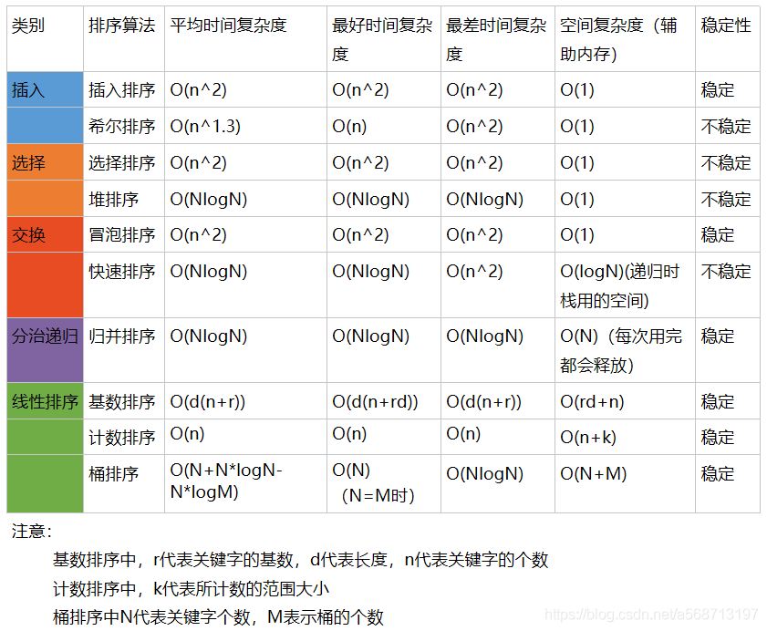

[数据结构与算法](file:///C:\Users\Administrator\Desktop\programmer\数据结构与算法\数据结构和算法.pdf)

# 数据结构

## 存储结构

### 顺序存储

顺序存储是把逻辑上相邻的元素存储在物理位置上也相邻的单元中。

- 优点：随机存取
- 缺点：可能产生较多的外部碎片

### 链式存储

链式存储不要求逻辑上相邻的单元在物理位置上也相邻，借助指示元素存储地址的指针来表示元素之间的逻辑关系。

- 优点：没有外部碎片
- 缺点：指针占用额外空间，且只能顺序存取

### 索引存储

索引存储除了存储数据，还建立附加的索引表。

- 优点：检索速度快
- 缺点：增加索引表占用较多的存储空间，修改表项也浪费时间

索引存储结构在存储数据的同时，还建立附加的索引表，索引表的每一项称为索引项，索引项的一般形式为关键字与地址。在索引存储结构中进行关键字查找时，先在索引表中快速查找（因为索引表中按关键字有序排列，可以采用折半查找）到相应的关键字，然后通过对应的地址找到主数据表中的元素。


### 散列存储

散列存储是根据关键字直接计算出元素的存储地址。

- 优点：检索、增加、删除结点都很快
- 缺点：存在冲突

哈希表就是采用散列存储的结构。

## 逻辑结构

### 线性结构

**备注**:有人也把顺序表和链表就视为存储结构中的顺序存储和链式存储。

#### 顺序表

一般采用顺序存储的形式实现，例如数组

#### 链表

一般采用链式存储的形式实现，包含单向链表、双向链表、循环链表、静态链表。

#### 队列

元素先进先出，可以采用顺序存储或者链式存储的结构实现

#### 栈

元素先进后出，可以采用顺序存储或者链式存储的结构实现

### 非线性结构

#### 树

##### 二叉树

###### 平衡二叉树

###### 满二叉树

###### 完全二叉树

##### 多路查找树

###### B树

###### B+树

###### 2-3树

###### 2-3-4树

###### 红黑树

##### 堆

#### 图

#### 散列表(哈希表)

#### 集合

# 算法

## 排序算法

### 0、总结



**参考：**

1、https://www.cnblogs.com/onepixel/articles/7674659.html
2、https://github.com/hustcc/JS-Sorting-Algorithm

### 1、冒泡排序

### 2、选择排序

### 3、插入排序

### 4、希尔排序

### 5、归并排序

### 6、快速排序

### 7、堆排序

### 8、基数排序

### 9、计数排序

### 10、桶排序

## 查找算法

### 1、顺序查找

`时间复杂度:O(n) 空间复杂度：O(1)`

```java
	 private static int sequenceSearch(int[] array,int target){
		 for(int i=0;i<array.length;i++){
			 if(target==array[i])
				 return i;
		 }
		 return -1;
	 }

```

### 2、二分查找

`时间复杂度:O(log2(n)) 空间复杂度:O(1)[迭代]或者O(log2(n))[递归]`

迭代法：

```java
	static  int binarySearch1(int arr[],int len,int target){
		/*初始化左右搜索边界*/
	    int left=0,right=len-1;
	    int mid;
	    while(left<=right){
	    	/*中间位置：两边界元素之和/2向下取整*/
	        mid=(left+right)/2;
	        /*arr[mid]大于target，即要寻找的元素在左半边，所以需要设定右边界为mid-1，搜索左半边*/
	        if(target<arr[mid]){
	            right=mid-1;
	        /*arr[mid]小于target，即要寻找的元素在右半边，所以需要设定左边界为mid+1，搜索右半边*/
            }else if(target>arr[mid]){
	            left=mid+1;
	        /*搜索到对应元素*/
	        }else if(target==arr[mid]){
	            return mid;
	        }
	    }
	    /*搜索不到返回-1*/
	    return -1;
	}

```

递归法：

```java
public class BinarySearch {
    private int[] array;
    /**
     * 递归实现二分查找
     * @param target
     * @return
     */
    public int searchRecursion(int target) {
        if (array != null) {
            return searchRecursion(target, 0, array.length - 1);
        }
        return -1;
    }

    private int searchRecursion(int target, int start, int end) {
        if (start > end) {
            return -1;
        }
        int mid = start + (end - start) / 2;
        if (array[mid] == target) {
            return mid;
        } else if (target < array[mid]) {
            return searchRecursion(target, start, mid - 1);
        } else {
            return searchRecursion(target, mid + 1, end);
        }
    }
}
```

### 3、 插值查找

`时间复杂度:O(log2(log2(n)))`

时间复杂度的证明过程：http://www.cs.technion.ac.il/~itai/publications/Algorithms/p550-perl.pdf

首先考虑一个新问题，为什么上述算法一定要是折半，而不是折四分之一或者折更多呢？

比如在英文字典里面查“apple”，你下意识翻开字典是翻前面的书页还是后面的书页呢？如果再让你查“zoo”，你又怎么查？很显然，这里你绝对不会是从中间开始查起，而是有一定目的的往前或往后翻。同样的，比如要在取值范围1 ~ 10000 之间 100 个元素从小到大均匀分布的数组中查找5， 我们自然会考虑从数组下标较小的开始查找。

经过以上分析，折半查找这种查找方式，不是自适应的（也就是说是傻瓜式的）。二分查找中查找点计算如下：

**mid=(low+high)/2, 即mid=low+1/2\*(high-low);\***

通过类比，我们可以将查找的点改进为如下：

**mid = low + [(key-a[low]) / (a[high]-a[low])] \* (high-low)，将系数 1/2 换成了：[(key-a[low]) / (a[high]-a[low])]。**

将上述的**比例参数1/2改进为自适应**的，根据关键字在整个有序表中所处的位置，让mid值的变化更靠近关键字key，这样也就间接地减少了比较次数。

**基本思想：插值查找也可以理解为按比例查找。**基于二分查找算法，将查找点的选择改进为自适应选择，可以提高查找效率。当然，插值查找也属于有序查找。**对于表长较大，而关键字分布又比较均匀的查找表来说，插值查找算法的平均性能比折半查找要好的多。反之，数组中如果分布非常不均匀，那么插值查找未必是很合适的选择。**

迭代插值：

```java
	private static int insertSearch1(int arr[],int target){
		/*初始化左右搜索边界*/
	    int left=0,right=arr.length-1;
	    int mid;
	    while(left<=right){
	        mid=left+(target-arr[left])/(arr[right]-arr[left])*(right-left);
	        /*arr[mid]大于target，即要寻找的元素在左半边，所以需要设定右边界为mid-1，搜索左半边*/
	        if(target<arr[mid]){
	            right=mid-1;
	        /*arr[mid]小于target，即要寻找的元素在右半边，所以需要设定左边界为mid+1，搜索右半边*/
            }else if(target>arr[mid]){
	            left=mid+1;
	        /*搜索到对应元素*/
	        }else if(target==arr[mid]){
	            return mid;
	        }
	    }
	    /*搜索不到返回-1*/
	    return -1;
	}

```

递归插值：

```java
	private static int insertSearch2(int array[],int left,int right,int target){
		if(left<=right){
			int mid=left+(target-array[left])/(array[right]-array[left])*(right-left);
			/*搜索到对应元素*/
			if(array[mid]==target){
				return mid;
			}else if(array[mid]<target){
				/*array[mid]小于target，即要寻找的元素在右半边，所以需要设定左边界为mid+1，搜索右半边*/
				return insertSearch2(array,mid+1,right,target);
			}else{
				/*array[mid]大于target，即要寻找的元素在左半边，所以需要设定右边界为mid-1，搜索左半边*/
				return insertSearch2(array,left,mid-1,target);
			}
		}else{
			return -1;
		}
	}

```

### 4、斐波那契查找

`时间复杂度:O(log2(n))`

  在斐波那契数列中的元素满足这样的关系：$F[k]=F[k-1]+F[k-2]$，此处将这个数组稍微改一下，改成：$（F[k]-1）=（F[k-1]-1）+（F[k-2]-1）+1$，图示如下：

<div style = "text-align:center;">
    </div>

  通过上面的图，应该就可以看出为什么要这样分割数组了，因为要找出一个中间mid值，以便将数组按斐波那契数列的规律，分割成两部分。

```java
public class FibonacciSearch {
	
	public static int FLENGTH = 20;
	public static void main(String[] args) {
		int [] arr = {1,8,10,89,100,134};
		int target = 89;
		System.out.println("目标元素在数组中位置是：" + fibSearch(arr, target));		
	}

	public static int[] fib() {
		int[] f = new int[FLENGTH];
		f[0] = 1;
		f[1] = 1;
		for (int i = 2; i < FLENGTH; i++) {
			f[i] = f[i-1] + f[i-2];
		}
		return f;
	}
	
	public static int fibSearch(int[] arr, int target) {
		int low = 0;
		int high = arr.length - 1;
		int k = 0; 
		int mid = 0; 
		int f[] = fib();
		/*获取最相邻的斐波那契数组中元素的值，该值略大于数组的长度*/
		while(high > f[k] - 1) {
			k++;
		}
		/*因为 f[k]值可能大于arr的长度。如果大于时，需要构造一个新的数组temp[]，将arr数组中的元素拷贝过去，不足的部分会使用0填充*/
		int[] temp=Arrays.copyOf(arr, f[k]);
		/*然后将temp后面填充的0，替换为最后一位数字
		 *如将temp数组由{1,8,10,89,100,134,0,0}变换为{1,8,10,89,100,134,134,134}*/
		for(int i = high + 1; i < temp.length; i++) {
			temp[i] = arr[high];
		}
		
		while (low <= high) { 
			mid = low + f[k - 1] - 1;
			if(target < temp[mid]) { 
				high = mid - 1;
				/*因为f[k]=f[k-1]+f[k-2]，所以k--就相当于取temp数组的左边部分*/
				k--;
			} else if ( target > temp[mid]) { 
				low = mid + 1;
				/*同理，f[k]=f[k-1]+f[k-2]，k -= 2就相当于取temp数组的右边部分*/
				k -= 2;
			} else {
				/*原arr数组中的值*/
				if(mid <= high){
					return mid;
				/*在temp中，扩展出来的高位的值*/
				}else{
					return high;
				}
			}
		}
		return -1;
	}
}
```

### 5、树表查找

见https://zhuanlan.zhihu.com/p/64940290

二叉搜索树(BST)、2-3树、红黑树、B/B+树。

红黑树对2-3树的另外一种表现形式、B/B+树是2-3树的拓展形式。

### 6、分块查找

`分块查找时间复杂度介于顺序查找时间复杂度和二分查找时间复杂度之间`

分块查找又称索引顺序查找，它是顺序查找的一种改进方法。

**算法思想：**将n个数据元素"按块有序"划分为m块（m ≤ n）。每一块中的结点不必有序，但块与块之间必须"按块有序"；即第1块中任一元素的关键字都必须小于第2块中任一元素的关键字；而第2块中任一元素又都必须小于第3块中的任一元素，……

**算法流程：**
step1 先选取各块中的最大关键字构成一个索引表；
step2 查找分两个部分：先对索引表进行二分查找或顺序查找，以确定待查记录在哪一块中；然后，在已确定的块中用顺序法进行查找。

```java
public class BlockSearch {
	/*主表*/
    static int[] valueList = new int[]{
    	104, 101, 103, 105,102, 0, 0, 0, 0, 0,
        201, 202, 204, 203,0,   0, 0, 0, 0, 0,
        303, 301, 302,  0,   0,   0, 0, 0, 0, 0
    };

    /*索引表*/
    static Block[] indexList = new Block[]{
    	new Block(1, 0, 5),
    	new Block(2, 10, 4),
    	new Block(3, 20, 3)
    };
	
	public static void main(String[] args) {
		System.out.println("原始主表：");
		printElemts(valueList);
		
		/*分块查找*/
		int searchValue = 203;
		System.out.println("元素"+searchValue+"，在列表中的索引为："+blockSearch(searchValue)+"\n");
		
	    /*插入数据并查找*/
		int insertValue = 106;
		         
		/*插入成功，查找插入位置*/
	    if (insertBlock(insertValue)) {
		   System.out.println("插入元素"+insertValue+"后的主表：");
		   printElemts(valueList);
		   System.out.println("元素" + insertValue + "在列表中的索引为：" + blockSearch(insertValue));
	    }
	}
	
	public static void printElemts(int[] array) {
	    for(int i = 0; i < array.length; i++){
	        System.out.print(array[i]+" ");
	        if ((i+1)%10 == 0) {
	            System.out.println();
	        }
	    }
	}
	 
	 
	/*插入数据*/
	public static boolean insertBlock(int key) {
	    Block item = null;

	    /*确定插入到哪个块中，在该例子中，第一个block中放的是100-200之间的数，第二个block中放的是200-300之间的数，以此类推*/
	    int index = key/100;
	    int i = 0;
	    /*找到对应的block*/
	    for (i = 0; i < indexList.length; i++) {
	        if (indexList[i].index == index) {
	            item = indexList[i];
	            break;
	        }
	    }
	    /*如果数组中不存在对应的块，则不能插入该数据*/
	    if (item == null) {
	       return false;
	    }

	    /*将元素插入到每个块的最后*/
	    valueList[item.start + item.length] = key;
	    /*更新该块的长度*/
	    indexList[i].length++;
	    return true;
	} 
	 
	public static int blockSearch(int key) {
	    Block indexItem = null;

	    /*确定插入到哪个块中，在该例子中，第一个block中放的是100-200之间的数，第二个block中放的是200-300之间的数，以此类推*/
	    int index = key/100;
	    /*找到对应的block*/
	    for(int i = 0;i < indexList.length; i++) {
	       if(indexList[i].index == index) {
	           indexItem = indexList[i];
	           break;
	       }
	   }

	    /*如果数组中不存在对应的块，则返回-1，查找失败*/
	   if(indexItem == null)
	       return -1;

	   /*在对应的block中查找*/
	   for(int i = indexItem.start; i < indexItem.start + indexItem.length; i++) {
	       if(valueList[i] == key)
	           return i;
	    }
	   	return -1;
	}
}

```

### 7、哈希查找

`时间复杂度:O(1) 空间复杂度:O(n)`

```java
public class HashSearch {

    /*待查找序列*/
    static int[] array = {13, 29, 27, 28, 26, 30, 38};
    /* 初始化哈希表长度，此处哈希表容量设置的和array长度一样。
     * 其实正常情况下，哈希表长度应该要长于array长度，因为使用
     * 开放地址法时，可能会多使用一些空位置
     */
    static int hashLength = 7;
    static int[] hashTable = new int[hashLength];

    public static void main(String[] args) {
        /*将元素插入到哈希表中*/
        for (int i = 0; i < array.length; i++) {
        	insertHashTable(hashTable, array[i]);
        }
        System.out.println("哈希表中的数据：");
        printHashTable(hashTable);
        
        int data = 28;
        System.out.println("\n要查找的数据"+data);
        int result = searchHashTable(hashTable, data);
        if (result == -1) {
            System.out.println("对不起，没有找到！");
        } else {
            System.out.println("在哈希表中的位置是：" + result);
        }
    }

    /*将元素插入到哈希表中*/
    public static void insertHashTable(int[] hashTable, int target) {
        int hashAddress = hash(hashTable, target);

        /*如果不为0，则说明发生冲突*/
        while (hashTable[hashAddress] != 0) {
            /*利用开放定址法解决冲突，即向后寻找新地址*/
            hashAddress = (++hashAddress) % hashTable.length;
        }

        /*将元素插入到哈希表中*/
        hashTable[hashAddress] = target;
    }

    public static int searchHashTable(int[] hashTable, int target) {
        int hashAddress = hash(hashTable, target);

        while (hashTable[hashAddress] != target) {
            /*寻找原始地址后面的位置*/
            hashAddress = (++hashAddress) % hashTable.length;
            /*查找到开放单元(未存放元素的位置)或 循环回到原点，表示查找失败*/
            if (hashTable[hashAddress] == 0 || hashAddress == hash(hashTable, target)) {
                return -1;
            }
        }
        return hashAddress;
    }

    /*用除留余数法计算要插入元素的地址*/
    public static int hash(int[] hashTable, int data) {
        return data % hashTable.length;
    }

    public static void printHashTable(int[] hashTable) {
    	for(int i=0;i<hashTable.length;i++)
    		System.out.print(hashTable[i]+" ");
    }
}

```

### 参考

1、https://blog.csdn.net/m0_37741420/article/details/107705009
2、https://zhuanlan.zhihu.com/p/64940290

## 搜索算法

### 分类

深度优先搜索（DFS）、广度优先搜索（BFS）、启发式搜索

### 参考

1、java实现二叉树的深度优先与广度优先：https://www.cnblogs.com/yongheng20/p/5749957.html

## 算法思想

### 分类

贪心算法、分治算法、动态规划、回溯算法、枚举算法。

### 参考

1、https://blog.csdn.net/ght886/article/details/80289142

